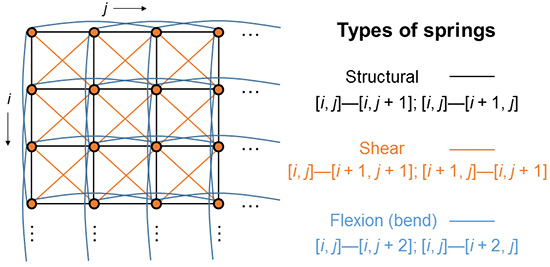

# ADA
## ```Algorithms + Data Structures == Animation```

### [Jon Macey](https://nccastaff.bournemouth.ac.uk/jmacey/)
### National Center for Computer Animation
### Bournemouth University

---

## About me

- My first computer was a Texas Instruments Ti 99 (followed by a Vic 20 then a PC).
- Been programming since 1979!
- Did a degree in Electronics, then MSc in Computer Animation.
- Teach programming and Maths to Animators.


Note:
I've been programming for a long time (40 years) but I started at about your age. Whilst my background is not in programming I have always used computers and programming in my jobs.
No it is mainly teaching programming to animators.


--

## [This got me hooked on Graphics](https://10print.org/)
``` 
10 PRINT CHR$ (205.5 + RND (1)); : GOTO 10  
```

  <video controls>
    <source data-src="video/c64.m4v" type="video/mp4" />
  </video>


---

## Can you see any programming?
  <video controls>
    <source data-src="video/showreel.mp4" type="video/mp4" />
  </video>

Note:
I'm going to show you a video, all of this work is from our students at the NCCA, either doing the degree course or the Masters. Whilst watching it have a think about how programming could have been used in it.


---


## Thinking like a programmer

- Most programming task require you to think in a certain way.
  - Algorithms (how to do a task).
  - Data Structures (how we represent things).
- This "computational thinking" approach can be applied lots of subjects.

Note: 
This is the crux of the thesis, computational thinking is the same for everything, if you can think in this way it doesn't matter what subject you are studying you can use a computer to do it.


--

## Sequences

<a href="examples/sequence/index.html" target="popup" onclick="popupWindow('examples/sequence/index.html','sequence',400,300)"></a>


```
drawRed();
drawGreen();
drawBlue();
```

Note:

I'm going to let you into a secret, most programming is actually quite simple, just don't tell anyone. We basically use the following elements to write code.


--

## [Selection](examples/selection/index.html)

<a href="examples/selection/index.html" target="popup" onclick="popupWindow('examples/selection/index.html','selection',520,580);"></a>


```
if(keyUpPressed())
  moveUp();
else if(keyDownPressed())
  moveDown();
else if(keyLeftPressed())
  moveLeft();
else if(keyRightPressed())
  moveRight();  
```

--

## Iteration


<a href="examples/iteration/index.html" target="popup" onclick="popupWindow('examples/iteration/index.html','Iteration',520,580);">  </a>

```
while(true)
{
  for_each(particle p)
  {
    p.update();
    p.draw();
  }
}
```

--


- There are so many languages which should I choose?

Note:

I get asked this a lot, to me it doesn't really matter. It's a bit like learning a language if you knwo


--

## Which Language should I choose?

- Programming languages are tools, choose the one best suited to the job.
- These slides are written in Javascript and HTML.
- The demos are written in C++ and converted to WebAssembly using a tool called emscipten.
- I use at least 5 programming languages on a regular basis.

--

## It's all machine code in the end

<iframe width="1000px" height="800px" src="https://godbolt.org/e?readOnly=true&hideEditorToolbars=true#g:!((g:!((g:!((h:codeEditor,i:(j:1,lang:c%2B%2B,source:'//+Type+your+code+here,+or+load+an+example.%0Aint+square(int+num)+%7B%0A++++return+num+*+num%3B%0A%7D%0A%0Aint+useSquare()%0A%7B%0A++++for(int+i%3D0%3B+i%3C20%3B+%2B%2Bi)%0A++++++++auto+res%3Dsquare(i)%3B%0A%7D%0A'),l:'5',n:'0',o:'C%2B%2B+source+%231',t:'0')),k:50,l:'4',n:'0',o:'',s:0,t:'0'),(g:!((h:compiler,i:(compiler:g92,filters:(b:'0',binary:'1',commentOnly:'0',demangle:'0',directives:'0',execute:'1',intel:'0',libraryCode:'1',trim:'1'),lang:c%2B%2B,libs:!(),options:'',source:1),l:'5',n:'0',o:'x86-64+gcc+9.2+(Editor+%231,+Compiler+%231)+C%2B%2B',t:'0')),k:50,l:'4',n:'0',o:'',s:0,t:'0')),l:'2',n:'0',o:'',t:'0')),version:4"></iframe>

---

> Whats the best thing about being an animator or VFX artist?

--

## You get to break things.

  <video controls loop autoplay="autoplay">
    <source data-src="video/smash.mp4" type="video/mp4" loop autoplay="autoplay"/>
  </video>


--

## And blow them up!

<video controls loop autoplay="autoplay">
    <source data-src="video/explode.mp4" type="video/mp4" loop autoplay="autoplay"/>
  </video>


--

## Smash Things.

<video controls loop autoplay="autoplay">
    <source data-src="video/wallsmash.mp4" type="video/mp4" loop autoplay="autoplay"/>
  </video>


--

## Or Throw things at Zombies!

<video controls loop autoplay="autoplay">
    <source data-src="video/zombies.mp4" type="video/mp4" loop autoplay="autoplay"/>
  </video>


--

#### Programming Houdini is a bit like using scratch.

<video controls loop autoplay="autoplay">
    <source data-src="video/scratch.mp4" type="video/mp4" />
  </video>

---

### What do Cloth and Hair have in common?

  <video controls loop>
    <source data-src="video/Spring.mp4" type="video/mp4" />
  </video>

--

## Springs!


<a href="https://gilberttang.github.io/CS114/proj3/"></a>


--

## Springs!

<a href="https://www.semanticscholar.org/paper/A-mass-spring-model-for-hair-simulation-Selle-Lentine/46388d5e6ab9bc16724f0db0fd70c6da4afdf112"></a>


--

## Hooke's Law


`$$ F = -kx $$`


`$$ y_{n+1}=y_{n}+h\sum _{i=1}^{s}b_{i}k_{i} $$`


```
Vec3 motionFunction(const State &_state)
{
  /// F = -k(|x|-d)(x/|x|) - bv where
  /// k is the spring constant
  /// |x| is the distance between the two spring points
  /// d is the distance of seperation
  /// b is the coefficient of damping larger b increases the damping force
  /// v is the relative velocity between the spring points
  Vec3 distance=m_b-m_a;
  float length=distance.length();
  return -m_k*(length-m_length)*(distance/length)-m_damping*_state.m_velocity;
}
```

---

## Anyone know what this is?

<a href="examples/noise/index.html" target="popup" onclick="popupWindow('examples/noise/index.html','selection',520,520);"></a>

--

### Noise is used everywhere in Animation.

<iframe width="1200px" height="600px" src="examples/tunnel/index.html"></iframe>


--

### Procedural Water.

<a href="examples/noise/index.html" target="popup" onclick="popupWindow('examples/water/index.html','selection',640,320);"></a>

```
/*
 * "Seascape" by Alexander Alekseev aka TDM - 2014
 * License Creative Commons Attribution-NonCommercial-ShareAlike 3.0 Unported License.
 * Contact: tdmaav@gmail.com
 */
varying vec2 vUv;
uniform float iTime;
uniform vec3 iResolution;
uniform vec2 iMouse;


const int NUM_STEPS = 8;
const float PI	 	= 3.141592;
const float EPSILON	= 1e-3;
#define EPSILON_NRM (0.1 / iResolution.x)

// sea
const int ITER_GEOMETRY = 3;
const int ITER_FRAGMENT = 5;
const float SEA_HEIGHT = 0.6;
const float SEA_CHOPPY = 4.0;
const float SEA_SPEED = 0.8;
const float SEA_FREQ = 0.16;
const vec3 SEA_BASE = vec3(0.1,0.19,0.22);
const vec3 SEA_WATER_COLOR = vec3(0.8,0.9,0.6);
#define SEA_TIME (1.0 + iTime * SEA_SPEED)
const mat2 octave_m = mat2(1.6,1.2,-1.2,1.6);

// math
mat3 fromEuler(vec3 ang) 
{
  vec2 a1 = vec2(sin(ang.x),cos(ang.x));
  vec2 a2 = vec2(sin(ang.y),cos(ang.y));
  vec2 a3 = vec2(sin(ang.z),cos(ang.z));
  mat3 m;
  m[0] = vec3(a1.y*a3.y+a1.x*a2.x*a3.x,a1.y*a2.x*a3.x+a3.y*a1.x,-a2.y*a3.x);
  m[1] = vec3(-a2.y*a1.x,a1.y*a2.y,a2.x);
  m[2] = vec3(a3.y*a1.x*a2.x+a1.y*a3.x,a1.x*a3.x-a1.y*a3.y*a2.x,a2.y*a3.y);
  return m;
}

float hash( vec2 p ) 
{
  float h = dot(p,vec2(127.1,311.7));	
  return fract(sin(h)*43758.5453123);
}

float noise( in vec2 p ) 
{
  vec2 i = floor( p );
  vec2 f = fract( p );	
  vec2 u = f*f*(3.0-2.0*f);
  return -1.0+2.0*mix( mix( hash( i + vec2(0.0,0.0) ), 
                  hash( i + vec2(1.0,0.0) ), u.x),
                  mix( hash( i + vec2(0.0,1.0) ), 
                  hash( i + vec2(1.0,1.0) ), u.x), u.y);
}

// lighting
float diffuse(vec3 n,vec3 l,float p) 
{
  return pow(dot(n,l) * 0.4 + 0.6,p);
}
float specular(vec3 n,vec3 l,vec3 e,float s) 
{    
  float nrm = (s + 8.0) / (PI * 8.0);
  return pow(max(dot(reflect(e,n),l),0.0),s) * nrm;
}

// sky
vec3 getSkyColor(vec3 e) 
{
  e.y = max(e.y,0.0);
  return vec3(pow(1.0-e.y,2.0), 1.0-e.y, 0.6+(1.0-e.y)*0.4);
}

// sea
float sea_octave(vec2 uv, float choppy) 
{
  uv += noise(uv);        
  vec2 wv = 1.0-abs(sin(uv));
  vec2 swv = abs(cos(uv));    
  wv = mix(wv,swv,wv);
  return pow(1.0-pow(wv.x * wv.y,0.65),choppy);
}

float map(vec3 p) 
{
  float freq = SEA_FREQ;
  float amp = SEA_HEIGHT;
  float choppy = SEA_CHOPPY;
  vec2 uv = p.xz; uv.x *= 0.75;

  float d, h = 0.0;    
  for(int i = 0; i < ITER_GEOMETRY; i++) 
  {        
    d = sea_octave((uv+SEA_TIME)*freq,choppy);
    d += sea_octave((uv-SEA_TIME)*freq,choppy);
    h += d * amp;        
    uv *= octave_m; freq *= 1.9; amp *= 0.22;
    choppy = mix(choppy,1.0,0.2);
  }
  return p.y - h;
}

float map_detailed(vec3 p) 
{
  float freq = SEA_FREQ;
  float amp = SEA_HEIGHT;
  float choppy = SEA_CHOPPY;
  vec2 uv = p.xz; uv.x *= 0.75;

  float d, h = 0.0;    
  for(int i = 0; i < ITER_FRAGMENT; i++) 
  {        
    d = sea_octave((uv+SEA_TIME)*freq,choppy);
    d += sea_octave((uv-SEA_TIME)*freq,choppy);
    h += d * amp;        
    uv *= octave_m; freq *= 1.9; amp *= 0.22;
    choppy = mix(choppy,1.0,0.2);
  }
  return p.y - h;
}

vec3 getSeaColor(vec3 p, vec3 n, vec3 l, vec3 eye, vec3 dist) 
{  
  float fresnel = clamp(1.0 - dot(n,-eye), 0.0, 1.0);
  fresnel = pow(fresnel,3.0) * 0.65;
      
  vec3 reflected = getSkyColor(reflect(eye,n));    
  vec3 refracted = SEA_BASE + diffuse(n,l,80.0) * SEA_WATER_COLOR * 0.12; 
  
  vec3 color = mix(refracted,reflected,fresnel);
  
  float atten = max(1.0 - dot(dist,dist) * 0.001, 0.0);
  color += SEA_WATER_COLOR * (p.y - SEA_HEIGHT) * 0.18 * atten;
  
  color += vec3(specular(n,l,eye,60.0));
  
  return color;
}

// tracing
vec3 getNormal(vec3 p, float eps) 
{
  vec3 n;
  n.y = map_detailed(p);    
  n.x = map_detailed(vec3(p.x+eps,p.y,p.z)) - n.y;
  n.z = map_detailed(vec3(p.x,p.y,p.z+eps)) - n.y;
  n.y = eps;
  return normalize(n);
}

float heightMapTracing(vec3 ori, vec3 dir, out vec3 p) 
{  
  float tm = 0.0;
  float tx = 1000.0;    
  float hx = map(ori + dir * tx);
  if(hx > 0.0) return tx;   
  float hm = map(ori + dir * tm);    
  float tmid = 0.0;
	for(int i = 0; i < NUM_STEPS; i++) 
	{
    tmid = mix(tm,tx, hm/(hm-hx));                   
    p = ori + dir * tmid;                   
    float hmid = map(p);
    if(hmid < 0.0) 
    {
      tx = tmid;
      hx = hmid;
    } 
    else 
    {
      tm = tmid;
      hm = hmid;
    }
  }
    return tmid;
}

// main
void main() 
{
  vec2 uv = gl_FragCoord.xy / iResolution.xy;
  uv = uv * 2.0 - 1.0;
  uv.x *= iResolution.x / iResolution.y;    
  float time = iTime * 0.3 + iMouse.x*0.01;

  // ray
  vec3 ang = vec3(sin(time*3.0)*0.1,sin(time)*0.2+0.3,time);    
  vec3 ori = vec3(0.0,3.5,time*5.0);
  vec3 dir = normalize(vec3(uv.xy,-2.0)); dir.z += length(uv) * 0.15;
  dir = normalize(dir) * fromEuler(ang);

  // tracing
  vec3 p;
  heightMapTracing(ori,dir,p);
  vec3 dist = p - ori;
  vec3 n = getNormal(p, dot(dist,dist) * EPSILON_NRM);
  vec3 light = normalize(vec3(0.0,1.0,0.8)); 
    
  // color
  vec3 color = mix(
    getSkyColor(dir),
    getSeaColor(p,n,light,dir,dist),
    pow(smoothstep(0.0,-0.05,dir.y),0.3)
    );
  // post
  gl_FragColor = vec4(pow(color,vec3(0.75)), 1.0);
}


```

--

## Wood.

<a href="examples/wood/index.html" target="popup" onclick="popupWindow('examples/wood/index.html','selection',640,320);"></a>


--

## Noise can also be a problem!

<iframe src="../Renderman/Lecture3Lighting/denoise.html" width="720px" height="512px"> </iframe>


- but we now use Machine Learning and AI to get rid of it.


---


## What do you see?


--

## Anyone know the artist?


--

## Programming as Art

<a href="http://www.paulgraham.com/knuth.html"></a>


--


## Abstraction
- abstraction is the thought process wherein ideas are distanced from objects.
- Abstraction uses a strategy of simplification of detail,
  - details are left ambiguous, vague, or undefined.
- This is one of the core principles we apply when programming.


---

## Let's design some code.

  <video controls>
    <source data-src="video/Golaem.mp4" type="video/mp4" />
  </video>

--

## Let's design some code.

- This example shows a finished flocking system.


 <a href="examples/flock/index.html" target="popup" onclick="popupWindow('examples/flock/index.html','Iteration',1400,900);">  </a>

--

## Lets do some Abstraction.

- what shall we call this?


<textarea id="design1" rows="6" cols="25" style="font-size: 44pt"></textarea>

--

## Boid

```

struct Boid
{
  point2 position;
  colourRGB colour;
  float speed;
  vec2 direction; 
};

```

--

### Now some rules.

<div class="row">
  <div class="column" style="float: left;width: 30%;padding: 5px;">
    <p/>
    <p/><b>Separation</b>: steer to avoid crowding local flockmates
  </div>
  <div class="column" style="float: left;width: 30%;padding: 5px;">
    <p/>
    <p/><b>Alignment</b>: steer towards the average heading of local flockmates
  </div>
  <div class="column" style="float: left;width: 30%;padding: 5px;">
    <p/>
    <p/><b>Cohesion</b>: steer to move toward the average position of local flockmates
  </div>
</div>

--

## Separation


- Given an array of all Boids how can we implement this algorithm?

<textarea id="design1" rows="6" cols="25" style="font-size: 24pt"></textarea>

Note:
Basically we need to traverse through the array (or list) and create a new list containing any of the boids in the radius. We then give them a force (Vector) to move them so they are the distance we need them to be apart.


--

## Alignment


- Given an array of all Boids how can we implement this algorithm?

<textarea id="design1" rows="6" cols="25" style="font-size: 24pt"></textarea>

Note:
Basically we need to traverse through the array (or list) and create a new list containing any of the boids in the radius. Add up all the directions and calculate the average!

--

## Cohesion


- Given an array of all Boids how can we implement this algorithm?

<textarea id="design1" rows="6" cols="25" style="font-size: 24pt"></textarea>

Note:
Basically we need to traverse through the array (or list) and create a new list containing any of the boids in the radius. We then give them a force (Vector) to move them so they are the distance we need them to be apart.


---

## Resources

- [shader toy for shader programming](https://www.shadertoy.com)
- [Blender free OpenSource Animation tool](https://www.blender.org/)
- [Jon's lecture notes](https://nccastaff.bournemouth.ac.uk/jmacey/)
- [scratch](https://scratch.mit.edu/)
- [Screen Skills info about 3d careers](https://www.screenskills.com/)
- [Houdini ](https://www.sidefx.com/)
- [Maya](https://www.autodesk.co.uk/products/maya/overview)

