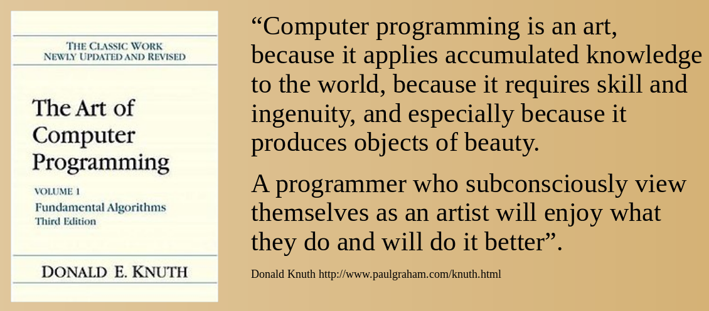

# ADA
## ```Algorithms + Data Structures == Animation```

### [Jon Macey](https://nccastaff.bournemouth.ac.uk/jmacey/)
### National Center for Computer Animation
### Bournemouth University

---

## About me

- My first computer was a Texas Instruments Ti 99 (followed by a Vic 20 then a PC)
- Been programming since 1979!
- Did a degree in Electronics, then MSc in Computer Animation
- Teach programming and Maths to Animators.


---

## Can you see any programming?
  <video controls>
    <source data-src="video/showreel.mp4" type="video/mp4" />
  </video>


---


## Thinking like a programmer

- Most programming task require you to think in a certain way
  - Algorithms (how to do a task)
  - Data Structures (how we represent things)
- This "computational thinking" approach can be applied lots of subjects.

--

## Sequences

<a href="examples/sequence/index.html" target="popup" onclick="popupWindow('examples/sequence/index.html','sequence',400,300)"></a>


```
drawRed();
drawGreen();
drawBlue();
```

--

## [Selection](examples/selection/index.html)

<a href="examples/selection/index.html" target="popup" onclick="popupWindow('examples/selection/index.html','selection',520,580);"></a>


```
if(keyUpPressed())
  moveUp();
else if(keyDownPressed())
  moveDown();
else if(keyLeftPressed())
  moveLeft();
else if(keyRightPressed())
  moveRight();  
```

--

## Iteration


<a href="examples/iteration/index.html" target="popup" onclick="popupWindow('examples/iteration/index.html','Iteration',520,580);">  </a>

```
while(true)
{
  for_each(particle p)
  {
    p.update();
    p.draw();
  }
}
```

--


- There are so many languages which should I choose?


--

## Which Language should I choose?

- Programming languages are tools, choose the one best suited to the job.
- These slides are written in Javascript and HTML
- The demos are written in C++ and converted to WebAssembly using a tool called emscipten
- I use at least 5 programming languages on a regular basis

--

## It's all machine code in the end

<iframe width="1000px" height="800px" src="https://godbolt.org/e?readOnly=true&hideEditorToolbars=true#g:!((g:!((g:!((h:codeEditor,i:(j:1,lang:c%2B%2B,source:'//+Type+your+code+here,+or+load+an+example.%0Aint+square(int+num)+%7B%0A++++return+num+*+num%3B%0A%7D%0A%0Aint+useSquare()%0A%7B%0A++++for(int+i%3D0%3B+i%3C20%3B+%2B%2Bi)%0A++++++++auto+res%3Dsquare(i)%3B%0A%7D%0A'),l:'5',n:'0',o:'C%2B%2B+source+%231',t:'0')),k:50,l:'4',n:'0',o:'',s:0,t:'0'),(g:!((h:compiler,i:(compiler:g92,filters:(b:'0',binary:'1',commentOnly:'0',demangle:'0',directives:'0',execute:'1',intel:'0',libraryCode:'1',trim:'1'),lang:c%2B%2B,libs:!(),options:'',source:1),l:'5',n:'0',o:'x86-64+gcc+9.2+(Editor+%231,+Compiler+%231)+C%2B%2B',t:'0')),k:50,l:'4',n:'0',o:'',s:0,t:'0')),l:'2',n:'0',o:'',t:'0')),version:4"></iframe>

---

## What do you see?


--

## Anyone know the artist?


--

## Programming as Art

<a href="http://www.paulgraham.com/knuth.html"></a>


--


## Abstraction
- abstraction is the thought process wherein ideas are distanced from objects.
- Abstraction uses a strategy of simplification of detail
  - details are left ambiguous, vague, or undefined
- This is one of the core "principles we apply when programming"


---

## Let's design some code

  <video controls>
    <source data-src="video/Golaem.mp4" type="video/mp4" />
  </video>

--

## Let's design some code

- This example shows a finished flocking system


 <a href="examples/flock/index.html" target="popup" onclick="popupWindow('examples/flock/index.html','Iteration',1400,900);">  </a>

--

## Lets do some Abstraction


<textarea id="design1" rows="6" cols="25" style="font-size: 44pt"></textarea>

--

## Agent

```

struct Agent
{
  point2 position;
  colourRGB colour;
  float speed;
  vec2 direction; 
};

```


