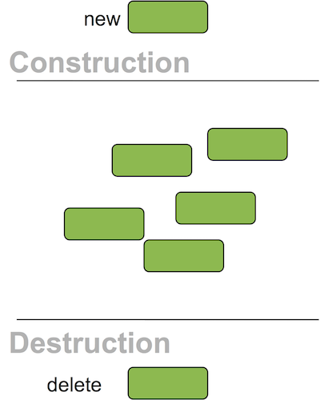
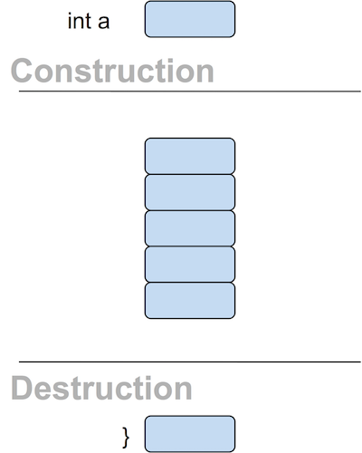

# Introduction to Qt
Jon Macey

jmacey@bournemouth.ac.uk

---

## What is Qt?
> ”Qt is a cross platform development framework written in C++.”

- C++ framework – bindings for other languages
- Python, Ruby, C#, etcetera
- Original for user interfaces – now for everything
- Databases, XML, WebKit, multimedia, networking, OpenGL, scripting, non-GUI...

--

## What is Qt?
- Qt is built from modules
- All modules have a common scheme and are built from the same API design ideas

--


--

## What is Qt?
- Qt extends C++ with macros and introspection

```
foreach (int value, intList) {     }

QObject *o = new QPustButton;
o->metaObject()->className(); // returns QPushButton 

connect(button, SIGNAL(clicked()), window, SLOT(close()));
```

- All code is still plain C++

--

## The Purpose of Qt
- Cross platform applications built from one source 
  - Windows, Linux, Mac + Mobile (Android / iOS)
- Builds native applications with native look and feel
- Easy to (re)use API, high developer productivity, openess


---

## [Hello World](https://github.com/NCCA/IntroToQt/tree/master/Qt1)

```
#include <QApplication>
#include <QLabel>


int main(int argc, char *argv[])
{
  QApplication app(argc, argv);
  QLabel *label = new QLabel();
  label->setObjectName(QString::fromUtf8("label"));
  label->setGeometry(QRect(100, 100, 200, 100));
  label->setText("Hello World");
  label->show();
  return app.exec();
}
```

--

## [qmake](http://doc.qt.io/qt-5/qmake-manual.html)
- Qt is built using a Makefile and the standard make tool,
- Makefile generation is somewhat cumbersome, so the qmake tool is used as a layer between Qt and the make system
- qmake uses a file ending with .pro to describe the project and how to build it.
  - used by QtCreator for projects as well.
- To generate a simple .pro file we can use qmake in the project generation mode which will create a simple project template

--

## qmake

```
Qt1$ qmake -project
```

- this will generate a simple qt project file

```
######################################################################
# Automatically generated by qmake (3.0) Mon Nov 14 08:32:53 2016
######################################################################

TEMPLATE = app
TARGET = Qt1
INCLUDEPATH += .
# note we need to add wigets module for gui
QT += widgets 
# Input
SOURCES += main.cpp
```

- then type make to build

--

## .pro files
- It is possible to build very complex .pro files to allow for multi platform builds
- The best source of information is the [qmake user guide](http://doc.qt.io/qt-5/qmake-manual.html), however there are several quite complex project files as part of the NGL:: library which are annotated
- Read the comments in these files if you have any issues.

--

## Useful qmake Variables
- ```TEMPLATE``` :- Defines the type of project
  - app, vcapp lib, vclib subdirs
- ```TARGET``` :- Name of the executable (by default equals to the .pro file name)
- ```QT``` :- Qt-specific modules and their dependencies defined in mkspecs/modules
  - QT += webkit sql network charts

--

## Useful qmake Variables

- ```CONFIG```
  - Specifies a project configuration or compiler option
  - used internally by qmake 
  - May refer to a project feature a .prf file in mkspecs/features
  - Custom features can be added using CONFIG += myFeatures

> Hint! Additional variables and values may be defined in the command line:

``` qmake “CONFIG += debug” ```

--

## Useful qmake Variables

- ```INCLUDEPATH```  and ```DEPENDPATH```
  - Sets the include search path (-I option)
- ```RESOURCES```  Specifies resource collection (.qrc) files to include in build
- ```LIBS``` the -L compiler option
- ```DEFINES``` the -D compiler option
- ```QMAKE_CXX``` which compiler to use
  - ```QMAKE_CXX=/usr/bin/g++```
- ```$$system( [command]) ``` run external command

```
QMAKE_CXXFLAGS+=$$system(sdl2-config  --cflags)
LIBS+=$$system(sdl2-config  --libs)
```

--

## qmake usage

- Scopes
```
win32:debug { SOURCES += paintwidget_win.cpp }
```
- Single line conditional assignment
```
win32:DEFINES += QT_DLL
```
- Environment variable reference
```
DESTDIR = $$PWD # Evaluated when the .pro file is processed (qmake executed)
DESTDIR = $PWD  # Evaluated when the Makefile is executed
```

- Variable reference 
```
TARGET = myproject_$${TEMPLATE}
```


---

# CMake

- CMake has full Qt integration and there are plans for Qt to move to CMake as the build tool of choice.
- You may need to specify the location of the Qt install for CMake to find it
- This is done using the ```CMAKE_MODULE_PATH``` environment variable for my install it is set to ```C:\Qt\5.12.6\``` 

--

## CMakeLists

```
cmake_minimum_required(VERSION 3.12)
# Name of the project
project(Qt1Build)
# This is the name of the Exe change this and it will change everywhere
set(TargetName Qt1)
# Instruct CMake to run moc automatically when needed (Qt projects only)
set(CMAKE_AUTOMOC ON)
# Run the uic tools and search in the ui folder
set(CMAKE_AUTOUIC ON)
set(CMAKE_AUTOUIC_SEARCH_PATHS ${PROJECT_SOURCE_DIR}/ui)
# find Qt libs
find_package(Qt5 COMPONENTS Widgets REQUIRED)
# use C++ 17
set(CMAKE_CXX_STANDARD 17)
set(CMAKE_CXX_STANDARD_REQUIRED ON)
set(CMAKE_CXX_EXTENSIONS ON)
# Set the name of the executable we want to build
add_executable(${TargetName})
target_sources(${TargetName} PRIVATE ${PROJECT_SOURCE_DIR}/main.cpp)
target_link_libraries(${TargetName} PRIVATE Qt5::Widgets )

```

---

## Qt Modules and Includes

- Qt Modules
  - QtCore, QtGui, QtWidgets, QtXml, QtSql, QtNetwork... 

- Enable Qt Module in qmake.pro file:
```
QT += network 
```

- Default: qmake projects use QtCore and QtGui 
- Any Qt class has a header file. 
```
#include <Qlabel>
#include <QtWidgets/QLabel> 
```
- Any Qt Module has a header file. 
```
#include <QtGui> 
```

--

## Includes and Compilation Time 

- Module includes
```
#include <QtGui> 
```
- Precompiled header and the compiler
  - If not supported may add extra compile time 
  - If supported may speed up compilation
- Supported on: Windows, MacOSX, Unix 

--

## Includes and Compilation Time 

- Class includes
```
#include <QLabel> 
```

- Reduce compilation time
- Use class includes ( ```#include <QLabel>``` ) 
- Forward declarations (```class QLabel;```) 
- Place module includes before other includes. 

--

## [qobject](http://doc.qt.io/qt-5/qobject.html)

<div id="mySlideLeft"   >

</div>    
<div id="mySlideRight">


 <p data-markdown> QObject is the base class of almost all Qt classes and all widgets
 </p>
  <p data-markdown> It contains many of the mechanisms that make up Qt </p>
  <p data-markdown> events, signals and slots, properties, memory manegment etc </p>
 
  
</div>

--

## [qobject](http://doc.qt.io/qt-5/qobject.html)
- QObject is the base class to most Qt classes. Examples of exceptions are:
  - Classes that need to be lightweight such as graphical primitives
  - Data containers (QString, QList, QChar, etc)
  - Classes that needs to be copyable, as QObjects cannot be copied

--

## [qobject](http://doc.qt.io/qt-5/qobject.html)
- They can have a name (QObject::objectName)
- They are placed in a hierarchy of QObject instances
- They can have connections to other QObject instances


--

## [(Type) Introspection](https://en.wikipedia.org/wiki/Type_introspection)
- In Computer Science Introspection is the ability to determine the type of an object at runtime.
- C++ supports type introspection via the typeid and dynamic_cast keywords. 
- The dynamic_cast expression can be used to determine whether a particular object is of a particular derived class.
- The typeid operator retrieves a [std::type_info](http://en.cppreference.com/w/cpp/types/type_info) object describing the most derived type of an object:

```
std::cout << typeid(obj).name() << '\n';
```

--

## Meta data
- Qt implements introspection in C++
- Every QObject has a meta object
- The meta object knows about
  - class name ([QObject::className](http://doc.qt.io/qt-5/qmetaobject.html#className))
  - inheritance ([QObject::inherits](http://doc.qt.io/qt-5/qmetaobject.html#inherits))
  - properties
  - signals and slots
  - general information ([QObject::classInfo](http://doc.qt.io/qt-5/qmetaobject.html#classInfo))

--

## Metadata


- The meta data is gathered at compile time by the meta object compiler, [moc](http://doc.qt.io/qt-4.8/moc.html).

--

## Metadata
- The meta data is gathered at compile time by the meta object compiler, moc.


- The moc harvests data from your headers.

--

## Metadata
- What does moc look for?

```
class MyClass : public QObject 
{
    Q_OBJECT
    Q_CLASSINFO("author", "John Macey")
public:
    MyClass(const Foo &foo, QObject *parent=0);
    Foo foo() const;
public slots:
    void setFoo( const Foo &foo );
signals:
    void fooChanged( Foo );
private:
Foo m_foo; 
};
```
- Make sure that you inherit QObject first (could be indirect)
- The Q_OBJECT macro, usually first

--

## Introspection
- The result of this process is classes know about themselves at runtime
- We can see what type of class we are dealing with
- We can identify specific classes
- We can pass messages between classes and or multicast to many classes
- This is the core to the Qt inter object communication system called (“Signals and Slots)

--

## Properties
- QObject have properties with getter and setter methods

```
class QLabel : public QFrame 
{
Q_OBJECT
    Q_PROPERTY(QString text READ text WRITE setText)
public:
    QString text() const;
public slots:
    void setText(const QString &);
};
```
- Naming policy: color, setColor
- For booleans: isEnabled, setEnabled

--

## Properties
- It is possible to access the properties of an object in a number of ways
- It is also possible to add dynamic properties to an object at runtime
- This allows for “object tagging” 
  - We can make these READ, WRITE or READ/WRITE

---

## Memory Management
- QObject can have parent and children
- When a parent object is deleted, it deletes its children

<div id="mySlideLeft"   >
<pre><code data-trim data-noescape>
  
QObject &#42;parent = new QObject();
QObject &#42;child1 = new QObject(parent);
QObject &#42;child2 = new QObject(parent);
QObject &#42;child1_1 = new QObject(child1);
QObject &#42;child1_2 = new QObject(child1);
delete parent; 

 </code></pre></div>    

<div id="mySlideRight">

</div>

--

## Memory Management
- This is used when implementing visual hierarchies.

<div id="mySlideLeft"   >
<pre><code data-trim data-noescape>
  
QDialog &#42;parent = new QDialog();
QGroupBox &#42;box = new QGroupBox(parent);
QPushButton &#42;button = new QPushButton(parent);
QRadioButton &#42;option1 = new QRadioButton(box);
QRadioButton &#42;option2 = new QRadioButton(box);
delete parent;
 </code></pre></div>    

<div id="mySlideRight">

</div>

--

## Heap

<div id="mySlideLeft">
   <p data-markdown> When using new and delete, memory is allocated on the heap. </p>
  <p data-markdown> Heap memory must be explicitly freed using delete to avoid memory leaks. </p>
  <p data-markdown> Objects allocated on the heap can live for as long as they are needed. </p>

</div>    
<div id="mySlideRight">
   
</div>

--

## Stack
<div id="mySlideLeft">
   <p data-markdown> Local variables are allocated on the stack.
 </p>
  <p data-markdown>Stack variables are automatically destructed when they go out of scope.
 </p>
  <p data-markdown> Objects allocated on the stack are always destructed when they go out of scope. </p>

</div>    
<div id="mySlideRight">
   
</div>

--

## Stack and Heap
- To get automatic memory management, only the parent needs to be allocated on the stack.


<div id="mySlideLeft">

<pre><code data-trim data-noescape>
int main(int argc, char **argv)
{
  QApplication a(argc, argv); 
  MyMainWindow w; // stack
  w.show();
  return a.exec();
}
</code></pre>
</div>

<div id="mySlideRight">

<pre><code data-trim data-noescape>
MyMainWindow::MyMainWindow(...
{
    new QLabel(this); // heap 
    new ... 
}
</code></pre>
</div>

---

## Constructor Etiquette
- Almost all QObjects take a parent object with a default value of 0 

``` 
QObject(QObject *parent=0); 
```
- Almost all QObjects take a parent object with a default value of 0 
- The parent of QWidgets are other QWidgets
- Classes have a tendency to provide many constructors for convenience (including one taking only parent)

```
QPushButton(QWidget *parent=0);
QPushButton(const QString &text, QWidget *parent=0);
QPushButton(const QIcon &icon, const QString &text, QWidget *parent=0);
```

- The parent is usually the first argument with a default value

--

## Constructor Etiquette
- When creating your own QObjects, consider
- Always allowing parent be 0 (nullptr on newer version of Qt)
- Having one constructor only accepting parent
  - parent is the first argument with a default value
- Provide several constructors to avoid having to pass 0 (null) and invalid (e.g. QString()) values as arguments

---

## Signals and Slots
- Dynamically and loosely tie together events and state changes with reactions
- What makes Qt tick
- based on the observer pattern

--

## Signals and Slot in Action


--

## Signals and Slot in Action


```
connect(clearButton,SIGNAL(clicked()),listWidget,SLOT(clear()));
```

--

## Signals and Slot in Action


--

## Signals and Slots vs Callbacks
- A callback is a pointer to a function that is called when an event occurs, any function can be assigned to a callback
  - No type-safety
  - Always works as a direct call
- Signals and Slots are more dynamic
  - A more generic mechanism
  - Easier to interconnect two existing classes
  - Less knowledge shared between involved classes

--

## What is a slot?

- A slot is defined in one of the slots sections
```
public slots:
    void aPublicSlot();
protected slots:
    void aProtectedSlot();
private slots:
    void aPrivateSlot();
```

  - A slot can return values, but not through connections
  - Any number of signals can be connected to a slot
```
connect(src, SIGNAL(sig()), dest, SLOT(slt()));
```
- It is implemented as an ordinary method
- It can be called as an ordinary method

--

## What is a signal?
- A signal is defined in the signals section
  - A signal always returns void
  - A signal must not be implemented 
  - The moc provides an implementation
- A signal can be connected to any number of slots
  - Usually results in a direct call, but can be passed as events between threads, or even over sockets (using 3rd party classes)
  - The slots are activated in arbitrary order
- A signal is emitted using the emit keyword

--

## Making the connection

- A signature consists of the function name  and argument types. No variable names, nor values are allowed.
- Custom types reduces reusability.

--

## Making the connection
- Qt can ignore arguments, but not create values from nothing


---

## [The QMainWindow class](http://doc-snapshots.qt.io/qt5-5.8/qmainwindow.html)
- A main window provides a framework for building an application's user interface. 
- Qt has QMainWindow and its related classes for main window management. 
- QMainWindow has its own layout to which you can add QToolBars, QDockWidgets, a QMenuBar, and a QStatusBar. 
- The layout has a center area that can be occupied by any kind of widget. 

--


--

## [example](https://github.com/NCCA/IntroToQt/tree/master/Qt2)
```
#include <QApplication>
#include <QPushButton>
#include <QMainWindow>
#include <QWidget>

int main(int argc, char *argv[])
{
  // create the main Qt app
  QApplication app(argc, argv);
  // create a main window widget
  QMainWindow *mainwin = new QMainWindow();
  // set the name
  mainwin->setObjectName(QString::fromUtf8("MainWindow"));
  // set the size
  mainwin->resize(200,200);
  // set the title of the window
  mainwin->setWindowTitle("A MainWindow App");
  // create a central widget with the main window as the parent
  QWidget *centralwidget = new QWidget(mainwin);
  // create a push button with the central widget as the parent
  QPushButton *button = new QPushButton(centralwidget);
  // set the name
  button->setObjectName(QString::fromUtf8("button"));
  // set the geometry
  button->setGeometry(QRect(10, 80, 100, 32));
  // set the text of the button
  button->setText("Button");
  // set the central widget for the main window
  mainwin->setCentralWidget(centralwidget);
  // show the window
  mainwin->show();
  // run the application
  return app.exec();
}
```

--

## [A (very) simple Web Browser](https://github.com/NCCA/IntroToQt/tree/master/Web)
```
#include <QApplication>
#include <QMainWindow>
#include <QtWebEngineWidgets>
#include <QPushButton>
#include <QToolBar>

int main(int argc, char *argv[])
{
  // make an instance of the QApplication
  QApplication a(argc, argv);
  // Create a new MainWindow
  QMainWindow w;

  QToolBar *toolbar= new QToolBar();
  QPushButton *back= new QPushButton("back");
  QPushButton *fwd= new QPushButton("fwd");
  toolbar->addWidget(back);
  toolbar->addWidget(fwd);

  w.addToolBar(toolbar);
  w.addToolBar(toolbar);

  QWebEngineView *page = new QWebEngineView();
  page->load(QUrl("http://www.google.co.uk"));

  QObject::connect(back,SIGNAL(clicked()),page,SLOT(back()));
  QObject::connect(fwd,SIGNAL(clicked()),page,SLOT(forward()));


  w.setCentralWidget(page);
  w.resize(1024,720);
  // show it
  w.show();
  // hand control over to Qt framework
  return a.exec();
}
```

--

## [Extending QMainWindow](https://github.com/NCCA/IntroToQt/tree/master/MainWindowExtended)
- In the following example we are going to create our own MainWindow class
- This class extends the Parent QMainWindow class and add two slots to handle keyInput and reisze events

--

## 

```
#ifndef MAINWINDOW_H
#define MAINWINDOW_H

#include <QMainWindow>
#include <QKeyEvent>

/// @file MainWindow.h

class MainWindow : public QMainWindow
{
  Q_OBJECT
  protected :
    /// @brief override the keyPressEvent inherited from QObject so we can handle key presses.
    /// @param [in] _event the event to process
    void keyPressEvent(QKeyEvent *_event);
    /// @brief override the resizeEvent inherited from QObject so we can handle key presses.
    /// @param [in] _event the event to process

    void resizeEvent (QResizeEvent * _event);
    public:
    /// @brief constructor
    /// @param _parent the parent window the for this window
    MainWindow(QWidget *_parent = 0);
    /// @brief  dtor free up the GLWindow and all resources
    ~MainWindow();
  private slots :

  private:


};

#endif // MAINWINDOW_H
```

--

## ctor

```
MainWindow::MainWindow(QWidget *_parent ): QMainWindow(_parent)
{
  resize(QSize(1024,720));
  setWindowTitle(QString("Extending a MainWindow Class"));
}
```

--

## keyPressEvent

```
void MainWindow::keyPressEvent(QKeyEvent *_event)
{
  // this method is called every time the main window recives a key event.
  // we then switch on the key value and set the camera in the GLWindow
  switch (_event->key())
  {
    case Qt::Key_Escape : QApplication::exit(EXIT_SUCCESS); break;
    default : break;
  }
}
```

--

## resizeEvent
- the resizeEvent is called every time the window size is changed
- in this case we change the window title to reflect the size

```
void MainWindow::resizeEvent ( QResizeEvent * _event )
{
  QSize size=_event->size();

  QString title=QString("Extending a MainWindow Class size is %1 %2")
                       .arg( size.width())
                       .arg( size.height());
  this->setWindowTitle(title);
}
```

---

## [QString](http://doc.qt.io/qt-5/qstring.html) 
- The QString class attempts to be the modern string class
  - Unicode and codecs
- Implicit sharing for performance
- Stores Unicode strings capable of representing almost all writing systems in use today
- Supports conversion from and to different local encodings
- Provides a convenient API for string inspection and modification

--

## QString
- There are three main methods for building strings
- The operator+ method

```
QString res = "Hello " + name + ", the value is " + QString::number(42);
     
```
- The QStringBuilder method

```
QString res = "Hello " % name %  ", the value is " % QString::number(42);
```
- The arg method

```
QString res = QString("Hello %1, the value is %2")
                    .arg(name)
                    .arg(42);
```

--

## QStringBuilder
- Using the + operator to join strings results in numerous memory allocations and checks for string lengths
- A better way to do it is to include QStringBuilder and use the % operator
- The string builder collects all lengths before joining all strings in one go, resulting in one memory allocation