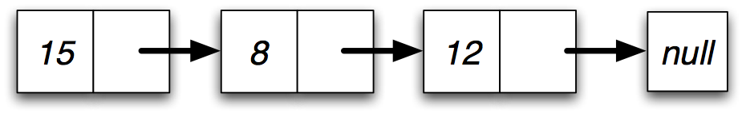
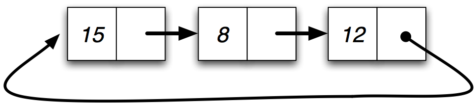
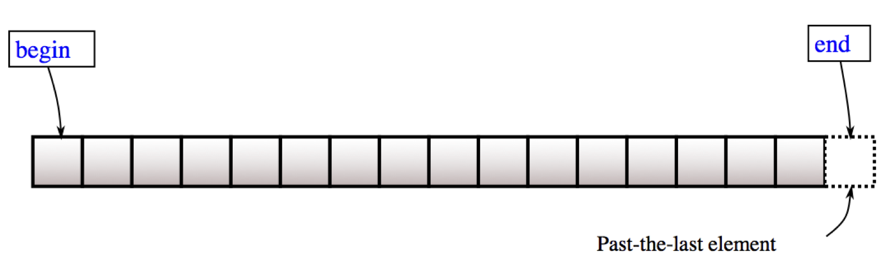

# Operator Overloading and STL
Jon Macey

jmacey@bournemouth.ac.uk

---

## Operator Overloading
- Operator Overloading means making the compiler's built in operator symbols work with classes
- Operator symbols are things like + - = * etc
- To do this with classes we may want to use a syntax as follows

```
ngl::Vec3 p1(1,2,3);
ngl::Vec3 p2(2,3,4);
ngl::Vec3 dir=p2-p1;
```

--

## Operator Overloading
- To allow a similar operation as shown previously we have to code the mechanism ourselves
- In effect the + and = operator must be overloaded to be methods of the class
- By overloading operators in this way we can give the classes in a system a common interface, allowing us to perform similar operations on a range of different objects.

--

## Overloading and the assignment operator
- The = operator is already overloaded to work with objects as well as simple data types
- This has already been see with the copy constructor
``` 
class_name object2 = object1;
```
This means that object2 is instantiated with the same state as object1, We can also do this in normal code for example

```
object2=object1;
```

--

### Overloading and the assignment operator

- This behaviour is default for the = operator however we can program our own overloaded = operator within the class.
- This is required when pointers are used as the object will point only to the memory address and if the initial object is destroyed so will the memory address where the pointer points to, therefore - code will be required to create and copy the pointer data

--

## [C++ Syntax](https://en.cppreference.com/w/cpp/language/operators)
- The syntax required for operator overloading is :
- The operator keyword
- And one of the 41 operator which may be overloaded as shown below

```
+ - * / % ˆ & | ~ ! = < > 
+= -= *= /= %= ˆ= 
&= |= << >> >>= <<= 
== != <= >= 
&& || ++ -- 
, ->* -> ( ) [ ]
new delete 
"" (c++ 11 suffix)
<=> (C++ 20 spaceship operator)
```

--

## Syntax for Operator Overloading 


- The syntax for operator overloading is as follows
- return_type operator symbol(parameter list .....)
- The return type for a relational operator is a Boolean value

--

## Arithmetic Operator Overloading


- Arithmetic operators return an object of the appropriate class as shown

--

## The parameter List
- The parameter list usually consists of an object of the class
- This is passed by reference rather than by value to avoid making a copy of the object
- Therefore the const prefix is used to stop the reference object being modified in the class

```
// less than (relational)
bool operator <(const Object &object); 
//minus (arithmetic)
Object operator -(const Object &object);
```

--

## Overloading relational operators

```
// in .h
bool operator==( const Vector &_v )const;
bool operator!=( const Vector &_v  )const;
// in .cpp
bool Vector::operator==( const Vector& _v )const
{
return (
        FCompare(_v.m_x,m_x)  &&
        FCompare(_v.m_y,m_y)  &&
        FCompare(_v.m_z,m_z)
        );
}

bool Vector::operator!=( const Vector& _v )const
{
return (
        !FCompare(_v.m_x,m_x) ||
        !FCompare(_v.m_y,m_y) ||
        !FCompare(_v.m_z,m_z)
        );
}

```

--

## floating point comparison
- we should never use == to compare floats.
- see [here](http://www.drdobbs.com/cpp/its-hard-to-compare-floating-point-numbe/240149806) [here](https://randomascii.wordpress.com/2012/02/25/comparing-floating-point-numbers-2012-edition/) and [here](http://stackoverflow.com/questions/17333/most-effective-way-for-float-and-double-comparison)
- I use a simple macro

```
#ifndef EPSILON
  constexpr float EPSILON = 0.001f;
#endif
#define FCompare(a,b) \
      ( ((a)-EPSILON)<(b) && ((a)+EPSILON)>(b) )
```

--

## Overloading the arithmetic operator

```
// in .h
Vector operator+(const Vector &_v   )const;
// in .cpp
Vector Vector::operator+(const Vector& _v )const
{
  return Vector(
                  m_x+_v.m_x,
                  m_y+_v.m_y,
                  m_z+_v.m_z,
                  m_w
                  );
}

```

---

## [friend functions](http://en.cppreference.com/w/cpp/language/friend)
- A friend function is used to allow access to private or protected data in a class from outside the class. 
- Normally a function which is not a member of a class cannot access the private attributes 
- In the previous case we need to access the private stream to insert or extract to so we make the member for << and >> a friend to the stream so we can access the data.
- It is best to limit the use of friend functions / classes however as we will see in the NGL library it is quite useful to make some classes friends with each other

--

### Overloading Insertion and Extraction

```
// in .h
friend std::ostream& operator<<(std::ostream& _output, const Vector& _s);
friend std::istream& operator>>(std::istream& _input, Vector &_s);
friend std::ostream& operator<<(std::ostream& _output, const Vector* _s);
friend std::istream& operator>>(std::istream& _input, Vector* _s);
// in .cpp
std::ostream& operator<<( std::ostream& _output,  const Vector& _v   )
{
	return _output<<"["<<_v.m_x<<","<<_v.m_y<<","<<_v.m_z<<","<<_v.m_w<<"]";
}
std::istream& operator>>( std::istream& _input, Vector& _s  )
{
  return _input >> _s.m_x >> _s.m_y >> _s.m_z>>s.m_w;
}

std::ostream& operator<<(  std::ostream& _output,  const Vector* _s    )
{
  return _output<<"["<<_s->m_x<<","<<_s->m_y<<","<<_s->m_z<<","<<_s->m_w<<"]";
}

std::istream& operator>>( std::istream& _input,   Vector *_s   )
{
  return _input >> _s->m_x >> _s->m_y >> _s->m_z >>s->m_w;
}

```

---

## overloading += 

```
// in .h
void operator+=( const Vector& _v );
// in .cpp
void Vector::operator+=( const Vector& _v )
{
	m_x+=_v.m_x;
	m_y+=_v.m_y;
	m_z+=_v.m_z;
//	m_w=0.0; // note design desision on w!
}
```

--

## overloading []

```
// in .h
float& operator[](  int _i) ;
// in .cpp
float& Vector::operator[](  int _i )
{
	assert(_i >=0 || _i<=4);
	return (&m_x)[_i];
}
``` 

--

## overloading -()

```
// in .h
Vector operator-(const Vector& _v )const;
// in .cpp
Vector Vector::operator-() const
{
	return Vector(-m_x,-m_y,-m_z,m_w);
}

```

--

## float * Vector
- As the left side operator is outside the class we declare the float * vector operator in the .h file but outside of the class scope
- see free functions 

```
Vector operator *(float _k, const Vector &_v)
{
return Vector(_k*_v.m_x, _k*_v.m_y, _k*_v.m_z,_v.m_w);
}
```

---

## Introduction to Templates
- “Code-generating programs are sometimes called metaprograms; writing such programs is called metaprogramming”.
- There are many different forms of meta programs depending upon the language being used.
- In General this can be approached either by having a program generate new code at runtime
- Or by using some form of pre-processor.

--

## Macros in C/C++
- The C/C++ pre-processor is responsible for macro expansion.
- This happens before the code is compiled
- Usually we limit the use of Macros to the C programming language, and try to use them sparingly
- In C++ we will avoid and use templates
- However Qt uses them extensively in the moc.

--

## Options for generic programming
- Implement the the same behaviour again and again for each type that needs it (OpenGL ?)
- Write generic code using void * and force the programmer to use coercion (pthreads ?)
- Use a special pre-processor (or 3rd party tools to generate your code such as Qt’s moc)
- This usually leads to mistakes and can cause problems of maintenance and re-use.

--

## templates
- C++ requires us to declare variables, function and most other entities using specific types.
- When we write code it usually looks the same for many different functions.
- This is very obvious if we write an algorithm to sort a list of data, depending upon the data type we would need a different implementation of essentially the same thing.
- This becomes more problematic if the language your are using doesn’t support generics.

--

## [templates in C++](http://en.cppreference.com/w/cpp/language/templates)
- A template is a C++ entity that defines one of the following:
	- a family of classes (class template), which may be nested classes
	- a family of functions (function template), which may be member functions
	- an alias to a family of types (alias template) (since C++11)
	- a family of variables (variable template) (since C++14)
	- a concept (constraints and concepts) (since C++20)

```
template <class identifier> function_declaration; 
template <typename identifier> function_declaration;
```

--

## template terminology


- image from [C++ Common Knowledge](http://stevedewhurst.com/commonknowledge/index.html)

--

## template terminology
- precise terminology is important, especially when discussing templates.
- In the previous diagram we show the different names for the elements.
- The most important distinction is between the template parameter used in the definition of the template and the template argument which is used in the specialisation of the template.

--

## template terminology

```
// T is the template parameter
template <typename T> class Heap{.....};

// double is the template argument
Heap<double> dHeap;

```

--

## template terminology
- template name :
	- the simple identifier for the template 
- template id 
	- the template name with an appended template argument list. <T ….>

---

## Function Templates
- Function templates provide a functional behaviour that can be called on for different types.
- This can be though of as a family of functions.
- We basically declare a function but unlike a normal function our parameters and / or return types are abstracted so they have no initial type
- Then the compiler will replace the types with the concrete types at compile time.

--

## [max.h](https://github.com/NCCA/Templates/blob/master/templates1/max.h)

```
#ifndef MAX_H_
#define MAX_H_

template <typename T> 
T const &max(T const & a, T const & b)
{
	std::cout << __PRETTY_FUNCTION__ << '\n';
	// if a<b then use b else use a
	return a < b ? b : a;
}

#endif
```

--

## [maxtest.cpp](https://github.com/NCCA/Templates/blob/master/templates1/maxtest.cpp)
```
#include <iostream>
#include <string>
#include <cstdlib>
#include "max.h"

int main()
{
	std::cout<< ::max(2,5)<<'\n';
	std::cout<< ::max(0.1,0.02)<<'\n';
	std::cout<< ::max('a','c')<<'\n';
	std::cout<< ::max("hello","world")<<'\n';

	return EXIT_SUCCESS;
}
```
```
const T &max(const T &, const T &) [T = int]
5
const T &max(const T &, const T &) [T = double]
0.1
const T &max(const T &, const T &) [T = char]
c
const T &max(const T &, const T &) [T = char [6]]
world
```

--

## Compiler Explorer

<iframe width="1000px" height="500px" src="https://godbolt.org/e#g:!((g:!((g:!((h:codeEditor,i:(j:1,lang:c%2B%2B,source:'%23include+%3Ciostream%3E%0A%23include+%3Cstring%3E%0A%23include+%3Ccstdlib%3E%0A%0Atemplate+%3Ctypename+T%3E+%0AT+const+%26max(T+const+%26+a,+T+const+%26+b)%0A%7B%0A++++//+if+a%3Cb+then+use+b+else+use+a%0A++++return+a+%3C+b+%3F+b+:+a%3B%0A%7D%0A%0A%0Aint+main()%0A%7B%0A++++auto+a%3D::max(2,5)%3B%0A++++auto+b%3D::max(0.1,0.02)%3B%0A++++auto+c%3D::max(!'a!',!'c!')%3B%0A++++auto+d%3D::max(%22hello%22,%22world%22)%3B%0A%0A++++return+EXIT_SUCCESS%3B%0A%7D'),l:'5',n:'0',o:'C%2B%2B+source+%231',t:'0')),k:50,l:'4',n:'0',o:'',s:0,t:'0'),(g:!((h:compiler,i:(compiler:g82,filters:(b:'0',binary:'1',commentOnly:'0',demangle:'0',directives:'0',execute:'1',intel:'0',libraryCode:'1',trim:'1'),lang:c%2B%2B,libs:!(),options:'',source:1),l:'5',n:'0',o:'x86-64+gcc+8.2+(Editor+%231,+Compiler+%231)+C%2B%2B',t:'0')),k:50,l:'4',n:'0',o:'',s:0,t:'0')),l:'2',n:'0',o:'',t:'0')),version:4"></iframe>

--

## global namespace
- In the previous example the max template was prefixed with :: to indicate it was in the global namespace
- This is due to potential issues with std::max
- If one argument type is in the std name space (string) according to the lookup rules both the local and std::max will be found as per the next example

--

## [ambmax.cpp](https://github.com/NCCA/Templates/blob/master/templates1/ambmax1.cpp)

```
#include <iostream>
#include <string>
#include <cstdlib>
#include "max.h"

int main()
{
	std::string a("hello");
	std::string b("templates");
	std::cout<< max(a,b)<<'\n';
	return EXIT_SUCCESS;
}

```

```
clang11 ambmax1.cpp
ambmax1.cpp:10:14: error: call to 'max' is ambiguous
        std::cout<< max(a,b)<<'\n';
                    ^~~
/Applications/Xcode.app/Contents/Developer/Toolchains/XcodeDefault.xctoolchain/usr/bin/../include/c++/v1/algorithm:2654:1: note:
      candidate function [with _Tp = std::__1::basic_string<char>]
max(const _Tp& __a, const _Tp& __b)
^
./max.h:5:10: note: candidate function [with T = std::__1::basic_string<char>]
T const &max(T const & a, T const & b)
         ^
1 error generated.
```

--

## [nomax.cpp](https://github.com/NCCA/Templates/blob/master/templates1/nomax.cpp)
- The template must be able to expand for the type and any operators

```
#include <iostream>
#include <complex>
#include <cstdlib>
#include "max.h"

int main()
{
	std::complex<float> c1,c2;
	std::cout<< ::max(c1,c2)<<'\n';

	return EXIT_SUCCESS;
}

```

```

In file included from nomax.cpp:4:
./max.h:9:11: error: invalid operands to binary expression ('const
      std::__1::complex<float>' and 'const std::__1::complex<float>')
        return a < b ? b : a;
               ~ ^ ~
1 error generated.

```

---

## template compilation
- templates are effectively compiled twice
	- Without instantiation they are checked for syntax ( e.g ; missing etc)
	- At the time of instantiation (i.e. where it is used) it is checked to see if all calls are valid.
- For ease of use and to avoid this for simple templates we can use a header and an inline function

--

## [Argument deduction](http://en.cppreference.com/w/cpp/language/template_argument_deduction)
- When we call a template function for some arguments, the template parameters determined by the arguments we pass.
- If we pass to ints to the parameter types T const & the C++ compiler must conclude that T must be an int.
- No automatic type conversion is allowed. Each T must match exactly.


--

## [argdeduct.cpp](https://github.com/NCCA/Templates/blob/master/templates1/argdeduct.cpp)

```
#include <iostream>
#include <string>
#include <cstdlib>
#include "max.h"

int main()
{
	std::cout<< ::max(4,7)<<'\n';
	std::cout<< ::max(4,4.2)<<'\n';
	
	return EXIT_SUCCESS;
}
```

```
clang11 argdeduct.cpp
argdeduct.cpp:9:14: error: no matching function for call to 'max'
        std::cout<< ::max(4,4.2)<<'\n';
                    ^~~~~
max.h : 5 : 10 : note : candidate template ignored : deduced conflicting types for
      parameter 'T' ('int' vs. 'double')
T const &max(T const & a, T const & b)
         ^
1 error generated.
```

--

## Overloading function templates
- Like ordinary functions, function templates can also be overloaded.
- The compiler must then decide which ones to use
- The rules of these decisions and how the compiler does this can get very complicated and lead to issues.
- The rules are similar to normal functions (for an in-depth discussion see Appendix B of “C++ templates the complete guide”

--

## [max2.cpp](https://github.com/NCCA/Templates/blob/master/templates1/max2.cpp)

```
/* The following code example is taken from the book
 * "C++ Templates - The Complete Guide"
 * by David Vandevoorde and Nicolai M. Josuttis, Addison-Wesley, 2002
 *
 * (C) Copyright David Vandevoorde and Nicolai M. Josuttis 2002.
 * Permission to copy, use, modify, sell and distribute this software
 * is granted provided this copyright notice appears in all copies.
 * This software is provided "as is" without express or implied
 * warranty, and with no claim as to its suitability for any purpose.
 */
// maximum of two int values
inline int const& max (int const& a, int const& b) 
{
    return  a < b ? b : a;
}

// maximum of two values of any type
template <typename T>
inline T const& max (T const& a, T const& b)
{
    return  a < b ? b : a;
}

// maximum of three values of any type
template <typename T>
inline T const& max (T const& a, T const& b, T const& c)
{
    return ::max (::max(a,b), c);
}

int main()
{
    ::max(7, 42, 68);     // calls the template for three arguments
    ::max(7.0, 42.0);     // calls max<double> (by argument deduction)
    ::max('a', 'b');      // calls max<char> (by argument deduction)
    ::max(7, 42);         // calls the nontemplate for two ints
    ::max<>(7, 42);       // calls max<int> (by argument deduction)
    ::max<double>(7, 42); // calls max<double> (no argument deduction)
    ::max('a',24);     // calls the nontemplate for two ints
}

```

--

## Compiler Explorer

<iframe width="1000px" height="400px" src="https://godbolt.org/embed-ro#g:!((g:!((g:!((h:codeEditor,i:(j:2,lang:c%2B%2B,source:'inline+int+const%26+max+(int+const%26+a,+int+const%26+b)+%0A%7B%0A++++return++a+%3C+b+%3F+b+:+a%3B%0A%7D%0A%0A//+maximum+of+two+values+of+any+type%0Atemplate+%3Ctypename+T%3E%0Ainline+T+const%26+max+(T+const%26+a,+T+const%26+b)%0A%7B%0A++++return++a+%3C+b+%3F+b+:+a%3B%0A%7D%0A%0A//+maximum+of+three+values+of+any+type%0Atemplate+%3Ctypename+T%3E%0Ainline+T+const%26+max+(T+const%26+a,+T+const%26+b,+T+const%26+c)%0A%7B%0A++++return+::max+(::max(a,b),+c)%3B%0A%7D%0A%0Aint+main()%0A%7B%0A++++::max(7,+42,+68)%3B+++++//+calls+the+template+for+three+arguments%0A++++::max(7.0,+42.0)%3B+++++//+calls+max%3Cdouble%3E+(by+argument+deduction)%0A++++::max(!'a!',+!'b!')%3B++++++//+calls+max%3Cchar%3E+(by+argument+deduction)%0A++++::max(7,+42)%3B+++++++++//+calls+the+nontemplate+for+two+ints%0A++++::max%3C%3E(7,+42)%3B+++++++//+calls+max%3Cint%3E+(by+argument+deduction)%0A++++::max%3Cdouble%3E(7,+42)%3B+//+calls+max%3Cdouble%3E+(no+argument+deduction)%0A++++::max(!'a!',24)%3B+++++//+calls+the+nontemplate+for+two+ints%0A%7D'),l:'5',n:'0',o:'C%2B%2B+source+%232',t:'0')),header:(),k:57.42148995997847,l:'4',m:100,n:'0',o:'',s:0,t:'0'),(g:!((h:compiler,i:(compiler:g72,filters:(b:'0',binary:'1',commentOnly:'0',demangle:'0',directives:'0',execute:'1',intel:'0',trim:'0'),lang:c%2B%2B,libs:!(),options:'',source:2),l:'5',n:'0',o:'x86-64+gcc+7.2+(Editor+%232,+Compiler+%231)+C%2B%2B',t:'0')),header:(),k:42.578510040021534,l:'4',n:'0',o:'',s:0,t:'0')),l:'2',n:'0',o:'',t:'0')),version:4"></iframe>


--

## function template summary
- Define a family of functions for different arguments
- When arguments are passed templates are instantiated for those arguments
- You can overload function templates
- When overloading limit changes by explicitly specifying parameters ( <int,int> )
- Make sure all overloaded versions are visible before being called 


---

## Example Linear Interpolation

- We can use linear interpolation to blend between two values using a real scalar value which ranges from 0 - 1
- The basic formula given two values a and b and the real scalar t we get 

$ p=a+(b-a)*t $

- This can be written in code as

```
float lerp(float _a, float _b, float _t)
{
  assert(t>=0.0f && t<=1.0f);
  return a+(b-a)*t;
}

```

--

### Problems with polymorphic approach
- The problem with the previous example is we would need to write a Lerp function for every data type.
- For Example to interpolate two Vectors we would need

```
float lerp(Vector _a, Vector _b, float _t)
{
  Vector r;
  assert(_t>=0 && _t<=1.0); 
  p.m_x=_a.m_x+(_b.m_x-_a.m_x)*_t; 
  p.m_y=_a.m_y+(_b.m_y-_a.m_y)*_t; 
  p.m_z=_a.m_z+(_b.m_z-_a.m_z)*_t;
  return r;
}

```

--

## A Template Version

```
template <typename T> T lerp(T _a, T _b, float _t) noexcept
{
  T p;
  assert(_t>=0 && _t<=1.0); 
  p=_a+(_b-_a)*_t;
  return p;
}
```
- For this function to work the Objects used must have = + - *(scalar) implemented as operators.

---

## The Standard Template Library
- The standard Template Library (STL) takes the idea of Templates and extends them to a number of typical programming problems.
- The STL contains templated classes which allow us to generate :-
  - [Containers](http://en.cppreference.com/w/cpp/container) (Ways of containing data)
  - [Associative](http://en.cppreference.com/w/cpp/container) Arrays (Contain data and key pairs)
  - [Iterators](http://en.cppreference.com/w/cpp/concept/Iterator) (ways of traversing the containers)
  - [Generic Algorithms](http://en.cppreference.com/w/cpp/algorithm) to act on the above

---

## [The stack](http://en.cppreference.com/w/cpp/container/stack)

- A stack is a dynamic data structure which operates on the principle of Last In First Out (LIFO)
- It has two fundamental operations :-
- push - add a value to the stack
- pop - remove the top value from the stack

--

## [The stack](http://en.cppreference.com/w/cpp/container/stack)
- Stacks are frequently used in computer graphics as a way of preserving a graphics state.
- OpenGL and Renderman both use Push and Pop operations to Save and Restore transformation information (usually a transform matrix)
- This allows for local and global transformations to happen within certain graphics contexts.

--

## [The stack](http://en.cppreference.com/w/cpp/container/stack)
- Stacks are also useful for doing simple calculations
- Using a method called [Reverse Polish Notation](https://en.wikipedia.org/wiki/Reverse_Polish_notation) (RPN)
- In Reverse Polish notation the operators follow their operands
- For example 3+4 can be represented by 3 4 +
- Using a stack we can push the values 3 and 4 onto the stack
- Then call an add operation which puts the sum on the top of the stack

--

# [std::stack example](https://github.com/NCCA/STLIntro/blob/master/STLStack/floatstack.cpp)

```
#include <iostream>
#include <stack>

int main()
{
  // create a stack of floats
  std::stack <float> FloatStack;
  // push some values on the stack
  FloatStack.push(3.0f);
  FloatStack.push(2.0f);
  // get the size of the stack
  std::cout <<"Stack Size = "<<FloatStack.size()<<std::endl;
  // print the top value
  std::cout <<"top "<<FloatStack.top()<<std::endl;
  // pop the value from the top of the stack
  FloatStack.pop();
  std::cout <<"top "<<FloatStack.top()<<std::endl;
}

```

---

## Linked Lists
- A Linked list is a classic computer data structure
- It consists of a number of linked nodes (structures) where each node points to another one.
- The lists may be implemented in a number of different ways
- Many modern languages have these data structures built into the core language, however C does not so we have to implement them ourselves.

--

## Linked list types


- Single linked list, each node points to the next


- A double linked list has references to previous and next values in the list



- A circular list points back to the beginning of the list (so never ends) good for buffers etc.

--

### Typical Linked list Operations
- insert at beginning of list
- insert at end of list
- insert in order (of data / priority )
- search
- remove contents

--

## [std::list<T>](http://en.cppreference.com/w/cpp/container/list)
- List containers are implemented as doubly-linked lists; Doubly linked lists can store each of the elements they contain in different and unrelated storage locations. The ordering is kept by the association to each element of a link to the element preceding it and a link to the element following it.

--

### Advantages of std::list
- This provides the following advantages to list containers:
- Efficient insertion and removal of elements anywhere in the container (constant time).
- Efficient moving elements and block of elements within the container or even between different containers (constant time).
- Iterating over the elements in forward or reverse order ([linear time](https://en.wikipedia.org/wiki/Time_complexity)).
- Compared to vectors and deques, lists perform generally better in inserting, extracting and moving elements in any position within the container (so can be faster for things like sorting algorithms).

--

## std::list methods
| Method | Usage |
|--------|-------|
| ```empty()```	  | Test whether container is empty  |
| ```size()```	 | Return size  |
| ```max_size()```	| Return maximum size  |
| ```resize()```	| Change size  |
| ```front()```	| Access first element  |
| ```back()```	| Access last element  |
| ```assign()``` |	 Assign new content to container  |
| ```push_front()```	| Insert element at beginning  |

--

## std::list methods
| Method | Usage |
|--------|-------|
| ```push_back()```	| Add element at the end  |
| ```pop_back()```	| Delete last element |
| ```insert()```	 | Insert elements |
| ```swap()```	| Swap content |
| ```clear()``` |	Clear content |

--

## [example](https://github.com/NCCA/STLIntro/blob/master/STLList/stllist.cpp)

```
#include <iostream>
#include <list>
#include <algorithm>
#include <cstdlib>


int main()
{
	std::list <float> toSort;

	toSort.push_back(2.0f);
	toSort.push_back(9.0f);
	toSort.push_back(2.1f);
	toSort.push_front(12.0f);
	toSort.push_front(3.0f);
	toSort.push_front(3.0f);

	for(auto i : toSort)
		std::cout<<i<<'\n';

	toSort.sort();
	std::for_each(std::begin(toSort),std::end(toSort),[](float i){std::cout<<i<<'\n';});
	std::cout <<"Sorted\n";
	std::for_each(std::begin(toSort),std::end(toSort),[](float i){std::cout<<i<<'\n';});
	std::cout <<"reverse\n";
	toSort.reverse();
	std::for_each(std::begin(toSort),std::end(toSort),[](float i){std::cout<<i<<'\n';});

	std::cout <<"Front method "<<toSort.front()<<'\n';
	std::cout <<"Back method "<<toSort.back()<<'\n';
	std::cout << "Clear List\n";
	toSort.clear();
	std::cout <<"Add some more values \n";
	toSort.push_front(12.0);
	toSort.push_front(3.0);
	toSort.push_front(3.0);
	std::for_each(std::begin(toSort),std::end(toSort),[](float i){std::cout<<i<<'\n';});

	std::cout <<"Now remove unique values"<<std::endl;
	toSort.unique();
	std::for_each(std::begin(toSort),std::end(toSort),[](float i){std::cout<<i<<'\n';});


	toSort.clear();
	std::for_each(std::begin(toSort),std::end(toSort),[](float i){std::cout<<i<<'\n';});
	
	return EXIT_SUCCESS;
}


```

---

## std::list<T>::iterator
- Iterators know about the internal structure of the object they are associated with
- They are allow use to traverse the unknown internal structure of the container and gain access to the elements.
- Iterators are usually defined as functions such as begin / end
- or the reverse iterators rbegin / rend
- This iterator can modify the list

--

## std::list<T>::const_iterator
- The const_iterator allows read only access to the data contained in the list.
- In the next example we pass the list by const reference so we need to use the const_iterator.

--

## std::begin() .begin()
## std::end() .end()



--

## std::rbegin() .rbegin()
## std::rend() .rend()


---

## [std::vector](http://en.cppreference.com/w/cpp/container/vector)
- C++ has a dynamic array object called a Vector as part of the Standard Template Library (STL)
- Vectors are good at:
  - Accessing individual elements by their position index (constant time).
  - Iterating over the elements in any order (linear time).
  - Add and remove elements from its end (constant amortized time).

--

## [std::vector](http://en.cppreference.com/w/cpp/container/vector)


- Compared to arrays, they provide almost the same performance for these tasks, plus they have the ability to be easily resized. 
- Although, they usually consume more memory than arrays when their - capacity is handled automatically (this is in order to accommodate for extra storage space for future growth).

--

### You will almost always use std::vector
- [Almost always use std::vector](http://andybohn.com/almostalwaysvector/)
- [Why you should avoid linked lists](https://www.youtube.com/watch?v=YQs6IC-vgmo)
- [Uses and Abuses of Vector ](http://www.gotw.ca/gotw/074.htm)

--

## [ example point.h](https://github.com/NCCA/STLIntro/blob/master/STLVector/Point3.h)

```
#ifndef POINT3_H_
#define POINT3_H_
#include <iostream>
#include <cassert>

class Point3
{
  public :

  friend std::ostream& operator<<(std::ostream& _output,const Point3& _s)
  {
    return _output<<"["<<_s.m_x<<","<<_s.m_y<<","<<_s.m_z<<"]";
  }

  inline Point3(float _x=0.0, float _y=0.0, float _z=0.0): m_x(_x),m_y(_y),m_z(_z){;}

  inline float& operator[]( int _i)
  {
    assert(_i >=0 || _i<=3);
    return (&m_x)[_i];
  }


  private :
    float m_x;
    float m_y;
    float m_z;
};

#endif
```

--


## [ example Vector.cpp](https://github.com/NCCA/STLIntro/blob/master/STLVector/Vector.cpp)

```
#include <iostream>
#include <vector>
#include <cstdlib>
#include "Point3.h"


int main()
{
	std::vector <Point3> points;

	for (int i=0; i<10; ++i)
	{
		points.push_back(Point3(i,i,i));
	}
	// we can access elements like a normal array
	points[0][0]=99;
	points[0][1]=99;
	points[0][2]=99;


	for(auto p : points)
	{
		std::cout <<p<<'\n';
	}

	return EXIT_SUCCESS;
}

```

--

## containers with pointers
- We can clear the contents of a container by using the .clear or erase methods
- This will remove and call the dtor on any automatic object
- However this is not true for dynamic objects.
- Where we must first delete the object pointed to then clear the container
- The following example shows this.

--

## [containers with pointers](https://github.com/NCCA/STLIntro/tree/master/PointerContain)

```
#ifndef MEM_H_
#define MEM_H_

#include <iostream>
#include <cstring>
class Mem
{
  public :
    Mem(int _size,char _n) : m_mem(new int[_size]),m_c(_n), m_size(_size)
    {
      std::cout<<"ctor "<<m_c<<'\n';

    }
    Mem(): m_mem(nullptr),m_c('d'), m_size(0)
    {
      std::cout<<"default ctor "<<m_c<<'\n';
    }
    Mem(const Mem &_m)
    {
      m_size=_m.m_size;
      m_mem = new int[m_size];
      m_c=_m.m_c;
      memcpy(m_mem,_m.m_mem,sizeof(int)*m_size);
      std::cout<<"copy ctor "<<m_c<<'\n';
    }

    Mem &operator =(const Mem &_m)
    {
      m_size=_m.m_size;
      m_mem = new int[m_size];
      m_c=_m.m_c;
      memcpy(m_mem,_m.m_mem,sizeof(int)*m_size);
      std::cout<<"copy assignment "<<m_c<<'\n';
      return *this;
    }


    ~Mem()
    {
      std::cout<<"dtor "<<m_c<<'\n';
      if(m_mem !=nullptr)
        delete [] m_mem;
    }
  private :
    int *m_mem;
    char m_c;
    int m_size;
};

#endif

```

--

## [containers with pointers](https://github.com/NCCA/STLIntro/tree/master/PointerContain)

```
#include <iostream>
#include <vector>
#include <memory>
#include "Mem.h"

int main()
{

  {
    std::cout<<"**********************************\n";
    std::cout<<"scoped std::vector auto\n";

    Mem a(10,'a');
    Mem b(10,'b');
    std::cout<<"create v\n";
    std::vector<Mem>v(2);
    std::cout<<"push back\n";
    v.push_back(a);
    v.push_back(b);
    v[0]=a;
    v[1]=b;
  }
  std::cout<<"end auto scope\n";
  std::cout<<"**********************************\n";

  {
    std::cout<<"**********************************\n";
    std::cout<<"scoped std::vector dynamic\n";

    std::vector<Mem *>v;
    v.push_back(new Mem(10,'a'));
    v.push_back(new Mem(10,'b'));
    //v.clear();
    v.erase(v.begin(),v.end());
  }
  std::cout<<"end dynamic scope\n";
  std::cout<<"**********************************\n";

  {
    std::cout<<"**********************************\n";
    std::cout<<"scoped std::vector dynamic with delete\n";

    std::vector<Mem *>v;
    v.push_back(new Mem(10,'a'));
    v.push_back(new Mem(10,'b'));
    for(size_t i=0; i<v.size(); ++i)
      delete v[i];
    v.clear();
  }
  std::cout<<"end dynamic scope\n";
  std::cout<<"**********************************\n";

  {
    std::cout<<"**********************************\n";
    std::cout<<"shared pointer\n";

    std::vector<std::unique_ptr<Mem > >v;
    v.push_back( std::unique_ptr<Mem >(new Mem(10,'a')) );
    v.push_back( std::unique_ptr<Mem >(new Mem(10,'b')) );
    v.clear();
  }
  std::cout<<"end smart pointer scope\n";
  std::cout<<"**********************************\n";

}

```

---

### std::map<T>
### std::unordered_map<T> (c++11)
- Maps are a kind of associative containers that stores elements formed by the combination of a key value and a mapped value.
- In a map, the key value is generally used to uniquely identify the element, while the mapped value is some sort of value associated to this key. Types of key and mapped value may differ. For example, a typical example of a map is a telephone guide where the name is the key and the telephone number is the mapped value.

--

### std::map<T>
### std::unordered_map<T> (c++11)

- Internally, the elements in the map are sorted from lower to higher key value following a specific strict weak ordering criterion set on construction.
- unordered_map uses a hash function
- As associative containers, they are especially designed to be efficient accessing its elements by their key (unlike sequence containers, which are more efficient accessing elements by their relative or absolute position). 

--

## [example](https://github.com/NCCA/STLIntro/blob/master/STLMap/StringMap.cpp)

```
#include <iostream>
#include <map>
#include <string>
#include <cstdlib>

int main()
{
	std::map <std::string,int> MyMap;

	MyMap["Jon"]=120212442;
	MyMap["Office"]=123331452;
	MyMap["Land Line"]=243464343;

	std::cout <<MyMap["Jon"]<<'\n';
	std::cout <<MyMap["Land Line"]<<'\n';
	std::cout <<MyMap["Office"]<<'\n';
	MyMap["Jon"]=442;
	std::cout<<MyMap.size()<<'\n';
	std::cout<<MyMap["fred"]<<'\n';
	std::cout <<MyMap["Jon"]<<'\n';
	std::cout<<MyMap.size()<<'\n';

	return EXIT_SUCCESS;
}
```

--

## [Function Map]()

```
#include <iostream>
#include <unordered_map>
#include <string>
#include <cstdlib>
#include <functional>


void FuncA(int _value)
{
	std::cout <<"Function A "<<_value<<'\n';
}

void FuncB(int _value)
{
	std::cout <<"Function B "<<_value<<'\n';
}

void FuncC(int _value)
{
	std::cout <<"Function C "<<_value<<'\n';
}

int main()
{
	std::unordered_map <std::string,std::function<void (int)>> MyMap;

	MyMap["run"]=FuncA;
	MyMap["walk"]=FuncB;
	MyMap["fire"]=FuncC;

	MyMap["run"](56);
	MyMap["fire"](10);
	MyMap["walk"](1);
	return EXIT_SUCCESS;
}
```

--

## Problems with std::map
- If we lookup a key using [] that doesn’t have a value map will insert one
- This can lead to errors and overflows as show in the following example
- We should always use the iterators and .find methods for a lookup of the key
- We can access the value stored using the ->second value (and ->first) for the key.


--


##  [Map Error](https://github.com/NCCA/STLIntro/blob/master/MapError/MapError.cpp)

```
#include <iostream>
#include <cstdlib>
#include <map>
#include <string>

int main()
{
	std::map<int,std::string> map;
	map[0]="this is a value";
	std::cout<<map.size()<<"\n";
	for(int i=1; i<20; ++i)
	{
		std::cout<<map[i]<<" >"<<map.size()<<"\n";
	}
	map.clear();
	map[0]="reset";
	for(int i=0; i<20; ++i)
	{

		std::cout<<"size "<<map.size()<<"\n";
	  auto it=map.find(i);
	  if(it !=map.end())
	  {
	  	std::cout<<"found value "<<it->second<<"\n";
	  }

	}
	return EXIT_SUCCESS;
}
```

---

## The algorithm Library

- ```#include <algorithm>``` defines a collection of functions that operate on containers with range based elements (have iterators)
- These algorithms operate on the values stored in the container
- They will never increase the size of the container just modify the contents
- It is also possible to use these algorithms on our own containers as long as the container satisfies the conditions of the algorithm (usually overloaded operators for compare and access)

--

## [std::for_each](http://en.cppreference.com/w/cpp/algorithm/for_each)
- Applies a function to a range

```
#include <iostream>
#include <list>
#include <algorithm>
#include <string>

void printFunc(const std::string &i)
{
	std::cout<<i<<'\n';
}

int main()
{

	std::list <std::string> myList;
	myList.push_back("2");
	myList.push_back("asdasd4");
	myList.push_back("asd");
	myList.push_back("skdfjhsdfkjhkj");
	myList.push_back("sdfsdhfkjsdhf");
	std::for_each(myList.begin(),myList.end(),printFunc);

	std::cout<<"2 appears "<<std::count(myList.begin(),myList.end(),"2")<<"times\n";
}

```

--

## [std::count_if](http://en.cppreference.com/w/cpp/algorithm/count)
- returns the number of elements in the range for which the condition is true

```
#include <iostream>
#include <algorithm>
#include <vector>
#include <cstdlib>

bool isOdd (int i) { return ((i%2)==1); }

int main ()
{
  int mycount;

  std::vector<int> myvector;
  for (int i=0; i<10123123; ++i)
  	myvector.push_back(i);

  mycount = (int) std::count_if (std::begin(myvector), std::end(myvector), isOdd);
  std::cout << "myvector contains " << mycount  << " odd values.\n";
  // with lambda
  mycount = (int) std::count_if (std::begin(myvector), std::end(myvector), 
  [](int i){return ((i%2)==1);});
  std::cout << "myvector contains " << mycount  << " odd values.\n";

  return EXIT_SUCCESS;
}
```

--

## [std::generate](http://en.cppreference.com/w/cpp/algorithm/generate)
- generate values within a range

```
#include <iostream>
#include <vector>
#include <algorithm>
#include <cstdlib>

int main()
{

	std::vector <int> randomNumbers(10);
	srand(time(NULL));
	std::generate(std::begin(randomNumbers),std::end(randomNumbers),std::rand);

	for (auto n : randomNumbers)
		std::cout<<n<<' ';
	std::cout<<'\n';

	int n = {0};
  std::generate(std::begin(randomNumbers),std::end(randomNumbers), [&n]{ return n++; });
	for (auto n : randomNumbers)
			std::cout<<n<<' ';
		std::cout<<'\n';

}

```

--

## [std::random_shuffle](http://en.cppreference.com/w/cpp/algorithm/random_shuffle)
- Rearranges the elements in the range randomly. 

```
#include <iostream>
#include <vector>
#include <algorithm>

int main()
{
	std::vector <int> data;
	for(int i=0; i<20; ++i)
		data.push_back(i);
	std::for_each(data.begin(),data.end(),[](int a){std::cout<<a<<'\n';});
	std::random_shuffle(data.begin(),data.end());
	std::cout<<"shuffle\n";
	std::for_each(data.begin(),data.end(),[](int a){std::cout<<a<<'\n';});
}
```

--

## [std::transform](http://en.cppreference.com/w/cpp/algorithm/transform)
- apply a function in a range

```
#include <iostream>
#include <list>
#include <algorithm>

int main()
{

	std::list <int> myList;
	myList.push_back(2);
	myList.push_back(4);
	myList.push_back(5);
	myList.push_back(6);
	myList.push_back(2);

	std::list <int> secondList;
	secondList.resize(myList.size());

	std::for_each(std::begin(myList),std::end(myList),[](int n){std::cout<<n<<'\n';});

	std::transform(std::begin(myList),std::end(myList),std::begin(secondList),[](int &n){return n*2;});
	std::cout<<"second\n";
	std::for_each(std::begin(secondList),std::end(secondList),[](int n){std::cout<<n<<'\n';});

}
```

--

## [Watch this](http://www.fluentcpp.com/getTheMap/)

<iframe width="560" height="315" src="https://www.youtube.com/embed/bXkWuUe9V2I" frameborder="0" allow="accelerometer; autoplay; encrypted-media; gyroscope; picture-in-picture" allowfullscreen></iframe>

---

##references
- Knuth D.E. The art of Computer Programming Vol 1 Addison Wesley
- http://www.cppreference.com/wiki/stl/start
- http://www.cplusplus.com/reference/stl/list/
- http://www.cplusplus.com/reference/stl/bitset/
- http://www.cplusplus.com/reference/stl/vector/
- http://www.cplusplus.com/reference/stl/map/
- http://en.wikipedia.org/wiki/Linked_list#Linked_list_operations
