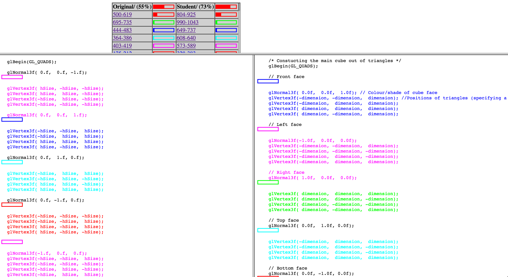

## Introduction to Animation Software Engineering 
### MSc AIM
Jon Macey

jmacey@bournemouth.ac.uk

---

## Teaching Team

- **Jon Macey** *jmacey@bournemouth.ac.uk* Unit Leader
  - Will teach 1st 5 weeks (intro to python)
- **Kari Noriy** *knoriy@bournemouth.ac.uk* (PGR)
  - Lectures on Machine Learning and AI 
- **Kavisha Jayathunge** *kjayathunge@bournemouth.ac.uk* (PGR)
  - Seminars and Lab support

--

## Outline of Unit

- Introduction to Software Engineering principles
  - Python, Test Driven Development, OO concepts, Version Control, Design Patterns 
- Using Jupyter Notebooks
  - Pandas, NumPy, Dataframes
- Data collection and processing
  - Finding an appropriate data source.
  - Analysing your data
  - Data cleaning and augmentation techniques.

--

## Outline of Unit 

- Model architectures - Neural network layers 
- (Convolutional, Linear, LSTM, etc.), Activation Functions, Normalisation (Batch-norm).
- Training loop - Optimisers, Loss function, forward and backwards pass (backpropagation). Plotting loss and analysing for overfitting.
- Train-Test-Validation 
  - The importance of testing and validating your model.
- Deployment 
  - offline and online.

---

## What we will use

- Python 3.x and Anaconda / Jupyter Notebooks
- Tensor flow or  PyTorch
- [git](https://guides.github.com/activities/hello-world/) and [git-hub](https://github.com/) for versions control and code submission
- Various Python Tools and libraries (Black,PyEnv,AutoPEP8)

---


#<small/>Citing code in your work

```python
"""
a simple Tensor Flow example
from :-
https://www.tensorflow.org/tutorials/quickstart/beginner
[Accessed 2022]. Avaliable from : <https://www.tensorflow.org/tutorials/quickstart/beginner>
"""
model = tf.keras.models.Sequential([
  tf.keras.layers.Flatten(input_shape=(28, 28)),
  tf.keras.layers.Dense(128, activation='relu'),
  tf.keras.layers.Dropout(0.2),
  tf.keras.layers.Dense(10)
])
```

--

## Citing Code
- The previous example was taken and modified from a website
- We need to cite this source in the code to avoid any notion of plagiarism.
- To do this we use the standard Harvard referencing format

--

#<small>Citing a small section of code</small>
- If you use a small section of code do the following
- Cite at the beginning of the code section
- at the end of the section mark as end of citation

```python
"""
The following section is from :-
Dan Sunday (2006) Intersections of Rays, Segments Planes and Triangles in 3D [online]
Accessed [2010] 
Avaliable from http://softsurfer.com/Archive/algorithm_0105/algorithm_0105.htm#intersect_RayTriangle()
"""
n=calcNormal(v0,v1,v2)
a = -n.dot(tvec)
b = n.dot(dir)
r=a/b;
# End Citation
```

--

## Say hello to [moss](http://theory.stanford.edu/~aiken/moss/)


---

## Coding Standards

- Most companies have coding standards, these guidelines help to make code conformant and easy to understand
- It helps with larger collaborations as all code is easy to locate and traverse
- We have an NCCA Coding standard for C++

--


##[NCCA Coding Standard](https://nccastaff.bournemouth.ac.uk/jmacey/NCCACodingStandard/index.html)
- The coding standard includes more details on how to cite code as well as other rules
- This helps us integrate code with existing projects
- Helps staff to understand code quicker when debugging and fixing problems
- Is good practice for the future (most companies use standards)
- We can also use tools to help with this.

--

## [Python Coding Standards](https://peps.python.org/pep-0008/)

- As python is a relatively new language it specified a coding standards very early (unlike C/C++)
- This was presented in the Python Enhancement Proposals 8 in 2001. (PEP-8) 
- We have tools that allow us to check our code and format to this standard
- If you are unsure check the PEP-8 guide, we expect you to be conformant with PEP-8 for all code

--

## Tool Support

- We will use a number of tools to make it easier to format and conform our code
- We will install and set these up in the labs over the next few weeks.
  - [black](https://github.com/psf/black) 
  - [autopep8](https://pypi.org/project/autopep8/)
  - [isort](https://pycqa.github.io/isort/)
- Most of these will integrate into VSCode which will be the main editor for early development

---

## Why python?

- In recent years python has become a core language for Digital Content Creation
  - it is easy to embed and use in DCC tools
- Good support for GUI (PyQt / PySide)
- Machine Learning and AI tools support python
- Easy to learn (to start with!) Easy to abuse too!

--

## Python

- python is a very flexible programming language, it can be used in a number of different ways.
- Most of our animation packages allow for embedded python scripting
- We can also write complex programs which run stand alone, and if written correctly can run on all operating systems

--

## Python in Pipeline and DCC's

- VFX reference platform mandates 3.9.x (ucs4) but we still have 2.7 floating around!
  - maya 2019 still in use by us.
```python
import sys
print (sys.maxunicode)
1114111
```

--

## Embeding and extending

- (C)Python is very easy to extend and embed
  - Extending is adding new compiled libraries with python bindings
- Embedding is the opposite where we extend our app with scripting
- There are many 3rd party tools to enable the generation of python bindings
- Most machine learning tools are written in C++ with Python bindings.

--

## How is python embedded

- The core power of python is the interpreter can be embedded in our own apps
  - https://docs.python.org/3/extending/embedding.html
- when you extend Python, the main program of the application is still the Python interpreter
- when you embed Python, the main program may have nothing to do with Python 
- instead, some parts of the application occasionally call the Python interpreter to run some Python code. 

---


## Hello World

<div class="stretch">
<iframe src="https://trinket.io/embed/python/1976ed6780" width="100%" height="356" frameborder="0" marginwidth="0" marginheight="0" allowfullscreen></iframe>
</div>

--

## import this

<div class="stretch">
<iframe src="https://trinket.io/embed/python/0e02216451" width="100%" height="356" frameborder="0" marginwidth="0" marginheight="0" allowfullscreen></iframe>
</div>

--

## import antigravity


- [python easter eggs](http://digitizor.com/easter-eggs-in-python/)

---

## Getting started
- At it’s simplest level python can be used as a simple command interpreter
- We type python into the terminal and we get a prompt which lets us enter commands
- This is know as the REPL [Read, Eval, Print, Loop](https://en.wikipedia.org/wiki/Read%E2%80%93eval%E2%80%93print_loop)
- If nothing else we can use this as a basic calculator
- It is also useful for trying simple bits of code which we wish to put into a larger system

--

## Python 2.7

- Python 2.7 will not be maintained past 1/1/2020. 
- Most of our Animation tools and pipelines still use Python 2.7
- The [vfx reference platform](https://vfxplatform.com/#footnote-python3) is planning to move to Python 3.x
- Transition is slow, but we can plan for the [__future__](https://docs.python.org/3/library/__future__.html)
	- Sometimes this can break things but for simple scripts we can try to future proof


--

## [Python in DCC Tools](https://vfxpy.com/)

- Maya 2020 and below uses Python version 2.7. 11 on all supported platforms
	- Maya 2022 uses Python 3.7.x
- Houdini 18.0 features preliminary Python 3 support in the form of a separate set of Houdini build downloads. 
  - Houdini 19 uses 3.7
- The Foundry seem to be working on Python 3 Support
- Most Pixar tools (Renderman / USD) work with both Python 2.7 and Python 3

--

## Python 3 

- The latest version of python3 is [3.10.6](https://www.python.org/downloads/)
- Note that most VFX tools will use 3.7 for the next few years once transitioned with plans for 3.9 for 2022
- This is not much of an issue but some nice features such as [f-strings](https://realpython.com/python-f-strings/) are not present.
- [more features here](https://docs.python.org/3/whatsnew/3.8.html)
- We don't always need the latest version just stability

--

## Python Implementations

- Standard python used by most people is CPython (this is also in the DCC tools)
- [iPython](https://ipython.org/) is another version used for many things, including the Jupyter Project
  - This can be installed using [anaconda](https://www.anaconda.com/)
- There are other [alternatives](https://www.python.org/download/alternatives/)

--

## [PyEnv](https://github.com/pyenv/pyenv)

- It can be difficult to manage different version of python on all platforms
  - If you need to use a specific version (for example the same as the DCC)
- I suggest using PyEnv to manage this (it will be in the lab machines under linux soon)
- This basically installs a local version you can use and install packages to using [pip](https://pip.pypa.io/en/stable/)

---

## #!

- know as a "hash bang" or ["shebang"](https://en.wikipedia.org/wiki/Shebang_(Unix%29)
- Is used in a plain text file under unix to indicate and interpreter directive.
  - basically what to run the file with
- It is the first line at the top of the file.

```
#!/usr/bin/env python
```
```
#!/usr/bin/bash
```
```
#!/opt/autodesk/maya/bin/mayapy
```

--

# [hello.py](https://github.com/NCCA/ASEAIM/blob/main/Lecture1/hello.py)

```
#!/usr/bin/env python

def main():
    print("hello world!")

if __name__ == "__main__":
    main()
```

```
chmod +x hello.py
./hello.py
```

---

## References and Resources

- [Python Cheat Sheet](https://www.pythoncheatsheet.org/)