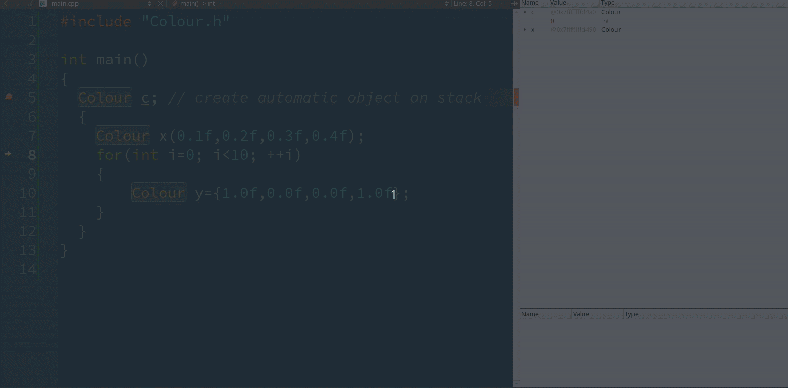

# Classes in C++
Jon Macey

jmacey@bournemouth.ac.uk

---


## Classes	in Practice
- It is standard practice to split the class into two separate files.
- A .h (.H) Header file is used to define the class and prototype the methods and data for this class.
- A .cpp (.C) file is used to contain the actual class code and algorithmic elements.
- To link these two elements together we need to tell the compiler which class the methods in the .cpp file belong to.

--


## C++ Scope Resolution Operator [::](https://msdn.microsoft.com/en-us/library/b451xz31.aspx)
- The :: (scope resolution) operator is used to qualify hidden names so that you can still use them. 
- This is how C++ allows us to have different classes with the same member function names (polymorphism)
- We use the :: to imply membership to a particular class and differentiate the different methods / class relationships


--

## [C++ class syntax](http://en.cppreference.com/w/cpp/language/class)

```
#ifndef COLOUR_H_
#define COLOUR_H_


class Colour
{
  public :

    Colour()=default;
    ~Colour()=default;
    Colour(float _r, float _g,float _b, float _a=1.0f) :
      m_r{_r},m_g{_g},m_b{_b},m_a{_a} {}
    Colour(const Colour &_c)=default;
    // accessors
    float red() const ;
    float green() const ;
    float blue() const ;
    float alpha() const ;
    // mutators see here for param passing guidelines
    // https://isocpp.github.io/CppCoreGuidelines/CppCoreGuidelines#fcall-parameter-passing
    void set(float _r, float _g, float _b, float _a=1.0f);
    void setRed(float _r);
    void setGreen(float _g);
    void setBlue(float _b);
    void setAlpha(float _a);

    void clamp(float _min,float _max);
    void mix(const Colour &_in, float _t);
    static Colour mix(const Colour &_a, const Colour &_b, float _t);
  private:

    float m_r=0.0f;
    float m_g=0.0f;
    float m_b=0.0f;
    float m_a=1.0f;
};
#endif

```

--


## [C++ class syntax](http://en.cppreference.com/w/cpp/language/class)
- we use the ``` class ``` keyword to define a class
- ``` class [name] { }; ```
- ``` { }; ``` scope defines members of the class
	- ``` public : ``` defines publicly visible area
	- ``` private : ```  defines hidden area
- classes are usually defined in a .h file

--

## [Special member functions](https://en.cppreference.com/w/cpp/language/member_functions#Special_member_functions)

- Some member functions are special : they can defined by the compiler even if not defined by the user.
  - Default constructor
  - Copy constructor
  - Move constructor (since C++11)
  - Copy assignment operator
  - Move assignment operator (since C++11)
  - Destructor
- These Special member functions are the only functions that can be defaulted  ```= default``` 

--

## A Simple class

```
class Point
{
  int x,y;
};
```
- Is this a valid class? If so explain what we get with it?

--

## [Loads of free stuff](https://www.youtube.com/watch?v=4AfRAVcThyA&t=2428s)

```
class Point
{
  private :
    int x,y;
  public :
    Point()=default;
    ~Point() noexcept = default;
    Point(const Point &)=default;
    Point & operator=(const Point &)=default;
    Point(Point &&)=default;
    Point & operator=(Point &&)=default;
    
};
```
- But always try to be explicit in your code! 

--

## Point

<div class="stretch">

<iframe width="1200px" height="800px" src="https://godbolt.org/e#z:OYLghAFBqd5QCxAYwPYBMCmBRdBLAF1QCcAaPECAKxAEZSBnVAV2OUxAHIBSAJgGY8AO2QAbZlgDU3fgGFmBPKMIBPGdm4AGAIJ9BI8VJmyAtphMk1/DTrEBDBg0kAFVMIJbdAdgBCnyZIADsR4AG52BJiSIP4Bku6SAB6kVj7SOgGBzABGysjRsQGu7hAAlDIAIlgAZnbMoh78fhlxAH7FQgRlkkKomInsgQTS/BWSNXUNMs3acS5unRBoQgzDHcN8AGzloxP1jTNz69K8m5KogZjEESSVS6grawsbpztVmLX704XzJcdbWzeeymTR%2B/1O50u1yIxDu4M2gMqwIOP083C8FW%2BOk8CRMdmEZTRvjBzyCWNmcWOgV4lUC5KOpMC/Ag1J2hziq3QIBAzCEeAAjsxMAB9IawuTrdRBOmjTncvEAaxFvIFQuMkushNB2JaASJFU4pVIoi4AFZOKQhFxNBbUFxZHw/Lw0kxWOwTvxaBaCNbDUaFSBTZpjVwACwWq2cG2kO2cC0MEDBn1Rw2kOCwJBoEyBJRXciULM50RXFCiOxCYBB4PVJSRYgJiDZX2kbLCOzEFRcL2kLNmToAeSEok7KdIWDxFeLzfwxEwyEUoUwCdH/TnCg4nG77kwJtHBBCJl9RuU2QTkCNF0UD2XAFpOZVkI7HbRQ5J4yw2BxaMezRHm7HEgADk2G9NlfewK0kU0ADpNFgyQIFwQgSA9ehJFkVBs1zYhUNKb0j39QNg13cNLX/Lh40TUhkxtUof04Xg/1HWN8JTOjSEXes8AeEBQyAA%3D"></iframe>

</div>


---

## [Constructors (ctor)](http://www.modernescpp.com/index.php/c-core-guidelines-constructors)
- When an object is created there are certain processes which must take place
- Instantiation always involves the allocation of memory for the objects state data.
- The methods do not require and memory as these are consistent for all objects of the class and are handled in the class itself.
- The special method which allocates the memory for an object is know as the 'constructor'
	- There are three basic types of constructor
	- The default constructor
	- User defined Constructor
	- The Copy Constructor

--

## [The default constructor](http://en.cppreference.com/w/cpp/language/default_constructor)

- The default constructor takes no parameters and has no return type
- It performs no processing on the object data just memory allocation
- It will always be called by the compiler if no user defined constructor is provided
- The default constructor is not referred to by the programmer in the class definition
- however since C++ 11 we should try and use ```=default```

--

## [User Defined Constructors](https://msdn.microsoft.com/en-GB/library/s16xw1a8.aspx)
- These constructors may be used to pass parameter values to the object
- These may be used to set default object values
- It is possible to have more than one constructor in a class passing different parameters
- This is known as “overloading” and gives more flexibility to the way the object can be instantiated

--

## User Defined Constructor

```
    Colour(float _r, float _g,float _b, float _a=1.0f) :
          m_r{_r},m_g{_g},m_b{_b},m_a{_a} {}
```

- set each of the attributes to a default value by calling  it’s own ctor
-  yes float has a constructor as do all C++ data types 

```
int a=int(2);
float b=float(4.5f);
```

--

## [C++ 11 in class initialisation](http://en.cppreference.com/w/cpp/language/initializer_list)

- C++ 11 allows you to set attribute values directly in the class

```
private :
	float m_r=0.0f;
	float m_g=0.0f;
	float m_b=0.0f;
	float m_a=1.0f;

```

--

## [C++ 11 in class initialisation](http://en.cppreference.com/w/cpp/language/initializer_list)
- This saves a bit of typing, but the real benefits come in classes with multiple constructors. Often, all constructors use a common initializer for a member:
- for full explaination see [stroustrup](http://www.stroustrup.com/C++11FAQ.html) section :- In-class member initializers
- [C++ core guidelines has much more depth](http://isocpp.github.io/CppCoreGuidelines/CppCoreGuidelines#S-ctor) 

--

## [copy ctor](http://en.cppreference.com/w/cpp/language/copy_constructor)
- The copy constructor creates a new class as a copy of an existing class
- As the classes are of the same type they both know about each others internal state (private attributes)
- To stop mutation of the class being copied we must make it read only
- To do this we use the const prefix on the ctor parameter being passed in.

--

## [copy ctor](http://en.cppreference.com/w/cpp/language/copy_constructor)

```
// pre c++ 11
Colour(const Colour &_c) : 
							m_r(_c.m_r),
							m_g(_c.m_g),
							m_b(_c.m_b),
							m_a(_c.m_a){}
// post c++ 11
Colour(const Colour &_c)=default;

```
- use const to make the class passed in read only
- use . to access the class attributes
- ```m_r(_c.m_r)``` is basically saying set the current class member ```m_r``` to the value of the parameter passed in ```_c.m_r```


---

### [The Orthodox Canonical class form ( rule of 3)](http://en.cppreference.com/w/cpp/language/rule_of_three)
- As a general rule (and rules are made to be broken) all classes should define four important functions
	- A default constructor :- This is used internally to initialise objects and data members when no other value is avaliable
	- A copy constructor :- This is used , among other places, in the implementation of call-by-value parameters
	- An assignment operator. This is used to assign one value to another.
	- A destructor. This is invoked when an object is deleted. (more of this soon)

--

## Rule of 5 
- C++ 11 gives some new methods of object creation an ownership and gives us a new rule
	- destructor
	- copy constructor
	- move constructor
	- copy assignment operator
	- move assignment operator
- More in a later lecture.

---

## [accessors (get Methods)](http://stackoverflow.com/questions/3647438/conventions-for-accessor-methods-getters-and-setters-in-c)
- in our Colour class these are the accessors 
```
// accessors
float red() const ;
float green() const ;
float blue() const ;
float alpha() const ;
```

- note the use of const here to say *"this method does not touch the class"*

--

## accessors

```
float Colour::red() const
{
  return m_r;
}

float Colour::green() const
{
  return m_g;
}

float Colour::blue() const
{
  return m_b;
}

float Colour::alpha() const
{
  return m_a;
}
```
- It is usual practice to put these methods in the .cpp file to keep the interface *clean*

--

## mutators (set Methods)

```
void set(float _r, float _g, float _b, float _a=1.0f);
void setRed(float _r);
void setGreen(float _g);
void setBlue(float _b);
void setAlpha(float _a);
```
- the mutators modify the class and hence can’t be const
- [A note on parameter passing](https://isocpp.github.io/CppCoreGuidelines/CppCoreGuidelines#fcall-parameter-passing
)

--

## mutators

```
void Colour::set(float _r, float _g, float _b, float _a)
{
  m_r=_r;
  m_g=_g;
  m_b=_b;
  m_a=_a;
}

void Colour::setRed(float _r)
{
  m_r=_r;
}
void Colour::setGreen(float _g)
{
  m_g=_g;
}

void Colour::setBlue(float _b)
{
  m_b=_b;
}

void Colour::setAlpha(float _a)
{
  m_a=_a;
}

```

- note the coding standard uses the Qt Convention of prefixing with set

---

#### An Aside on Test Driven Development (TDD)
1. You are not allowed to write any production code unless it is to make a failing unit test pass.
2. You are not allowed to write any more of a unit test than is sufficient to fail; and compilation failures are failures.
3. You are not allowed to write any more production code than is sufficient to pass the one failing unit test.
<center/><iframe width="560" height="315" src="https://www.youtube.com/embed/KtHQGs3zFAM?start=96" frameborder="0" allowfullscreen></iframe>

--

## Test Driven Development (TDD)
- An important aspect of TDD is that changes are made incrementally, in small steps. 
- You write a short test, then write enough code to make that test pass, and then repeat.
- After every small change, you recompile your code and rerun the tests. 
- Working in these small steps means that if a test starts to fail, then in all probability this will be caused by the code you wrote since the last test run. 


--

## 3rd Party testing Frameworks
- [there are many 3rd party testing frameworks](https://en.wikipedia.org/wiki/List_of_unit_testing_frameworks)
- these cover many languages but most have similar idioms / syntax
- for NGL I have used [google test](https://github.com/google/googletest)
- For a quick overview see the [primer](https://github.com/google/googletest/blob/master/googletest/docs/Primer.md) 
- There is also a [mocking framework](https://github.com/google/googletest/blob/master/googlemock/README.md)

```
// Qt .pro (for university) usually /usr/local
INCLUDE_PATH+=/public/devel/include
LIBS+= -L/public/devel/lib -lgtest
```

--

## Colour Class

- The Colour Class was developed using TDD (I tend to do this with all my code, be it C++ or Python)

```
#include "Colour.h"
#include <gtest/gtest.h>
using namespace ::testing;

TEST(Colour,defaultCtor)
{
  Colour c;
  EXPECT_FLOAT_EQ(c.red(),0.0f);
  EXPECT_FLOAT_EQ(c.green(),0.0f);
  EXPECT_FLOAT_EQ(c.blue(),0.0f);
  EXPECT_FLOAT_EQ(c.alpha(),1.0f);
}

```


---

# clamp

```
void Colour::clamp(float _min, float _max)
{
  auto clamp=[](float _v,float _min,float _max)
  {
  return (_v < _min) ? _min : (_max < _v) ? _max : _v;
  };

  m_r=clamp(m_r,_min,_max);
  m_g=clamp(m_g,_min,_max);
  m_b=clamp(m_b,_min,_max);
  m_a=clamp(m_a,_min,_max);

}
```
- note C++ 17 now has a std::clamp

--

## ?: what?
- The ?: construct is called an “arithmetic if”  or a “conditional expression” (Stroustrup 2009)
- It works by doing a test (bool expression) ? [true] : [false]
- This saves us writing long expressions or functions
- For example 
```
(a>=b) ? a:b;
int max(int _a, int _b)
{
	int m;
	if (a>=b)
		m=a; 
	else
		m=b; 
	return m;
}
```

--

## Linear Interpolation
- We can use linear interpolation to blend between two values using a real scalar value which ranges from 0.0 - 1.0
- The basic formula given two values a and b and the real scalar t we get 
$$ p=a+(b-a)\times t $$

--

## mix
- This function is doing basic linear interpolation of each of the colour components 
- design decision :- Should I be leaving the alpha as the original?

```
void Colour::mix(const Colour &_in, float _t)
{
  assert(_t>=0.0f && _t <= 1.0f);
  m_r=m_r+(_in.m_r-m_r)*_t;
  m_g=m_g+(_in.m_g-m_g)*_t;
  m_b=m_b+(_in.m_b-m_b)*_t;
  m_a=m_a+(_in.m_a-m_a)*_t;
}

```

--

## [assert](http://en.cppreference.com/w/cpp/error/assert)
- The assert function is a C++ macro which test the statement and if it evaluates to false will abort the program
- The assert macro is used for developing programs and testing for programmers
- We can disable it by defining the NDEBUG flag as part of our compile options (more of this in the lab session)
- Add DEFINES+= NDEBUG to the Qt Project


--

## Static Class Methods

- A static member is shared by all objects of the class

```
static Colour mix(const Colour &_a, const Colour &_b, float _t);
```

```
Colour Colour::mix(const Colour &_a, const Colour &_b, float _t)
{
  Colour ret;
  ret.m_r=_a.m_r+(_b.m_r-_a.m_r)*_t;
  ret.m_g=_a.m_g+(_b.m_g-_a.m_g)*_t;
  ret.m_b=_a.m_b+(_b.m_b-_a.m_b)*_t;
  ret.m_a=_a.m_a+(_b.m_a-_a.m_a)*_t;
  return ret;
}
```


--


## Static Class Methods


```
TEST(Colour,mixStatic)
{
  Colour a(0.0f,0.0f,0.0f,0.0f);
  Colour b(1.0f,1.0f,1.0f,1.0f);
  Colour res;
  for(float t=0.0f; t<=1.0f; t+=0.1f)
  {
    res=Colour::mix(a,b,t);
    EXPECT_FLOAT_EQ(res.red(),t);
    EXPECT_FLOAT_EQ(res.green(),t);
    EXPECT_FLOAT_EQ(res.blue(),t);
    EXPECT_FLOAT_EQ(res.alpha(),t);
  }
}

```


---


# Using the Class	

- Now we have defined the class we can use it to create different objects for us to use.
- Each of the objects must have some way of being referred to to we can differentiate it from the others
- The simplest way of doing this is by using a simple name as show in the next example 

--

```
#include "Colour.h"

int main()
{
  Colour c; // create automatic object on stack
  {
    Colour x(0.1f,0.2f,0.3f,0.4f);
    for(int i=0; i<10; ++i)
    {
        Colour y={1.0f,0.0f,0.0f,1.0f};
    }
  }
}
```

--

## Automatic Objects




--

# Objects

- Each of these Colour Objects are completely different instances of the class Colour
- Each one has it’s own name and it’s own memory space
- They are however each identical in the respect that they contain the same attributes (i.e. m_r etc) and each have the same methods which may be invoked.
- Each one of these objects has it’s own lifetime which is constrained within the { } of the main program
- These are called automatic objects (created on the stack)

--

# [The destructor](http://en.cppreference.com/w/cpp/language/destructor)
- The destructor is called when an object is destroyed
- The responsibility of the destructor is to cleanup after the object and de-allocate any memory that the object has created
- In this case the object doesn’t create any memory so the following example is illustrative rather than functional
- [As a general rule is you allocate anything dynamically in the class you need a dtor](http://www.modernescpp.com/index.php/c-core-guidelines-destructor-rules). 
- Even better use a smart pointer!

--

## Automatic Objects
```
#include <iostream>
#include <cstdlib>
#include "Colour.h"
int main()
{
Colour red(1.0f,0.0f,0.0f);
{
  Colour green(0.0f,1.0f,0.0f);
  green.Print();
  {
     Colour white(1.0f,1.0f,1.0f);
     white.Print();
  }
 red.Print();
}
}
```
- In this case the automatic objects will fall out of scope when they meet the end brace where they are defined

--

## Automatic Objects

- This will then automatically call the destructor (dtor)
 - In this case green is first  
 - followed by white
 - finally red
```
[0,1 0 1]
[1,1 1 1]
dtor called 
[1,0 0 1]
dtor called 
dtor called 
```

--

## Dynamic Objects
- In a lot of cases dynamic objects will be fine, however we may need to dynamically create our objects and control their lifetimes within the program
- To do this we need to have a way to create and destroy our objects on the fly and re-allocate them at will
- This involves the use of pointers as show in the next example

--

## Dynamic Objects

```
#include <iostream>
#include <cstdlib>

#include "Colour.h"

int main()
{

Colour *current;
current = new Colour(1,0,0);
current->setName("red");
current->print();

delete current;


current = new Colour(1,1,1);
current->setName("white");
current->print();

delete current;

}

```

---

## Why use a destructor?
- In the previous example the dtor just printed out that it had been called
- The following example will show the real reason for the dtor
- The class allocates a block of dynamic memory when it is created
- When it is destroyed we need to free this memory so the destructor does this
- We also implement a “deep copy” constructor

--

## Mem.h

```
#ifndef MEM_H_
#define MEM_H_

/// @brief a class to allocate dynamic integers
/// demonstrates the use of the destructor
class Mem
{
	public :
		/// @brief ctor passing in the size of the memory
    /// @param[in] _size the size of the array to alloc
    Mem(int _size );
    /// @brief copy ctor explicitly copies the data
		/// @param [in] _m the Mem object to copy
		Mem( const Mem &_m );
    /// @brief dtor will deallocate m_mem if allocated
		~Mem();
    /// @param method to print out the memory
    void print();
    /// @param method to set the data value in the array
    /// @param[in] _offset the index into the memory array
    /// this is validated with an assert
    /// @param[in] _value the value to set m_mem[_offset] too
    void set(int _offset,int _value);

  private :
    /// @brief a pointer to the memory
    int *m_mem;
    /// @brief the size of the memory array
    int m_size;
};

#endif
```

--

## Mem.cpp

```
#include "Mem.h"
#include <iostream>
#include <cassert>

Mem::Mem( int _size )
{
  std::cout<<"ctor called\n";
  // allocate a new block of memory
  m_mem = new int[_size];
  // retain the size of the allocated block
  m_size=_size;
}

Mem::Mem( const Mem &_m  )
{
  std::cout<<"Copy ctor Called\n";
  m_size=_m.m_size;
  // allocate new memory
  m_mem = new int[m_size];
  // now copy the data from the original
  // using a loop here but could use memcpy or std::copy is using an stl container
  for(int i=0; i<m_size; ++i)
  {
    m_mem[i]=_m.m_mem[i];
  }
//  m_size=_m.m_size;
//  m_mem=_m.m_mem;
}

Mem::~Mem()
{
  std::cout<<"dtor called\n";
  if(m_mem !=0)
  {
    delete [] m_mem;
  }
}


void Mem::print()
{
  for(int i=0; i<m_size; ++i)
  {
    std::cout<<m_mem[i]<<std::endl;
  }
}
void Mem::set( int _offset,  int _value )
{
  assert(_offset<m_size);
  m_mem[_offset]=_value;
}

```

--


## Shallow Copy
- In a shallow copy we just copy the memory address of the first class to that of the second class
- This means that the second class shares the data with the first
- If the first is destroyed then this memory is no longer valid
- In most cases this is not desirable

--


## Shallow Copy


--

## Deep Copy
- With a deep copy the object allocates the same amount of space for the memory
- Then each element is copied from the original to the new one

--

## Deep Copy


---

# References
- Budd, T 2002 “An introduction to Object Oriented programming” 3rd Edition.  Addison Wesley
- Parsons, David. “Object Oriented Programming with C++” Thomson Learning; 2nd edition 8 Nov 2000
- Priess B. “Data Structures and Algorithms with Object-Oriented Design Patterns in C++”  Wiley 1998
- Eckel B.  “Thinking in C++, 2nd ed. Volume 1”  Prentice Hall 2000

--

# Further Reading
- http://en.wikipedia.org/wiki/Mutable_object
- http://www.parashift.com/c++-faq-lite/const-correctness.html
- http://en.wikipedia.org/wiki/Unified_Modeling_Language
- http://en.wikipedia.org/wiki/Class_diagram
- http://www.ibm.com/developerworks/rational/library/content/RationalEdge/sep04/bell/
- http://www.parashift.com/c++-faq-lite/inline-functions.html


