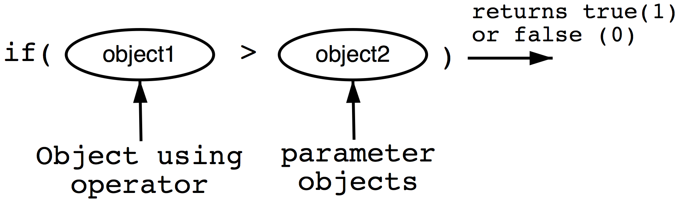
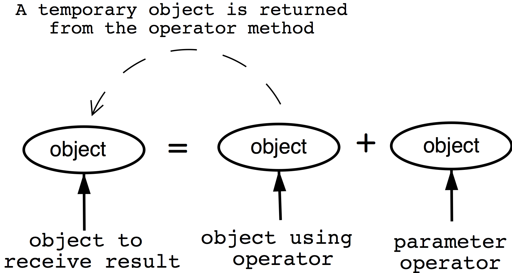

# Operator Overloading
Jon Macey

jmacey@bournemouth.ac.uk

---

## Operator Overloading
- Operator Overloading means making the compiler's built in operator symbols work with classes
- Operator symbols are things like + - = * etc
- To do this with classes we may want to use a syntax as follows

```
ngl::Vec3 p1(1,2,3);
ngl::Vec3 p2(2,3,4);
ngl::Vec3 dir=p2-p1;
```

--

## Operator Overloading
- To allow a similar operation as shown previously we have to code the mechanism ourselves
- In effect the + and = operator must be overloaded to be methods of the class
- By overloading operators in this way we can give the classes in a system a common interface, allowing us to perform similar operations on a range of different objects.

--

## Overloading and the assignment operator
- The = operator is already overloaded to work with objects as well as simple data types
- This has already been see with the copy constructor
``` 
class_name object2 = object1;
```
This means that object2 is instantiated with the same state as object1, We can also do this in normal code for example

```
object2=object1;
```

--

## Overloading and the assignment operator

- This behaviour is default for the = operator however we can program our own overloaded = operator within the class.
- This is required when pointers are used as the object will point only to the memory address and if the initial object is destroyed so will the memory address where the pointer points to, Therefore - code will be required to create and copy the pointer data

--

## C++ Syntax
- The syntax required for operator overloading is :
- The operator keyword
- And one of the 41 operator which may be overloaded as shown below

```
+ - * / % ˆ & | ~ ! = < > 
+= -= *= /= %= ˆ= 
&= |= << >> >>= <<= 
== != <= >= 
&& || ++ -- 
, ->* -> ( ) [ ]
new delete 
"" (c++ 11 suffix)
```

--

## Syntax for Operator Overloading 


- The syntax for operator overloading is as follows
- return_type operator symbol(parameter list .....)
- The return type for a relational operator is a Boolean value

--

## Arithmetic Operator Overloading


- Arithmetic operators return an object of the appropriate class as shown

--

## The parameter List
- The parameter list usually consists of an object of the class
- This is passed by reference rather than by value to avoid making a copy of the object
- Therefore the const prefix is used to stop the reference object being modified in the class

```
// less than (relational)
bool operator <(const Object &object); 
//minus (arithmetic)
Object operator -(const Object &object);
```

--

## Overloading relational operators

```
// in .h
bool operator==( const Vec3 &_v )const;
bool operator!=( const Vec3 &_v )const;
// in .cpp
bool Vec3::operator==(const Vec3& _v)const
{
  return (
          FCompare(_v.m_x,m_x)  &&
          FCompare(_v.m_y,m_y)  &&
          FCompare(_v.m_z,m_z)
         );
}

bool Vec3::operator!=(const Vec3& _v  )const
{
  return (
          !FCompare(_v.m_x,m_x) ||
          !FCompare(_v.m_y,m_y) ||
          !FCompare(_v.m_z,m_z)
         );
}

```

--

## floating point comparison
- we should never use == to compare floats.
- see [here](http://www.drdobbs.com/cpp/its-hard-to-compare-floating-point-numbe/240149806) [here](https://randomascii.wordpress.com/2012/02/25/comparing-floating-point-numbers-2012-edition/) and [here](http://stackoverflow.com/questions/17333/most-effective-way-for-float-and-double-comparison)
- I use a simple macro

```
constexpr float  EPSILON = 0.001f;
#define FCompare(a,b) \
    ( ((a)-EPSILON)<(b) && ((a)+EPSILON)>(b) )
```

--

## Overloading the arithmetic operator

```
// in .h
Vec3 operator +(const Vec3 &_v )const ;
Vec3 operator -(const Vec3 &_v )const ;

// in .cpp
Vec3 Vec3::operator+( const Vec3& _v)const
{
  return Vec3(m_x+_v.m_x,m_y+_v.m_y,m_z+_v.m_z);
}

Vec3 Vec3::operator-( const Vec3& _v)const
{
  return Vec3(m_x-_v.m_x,m_y-_v.m_y,m_z-_v.m_z);
}


```

---

## [friend functions](http://en.cppreference.com/w/cpp/language/friend)
- A friend function is used to allow access to private or protected data in a class from outside the class. 
- Normally a function which is not a member of a class cannot access the private attributes 
- In the previous case we need to access the private stream to insert or extract to so we make the member for << and >> a friend to the stream so we can access the data.
- It is best to limit the use of friend functions / classes however as we will see in the NGL library it is quite useful to make some classes friends with each other

--

### Overloading Insertion and Extraction

```
// in .h
friend std::ostream& operator<<(std::ostream& _output, const Vec3& _s);
friend std::istream& operator>>(std::istream& _input, Vec3 &_s);
// in .cpp
std::ostream& operator<<( std::ostream& _output,  const Vec3& _v   )
{
  return _output<<"["<<_v.m_x<<","<<_v.m_y<<","<<_v.m_z<<"]";
}
std::istream& operator>>( std::istream& _input, Vec3& _s  )
{
  return _input >> _s.m_x >> _s.m_y >> _s.m_z;
}

```

---

## overloading += 

```
// in .h
Vec3& operator+=(const Vec3& _v );
Vec3& operator-=( const Vec3& _v );

// in .cpp
Vec3& Vec3::operator+=(const Vec3& _v)
{
  m_x+=_v.m_x;
  m_y+=_v.m_y;
  m_z+=_v.m_z;
  return *this;
}

Vec3& Vec3::operator-=(const Vec3& _v)
{
  m_x-=_v.m_x;
  m_y-=_v.m_y;
  m_z-=_v.m_z;
  return *this;
}

```

--

## overloading []

```
// in .h
float& operator[]( size_t _i);
// in .cpp
float& Vec3::operator[](  size_t _i )
{
  assert( _i<=3);
  return m_openGL[_i];
}
``` 

--

## overloading -()

```
// in .h
Vec3 operator-();
// in .cpp
Vec3 Vec3::operator-()
{
    m_x=-m_x;
    m_y=-m_y;
    m_z=-m_z;
    return *this;
}

```

--

## float * Vector
- As the left side operator is outside the class we declare the float * vector operator in the .h file but outside of the class scope
- see free functions 

```
inline Vec3 operator *(float _k, const Vec3 &_v)
{
  return Vec3(_k*_v.m_x, _k*_v.m_y, _k*_v.m_z);
}
```


