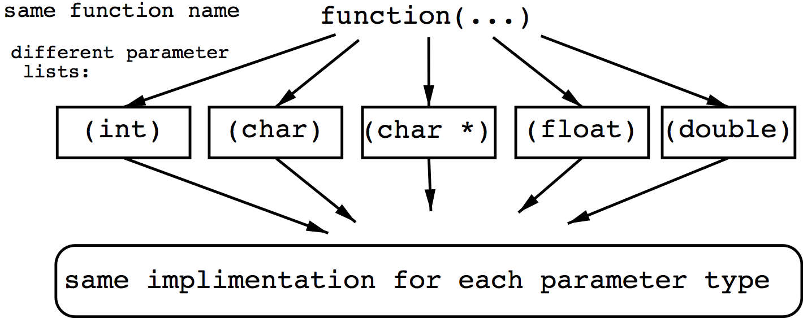
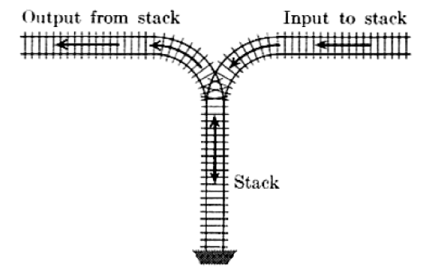
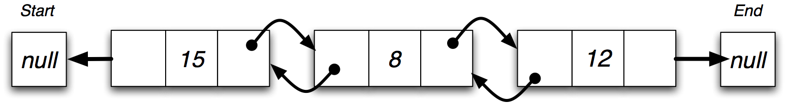
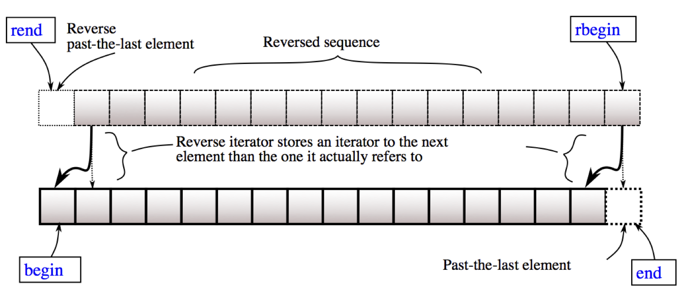

# STL and Algorithms
Jon Macey

jmacey@bournemouth.ac.uk

---

## Generic Programming
- Generic programming allows us to generate an algorithm where the data types used for the algorithm are not defined at the time the user implements the algorithm.
- Instead we declare a “template” argument which the compiler will attempt to generate when the user applies the function in a particular context.
- This is a type of polymorphism more specifically for C++ compile time polymorphism

--

## [Polymorphism by parameter](http://en.cppreference.com/w/cpp/language/function)
- Parametric Overloading allows us to have multiple methods of the same name with different parameters
- We have already seen this with the constructor method in classes
- For example we can have the following methods

```
int foo(int _a);
int foo(int _a, int _b);
int foo(float _b, float _b);

```
- Note that the return type of a function can not be overloaded and must remain the same value for every method

--

### Parametric Polymorphism (genericity)


- The primary application of parametric polymorphism is in O-O systems to allow methods to work in a generic way.
- However these functions are not truly generic as ad-hoc polymorphism is used and each different parameter list has it's own implementation
- In contrast a generic method will execute the same implementation but be able to accept a range of types as parameters

--

## Generic Functions (using templates)
- In C++ genericity is is achieved by the use of templates
- We have already used a lot of these when using stl
- A template will operate on any data type for which the internal implementation is appropriate.
- For example a template function which compares two objects using the '>' operator to return the greater will operate on any data type (including Objects) where the '>' function is appropriate.
- From the operator overloading examples last week we can see that we can now also use a simple template function with objects.

--

## But why use templates?
- We often need to perform a similar process on different data types
- The data type(s) being processed are passed to a method as parameters
- With parametric overloading, each type of parameter will cause the compiler to use a different (type specific) method.
- With genericity, a single generic function is able to process all data types, including those defined by the programmer (i.e. objects) - all data types are handled by one (type generic) model.
- Genericity allows us to create generic classes, as well as simply using generic functions as methods

--

## Generic Functions
- Genericity is a more powerful tool than parametric overloading for O-O systems because it does not have to anticipate the type of data parameters which may be supplied at run time.
- This means it is able to handle dynamic objects of disparate types
- However, this approach only works if we are able to process all data types in a particular way, this means that we need to have a common interface for all objects used as parameters.

--

## Generic function parameters
- With generic functions parameters can be of any type
- However they must be able to be processed by the function, which in this case means that able to use the '==' operator
- This will also be true of any objects which use this function as they will need an overloaded '==' operator.

---

## [Template Functions](http://en.cppreference.com/w/cpp/language/function_template)
- Templates are a very powerful tool and are the basis of the standard template library (STL)
- Template functions are a generic functions which can have parameters of any data type
- The C++ syntax for creating a template function is as follows :
- for a more in-depth notes see [here](https://nccastaff.bournemouth.ac.uk/jmacey/CA2/slides/templates/slides.html?home=/jmacey/ASE)

```
template < typename T> [return type] functionName(params )
```

--

## Template Functions
- template is a C++ keyword, and the name of the generic class name must be enclosed in pointed brackets <.....>
- The class type name can be anything but most examples use T 
- This value T acts as an alias for any data type actually passed to the function (whether that data type is int, char,Vector, Matrix, Vector, Colour, banana etc)

--

## example

```
template<typename T>
void f(T s)
{
    std::cout << s << '\n';
}
 
template void f<double>(double); // instantiates f<double>(double)
template void f<>(char); // instantiates f<char>(char), template argument deduced
template void f(int); // instantiates f<int>(int), template argument deduced
```

```
#include <iostream>
 
template<typename T>
void f(T s)
{
    std::cout << s << '\n';
}
 
int main()
{
    f<double>(1); // instantiates and calls f<double>(double)
    f<>('a'); // instantiates and calls f<char>(char)
    f(7); // instantiates and calls f<int>(int)
    void (*ptr)(std::string) = f; // instantiates f<string>(string)
}

```

--

# [Compiler Explorer](https://godbolt.org/z/WjOyS6)

<iframe width="1000px" height="500px" src="https://godbolt.org/e#g:!((g:!((g:!((h:codeEditor,i:(j:1,lang:c%2B%2B,source:'%23include+%3Ciostream%3E%0A%0Atemplate%3Ctypename+T%3E%0Avoid+f(T+s)%0A%7B%0A++++std::cout+%3C%3C+s+%3C%3C+!'%5Cn!'%3B%0A%7D%0A%0Aint+main()%0A%7B%0A++++f%3Cdouble%3E(1)%3B+//+instantiates+and+calls+f%3Cdouble%3E(double)%0A++++f%3C%3E(!'a!')%3B+//+instantiates+and+calls+f%3Cchar%3E(char)%0A++++f(7)%3B+//+instantiates+and+calls+f%3Cint%3E(int)%0A++++void+(*ptr)(std::string)+%3D+f%3B+//+instantiates+f%3Cstring%3E(string)%0A%7D'),l:'5',n:'0',o:'C%2B%2B+source+%231',t:'0')),k:60.035419126328215,l:'4',n:'0',o:'',s:0,t:'0'),(g:!((h:compiler,i:(compiler:g63,filters:(b:'0',binary:'1',commentOnly:'0',demangle:'0',directives:'0',execute:'1',intel:'0',libraryCode:'1',trim:'0'),lang:c%2B%2B,libs:!((name:fmt,ver:trunk)),options:'-std%3Dc%2B%2B14',source:1),l:'5',n:'0',o:'x86-64+gcc+6.3+(Editor+%231,+Compiler+%231)+C%2B%2B',t:'0')),k:39.964580873671785,l:'4',n:'0',o:'',s:0,t:'0')),l:'2',n:'0',o:'',t:'0')),version:4"></iframe>


---

## Example Linear Interpolation

- We can use linear interpolation to blend between two values using a real scalar value which ranges from 0 - 1
- The basic formula given two values a and b and the real scalar t we get 

$ p=a+(b-a)*t $

- This can be written in code as

```
float lerp(float _a, float _b, float _t)
{
  assert(t>=0.0f && t<=1.0f);
  return a+(b-a)*t;
}

```

--

### Problems with polymorphic approach
- The problem with the previous example is we would need to write a Lerp function for every data type.
- For Example to interpolate two Vectors we would need

```
float lerp(Vector _a, Vector _b, float _t)
{
  Vector r;
  assert(_t>=0 && _t<=1.0); 
  p.m_x=_a.m_x+(_b.m_x-_a.m_x)*_t; 
  p.m_y=_a.m_y+(_b.m_y-_a.m_y)*_t; 
  p.m_z=_a.m_z+(_b.m_z-_a.m_z)*_t;
  return r;
}

```

--

## A Template Version

```
template <typename T> T lerp(T _a, T _b, float _t) noexcept
{
  T p;
  assert(_t>=0 && _t<=1.0); 
  p=_a+(_b-_a)*_t;
  return p;
}
```
- For this function to work the Objects used must have = + - *(scalar) implemented as operators.

--

# [Compiler Explorer](https://godbolt.org/z/KXsa8o)

<iframe width="1000px" height="500px" src="https://godbolt.org/e#g:!((g:!((g:!((h:codeEditor,i:(j:1,lang:c%2B%2B,source:'template+%3Ctypename+T%3E+T+lerp(T+_a,+T+_b,+float+_t)+noexcept%0A%7B%0A++T+p%3B%0A++p%3D_a%2B(_b-_a)*_t%3B%0A++return+p%3B%0A%7D%0A%0Aint+main()%0A%7B%0A++++auto+a%3Dlerp(12,22,0.5f)%3B%0A++++auto+b%3Dlerp(0.2,2.0,0.1f)%3B%0A++++auto+c%3Dlerp(0.2f,2.0f,0.8f)%3B%0A//++++auto+d%3Dlerp(%22hello%22,%22world%22,0.5f)%3B%0A%7D'),l:'5',n:'0',o:'C%2B%2B+source+%231',t:'0')),k:60.035419126328215,l:'4',n:'0',o:'',s:0,t:'0'),(g:!((h:compiler,i:(compiler:g63,filters:(b:'0',binary:'1',commentOnly:'0',demangle:'0',directives:'0',execute:'1',intel:'0',libraryCode:'1',trim:'0'),lang:c%2B%2B,libs:!((name:fmt,ver:trunk)),options:'-std%3Dc%2B%2B14',source:1),l:'5',n:'0',o:'x86-64+gcc+6.3+(Editor+%231,+Compiler+%231)+C%2B%2B',t:'0')),k:39.964580873671785,l:'4',n:'0',o:'',s:0,t:'0')),l:'2',n:'0',o:'',t:'0')),version:4"></iframe>


---

## The Standard Template Library
- The standard Template Library (STL) takes the idea of Template functions and extends them to a number of typical programming problems.
- The STL contains templated classes which allow us to generate :-
  - [Containers](http://en.cppreference.com/w/cpp/container) (Ways of containing data)
  - [Associative](http://en.cppreference.com/w/cpp/container) Arrays (Contain data and key pairs)
  - [Iterators](http://en.cppreference.com/w/cpp/concept/Iterator) (ways of traversing the containers)
  - [Generic Algorithms](http://en.cppreference.com/w/cpp/algorithm) to act on the above

---

## [The stack](http://en.cppreference.com/w/cpp/container/stack)

- A stack is a dynamic data structure which operates on the principle of Last In First Out (LIFO)
- It has two fundamental operations :-
- push - add a value to the stack
- pop - remove the top value from the stack

--

## [The stack](http://en.cppreference.com/w/cpp/container/stack)
- Stacks are frequently used in computer graphics as a way of preserving a graphics state.
- OpenGL and Renderman both use Push and Pop operations to Save and Restore transformation information (usually a transform matrix)
- This allows for local and global transformations to happen within certain graphics contexts.

--

## [The stack](http://en.cppreference.com/w/cpp/container/stack)
- Stacks are also useful for doing simple calculations
- Using a method called [Reverse Polish Notation](https://en.wikipedia.org/wiki/Reverse_Polish_notation) (RPN)
- In Reverse Polish notation the operators follow their operands
- For example 3+4 can be represented by 3 4 +
- Using a stack we can push the values 3 and 4 onto the stack
- Then call an add operation which puts the sum on the top of the stack

--


# [std::stack example](https://github.com/NCCA/STLIntro/blob/master/STLStack/floatstack.cpp)

```
#include <iostream>
#include <stack>

int main()
{
// create a stack of floats
std::stack <float> FloatStack;
// push some values on the stack
FloatStack.push(3.0f);
FloatStack.push(2.0f);
// get the size of the stack
std::cout <<"Stack Size = "<<FloatStack.size()<<std::endl;
// print the top value
std::cout <<"top "<<FloatStack.top()<<std::endl;
// pop the value from the top of the stack
FloatStack.pop();
std::cout <<"top "<<FloatStack.top()<<std::endl;
}

```

---

## Linked Lists
- A Linked list is a classic computer data structure
- It consists of a number of linked nodes (structures) where each node points to another one.
- The lists may be implemented in a number of different ways
- Many modern languages have these data structures built into the core language, however C does not so we have to implement them ourselves.

--

## Linked list types


- Single linked list, each node points to the next



- A double linked list has references to previous and next values in the list


- A circular list points back to the beginning of the list (so never ends) good for buffers etc.

--

### Typical Linked list Operations
- insert at beginning of list
- insert at end of list
- insert in order (of data / priority )
- search
- remove contents

--

## [std::list<T>](http://en.cppreference.com/w/cpp/container/list)
- List containers are implemented as doubly-linked lists; Doubly linked lists can store each of the elements they contain in different and unrelated storage locations. The ordering is kept by the association to each element of a link to the element preceding it and a link to the element following it.

--

### Advantages of std::list
- Efficient insertion and removal of elements anywhere in the container (constant time).
- Efficient moving elements and block of elements within the container or even between different containers (constant time).
- Iterating over the elements in forward or reverse order ([linear time](https://en.wikipedia.org/wiki/Time_complexity)).

--

## std::list methods
| Method | Usage |
|--------|-------|
| ```empty()```	  | Test whether container is empty  |
| ```size()```	 | Return size  |
| ```max_size()```	| Return maximum size  |
| ```resize()```	| Change size  |
| ```front()```	| Access first element  |
| ```back()```	| Access last element  |
| ```assign()``` |	 Assign new content to container  |
| ```push_front()```	| Insert element at beginning  |

--

## std::list methods
| Method | Usage |
|--------|-------|
| ```push_back()```	| Add element at the end  |
| ```pop_back()```	| Delete last element |
| ```insert()```	 | Insert elements |
| ```swap()```	| Swap content |
| ```clear()``` |	Clear content |

--

## [example](https://github.com/NCCA/STLIntro/blob/master/STLList/stllist.cpp)

```
#include <iostream>
#include <list>
#include <algorithm>
#include <cstdlib>


int main()
{
	std::list <float> toSort;

	toSort.push_back(2.0f);
	toSort.push_back(9.0f);
	toSort.push_back(2.1f);
	toSort.push_front(12.0f);
	toSort.push_front(3.0f);
	toSort.push_front(3.0f);

	for(auto i : toSort)
		std::cout<<i<<'\n';

	toSort.sort();
	std::for_each(std::begin(toSort),std::end(toSort),[](float i){std::cout<<i<<'\n';});
	std::cout <<"Sorted"<<std::endl;
	std::for_each(std::begin(toSort),std::end(toSort),[](float i){std::cout<<i<<'\n';});
	std::cout <<"reverse" <<std::endl;
	toSort.reverse();
	std::for_each(std::begin(toSort),std::end(toSort),[](float i){std::cout<<i<<'\n';});

	std::cout <<"Front method "<<toSort.front()<<std::endl;
	std::cout <<"Back method "<<toSort.back()<<std::endl;
	std::cout << "Clear List"<<std::endl;
	toSort.clear();
	std::cout <<"Add some more values "<<std::endl;
	toSort.push_front(12.0);
	toSort.push_front(3.0);
	toSort.push_front(3.0);
	std::for_each(std::begin(toSort),std::end(toSort),[](float i){std::cout<<i<<'\n';});

	std::cout <<"Now remove unique values"<<std::endl;
	toSort.unique();
	std::for_each(std::begin(toSort),std::end(toSort),[](float i){std::cout<<i<<'\n';});


	toSort.clear();
	std::for_each(std::begin(toSort),std::end(toSort),[](float i){std::cout<<i<<'\n';});
	
	return EXIT_SUCCESS;
}


```

---

## std::list<T>::iterator
- Iterators know about the internal structure of the object they are associated with
- They are allow use to traverse the unknown internal structure of the container and gain access to the elements.
- Iterators are usually defined as functions such as begin / end
- or the reverse iterators rbegin / rend
- This iterator can modify the list

--

## std::list<T>::const_iterator
- The const_iterator allows read only access to the data contained in the list.
- In the next example we pass the list by const reference so we need to use the const_iterator.

--

## std::begin() .begin()
## std::end() .end()


--

## std::rbegin() .rbegin()
## std::rend() .rend()



---

## [std::vector](http://en.cppreference.com/w/cpp/container/vector)
- C++ has a dynamic array object called a Vector as part of the Standard Template Library (STL)
- Vectors are good at:
  - Accessing individual elements by their position index (constant time).
  - Iterating over the elements in any order (linear time).
  - Add and remove elements from its end (constant amortized time).

--

## [std::vector](http://en.cppreference.com/w/cpp/container/vector)


- Compared to arrays, they provide almost the same performance for these tasks, plus they have the ability to be easily resized. 
- Although, they usually consume more memory than arrays when their - capacity is handled automatically (this is in order to accommodate for extra storage space for future growth).

--

### You will almost always use std::vector
- [Almost always use std::vector](http://andybohn.com/almostalwaysvector/)
- [Why you should avoid linked lists](https://www.youtube.com/watch?v=YQs6IC-vgmo)
- [Uses and Abuses of Vector ](http://www.gotw.ca/gotw/074.htm)

--

## [ example point.h](https://github.com/NCCA/STLIntro/blob/master/STLVector/Point3.h)

```
#ifndef POINT3_H_
#define POINT3_H_
#include <iostream>
#include <cassert>

class Point3
{
  public :

  friend std::ostream& operator<<(std::ostream& _output,const Point3& _s)
  {
    return _output<<"["<<_s.m_x<<","<<_s.m_y<<","<<_s.m_z<<"]";
  }

  inline Point3(float _x=0.0, float _y=0.0, float _z=0.0): m_x(_x),m_y(_y),m_z(_z){;}

  inline float& operator[]( int _i)
  {
    assert(_i >=0 || _i<=3);
    return (&m_x)[_i];
  }


  private :
    float m_x;
    float m_y;
    float m_z;
};

#endif
```

--


## [ example Vector.cpp](https://github.com/NCCA/STLIntro/blob/master/STLVector/Vector.cpp)

```
#include <iostream>
#include <vector>
#include <cstdlib>
#include "Point3.h"


int main()
{
	std::vector <Point3> points;

	for (int i=0; i<10; ++i)
	{
		points.push_back(Point3(i,i,i));
	}
	// we can access elements like a normal array
	points[0][0]=99;
	points[0][1]=99;
	points[0][2]=99;


	for(auto p : points)
	{
		std::cout <<p<<'\n';
	}

	return EXIT_SUCCESS;
}

```

--

## containers with pointers
- We can clear the contents of a container by using the .clear or erase methods
- This will remove and call the dtor on any automatic object
- However this is not true for dynamic objects.
- Where we must first delete the object pointed to then clear the container
- The following example shows this.

--

## [containers with pointers](https://github.com/NCCA/STLIntro/tree/master/PointerContain)

```
#ifndef MEM_H_
#define MEM_H_

#include <iostream>
#include <cstring>
class Mem
{
  public :
    Mem(int _size,char _n) : m_mem(new int[_size]),m_c(_n), m_size(_size)
    {
      std::cout<<"ctor "<<m_c<<'\n';

    }
    Mem(): m_mem(nullptr),m_c('d'), m_size(0)
    {
      std::cout<<"default ctor "<<m_c<<'\n';
    }
    Mem(const Mem &_m)
    {
      m_size=_m.m_size;
      m_mem = new int[m_size];
      m_c=_m.m_c;
      memcpy(m_mem,_m.m_mem,sizeof(int)*m_size);
      std::cout<<"copy ctor "<<m_c<<'\n';
    }

    Mem &operator =(const Mem &_m)
    {
      m_size=_m.m_size;
      m_mem = new int[m_size];
      m_c=_m.m_c;
      memcpy(m_mem,_m.m_mem,sizeof(int)*m_size);
      std::cout<<"copy assignment "<<m_c<<'\n';
      return *this;
    }


    ~Mem()
    {
      std::cout<<"dtor "<<m_c<<'\n';
      if(m_mem !=nullptr)
        delete [] m_mem;
    }
  private :
    int *m_mem;
    char m_c;
    int m_size;
};

#endif

```

--

## [containers with pointers](https://github.com/NCCA/STLIntro/tree/master/PointerContain)

```
#include <iostream>
#include <vector>
#include <memory>
#include "Mem.h"

int main()
{

  {
    std::cout<<"**********************************\n";
    std::cout<<"scoped std::vector auto\n";

    Mem a(10,'a');
    Mem b(10,'b');
    std::cout<<"create v\n";
    std::vector<Mem>v(2);
    std::cout<<"push back\n";
    v.push_back(a);
    v.push_back(b);
    v[0]=a;
    v[1]=b;
  }
  std::cout<<"end auto scope\n";
  std::cout<<"**********************************\n";

  {
    std::cout<<"**********************************\n";
    std::cout<<"scoped std::vector dynamic\n";

    std::vector<Mem *>v;
    v.push_back(new Mem(10,'a'));
    v.push_back(new Mem(10,'b'));
    //v.clear();
    v.erase(v.begin(),v.end());
  }
  std::cout<<"end dynamic scope\n";
  std::cout<<"**********************************\n";

  {
    std::cout<<"**********************************\n";
    std::cout<<"scoped std::vector dynamic with delete\n";

    std::vector<Mem *>v;
    v.push_back(new Mem(10,'a'));
    v.push_back(new Mem(10,'b'));
    for(size_t i=0; i<v.size(); ++i)
      delete v[i];
    v.clear();
  }
  std::cout<<"end dynamic scope\n";
  std::cout<<"**********************************\n";

  {
    std::cout<<"**********************************\n";
    std::cout<<"shared pointer\n";

    std::vector<std::unique_ptr<Mem > >v;
    v.push_back( std::unique_ptr<Mem >(new Mem(10,'a')) );
    v.push_back( std::unique_ptr<Mem >(new Mem(10,'b')) );
    v.clear();
  }
  std::cout<<"end smart pointer scope\n";
  std::cout<<"**********************************\n";

}

```

---

### std::map<T>
### std::unordered_map<T> (c++11)
- Maps are a kind of associative containers that stores elements formed by the combination of a key value and a mapped value.
- In a map, the key value is generally used to uniquely identify the element, while the mapped value is some sort of value associated to this key. Types of key and mapped value may differ. For example, a typical example of a map is a telephone guide where the name is the key and the telephone number is the mapped value.

--

### std::map<T>
### std::unordered_map<T> (c++11)

- Internally, the elements in the map are sorted from lower to higher key value following a specific strict weak ordering criterion set on construction.
- unordered_map uses a hash function
- As associative containers, they are especially designed to be efficient accessing its elements by their key (unlike sequence containers, which are more efficient accessing elements by their relative or absolute position). 

--

## [example](https://github.com/NCCA/STLIntro/blob/master/STLMap/StringMap.cpp)

```
#include <iostream>
#include <map>
#include <string>
#include <cstdlib>

int main()
{
	std::map <std::string,int> MyMap;

	MyMap["Jon"]=120212442;
	MyMap["Office"]=123331452;
	MyMap["Land Line"]=243464343;

	std::cout <<MyMap["Jon"]<<'\n';
	std::cout <<MyMap["Land Line"]<<'\n';
	std::cout <<MyMap["Office"]<<'\n';
	MyMap["Jon"]=442;
	std::cout<<MyMap.size()<<'\n';
	std::cout<<MyMap["fred"]<<'\n';
	std::cout <<MyMap["Jon"]<<'\n';
	std::cout<<MyMap.size()<<'\n';

	return EXIT_SUCCESS;
}
```

--

## [Function Map]()

```
#include <iostream>
#include <unordered_map>
#include <string>
#include <cstdlib>
#include <functional>


void FuncA(int _value)
{
	std::cout <<"Function A "<<_value<<'\n';
}

void FuncB(int _value)
{
	std::cout <<"Function B "<<_value<<'\n';
}

void FuncC(int _value)
{
	std::cout <<"Function C "<<_value<<'\n';
}

int main()
{
	std::unordered_map <std::string,std::function<void (int)>> MyMap;

	MyMap["run"]=FuncA;
	MyMap["walk"]=FuncB;
	MyMap["fire"]=FuncC;

	MyMap["run"](56);
	MyMap["fire"](10);
	MyMap["walk"](1);
	return EXIT_SUCCESS;
}
```

--

## Problems with std::map
- If we lookup a key using [] that doesn’t have a value map will insert one
- This can lead to errors and overflows as show in the following example
- We should always use the iterators and .find methods for a lookup of the key
- We can access the value stored using the ->second value (and ->first) for the key.


--


##  [Map Error](https://github.com/NCCA/STLIntro/blob/master/MapError/MapError.cpp)

```
#include <iostream>
#include <cstdlib>
#include <map>
#include <string>

int main()
{
	std::map<int,std::string> map;
	map[0]="this is a value";
	std::cout<<map.size()<<"\n";
	for(int i=1; i<20; ++i)
	{
		std::cout<<map[i]<<" >"<<map.size()<<"\n";
	}
	map.clear();
	map[0]="reset";
	for(int i=0; i<20; ++i)
	{

		std::cout<<"size "<<map.size()<<"\n";
	  auto it=map.find(i);
	  if(it !=map.end())
	  {
	  	std::cout<<"found value "<<it->second<<"\n";
	  }

	}
	return EXIT_SUCCESS;
}
```

---

## The algorithm Library

- ```#include <algorithm>``` defines a collection of functions that operate on containers with range based elements (have iterators)
- These algorithms operate on the values stored in the container
- They will never increase the size of the container just modify the contents
- It is also possible to use these algorithms on our own containers as long as the container satisfies the conditions of the algorithm (usually overloaded operators for compare and access)

--

## [std::for_each](http://en.cppreference.com/w/cpp/algorithm/for_each)
- Applies a function to a range

```
#include <iostream>
#include <list>
#include <algorithm>
#include <string>

void printFunc(const std::string &i)
{
	std::cout<<i<<'\n';
}

int main()
{

	std::list <std::string> myList;
	myList.push_back("2");
	myList.push_back("asdasd4");
	myList.push_back("asd");
	myList.push_back("skdfjhsdfkjhkj");
	myList.push_back("sdfsdhfkjsdhf");
	std::for_each(myList.begin(),myList.end(),printFunc);

	std::cout<<"2 appears "<<std::count(myList.begin(),myList.end(),"2")<<"times\n";
}

```

--

## [std::count_if](http://en.cppreference.com/w/cpp/algorithm/count)
- returns the number of elements in the range for which the condition is true

```
#include <iostream>
#include <algorithm>
#include <vector>
#include <cstdlib>

bool isOdd (int i) { return ((i%2)==1); }

int main ()
{
  int mycount;

  std::vector<int> myvector;
  for (int i=0; i<10123123; ++i)
  	myvector.push_back(i);

  mycount = (int) std::count_if (std::begin(myvector), std::end(myvector), isOdd);
  std::cout << "myvector contains " << mycount  << " odd values.\n";
  // with lambda
  mycount = (int) std::count_if (std::begin(myvector), std::end(myvector), 
  [](int i){return ((i%2)==1);});
  std::cout << "myvector contains " << mycount  << " odd values.\n";

  return EXIT_SUCCESS;
}
```

--

## [std::generate](http://en.cppreference.com/w/cpp/algorithm/generate)
- generate values within a range

```
#include <iostream>
#include <vector>
#include <algorithm>
#include <cstdlib>

int main()
{

	std::vector <int> randomNumbers(10);
	srand(time(NULL));
	std::generate(std::begin(randomNumbers),std::end(randomNumbers),std::rand);

	for (auto n : randomNumbers)
		std::cout<<n<<' ';
	std::cout<<'\n';

	int n = {0};
  std::generate(std::begin(randomNumbers),std::end(randomNumbers), [&n]{ return n++; });
	for (auto n : randomNumbers)
			std::cout<<n<<' ';
		std::cout<<'\n';

}

```

--

## [std::random_shuffle](http://en.cppreference.com/w/cpp/algorithm/random_shuffle)
- Rearranges the elements in the range randomly. 

```
#include <iostream>
#include <vector>
#include <algorithm>

int main()
{
	std::vector <int> data;
	for(int i=0; i<20; ++i)
		data.push_back(i);
	std::for_each(data.begin(),data.end(),[](int a){std::cout<<a<<'\n';});
	std::random_shuffle(data.begin(),data.end());
	std::cout<<"shuffle\n";
	std::for_each(data.begin(),data.end(),[](int a){std::cout<<a<<'\n';});
}
```

--

## [std::transform](http://en.cppreference.com/w/cpp/algorithm/transform)
- apply a function in a range

```
#include <iostream>
#include <list>
#include <algorithm>

int main()
{

	std::list <int> myList;
	myList.push_back(2);
	myList.push_back(4);
	myList.push_back(5);
	myList.push_back(6);
	myList.push_back(2);

	std::list <int> secondList;
	secondList.resize(myList.size());

	std::for_each(std::begin(myList),std::end(myList),[](int n){std::cout<<n<<'\n';});

	std::transform(std::begin(myList),std::end(myList),std::begin(secondList),[](int &n){return n*2;});
	std::cout<<"second\n";
	std::for_each(std::begin(secondList),std::end(secondList),[](int n){std::cout<<n<<'\n';});

}
```

--

## [Watch this](http://www.fluentcpp.com/getTheMap/)

<iframe width="560" height="315" src="https://www.youtube.com/embed/bXkWuUe9V2I" frameborder="0" allow="accelerometer; autoplay; encrypted-media; gyroscope; picture-in-picture" allowfullscreen></iframe>

---

##references
- Knuth D.E. The art of Computer Programming Vol 1 Addison Wesley
- http://www.cppreference.com/wiki/stl/start
- http://www.cplusplus.com/reference/stl/list/
- http://www.cplusplus.com/reference/stl/bitset/
- http://www.cplusplus.com/reference/stl/vector/
- http://www.cplusplus.com/reference/stl/map/
- http://en.wikipedia.org/wiki/Linked_list#Linked_list_operations
