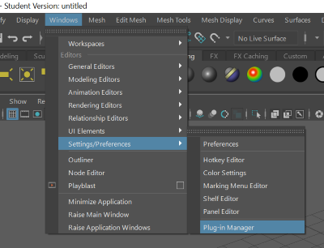
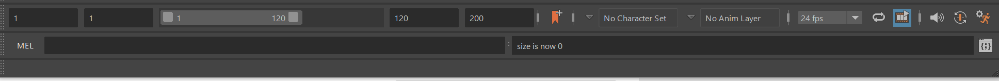
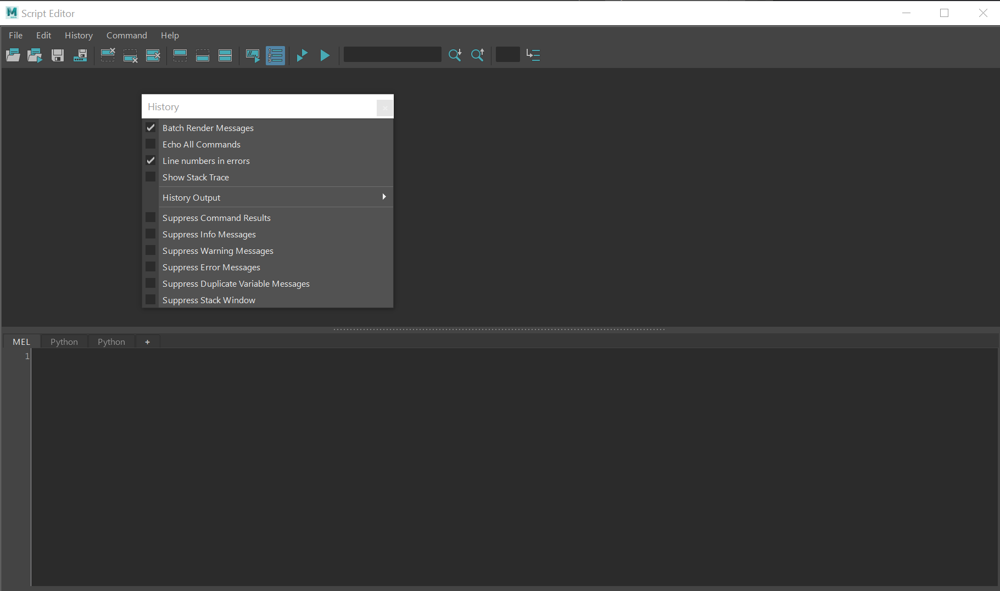
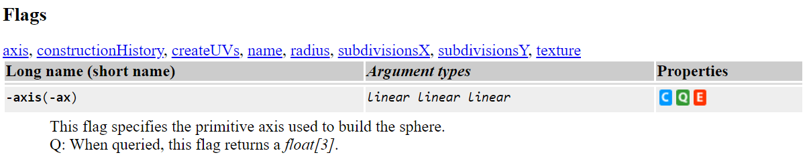

# A Technical Introduction to Maya

Jon Macey

---

### Maya as a scripting Engine

- at it's simplest maya is a scripting engine that can run MEL language scripts.
- When maya starts up it executes multiple scripts located in the directory 

``` $MAYA_LOCATION/scripts/startup/ ```

- This makes it possible to fully customize the look and feel of maya.

--

# goMaya

- When we run maya in the labs we use the goMaya script 
- this sets up the environment and plugin paths for everything we need.
- However this includes everything for the University build and can be slow

--

## Speeding up startup

- to help speedup maya when launching we can disable any plugins we don't need.
- to do this we use the plugin manager




--

## Disable plugins

- By default I disable the following plugins

	1. Bifrost
	2. MASH
	3. xGen

---


## The Maya Environment

- When maya starts up it reads a file called Maya.env this contains a number of environment variables for Maya.
- Under Linux ```~/maya/version/```
- Under Windows ```%HOMEDRIVE%\%HOMEPATH%\Documents\maya\[version]```
- On a mac this is located in ```~/Library/Preferences/Autodesk/maya/[Version]```
- We are going to use this to setup some directories to use for the next few weeks Lectures

--

## Basic Setup

```
cd $HOME
mkdir MayaScripts
mkdir MayaPlugs
```

- Add this to the Maya.env (you may need both versions of Maya)

``` 
MAYA_PLUG_IN_PATH=/home/jmacey/MayaPlugs
MAYA_SCRIPT_PATH=/home/jmacey/MayaScripts
MAYA_DISABLE_CLIC_IPM=1
MAYA_DISABLE_CER=1
```
- Note the last too can speed up maya start / restart which you will need __a lot__

--

## The script editor



- The script editor can be launched by pressing the icon at the bottom right of the screen.
- simple mel commands can also be executed in the mel dialog to the left.

--

## The script editor



--

## A simple Mel Script Test

```
global proc helloMel()
{
  print("hello from Mel\n");
}
```
- Save the file in the scripts directory as hello.mel
- in the Mel window source ```hello.mel```
- then call helloMel()

--


## Python Paths

- maya will use the global python path which you can set as usual
- it is also possible to setup some default python behaviors using a file called ```userSetup.py```
- this lives in the default maya user directory as follows
```
# Windows
%HOMEDRIVE%\%HOMEPATH%\Documents\maya\[version]\scripts
# Linux 
~/maya/[version]/scripts
# Mac OSX
~/Library/Preferences/Autodesk/maya/[version]/scripts
```

--

## userSetup.py

- to add to the path in the userSetup.py file we can do the following

```
import sys
sys.path.append('yourpath')
```

- it is quite common to add global python imports here such as 

```
from __future__ import print_function,division
import maya.cmds as cmds
```

--

## A Simple Python Script

```
def helloPy() :
  print ('hello from python ')
```
- Again save this script as helloPy.py in the Scripts directory
- We need to import the module before we use it so the following is needed

```
from helloPy import helloPy
helloPy()
```

--

## [reload](https://docs.python.org/2/library/functions.html#reload)
- To help the development cycle, we can easily modify the script and call 
```
import helloPy
# make changes to source.
reload (helloPy)
```

- to reload the module from the source file, otherwise this will be the same module for the whole of the session.
- Also note that each tab of the script editor is also a different instance so each module is unique to the tab imported

---


## MEL (Maya Embedded Language)

>As a language, MEL is descended from UNIX shell scripting. This means MEL is strongly based on executing commands to accomplish things (like executing commands in a UNIX shell), rather than manipulating data structures, calling functions, or using object oriented methods as in other languages.

--

# [MEL](https://knowledge.autodesk.com/support/maya/learn-explore/caas/CloudHelp/cloudhelp/2018/ENU/Maya-Scripting/files/GUID-60178D44-9990-45B4-8B43-9429D54DF70E-htm.html)

- Maya’s user interface is created primarily using MEL, and MEL provides an easy way to extend the functionality of Maya. 
- Everything you can do using Maya’s graphical interface can be automated and extended using MEL. 
- Familiarity with MEL can deepen your understanding of and expertise with Maya.
- it’s easy to perform a task in the graphical interface, then drag the resulting commands from the Script Editor to the shelf to create a button. 

--

## Assignment

- Mel is a strongly typed language, however it allows implicit declaration and typing in most instances. 
- When you declare a variable you also declare its type and can optionally assign an initial value.
- Variable names start with a $, followed by a letter, then any combination of letters, numbers, and underscores. 

- a variable's type cannot be redefined once it is created, however standard scoping rules are still applicable.


--

## Assignment

```
int $a = 5;
float $b = 3.456;
vector $v = <<1.2, 3.4, 6.5>>;
float $ar[] = {1.2, 3.4, 4.5}; // An array of floats
matrix $mtx[3][2]; // A 3x2 matrix of floats
```

```
int $a=1;
int $b=1;
// Error: int $b=1; // 
// Error: Line 2.7: Invalid redeclaration of variable "$b" as a different type. // 
```

- In this example the variables are effectively global.

--

## Assignment

- A variable must go out of scope before it can be declared as a different type. 
- Best to always use scope when writing simple expressions and tests

```
{
	$s1 = "hello";
	$s2 = " Mel Scripting";
	print( $s1 + $s2);
}
print($s1);
```

--

## Arrays

- arrays can be index and used as with normal arrays.
- size gives the size and clear clears.
```
{
    float $floats[]={1.0,2.2,3.30,4.3};
    print("Size of array " + size($floats));
    // now append
    $floats[size($floats)]=99.2;
    for($f in $floats)
    {
        print("value is "+$f+"\n");
    }
    clear($floats);
    print("size is now "+size($floats));
};
```

--

## Global 

- Once a variable or function is declared as global, it can exist and be addressed between different scripts and procedures.
- This can be problematic especially if using simple names.
- To refer to the variable elsewhere, you need to include the "global" keyword


---

## MEL Command Syntax

- MEL includes a wide variety of commands for all aspects of using Maya. 
- Anything that can be executed by a button press can be done with a command

```
sphere -radius 12 -name "big";
move -relative 2 2 2 "big";
rotate -relative 45 0 0 "big";
```

- By convention, most commands operate on an object if you specify its name, otherwise they operate on the current selection.

--

## Imperative syntax
- The imperative command syntax looks like a command in a shell, with optional flags and arguments after the command name

```
sphere -name "sphere10" -radius 10;
```

- The imperative style is a complete statement and should end with a semicolon
- When you use this imperative command syntax  you can optionally leave off quotation marks around single-word strings

```
sphere -name sphere10 -radius 10;
```

--

## A note on numbering

- maya will check names when you create things.
- In the previous example if we run the ```sphere``` command again it will re-number the sphere to sphere11.

```
{
	int $i;
	for($i=0; $i<10; ++$i)
		sphere -r 1 -name "sphere";
}
```

- in this case we get ```sphere, sphere1 ... sphere9```


--

## Function Syntax

- Function syntax looks like a standard function call in a computer language.

```
// Imperative syntax
attributeExists visibility mySphere;
// Function syntax
attributeExists("visibility","mySphere"); 
``` 

--

## Create, edit, and query modes

- many of the commands have different modes outlined in the documentation.



- If you don’t include an -edit or -query flag, a command operates in create mode. 
- In this mode, the command creates the named object/node in the scene graph.

--

## Create, edit, and query modes

```
{
    sphere -name "newSphere";
    sphere -query -radius "newSphere";
    sphere -e -r 4 "newSphere";
    sphere -q -r "newSphere";
    
};
```

- note we can also use long or short flags as outlined in the help documentation

--


## Using return values \` \`

- When you use the function syntax of a command, the command returns a value.
- When you use the imperative syntax, the command simply prints its return value to the Script Editor, it does not provide a usable return value. 
- Using imperative syntax in an expression will cause a syntax error:

--

## Using return values \` \`

```
if (size($word)) print("Not empty.\n");
// Function syntax of size returns a value.
// This is OK.
if (size $word) print("Not empty.\n");
// Can't use imperative 
// This is a syntax error.
```

- To use imperative command syntax in an expression you must surround the command with backquotes:

```
if (`size $word`) print("Not empty.\n");
```

---

## [eval](https://help.autodesk.com/cloudhelp/2018/ENU/Maya-Tech-Docs/Commands/eval.html)

- The purpose of the eval command is to provide a way for the user to execute a MEL command or procedure which can only be determined at runtime. 

```
{
// a set of possible command that could be executed
string $commands[] = { "polyCone", "polyCube", "polySphere", "polyTorus" };

// repeat a few times
for( $i=-10; $i<=10; $i+=2 )
{
	for( $j=-10; $j<=10; $j+=2 )
	{
		// generate a random number to use as an index into the commands array
		int $index = `rand 4`;
		
		// call eval to execute the command
		eval($commands[$index]);
		
		// move the object
		xform -t $i 0 $j;
	}
}
}
```

--

## [ls](https://help.autodesk.com/cloudhelp/2018/ENU/Maya-Tech-Docs/Commands/index.html)

- The ls command returns the names (and optionally the type names) of objects in the scene.
- The most common use of ls is to filter or match objects based on their name (using wildcards) or based on their type. 
- By default ls will match any object in the scene but it can also be used to filter or list the selected objects when used in conjunction with the -selection flag.

--

## [ls](https://help.autodesk.com/cloudhelp/2018/ENU/Maya-Tech-Docs/Commands/index.html)

- Values are returned in a ```string []``` which we can process.

```
{
		// declare an array called $nodes. Call ls to list
		// the nodes in the scene
		$nodes = `ls`;
		
		// loop through the array and print each node
		for( $node in $nodes ) {

			// use the nodeType function to determine the 
			// type of the node
			$type = `nodeType $node`;
			
		
			// print the node name and it's type
			print( $node +" "+ $type +"\n" );
		}
	}
```

---

## Rock Tool

- We are going to create a simple tool to generate random rock
- To do this we will generate a number of low res sphere with random parameters
- These will then be combined using a boolean operation
- Other mesh operations will be applied to make it look more rock like.

--

## Rock Tool

- The basic operations we are going to use are as follows

<video width="720" height="480" controls src="images/rock1.mp4"  type="video/mp4" autoplay></video>


--

## Rock Tool

- We are going to create this as a small script and a series of functions
- Eventually a GUI will be added to allow controls to be changed.

```
proc string createSphere(float $minRad, float $maxRad,int $minRockDivisions,int $maxRockDivisions)
{
  $divx=(int)rand($minRockDivisions,$maxRockDivisions);
  $divy=(int)rand($minRockDivisions,$maxRockDivisions);
  
  $cmd ="polySphere -sx " +  $divx + " -sy " + $divy + "  -r " + `rand $minRad $maxRad` + "-name baseSphere"; 

  $name=eval($cmd); //`polySphere -sx 8 -sy 8 -r `rand $minRad $maxRad` -name "baseSphere"`;
  $x = rand(-$minRad,$minRad); 
  $y = rand(-$minRad,$minRad); 
  $z = rand(-$minRad,$minRad); 
  move $x $y $z  ;
  $rx= rand(360);
  $ry= rand(360);
  $rz= rand(360);
  rotate -os $rx $ry $rz;
  $sx= rand($maxRad)+$minRad;
  $sy= rand($maxRad)+$minRad;
  $sz= rand($maxRad)+$minRad;
  scale $sx $sy $sz;
  return $name[0];
};

proc string createRock(int $numSpheres, float $minRad, float $maxRad,int $minRockDivisions,int $maxRockDivisions)
{
  int $i;
  for ($i = 0; $i < $numSpheres; ++$i) 
  {
    createSphere($minRad,$maxRad,$minRockDivisions,$maxRockDivisions);
  }

  string $spheres[] = `ls -type shape "baseSphere*"`;
  select $spheres;
  $name= `polyCBoolOp -op 1 -ch 1 -preserveColor 0 -classification 1 -name NewRock`;
  polyTriangulate -ch 1 -name $name;
  polyReduce  -p 50  -replaceOriginal 1 -name $name;
  polySmooth  -name $name;  
  delete -ch $name;
  $sx= rand(360);
  $sy= rand(360);
  $sz= rand(360);
  rotate -os $sx $sy $sz;
  return $name[0];
}

proc createRockCallback() 
{
  // read the control for the number of cubes to be created
  int $numSpheres = `intSliderGrp -q  -v numSpheres`;
  float $minRad = `floatSliderGrp -q  -v minRadius`;
  float $maxRad = `floatSliderGrp -q  -v maxRadius`;
  int $minRockDivisions = `intSliderGrp -q  -v minRockDivisions`;
  int $maxRockDivisions = `intSliderGrp -q  -v maxRockDivisions`;

  createRock($numSpheres,  $minRad,  $maxRad, $minRockDivisions,$maxRockDivisions);
}

proc createMultipleRocks() 
{
  // read the control for the number of cubes to be created
  int $numRocks = `intSliderGrp -q  -v numRocks`;
  int $numSpheres = `intSliderGrp -q  -v numSpheres`;
  int $minRockDivisions = `intSliderGrp -q  -v minRockDivisions`;
  int $maxRockDivisions = `intSliderGrp -q  -v maxRockDivisions`;

  float $minRad = `floatSliderGrp -q  -v minRadius`;
  float $maxRad = `floatSliderGrp -q  -v maxRadius`;
  int $i;
  for($i=0; $i<$numRocks; ++$i)
  {  
   $sphereName=createRock($numSpheres,  $minRad,  $maxRad,$minRockDivisions,$maxRockDivisions);
  $x = rand(-20,20); 
  $y = 5.0; 
  $z = rand(-20,20); 
  move $x $y $z $sphereName ;
  }
}

proc createRockGUI()
{

  if ( `window -exists RockWindow` ) 
  {
    deleteUI RockWindow; // delete window when it exists
  }
  window -t "rock creation tool" RockWindow;
  columnLayout colLayout;
  floatSliderGrp -p colLayout -field 1 -l "min rock radius" -min 0.2 -max 2.0 -value 0.2 minRadius;
  floatSliderGrp -p colLayout -field 1 -l "max rock radius" -min 0.2 -max 5.0  -value 1.2 maxRadius;
  intSliderGrp -p colLayout -field 1 -l "min rock divisions" -min 2 -max 12 -value 2 minRockDivisions;
  intSliderGrp -p colLayout -field 1 -l "max rock divisions" -min 2 -max 25  -value 4 maxRockDivisions;

  intSliderGrp -p colLayout -field 1 -l "number of spheres" -min 4 -max 100  -value 4 numSpheres;

  button -p colLayout -l "Create" -command "createRockCallback()";


  intSliderGrp -p colLayout -field 1 -l "number of rocks" -min 4 -max 500  -value 20 numRocks;
  button -p colLayout -l "Create Multiple" -command "createMultipleRocks()";

  showWindow RockWindow;

}

createRockGUI();


```


---

## References

https://knowledge.autodesk.com/support/maya/learn-explore/caas/CloudHelp/cloudhelp/2015/ENU/Maya/files/Syntax-htm.html

