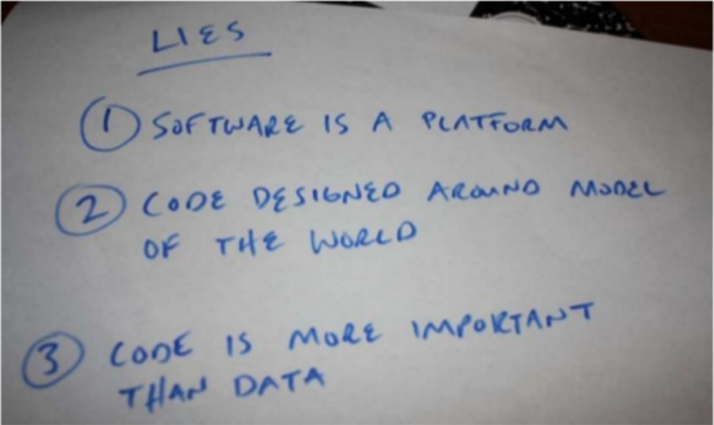

# Introduction to Data Oriented Design

Jon Macey

jmacey@bournemouth.ac.uk

---

## Introduction

- From Mike Acton's cppcon talk :- 3 big lies
</img>
- I know that's what we have taught you for the last 2 years!

--

## Well not quite

- For many cases this is true, especially for large software systems
- However for high performance applications we need speed / and good memory performance
- This is true of both games and DCC tools
- [see this](https://cellperformance.beyond3d.com/articles/2008/03/three-big-lies.html)

--

# Lie #1

- Software is a platform :-
  > The reality is software is not a platform. You can't idealize the hardware. And the constants in the "Big-O notation" that are so often ignored, are often the parts that actually matter in reality (for example, memory performance.) 

--

# Lie #2 
- Code should be designed around a model of the world!

<blockquote>
<small/><P/>There is no value in code being some kind of model or map of an imaginary world. I don't know why this one is so compelling for some programmers, but it is extremely popular. If there's a rocket in the game, rest assured that there is a "Rocket" class (Assuming the code is C++) which contains data for exactly one rocket and does rockety stuff. With no regard at all for what data transformation is really being done, or for the layout of the data. Or for that matter, without the basic understanding that where there's one thing, there's probably more than one.
</blockquote>

--

# Lie #3
- Code is more important than data
<blockquote>
<small/><P/>This is the biggest lie of all. Programmers have spent untold billions of man-years writing about code, how to write it faster, better, prettier, etc. and at the end of the day, it's not that significant. Code is ephemeral and has no real intrinsic value. The algorithms certainly do, sure. But the code itself isn't worth all this time (and shelf space! - have you seen how many books there are on UML diagrams?). The code, the performance and the features hinge on one thing - the data. Bad data equals slow and crappy application. Writing a good engine means first and formost, understanding the data.
</blockquote>


--

## So now what?
- the following slides are going to present issues that can arise (usually from C++ / OO approach)
- we will look at how common programming idioms cause issues with the optimizer
- we will discover re-arranging data in different way will make cache misses less likely
- we will see that doing this can make it easier to run code concurrently 


---

## Strict Aliasing
- Strict aliasing is an assumption, made by the C (or C++) compiler, that dereferencing pointers to objects of different types will never refer to the same memory location (i.e. alias eachother.) 
- Why is this an issue?
- May cause multiple fetches and not allow compiler to optimize (it can't tell how the pointer will change)

--

## Example

<iframe width="1000px" height="800px" src="https://godbolt.org/e#g:!((g:!((g:!((h:codeEditor,i:(j:1,lang:c%2B%2B,source:'void+alias(float+*v,+int+*n)%0A%7B%0A++++for(int+i%3D0%3B+i%3C*n%3B+%2B%2Bi)%0A++++%7B%0A++++++++v%5Bi%5D%2B%3D1.0f%3B%0A++++%7D%0A%7D%0A%0Avoid+noalias(float+*v,+int+*n)%0A%7B%0A++++auto+l%3D*n%3B%0A++++for(int+i%3D0%3B+i%3Cl%3B+%2B%2Bi)%0A++++%7B%0A++++++++v%5Bi%5D%2B%3D1.0f%3B%0A++++%7D%0A%7D'),l:'5',n:'0',o:'C%2B%2B+source+%231',t:'0')),k:51.19524223962867,l:'4',n:'0',o:'',s:0,t:'0'),(g:!((h:compiler,i:(compiler:g83,filters:(b:'0',binary:'1',commentOnly:'0',demangle:'0',directives:'0',execute:'1',intel:'0',libraryCode:'1',trim:'0'),lang:c%2B%2B,libs:!(),options:'-O3+-ffast-math++-fstrict-aliasing',source:1),l:'5',n:'0',o:'x86-64+gcc+8.3+(Editor+%231,+Compiler+%231)+C%2B%2B',t:'0')),header:(),k:48.804757760371345,l:'4',m:100,n:'0',o:'',s:0,t:'0')),l:'2',n:'0',o:'',t:'0')),version:4"></iframe>

--

## restrict (C only)

<iframe width="1000px" height="800px" src="https://godbolt.org/e#g:!((g:!((g:!((h:codeEditor,i:(j:1,lang:___c,source:'void+vecAdd(float+*a,+float+*b,+float+*c)%0A%7B%0A++++for(int+i%3D0%3B+i%3C4%3B+%2B%2Bi)%0A++++++++a%5Bi%5D%3Db%5Bi%5D%2Bc%5Bi%5D%3B%0A%7D%0A%0A%0A%0Avoid+vecAdd2(float++*+restrict+a,+float+*b,+float+*c)%0A%7B%0A++++for(int+i%3D0%3B+i%3C4%3B+%2B%2Bi)%0A++++++++a%5Bi%5D%3Db%5Bi%5D%2Bc%5Bi%5D%3B%0A%7D%0A%0A'),l:'5',n:'0',o:'C+source+%231',t:'0')),k:34.13016149308579,l:'4',n:'0',o:'',s:0,t:'0'),(g:!((h:compiler,i:(compiler:cg82,filters:(b:'0',binary:'1',commentOnly:'0',demangle:'0',directives:'0',execute:'1',intel:'0',libraryCode:'1',trim:'0'),lang:___c,libs:!(),options:'-O3',source:1),l:'5',n:'0',o:'x86-64+gcc+8.2+(Editor+%231,+Compiler+%231)+C',t:'0')),header:(),k:32.5365051735809,l:'4',m:100,n:'0',o:'',s:0,t:'0'),(g:!((h:output,i:(compiler:1,editor:1,wrap:'1'),l:'5',n:'0',o:'%231+with+x86-64+gcc+8.2',t:'0')),k:33.33333333333333,l:'4',n:'0',o:'',s:0,t:'0')),l:'2',n:'0',o:'',t:'0')),version:4"></iframe>

--

## Aliasing

 - In the first example, without type-based alias analysis the value of *n would have to be fetched from memory as many times as the loop iterates. 
 - In the second version, the value of *n has been moved out of the loop and is therefore fetched only once. 
 - It is important to note that according to the C/C++ language standards it is illegal to write code similar to the following type-punning operation.
 

--


## C++ 

- we should enable -fstrict-aliasing to get warning of this issue and fix
- see [this](https://cellperformance.beyond3d.com/articles/2006/06/understanding-strict-aliasing.html)
- still no restrict keyword in C++ but most compilers have ```__restrict``` keyword (not standard)

--

> It should be pointed out that declaring the input variables as const is not a solution to the aliasing problem. For example, declaring m as const Matrix &m just says that the memory area occupied by m is constant with respect to accesses through m, not that the memory area is constant in general.


--

## How to avoid aliasing
-  Minimize use of globals, pointers, references
  - Pass small variables by-value
  - Use local variables as much as possible
- Make local copies of global and class member variables
- Declare variables close to point of use
- Declare side-effect free functions as const

---

## Instruction Cache Optimizations

- Optimizing the utilization of a cache has two key parts. The first is reducing the size of the data it holds. 
- The second is increasing data locality so that data accessed at the same time is stored together.
- Break loops up into cache-size chunks. 

--

## Loops

- Give the following when A B and C are large chunks of independent code.

```
for (i = 0; i < N; i++) 
{
  ...A...;
  ...B...;
  ...C...; 
}
```

--

## Loops

- split so that A,B and C can fit into cache

```
for (i = 0; i < N; i++)
  ...A...;
for (i = 0; i < N; i++)
  ...B...;
for (i = 0; i < N; i++)
  ...C...;
```
- Keeping the code in cache outweighs the small cost added by the additional loop overhead. 
- For loop bodies that do not quite fit into the instruction cache, an opposite strategy can be employed.

---

## What is Data?

- Any application is nothing without its data!
- Instructions are data too. 
  - Instructions take up memory, use up bandwidth, and can be transformed, loaded, saved and constructed.
  - LISP actually transforms [instructions](https://tinyurl.com/c2lsewj)

--

## The first Principle
- Data is not the problem domain.
  - OO techniques  :-
  > abstraction heavy paradigms try to pretend the computer and its data do not exist at every turn, abstracting away the idea that there are bytes, or CPU pipelines, or other hardware features.

--

## The First Principle

> The data-oriented approach gives up some of the human readability by leaving the problem domain in the design document, but stops the machine from having to handle human concepts at any level by just that same action.

--

## The First Principle

- When a class owns some data, it gives that data a context, and that context can sometimes limit the ability to reuse the data.
  - We often get repeated data (as in two classes sharing things etc)
  - It may be unrelated data (dependent upon context and use of the class)

--

## Data Driven Approach

- data is mere facts that can be interpreted in whatever way necessary to get the output data in the format it needs to be. 
- We only care about what transforms we do, and where the data ends up. 
- In practice, when you discard meanings from data, you also reduce the chance of tangling the facts with their contexts, and thus you also reduce the likelihood of mixing unrelated data just for the sake of an operation or two.

--

## The Second Principle

- Data is type, frequency, quantity, shape and probability.
  - It's not just structue
  - It's not just about cache misses (although this will help)
- The data-oriented design model is centred around data, live data, real data, information data. 
- Object-oriented design is centred around the problem and its solution. 

--

## The Second Principle

- object oriented is quick and easy to develop from Abstraction to code.

> Data-oriented design takes a different approach to the problem, instead of assuming that we know nothing about the hardware, it assumes we know nothing about the problem.

- it plans to be simple, and get the job done. 
- Extendible can be added later, with unit tests to ensure that it remains working as it did while it was simple.

--

## Data Changes

- Data oriented design is current. 
- OO design starts to show its weaknesses when designs change. 
- OO design suffers from an inertia inherent in keeping the problem domain coupled with the implementation. 
- A data-oriented approach to design takes note of the change in design by understanding the change in the data.

--

## Operations an Data

- OO links  operations by related data 
  - hard to unlink the methods when the data changes or splits.

> If you keep your data in one place, write operations in another place, and keep the aspects and roles of data intrinsic from how the operations and transforms are applied to the data, then you will find that many refactorings that would have been large and difficult in object oriented code, become trivial.


---

## Why Use an ```if```(?)

- Cyclomatic complexity concerns itself only with flow control.
  - one plus the number of conditionals present in the system being analysed
  -  ```if, while, for, and do-while```
  - ```case``` statements and ```virtual``` call even harder to calculate
- good tools to help measure this from source. 

--

## Why Use an ```if```(?)

- In most cases  flow controls are put in for one of two reasons
  1. design, and implementation necessity (game logic, program logic etc)
  2. defensive programming techniques (check for null data in list etc.)
- Most flow control statements are just to stop crashes, to check bounds, pointers being null, or any other exceptional cases.
- The second most common is loop control (but hardware, compilers and optimizers know how to deal with these well.) 

--

## Why Use an ```if```(?)

- The third most common flow control comes from polymorphic calls, which can be helpful in implementing some of the program logic

- but mostly enforced in the object-oriented approach to writing software.
  - Remember "re-use is good"

--

## Solutions

- keep our working set of data as a collections of arrays
  - no need to check for nullptr
- The reason we are able to get rid of the check for null is that we now have our data in a format that doesn’t allow for null.

--

## Solutions

> Where we once had rooms, and we looked in the rooms to find out if there were any doors on the walls we bumped into (in order to either pass through, or instead do a collision response), we now look in the table of doors to see if there are any that match our ```roomid```. This reversal of ownership can be a massive benefit in debugging, but sometimes can appear backwards when all you want to do is find out what doors you can use to get out of a room.

---

## Existence based processing

- "Existence based processing" is when you process every element in a homogeneous set of data. 
- You run the same instructions for every element in that set. 
- usually three types of operation :-
  - filter
  - mutation
  - emission

--

## Mutation

- A mutation is a one to one manipulation of the data
- it takes incoming data and some constants that are setup before the transform
- produces one element for each input element. 

--

## Filter

- A filter takes incoming data and some constants that are setup before the transform, 
- produces one element or zero elements for each input element.

--

## Emission

- An emission is a manipulation on the incoming data that can produce multiple output elements. 
- Just like the other two transforms, an emission can use constants, but there is no guaranteed size of the output table
-  it can produce anywhere between zero and infinity elements.

--

## Kernel Processing

- Every CPU can efficiently handle running processing kernels over homogeneous sets of data
  - doing the same operation over contiguous data reduces uOP cache reloads. 
- When there is no global state, no accumulator, it is proven to be parallelisable. 
  - think [mapreduce](https://en.wikipedia.org/wiki/MapReduce) and Cuda, or OpenCL
- Stateless transforms of stateful data is highly robust, and deeply parallelisable (and the compiler may do it for us!)

--

## Branch Prediction

- In predication, flow control statements are not  ignored, they are used instead as an indicator of how to merge two results. 
- Both sides of the branch are run and it discards one result based on the value of the condition.
- In some CPUs there is an fsel intrinsic, other CPUs may have a [cmov](https://www.felixcloutier.com/x86/cmovcc) instruction, but all CPUs can use masking to effect this trick.
- [example](https://github.com/xiadz/cmov)


---

## Don’t use booleans

- Domain knowledge normalisation applies in most  development
  - however not often used (Apart from perhaps database normalization)

> As information is encoded in data, and the amount of information encoded can be amplified by domain knowledge, it’s important that we begin to see the advice offered by compression techniques is that: all we are really encoding is probabilities.

--

## Example Game Entity

> in a game the entities have health, regenerate after a while of not taking damage, can die, can shoot each other.

- then lets see what domain knowledge can do to reduce processing.
- if you have full health, you don’t need to regenerate.
- Once you have been shot, it takes time until you begin regenerating.
- Once you are dead, you cannot regenerate and have zero health.

--

```
struct entity 
{
  // information about the entity position
  // ...
  // now health data in the middle of the entity
  float timeoflastdamage;
  float health;
  // other entity information
};

std::vector<entity> entities;

```

```
void updatehealth( entity *e ) 
{
  auto timesincelastshot = e->timeoflastdamage - currenttime; 
  bool ishurt = e->health < max_health && e->health > 0;
  bool regencanstart = timesincelastshot >time_before_regenerating; 
  if( ishurt && regencanstart ) 
  {
    e->health = min(max_health, e->health + ticktime * regenrate); 
  }
}
```

--

## Example

- the updatehealth will run for every entity in the game, every update.
- We can make this better by looking at the flow control statement. 
- The function only needs to run if the health is less than full health, and more than zero. 
- The regenerate function only needs to run if it has been long enough since the last damage dealt.


--

## Example

```
 
struct entity 
{
// information about the entity position // ...
// other entity information
};
struct entitydamage 
{
  float timeoflastdamage;
  float health; 
}
std::vector<entity> entities; 
std::unordered_map<entityref,entitydamage> entitydamages;
```

--

## Example

- We can now run the update function over the health table rather than the entities.

```
void updatehealth () 
{
  for(auto eh : entitydamages ) 
  {
    auto entity = eh->first;
    entitydamage &ed = eh->second; 
    if( ed.health < 0 ) 
    {
      deadentities.insert( entity );
      discard(eh); 
    } 
    else 
    {
      auto timesincelastshot = eh->timeoflastshot - currenttime;
      bool regencanstart = timesincelastshot > time_before_regenerating;
      if( regencanstart )
        eh->health =eh->health + ticktime * regenrate;
      if( eh->health > max_health ) 
        discard(eh);
    }
  }
}
```

--

## Example

- new ```entityhealth``` is only added when damaged, if it already has it we just update. 
- The reason this works is that an entity has an implicit boolean hidden in the row existing in the table. 
- For the ```entityhealth``` table, that implicit boolean was ```ishurt``` from the first function. 
- For the ```deadentities``` table, the implicit boolean of ```isdead```, also implies a health value of 0, which can reduce processing for many other systems. 
- If you don’t have to load a float and check that it is less than 0, then you’re saving a floating point comparison or conversion to boolean.

---

## Don’t use enums

- Enumerations are used to define sets of states. 
- We could have had a state variable for the regenerating entity, one that had ```infullhealth```, ```ishurt```, ```isdead``` as its three states.
- We then use and ```if``` or ```switch``` to determine what needs to be done.
- This approach is not ideal if we don't want to use an ```if``` in our code.

--

## Don’t use enums

- Instead we use tables (arrays of components)
  - Any enum can be emulated with a variety of tables. 
  - All you need is one table per enumerable value. 
  - Setting the enumeration is an insert into a table.
- If it exists in the table it can be operated on.

--

## Don’t use enums

> If the enum is a state or type enum previously handled by a switch or virtual call, then we don’t need to look up the value, instead we change the way we think about the problem. The solution is to run transforms taking the content of each of the switch cases or virtual methods as the operation to apply to the appropriate table, the table corresponding to the original enumeration value.

--

# Polymorphism 
- What will this code generate?

```
#include <cstdio>
#include <cstdlib>
#include <cmath>

struct shape 
{ 
    shape (){}
    virtual ~shape() {}
    virtual float getarea () const = 0;
};
struct circle : public shape 
{ 
    circle( float diameter ) : d(diameter ) {} 
    ~circle() {}
    float getarea() const { return d*d*M_PI/4; } 
    float d;
};

struct square : public shape 
{ 
    square( float across ) : width( across ) {} 
    ~square() {}
    float getarea() const { return width*width; } 
    float width;
};

int main () 
{
  circle circle( 2.5f );
  square square( 5.0f );
  shape *shape1 = &circle, *shape2 = &square;
  printf( "areas are %f and %f\n", shape1->getarea(), shape2->getarea());
  return EXIT_SUCCESS;
}
```

--

<iframe width="1000px" height="600px" src="https://godbolt.org/e#g:!((g:!((g:!((h:codeEditor,i:(j:1,lang:c%2B%2B,source:'%23include+%3Ccstdio%3E%0A%23include+%3Ccstdlib%3E%0A%23include+%3Ccmath%3E%0A%0Astruct+shape+%0A%7B+%0A++++shape+()%7B%7D%0A++++virtual+~shape()+%7B%7D%0A++++virtual+float+getarea+()+const+%3D+0%3B%0A%7D%3B%0Astruct+circle+:+public+shape+%0A%7B+%0A++++circle(+float+diameter+)+:+d(diameter+)+%7B%7D+%0A++++~circle()+%7B%7D%0A++++float+getarea()+const+%7B+return+d*d*M_PI/4%3B+%7D+%0A++++float+d%3B%0A%7D%3B%0A%0Astruct+square+:+public+shape+%0A%7B+%0A++++square(+float+across+)+:+width(+across+)+%7B%7D+%0A++++~square()+%7B%7D%0A++++float+getarea()+const+%7B+return+width*width%3B+%7D+%0A++++float+width%3B%0A%7D%3B%0A%0Aint+main+()+%0A%7B%0A++circle+circle(+2.5f+)%3B%0A++square+square(+5.0f+)%3B%0A++shape+*shape1+%3D+%26circle,+*shape2+%3D+%26square%3B%0A++printf(+%22areas+are+%25f+and+%25f%5Cn%22,+shape1-%3Egetarea(),+shape2-%3Egetarea())%3B%0A++return+EXIT_SUCCESS%3B%0A%7D'),l:'5',n:'0',o:'C%2B%2B+source+%231',t:'0')),k:49.0897164012839,l:'4',n:'0',o:'',s:0,t:'0'),(g:!((h:compiler,i:(compiler:clang_concepts,filters:(b:'0',binary:'1',commentOnly:'0',demangle:'0',directives:'0',execute:'1',intel:'0',libraryCode:'1',trim:'0'),lang:c%2B%2B,libs:!(),options:'',source:1),l:'5',n:'0',o:'x86-64+clang+(experimental+concepts)+(Editor+%231,+Compiler+%231)+C%2B%2B',t:'0')),header:(),k:48.5302894337479,l:'4',m:100,n:'0',o:'',s:0,t:'0'),(g:!((h:output,i:(compiler:1,editor:1,wrap:'1'),l:'5',n:'0',o:'%231+with+x86-64+clang+(experimental+concepts)',t:'0')),k:2.3799941649682106,l:'4',n:'0',o:'',s:0,t:'0')),l:'2',n:'0',o:'',t:'0')),version:4"></iframe>

--

## Vtable
- The use of polymorphism above creates a vtable and more importantly a vtable lookup at runtime.
- If you use existence-based-processing techniques, your classes defined by the tables they belong to, then you can switch between tables at runtime. 
- you compose your class from different attributes and abilities then need to change them post creation, you can. 

--

## Vtable


- you need a little extra space for the reference to the entity in each of the class attributes or abilities, but you don’t need a virtual table pointer to find which function to call. 
- You can run through all entities of the same type increasing cache effectiveness, even though it provides a safe way to change type at runtime.

---

## [Component Based Objects](https://en.wikipedia.org/wiki/Component-based_software_engineering)

- One of the foundations of DOD is the use of component oriented design
<blockquote/><small/><p/> Component based entity systems are found in games development as a way to provide a data-driven functionality system for entities, which can allow for designer control over what would normally be the realm of a programmer. Not only are component based entities better for rapid design changes, but they also stymie the chances of the components getting bogged down into monolithic objects as most game designers would demand more components with new features over extending the scope of existing components. Most new designs need iterating, and extending an existing component by code doesn’t allow design to change back and forth, trying different things.

--

## The OO approach

- in object oriented design we name the object
- then fill out the details as and when they become necessary (attributes and methods)
- Component oriented design is less rigid
  - It is basically an inventory with an identifier for the entity.


---

# References

- Ericson, Christer. Real-time collision detection. Morgan- Kaufmann, 2003. (Chapter on memory optimization)
- http://www.dataorienteddesign.com/site.php
