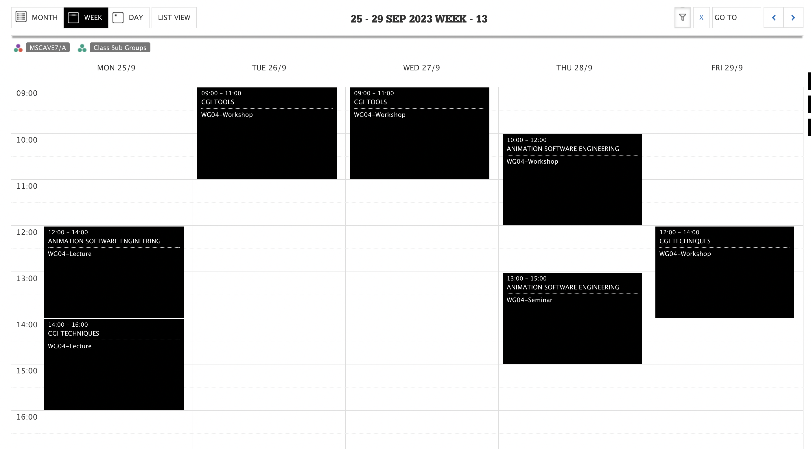

# MSc CAVE Welcome 

Jon Macey

jmacey@bournemouth.ac.uk

---

## Welcome to the NCCA

- Welcome to the National Center for Computer Animation
- And the MSc CAVE course
- You will be bombarded with information today but don't worry we will repeat it all over the next few weeks.

--

## About Me

- My name is Jon Macey I'm the programme Leader 
- I will also be your Academic Advisor (more Later today)
- If you have any issued or problems please either email me at jmacey@bournemouth.ac.uk
- or send a message on teams.
- For unit specific questions please use Brightspace.

---

## Course Outline

- The MSc CAVE is split into 3 semesters
  -  Semester 1 and 2 each have 3 Units
- Semester 3 is for the MSc Project
- Each Unit is worth 20 Credits and **All** Units are Equal

--

## Semester 1

- Animation Software Engineering (Jon Macey)
- CGI Tools (Ari Sarafopolous , Phil Spicer (Jon Macey))
- CGI Techniques (Jian Zhang, Jian Chang)

--

## Semester 2

- Simulation and Rendering (Ian Stephenson, Jian Chang, Lihua You)
- Group Project (Shared with MADE and MA3D)  (Ari Sarafopoulos)
- Pipeline and Technical Direction (Jon Macey)

--

## Semester 3

- MSc Project (Jian Chang + team)

---

## Timetable

The online timetable can be found here https://timetable.bournemouth.ac.uk/

--

## Your Lab

- WG04 (Weymouth House Ground floor room 4)
- Door code C1695Z
- I will take you on a tour and show you the room later

---

## Any Questions?

