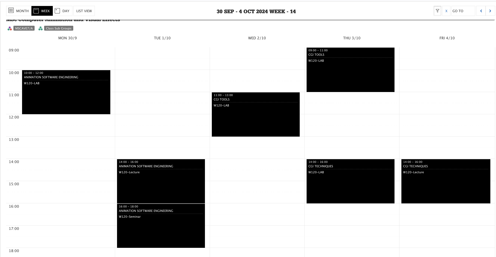

# MSc CAVe Welcome 

Jon Macey

jmacey@bournemouth.ac.uk

---

## Welcome to the NCCA

- Welcome to the National Center for Computer Animation
- And the MSc CAVE course
- You will be bombarded with information today but don't worry we will repeat it all over the next few weeks.

--

## About Me

- My name is Jon Macey I'm the programme Leader 
- I will also be your Academic Advisor (more Later today)
- If you have any issued or problems please either email me at jmacey@bournemouth.ac.uk
- or send a message on teams.
- For unit specific questions please use Brightspace.

---

## Course Outline

- The MSc CAVE is split into 3 semesters
  -  Semester 1 and 2 each have 3 Units
- Semester 3 is for the MSc Project
- Each Unit is worth 20 Credits and **All** Units are Equal

--

## Semester 1

- Animation Software Engineering (Jon Macey)
- CGI Tools (Adam Twycross, Phil Spicer (Jon Macey))
- CGI Techniques (Jian Zhang, Jian Chang)

--

## Semester 2

- Simulation and Rendering (Ian Stephenson, Jian Chang, Lihua You)
- Group Project (Shared with MADE and MA3D)  (Ari Sarafopoulos)
- Personal Inquiry (Shared with MADE and MA3D) (Hongchuan Yu)

--

## Semester 3

- MSc Project (Jon Macey)

---

## Timetable

The online timetable can be found here https://timetable.bournemouth.ac.uk/

--

## Timetable

- All times are UK Times
- If scheduled on Teams it will adjust to local time
- Unit Leaders will arrange invites to Lectures (Check teams)

--

## Lectures and Labs

- We are all new to online teaching
- Basic Rules :-
  - No longer that 1 hr without a break
  - 15 minute break between 1hr sessions
  - Will try and limit to max 4hrs a day online (induction week a bit busy!)

--

## Virtual Workstations

- We have two virtual workstation solutions
  - For Windows we will use VMWare Horizon
  - For Linux we will use NoMachine
- There will also be VPN access to some elements (License servers / ssh to lab machines)
- More details on this next week.

---

## Any Questions?

