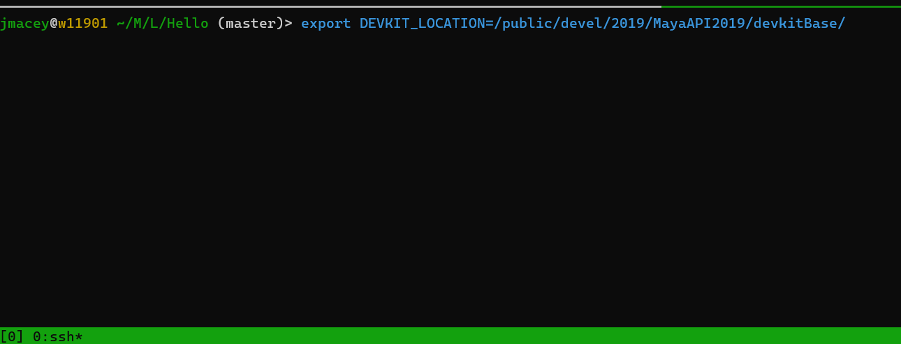
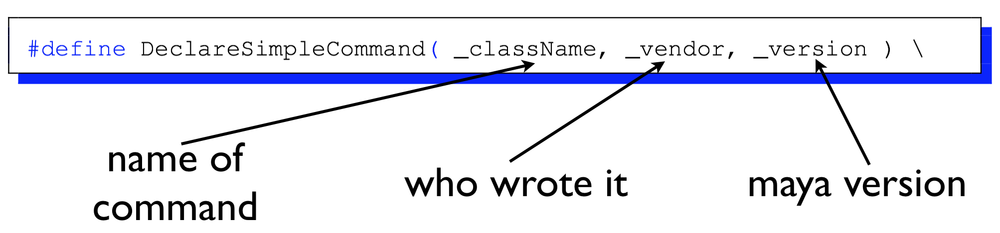
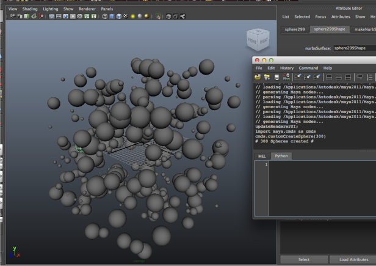
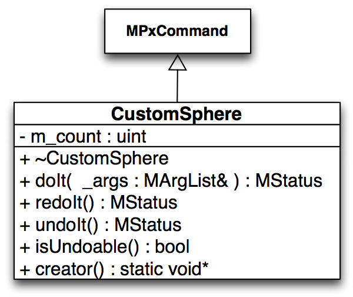

# Introduction to the Maya C++ API

Jon Macey

---

## API Basics
- Maya has both a python and a C++ API
- In most cases either can be used to accomplish tasks
- For this lecture we will look at the C++ API
- There are a series of headers and libraries shipped with maya which allow us to write plugins
- These come in many forms and will be discussed today

--

## C++ API
- The maya api uses inheritance to extend the basic functionality of maya. 
- There are a number of different class types we can work with and these will change depending upon the context
- Devkit can be found here https://www.autodesk.com/developer-network/platform-technologies/maya

---

## MObject

- Also know as a "Model Object" Generic class for all Maya types. 
- Ownership is maintained by Maya (lifetime) 
- To access anything we need to apply a function set to the ```MObject```.
- Is a handle/reference to a Maya internal object 
- Valid use: determine object type and compatible function sets 
- NEVER store an MObject use immediately 

--

## Mfn function sets

- These are used to interact with ```MObjects``` We need to connect the correct function set to the correct object type. 
- As they are Dependency nodes we can also attach as this. 
  - If the ```MObject``` is pointing to a light we apply a ```MFnLight``` function set to access the light params. 
  - However as it is also a DG object we can also apply a ```MFnDependencyNode``` function to it as well. 
- This overlap is very limited but application of it depends upon the context we are working within.

--

## MFn function Sets

  - ```MFnCamera``` 
  - ```MFnLight``` 
  - ```MFnFluid``` 
  - ```MFnPlugin``` 
  - ```MFnNurbsSurface``` 
  - ```MFnDagNode``` (DagNode has visible component in UI) 
  - ```MFnDependencyNode``` (dependency node has no visible component in UI) 

--

## MFn function Sets
- An object can be compatible with more than one type of function set . . . 
- Example: a NURBS object is compatible with/can be operated on by MFnNurbsSurface, MFnDagNode, MFnDependencyNode etc.

--

## Proxy MPx

- Base classes inherited to define new types of Maya objects 
  - Examples:
  - ```MPxCommand``` – define new commands 
  - ```MPxNode``` – define new (generic) nodes 
  - ```MPxDeformerNode``` – define deformer type 
  - ```MPxIkSolver``` – define new IK solver 
  - ```MPxFileTranslator``` – define file exporter 
- Proxies understand Maya’s internals; developer implement the new/unique features.

--

## Iterators MIt
- Used to traverse a category of objects 
- Examples:
  - ```MItKeyframe``` – iterate over keyframes of anim curve 
  - ```MItSurfaceCV``` 
  - ```MItCurveCV``` 
  - ```MItDependencyGraph``` – iterate over all nodes (in)directly connected to a given node 
  - ```MItDependencyNodes``` – traverse all the nodes in Maya’s Dependency Graph 

--

## Utility Classes (Wrappers)
- MGlobal – a static class. Members perform mostly UI-related tasks 
- MStatus – passes return status codes (always check) 
- MString 
- MVector 
- MDagPath 

---

## Getting Started
- Maya plugins are built as platform specific shared libraries, (.so, .mll , .bundle) 
- We must ensure correct ABI / VFX Reference platform on some platforms (Not as bad as it used to be!)
- Linux: stdout is directed to shell (where goMaya was called in the case of the studio)
- Windows: stdout is directed to an output window 
- General: stdout may not appear unless flushed

--

## mayald
- mayald is a shell script shipped with maya to simplify the building of maya plugins / projects
- It contains commands / paths to use when building maya plugins
- It also links against all of the libraries required for every type of maya application we may wish to build
- It is found in /usr/autodesk/maya/bin in the current lab build

--

## cmake

- devkit is supplied with cmake configuration files which make cross platform development much easier.
- Running cmake will generate the Makefile or MSBuild project for the correct platform
- We just need to set the environment variable to point ot the correct location
- For the labs this is currently 

```
export DEVKIT_LOCATION=/public/devel/2021/MayaDevkit/devkitBase
```

--

## cmake

- with cmake we typically do an "out of source build" by creating a build directory as shown.




--

## Visual Studio Project

- Under windows we can create a simple .DLL project 
- We need to change the target extension to .mll (maya link library) as this is the default search.
- Full details on how to do a setup is [here](https://nccastaff.bournemouth.ac.uk/jmacey/OldWeb/MayaAPI/Windows/index.md.html)

---

## A Simple Maya Command

- The following example will create and register a simple maya command
- We are going to use a macro supplied with the maya API which will create the correct class / code we require
- This is the simplest possible way and is good for quick command development




--

## [A Simple Maya Command](https://github.com/NCCA/MayaAPICode/blob/master/Lecture1/Hello/HelloMaya.cpp)

```
#include <maya/MSimple.h>
#include <maya/MIOStream.h>
#include <maya/MGlobal.h>
// This is a macro to create a simple command
// the compiler expands it to a bunch of code

DeclareSimpleCommand( HelloMaya , "NCCA", "Maya 2020");

MStatus HelloMaya::doIt( const MArgList& )
{
  std::cout<<"This should come from the shell\n";
  MGlobal::displayInfo("Hello Maya in the maya command shell");
  MGlobal::displayWarning("This should be a warning");
  MGlobal::displayError("This should be an error");

  return MS::kSuccess;
}
```


--

## Loading plugins
<video controls loop  autoplay="autoplay">
    <source data-src="images/maya1.mov" type="video/mp4" />
</video>

--

## running the command
<!-- .slide: style="text-align: left;"> -->  

- Python

```
import maya.cmds as cmds
cmds.HelloMaya()
```

- Mel

```
HelloMaya
```

---

<!-- .slide: style="text-align: center;"> -->  

## customCreateSphere
- This command will generate a number of random spheres based on a user argument


--

## customCreateSphere


--

## customCreateSphere
- We will implement the following virtual methods from the MPxCommand class
- the main code for executing the command will be placed in the redoIt and called from the doIt method when constructed
- As we have no dynamic memory we don’t actually use the dtor.


--


## Utility macros

- This macro makes it easy to check for errors and will be replaced by the compiler every time we use it.
- This is taken from the maya api documentation / examples

```

#define CHECK_STATUS_AND_RETURN_IF_FAIL( status , message )				\
  if( !status )									\
  {										\
    MString errorString = status.errorString() +  MString( message);	\
    MGlobal::displayError( errorString );					\
    return MStatus::kFailure;						\
  }										\

```

--

## Basic Methods

- Note the creator method is called by maya and we use it to call our ctor 

```
bool CustomSphere::isUndoable() const
{
	return true;
}


void* CustomSphere::creator()
{
  return new CustomSphere();
}
```

--

## doIt method

- the doIt method will be passed any arguments passed when the command is invoked.
- It is the responsibility of the doIt command to parse these and store in the class any values which may be required for do / undo.
- Arguments are processed by the MArgList class as shown in the following example

--

```
MStatus CustomSphere::doIt( const MArgList& _args )
{
	MStatus	status;

	// Verify argument count
  if ( _args.length() != 1 )
	{
		MGlobal::displayError( "Command requires one argument" );
		return MStatus::kFailure;
	}

	// Check aurgument type
  m_count = _args.asInt( 0, &status );
	if( !status )
	{
		MGlobal::displayError( "argument is not an integer" );
		return MStatus::kFailure;
	}

	// Check argument range
	if( m_count <= 0 )
	{
		MGlobal::displayError( "argument must be greater than zero" );
		return MStatus::kFailure;
	}
  // now call the redoIt method which actually does the work
	return redoIt();
}

```

--

## redoIt method

- In this case the redoIt method will do the creation of the spheres
- This will loop for the number of times specified on the command line, and execute a maya command to create a sphere with a random radius
- Next a move command will be executed to move the sphere to a random position


--

## redoIt method

```
#include <random>
std::mt19937 g_RandomEngine;

MStatus CustomSphere::redoIt()
{
  static const MString create("sphere -name \"sphere^1s\" -r ^2s");
  static const MString move("move ^1s ^2s ^3s \"sphere^4s\"");
  int seed=0;
  MString cmd,index,radius,x,y,z;
  std::uniform_real_distribution<float>radiusDist(0.8f,4.5f);
  std::uniform_real_distribution<float>positionDist(-20,20);
  // loop for the number of arguments passed in and create some random spheres
  for(  int i = 0; i < m_count; ++i )
	{
    // fist I'm going to create a maya command as follows
    // sphere -name "sphere[n]" where n is the value of i
    // and this is why I hate MString!
    radius.set(radiusDist(g_RandomEngine));
    index.set(i);
    cmd.format(create, index, radius);
    // now execute the command
    MStatus status = MGlobal::executeCommand( cmd );
    // and check that is was successful
    checkStatusAndReturnIfFail(status,"Unable to execute sphere command");

    // now move to a random position first grab some positions
    x.set(positionDist(g_RandomEngine));
    y.set(positionDist(g_RandomEngine));
    z.set(positionDist(g_RandomEngine));
    // build the command string
    // move x y z "sphere[n]"
    cmd.format(move, x, y, z, index);
    // execute
    status=MGlobal::executeCommand(cmd);
    checkStatusAndReturnIfFail(status,"unable to move object");

	}
  MString message,count;
  count.set(m_count);
  message.format("Created ^1s spheres", count) ;
  MGlobal::displayInfo( message );
	return MStatus::kSuccess;
}

```

--

## undoIt method

```

MStatus CustomSphere::undoIt()
{
  // here we undo what was done in the re-do method,
  // this will be called when maya calls the undo method
  MString cmd,index;

  for(  int i = 0; i < m_count; ++i )
  {
    index.set(i);
    // delete the objects as created previously
    cmd.format("delete  \"sphere^1s\"", index) ;
    MStatus status=MGlobal::executeCommand(cmd);
    // check that is was ok
    checkStatusAndReturnIfFail(status,"unable to delete objects in undo");

  }
	return MStatus::kSuccess;
}

```

--

## plugin code

- to register our command we need to add some plugin code to allow the register / deregister of the plugin
- This is as follows

```

#include "CustomSphere.h"
#include <maya/MFnPlugin.h>


MStatus initializePlugin( MObject obj )
{ 
	MStatus   status;
	MFnPlugin plugin( obj, "", "NCCA" , "Any" );

  status = plugin.registerCommand( "customCreateSphere", CustomSphere::creator );
	if ( !status )
	{
    status.perror( "Unable to register command \"customCreateSphere\"" );
		return status;
	}

	return status;
}


MStatus uninitializePlugin( MObject obj )
{
	MStatus   status;
	MFnPlugin plugin( obj );

  status = plugin.deregisterCommand( "customCreateSphere" );
	if ( !status )
	{
    status.perror( "Unable to register command \"customCreateSphere\"" );
		return status;
	}

	return status;
}

```

---

# Python Plugins

- Python now supports plugins developed in python
- They are very similar to the C++ plugins but don't need to be compiled
- Performance may vary as the code needs to still be interpreted
- Can be an easier solution for development

---

# HelloMayaPy

```
import maya.api.OpenMaya as om
import maya.cmds as cmds


def maya_useNewAPI():
    """
    Can either use this function (which works on earlier versions)
    or we can set maya_useNewAPI = True
    """
    pass


maya_useNewAPI = True


class HelloMaya(om.MPxCommand):

    CMD_NAME = "HelloMayaPy"

    def __init__(self):
        super(HelloMaya, self).__init__()

    def doIt(self, args):
        """
        Called when the command is executed in script
        """
        print("This should come from the python shell")
        om.MGlobal.displayWarning("This should be a warning")
        om.MGlobal.displayError("This should be an error")
        om.MGlobal.displayInfo("This should be an info message")

    @classmethod
    def creator(cls):
        """
        Think of this as a factory
        """
        return HelloMaya()


def initializePlugin(plugin):
    """
    Load our plugin
    """
    vendor = "NCCA"
    version = "1.0.0"

    plugin_fn = om.MFnPlugin(plugin, vendor, version)

    try:
        plugin_fn.registerCommand(HelloMaya.CMD_NAME, HelloMaya.creator)
    except:
        om.MGlobal.displayError(f"Failed to register command: {HelloMaya.CMD_NAME}")


def uninitializePlugin(plugin):
    """
    Exit point for a plugin
    """
    plugin_fn = om.MFnPlugin(plugin)
    try:
        plugin_fn.deregisterCommand(HelloMaya.CMD_NAME)
    except:
        om.MGlobal.displayError(f"Failed to deregister command: {HelloMaya.CMD_NAME}")


if __name__ == "__main__":
    """
    So if we execute this in the script editor it will be a __main__ so we can put testing code etc here
    Loading the plugin will not run this
    As we are loading the plugin it needs to be in the plugin path.
    """

    plugin_name = "HelloMaya.py"

    cmds.evalDeferred(
        'if cmds.pluginInfo("{0}", q=True, loaded=True): cmds.unloadPlugin(f"{plugin_name}")'
    )
    cmds.evalDeferred(
        'if not cmds.pluginInfo("{0}", q=True, loaded=True): cmds.loadPlugin(f"{plugin_name}")'
    )
```

---

## Exercise

- Using the maya api documentation for MArgList modify the customCreateSphere plugin to take the following arguments
  - -mr [double] the minimum radius must be >0
  - -mm [double] the max radius
  - -x [double] the  ±x extents
  - -y [double] the  ±y extents
  - -z [double] the  ±z extents
  - -n [int] the number of spheres to create

--

## Hint

- You will need to add class attributes for each of the new parameters, there is quite a lot of sample code in the MArgList class you can use.
- If you want a more advanced solution follow this tutorial http://nccastaff.bournemouth.ac.uk/jmacey/OldWeb/RobTheBloke/www/maya/MSyntax.html
- Solution next week (mine is based on the above)

