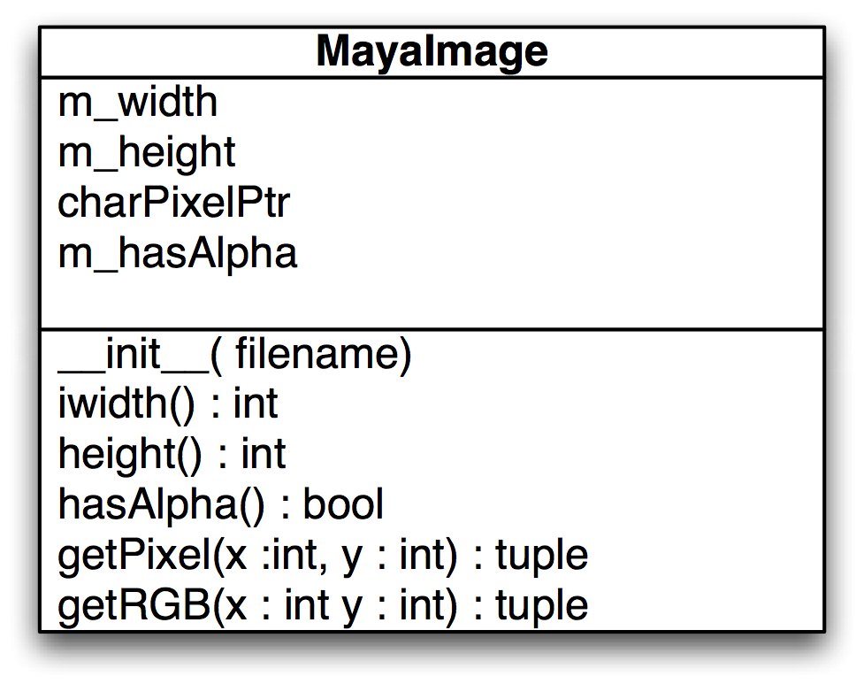
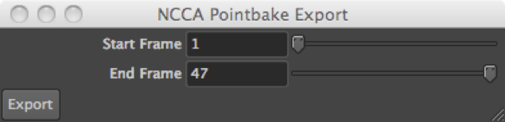

# Introduction to Python in Maya

Jon Macey

---

## The Maya Environment

- When maya starts up it reads a file called Maya.env this contains a number of environment variables for Maya.
- Under Linux ```~/maya/version/```
- Under Windows ```%HOMEDRIVE%\%HOMEPATH%\Documents\maya\[version]```
- On a mac this is located in ```~/Library/Preferences/Autodesk/maya/[Version]```
- We are going to use this to setup some directories to use for the next few weeks Lectures

--

## Basic Setup

```
cd $HOME
mkdir MayaScripts
mkdir MayaPlugs
```

- Add this to the Maya.env (you may need both versions of Maya)

``` 
MAYA_PLUG_IN_PATH=/home/jmacey/MayaPlugs
MAYA_SCRIPT_PATH=/home/jmacey/MayaScripts
MAYA_DISABLE_CLIC_IPM=1
MAYA_DISABLE_CER=1
```
- Note the last too can speed up maya start / restart which you will need __a lot__

--

## A simple Mel Script Test

```
global proc helloMel()
{
  print("hello from Mel\n");
}
```
- Save the file in the scripts directory as hello.mel
- in the Mel window source ```hello.mel```
- then call helloMel()

--


## Python Paths

- maya will use the global python path which you can set as usual
- it is also possible to setup some default python behaviors using a file called ```userSetup.py```
- this lives in the default maya user directory as follows
```
# Windows
%HOMEDRIVE%\%HOMEPATH%\Documents\maya\[version]\scripts
# Linux 
~/maya/[version]/scripts
# Mac OSX
~/Library/Preferences/Autodesk/maya/[version]/scripts
```

--

## userSetup.py

- to add to the path in the userSetup.py file we can do the following

```
import sys
sys.path.append('yourpath')
```

- it is quite common to add global python imports here such as 

```
from __future__ import print_function,division
import maya.cmds as cmds
```

--

## A Simple Python Script

```
def helloPy() :
  print ('hello from python ')
```
- Again save this script as helloPy.py in the Scripts directory
- We need to import the module before we use it so the following is needed

```
from helloPy import helloPy
helloPy()
```

--

## [reload](https://docs.python.org/2/library/functions.html#reload)
- To help the development cycle, we can easily modify the script and call 
```
import helloPy
# make changes to source.
reload (helloPy)
```

- to reload the module from the source file, otherwise this will be the same module for the whole of the session.
- Also note that each tab of the script editor is also a different instance so each module is unique to the tab imported 

--

## Command Mode

- The simplest way to use Python in maya is with the command module
- This is very similar to the mel scripting language and allows access to most of the basic maya features
- To load the module we use the following import code

```
import maya.cmds as cmds
```

- We then use cmds.[function] to access the objects 

--

## [example](https://github.com/NCCA/DemoPythonCode/blob/master/Maya/mayaExample1.py)

```
from __future__ import print_function,division
import maya.cmds as cmds

# let's create a sphere
cmds.sphere(radius=2, name='Sphere1')

# query the radius of the sphere named Sphere1
radius = cmds.sphere('Sphere1', query=True, radius=True)
print('The sphere radius =',radius)

# modify the radius
print('Increment the sphere\'s radius by one unit')
cmds.sphere('Sphere1', edit=True, radius=radius+1)
radius = cmds.sphere('Sphere1', query=True, radius=True)
print ('The new sphere radius =', radius)
```

--

## [moving objects](https://github.com/NCCA/DemoPythonCode/blob/master/Maya/mayaExample2.py)

```
from __future__ import print_function,division
import maya.cmds as cmds

# let's delete all objects
cmds.select(all=True)
cmds.delete()
#let's create a new torus
cmds.torus(r=4, hr=0.5, name='Torus1')
cmds.move(0, 0, 0, 'Torus1')
cmds.scale(0.5, 0.5, 0.5, 'Torus1')
cmds.rotate(0, '45deg', 0, 'Torus1')
```

--

## [Setting Attributes](https://github.com/NCCA/DemoPythonCode/blob/master/Maya/mayaExample3.py)

```
from __future__ import print_function,division
import maya.cmds as cmds

# lets delete all objects
cmds.select(all=True)
cmds.delete()
#lets create a nurb's cube
cmds.nurbsCube(w=3, name='Cube1')
cmds.getAttr('Cube1.tx')
cmds.getAttr('Cube1.ty')
cmds.getAttr('Cube1.tz')

# let's make sure 'Cube1' is selected
cmds.select('Cube1', replace=True)
#let's change its translation attributes
cmds.setAttr('Cube1.tx', 1)
cmds.setAttr('Cube1.ty', 2)
cmds.setAttr('Cube1.tz', 3)
```

---

## pymel
- PyMEL makes python scripting in Maya work the way it should. 
- Maya’s command module is a direct translation of MEL commands into python functions. 
	- The result is a very awkward and unpythonic syntax which does not take advantage of python’s strengths
- particularly, a flexible, object-oriented design. 
- PyMEL builds on the cmds module by organizing many of its commands into a class hierarchy, and by customizing them to operate in a more succinct and intuitive way.

--

## pymel

- pymel is an attempt to make mel more object oriented rather than a wrapping of mel commands into python 
- For example

```
cmds.getAttr( cmds.listRelatives( cmds.ls(type='camera')[0], p=1 )[0] + '.translate' )[0][2]
```

- becomes

```
import pymel.core as pymel
pymel.ls(type='camera')[0].getParent().translate.get().z
```

--

## [sphere example](https://github.com/NCCA/DemoPythonCode/blob/master/Maya/pymelExample1.py)

```
from __future__ import print_function,division
import pymel.core as pm

pm.sphere(radius=2, name='Sphere1')

# query the radius of the sphere named Sphere1
radius = pm.sphere('Sphere1', query=True, radius=True)
print ('The sphere radius =',radius)

# modify the radius
print ('Increment the sphere\'s radius by one unit')
pm.sphere('Sphere1', edit=True, radius=radius+1)
radius = pm.sphere('Sphere1', query=True, radius=True)
print ('The new sphere radius =', radius)
```

---

## Accessing API Values
- The Maya C++ api uses pass by reference to return variable values
- As python has no real way to access these values we need to use the MScriptUtil classes
- The MScriptUtil class is Utility class for working with pointers and references in Python

--

## Accessing API Values

> In Python parameters of class types are passed by reference but parameters of simple types, like integers and floats, are passed by value, making it impossible to call those API methods from Python. The MScriptUtil class bridges this gap by providing methods which return pointers to values of simple types and which can extract values from such pointers. These pointers can also be used wherever an API method requires a reference to a simple type or an array of a simple type.

--

## Accessing API Values


> This class is admittedly cumbersome to use but it provides a way of building parameters and accessing return values for methods which would not normally be accessible from Python.

--

## MImage
- MImage is part of the OpenMaya API
- It provides access to some of Maya's image manipulation functionality. 
- It has methods for loading and resizing image files in any Maya-supported raster format, including IFF, SGI, Softimage (pic), TIFF (tif), Alias PIX (als), GIF, RLA, JPEG (jpg). 
- The image is stored as an uncompressed array of pixels, that can be read and manipulated directly. 
- For simplicity, the pixels are stored in a RGBA format (4 bytes per pixel).

--

## [A Python Wrapper Class](http://jonmacey.blogspot.co.uk/2011/04/using-maya-mscriptutil-class-in-python.html)

- Most of the work in this class will be done in the ctor
- We will store values for width and height as well as a flag to indicate if we have alpha
- A pointer to the image data is also stored and we can access the pixel values using an index operator

--

## [MayaImage.py](https://github.com/NCCA/DemoPythonCode/blob/master/Maya/MayaImage.py)

```
########################################
# A simple wrapper for the MImage class
# Author Jon Macey
# Date 22/3/2011
# Version 1.0
# Sample Usage Below
# img=MayaImage('/Users/jmacey/Road.tiff')
# print img.width()
# print img.height()
# print img.hasAlpha()
#
# print img.getPixel(20,30)
# print img.getRGB(20,50)
########################################

import maya.OpenMaya as om
import sys

class MayaImage :
	""" The main class, needs to be constructed with a filename """
	def __init__(self,filename) :
		""" constructor pass in the name of the file to load (absolute file name with path) """
		# create an MImage object
		self.image=om.MImage()
		# read from file MImage should handle errors for us so no need to check
		self.image.readFromFile(filename)
		# as the MImage class is a wrapper to the C++ module we need to access data
		# as pointers, to do this use the MScritUtil helpers
		self.scriptUtilWidth = om.MScriptUtil()
		self.scriptUtilHeight = om.MScriptUtil()

		# first we create a pointer to an unsigned in for width and height
		widthPtr = self.scriptUtilWidth.asUintPtr()
		heightPtr = self.scriptUtilHeight.asUintPtr()
		# now we set the values to 0 for each
		self.scriptUtilWidth.setUint( widthPtr, 0 )
		self.scriptUtilHeight.setUint( heightPtr, 0 )
		# now we call the MImage getSize method which needs the params passed as pointers
		# as it uses a pass by reference
		self.image.getSize( widthPtr, heightPtr )
		# once we get these values we need to convert them to int so use the helpers
		self.m_width = self.scriptUtilWidth.getUint(widthPtr)
		self.m_height = self.scriptUtilHeight.getUint(heightPtr)
		# now we grab the pixel data and store
		self.charPixelPtr = self.image.pixels()
		# query to see if it's an RGB or RGBA image, this will be True or False
		self.m_hasAlpha=self.image.isRGBA()
		# if we are doing RGB we step into the image array in 3's
		# data is always packed as RGBA even if no alpha present
		self.imgStep=4
		# finally create an empty script util and a pointer to the function
		# getUcharArrayItem function for speed
		scriptUtil = om.MScriptUtil()
		self.getUcharArrayItem=scriptUtil.getUcharArrayItem


	def width(self) :
		""" return the width of the image """
		return self.m_width

	def height(self) :
		""" return the height of the image """
		return self.m_height

	def hasAlpha(self) :
		""" return True is the image has an Alpha channel """
		return self.m_hasAlpha

	def getPixel(self,x,y) :
		""" get the pixel data at x,y and return a 3/4 tuple depending upon type """
		# check the bounds to make sure we are in the correct area
		if x<0 or x>self.m_width :
			print "error x out of bounds\n"
			return
		if y<0 or y>self.m_height :
			print "error y our of bounds\n"
			return
		# now calculate the index into the 1D array of data
		index=(y*self.m_width*4)+x*4
		# grab the pixels
		red = self.getUcharArrayItem(self.charPixelPtr,index)
		green = self.getUcharArrayItem(self.charPixelPtr,index+1)
		blue = self.getUcharArrayItem(self.charPixelPtr,index+2)
		alpha=self.getUcharArrayItem(self.charPixelPtr,index+3)
		return (red,green,blue,alpha)

	def getRGB(self,x,y) :
		r,g,b,a=getPixel(x,y)
		return (r,g,b)
```

--

## [demo](https://github.com/NCCA/DemoPythonCode/blob/master/Maya/ImageMapExample.py) 

```
import maya.OpenMaya as om
import maya.cmds as cmds


basicFilter = "*.*"

imageFile=cmds.fileDialog2(caption="Please select imagefile",
													fileFilter=basicFilter, fm=1)


img=MayaImage(str(imageFile[0]))
print img.width()
print img.height()
xoffset=-img.width()/2
yoffset=-img.height()/2

for y in range (0,img.height()) :
	for x in range(0,img.width()) :
		r,g,b,a=img.getPixel(x,y)
		if r > 10 :
			cmds.polyCube(h=float(r/10))
			cmds.move(xoffset+x,float(r/10)/2,yoffset+y)
```

--

## demo


<video controls loop  autoplay="autoplay">
    <source data-src="images/mayaImage.mov" type="video/mp4" />
</video>

---

# maya.api.OpenMaya

> This is a Python wrapper for the Maya C++ API, and referred to as Python API 2.0. This wrapper has better performance and is more "Pythonic" than the Python API 1.0. It is also a newer API, and is still under development, so not all classes exposed in 1.0 are available. For more information, see "Maya Python API 2.0" and ["Maya Python API 2.0 Reference"](https://help.autodesk.com/view/MAYAUL/2016/ENU/?guid=__py_ref_index_html) in the Maya Developer Help.

--

# [maya standalone](https://help.autodesk.com/cloudhelp/2018/JPN/Maya-Tech-Docs/PyMel/standalone.html)

- it is possible to run maya python without starting the GUI
- this is really useful for batch processing (for example pipeline and render farm work)
- the maya executable is called ```mayapy```
- Another good use of mayapy is to run unit test on maya python modules we are developing and using TDD

--

# API 2 Maya Image Class

- The following code is a version of the MayaImage class developed previously 
- You will notice the code is much cleaner and more pythonic, however we still have some weird ctype conversion for raw pointers

```
import maya.api.OpenMaya as OpenMaya
import ctypes


class MayaImage :
  def __init__(self,filename=None,width=None,height=None,channels=4,imagetype=OpenMaya.MImage.kByte) :
    """ constructor pass in the name of the file to load (absolute file name with path)
    or width and height to create and image
    """
    if filename != None and isinstance(filename,str) :
      self.filename=filename
    elif (width !=None and height !=None) :
      try :
        self.width=int(width)
        self.height=int(height)
      except ValueError :
        print('error converting values to int')
        exit()
      print('creating empty image {}x{}'.format(width,height))
    else :
      raise ValueError('ImageError trouble converting arguments')
    # create an MImage object
    self.image=OpenMaya.MImage()
    self.channels=channels
    self.type=imagetype
    if filename !=None :
      self.readImage(filename)
    else :
      self.image.create(self.width,self.height,self.channels,self.type)
      self.charPixelPtr = ctypes.cast(self.image.pixels(), ctypes.POINTER(ctypes.c_char) )
      self.width,self.height=self.image.getSize()
      

  def readImage(self,filename) :
    # read from file MImage should handle errors for us so no need to check
    self.image.readFromFile(filename)
    self.width,self.height=self.image.getSize()
    # get the pixel data
    self.charPixelPtr = ctypes.cast(self.image.pixels(), ctypes.POINTER(ctypes.c_char) )
    # query to see if it's an RGB or RGBA image, this will be True or False
    self.hasAlpha=self.image.isRGBA()

  def setPixel(self,x,y,r,g,b,a=255) :
    # check the bounds to make sure we are in the correct area
    if x<0 or x>self.width :
      raise IndexError('x value out of range')
    if y<0 or y>self.height :
      raise IndexError('y value out of range')
    # now calculate the index into the 1D array of data
    index=(y*self.width*self.channels)+x*self.channels
    # grab the pixels we need to convert from char to integer ordinal type so use ord
    self.charPixelPtr[index]=ctypes.c_char(chr(r))
    self.charPixelPtr[index+1]=ctypes.c_char(chr(g))
    self.charPixelPtr[index+2]=ctypes.c_char(chr(b))
    self.charPixelPtr[index+3]=ctypes.c_char(chr(a))

  def save(self,filename,outputFormat='png') :
    self.image.writeToFile(filename+'.'+outputFormat,outputFormat=outputFormat)
    
  def getPixel(self,x,y) :
    """ get the pixel data at x,y and return a 3/4 tuple depending upon type """
    # check the bounds to make sure we are in the correct area
    if x<0 or x>self.width :
      print "error x out of bounds\n"
      return
    if y<0 or y>self.height :
      print "error y our of bounds\n"
      return
    # now calculate the index into the 1D array of data
    index=(y*self.width*self.channels)+x*self.channels
    # grab the pixels we need to convert from char to integer ordinal type so use ord
    red   = ord(self.charPixelPtr[index])
    green = ord(self.charPixelPtr[index+1])
    blue  = ord(self.charPixelPtr[index+2])
    alpha = ord(self.charPixelPtr[index+3])
    return (red,green,blue,alpha)

  def getRGB(self,x,y) :
    r,g,b,_=self.getPixel(x,y)
    return (r,g,b)

```

--

## Unit Tests

- in order to test this we can use maya stand alone

```
#!/Applications/Autodesk/maya2019/Maya.app/Contents/bin/mayapy

import maya.standalone
import unittest
import MayaImage as mi

class TestMayaImage(unittest.TestCase):
  @classmethod
  def setUpClass(self):
    print('doing setup')

  def testConstructFromWidthHeight(self) :
    image=mi.MayaImage(width=100,height=200)
    self.assertEqual(image.width,100)
    self.assertEqual(image.height,200)
    
  def testThrowFromBadFilename(self) :
    with self.assertRaises(ValueError) :
      _=mi.MayaImage(200)
  def testThrowFromIndexError(self) :
    with self.assertRaises(IndexError) :
      img=mi.MayaImage(width=10,height=10)
      img.setPixel(200,100,255,255,0)
  def testSaveImage(self) :
    image=mi.MayaImage(width=100,height=100)
    for h in range(0,100) :
      for w in range(0,100) :
        image.setPixel(w,h,255,0,0)
    image.save("test","png")

  def testOpenImage(self) :
    self.testSaveImage()
    image=mi.MayaImage("test.png")
    r,g,b,_=image.getPixel(2,2)
    self.assertEqual(r,255)
    self.assertEqual(g,0)
    self.assertEqual(b,0)
    

if __name__ == '__main__' :
  maya.standalone.initialize(name='python')
  unittest.main()
  print('closing down maya-standalone')
  maya.standalone.uninitialize()

```

---


## PointBake Animation
- The following examples show how to export mesh data into our own point baked format
- Point baking takes an original mesh (usually exported as an obj) and stores each vertex value for each frame as a relative value
- In this case we are going to write the data out as an XML file as this is easier to parse using python for the loader

--

## format

```
<?xml version="1.0" encoding="UTF-8" ?>
<NCCAPointBake>
  <MeshName> pCube1 </MeshName>
  <NumVerts> 8 </NumVerts>
  <StartFrame> 0 </StartFrame>
  <EndFrame> 100 </EndFrame>
  <NumFrames> 100 </NumFrames>
  <TranslateMode> absolute </TranslateMode>
  <Frame number="0">
    <Vertex number="0" attrib="translate"> -7.478646 3.267710 5.018191 </Vertex>
    <Vertex number="1" attrib="translate"> -4.407852 3.267710 5.018191 </Vertex>
    <Vertex number="2" attrib="translate"> -7.478646 6.199014 5.018191 </Vertex>
    <Vertex number="3" attrib="translate"> -4.407852 6.199014 5.018191 </Vertex>
    <Vertex number="4" attrib="translate"> -7.478646 6.199014 2.284239 </Vertex>
    <Vertex number="5" attrib="translate"> -4.407852 6.199014 2.284239 </Vertex>
    <Vertex number="6" attrib="translate"> -7.478646 3.267710 2.284239 </Vertex>
    <Vertex number="7" attrib="translate"> -4.407852 3.267710 2.284239 </Vertex>
  </Frame>
</NCCAPointBake>
```

--

## User Interface



- The user interface for the exported is created using the cmds.window() method
- The code on the next page show how the components are added to the window and callbacks are associated to the buttons
- The whole UI is wrapped into a single class with logic to ensure that things are selected before the system will run.

--


## [export](https://github.com/NCCA/PointBake/blob/master/ImportExportScripts/NCCAPointBakeMayaExport.py)

```
import maya.OpenMaya as OM
import maya.OpenMayaAnim as OMA
import maya.OpenMayaMPx as OMX
import maya.cmds as cmds
import sys, math


########################################################################################################################
##  @brief simple function to write data out with tabs for a well formatted xml file
##	@param[in] _file the file pointer to write data too
##  @param[in] _nTabs number of tabs to write before the data
##  @param[in] _data the actual data to write out to the file
########################################################################################################################

def WriteData(_file,_nTabs,_data) :
	for i in range(0,_nTabs) :
		_file.write("\t")
	_file.write(_data)
	_file.write("\n")


########################################################################################################################
##  @brief function to extract and write out the xml data to a file, we don't use any XML
##  lib so there is no real check for correct formatting of the data, be carful!
##	@param[in] _fileName the file name to open
##  @param[in] _name name of the mesh selected
##  @param[in] _startFrame  the start frame for the export
##  @param[in] _endFrame  the end frame for the export
########################################################################################################################

def NCCAPointBake(_fileName,_name,_startFrame,_endFrame) :

	# grab the selected object
	selected = OM.MSelectionList()
	obj=OM.MObject( )
	selected.add(_name)
	selected.getDependNode(0,obj)
	# get the parent transform
	fn = OM.MFnTransform(obj)
	Mesh=""
	oChild = fn.child(0)
	# check to see if what we have is a mesh
	if(oChild.apiTypeStr()=="kMesh") :
		print "got Mesh"
		# get our mesh
		Mesh=OM.MFnMesh(oChild)
	else :
		print "Didn't get mesh ", oChild.apiType()
		return

	# now we try and open the file for writing
	try :
		file=open(str(_fileName[0]),'w')
	# if this fails catch the error and exit
	except IOError :
		print "Error opening file",str(_fileName)
		return

	# set the frame to start
	print "PB get anim control"
	currFrame=OM.MTime()
	anim=OMA.MAnimControl()
	# as these can take time to process we have an interupter to allow for the process to be
	# stopped
	interupter=OM.MComputation()
	# set the start of the heavy computation
	interupter.beginComputation()
	# now we set the tab level to 0 for the initial write to the file
	tabIndent=0

	# now we get the mesh number of points
	numPoints = cmds.polyEvaluate( _name, v=True)
	# write the xml headers
	file.write("<?xml version=\"1.0\" encoding=\"UTF-8\" ?>\n")
	file.write("<NCCAPointBake>\n")
	# up the tab level
	tabIndent=tabIndent+1
	# write the initial header data
	WriteData(file,tabIndent,"<MeshName> %s </MeshName>" %(_name))
	WriteData(file,tabIndent,"<NumVerts> %d </NumVerts>" %(numPoints))
	WriteData(file,tabIndent,"<StartFrame> %s </StartFrame>" %(_startFrame))
	WriteData(file,tabIndent,"<EndFrame> %s </EndFrame>" %(_endFrame))
	WriteData(file,tabIndent,"<NumFrames> %s </NumFrames>" %(_endFrame-_startFrame))
	WriteData(file,tabIndent,"<TranslateMode> %s </TranslateMode>" %("absolute"))

	# now for every frame write out the vertex data
	for frame in range(_startFrame,_endFrame) :
		print "Doing frame %04d" %(frame)
		# move to the correct frame
		currFrame.setValue (frame)
		anim.setCurrentTime(currFrame)
		# write out the frame tag
		WriteData(file,tabIndent,"<Frame number=\"%d\">" %(frame))
		tabIndent=tabIndent+1
		for vertex in range(0,numPoints) :
			# now the actual vertex data for the current mesh index value
			data = cmds.xform( (_name+ ".vtx["+str(vertex)+"]"), q=True, ws=True, t=True )
			WriteData(file,tabIndent,"<Vertex number=\"%d\" attrib=\"translate\"> %f %f %f </Vertex>" %(vertex,data[0],data[1],data[2]))
		# now un-indent as we have ended the frame
		tabIndent=tabIndent-1
		WriteData(file,tabIndent,"</Frame>")
		# if we have interupted exit and finish
		if interupter.isInterruptRequested()  :
			file.write("</NCCAPointBake>\n")
			file.close()
			print "File export interrupted ";
			return
	# now finish
	file.write("</NCCAPointBake>\n")
	# and close the file
	file.close()

########################################################################################################################
##  @brief actual function call used to do the import
########################################################################################################################

class PointBakeExport() :
	########################################################################################################################
	# @brief ctor
	########################################################################################################################

	def __init__(self) :
		# get the currently selected objects and make sure we have only one object
		selected = OM.MSelectionList()
		OM.MGlobal.getActiveSelectionList(selected)
		self.selectedObjects = []
		selected.getSelectionStrings(self.selectedObjects)
		if len(self.selectedObjects) == 0 :
			cmds.confirmDialog( title='No objects Selected', message='Select a Mesh Object', button=['Ok'], defaultButton='Ok', cancelButton='Ok', dismissString='Ok' )
		elif len(self.selectedObjects) > 1 :
			cmds.confirmDialog( title='Select One Object', message='Only One Mesh may be exported at a time', button=['Ok'], defaultButton='Ok', cancelButton='Ok', dismissString='Ok' )
		# now we have the correct criteria we can proceed with the export
		else :
			# get the start and end values for our UI sliders
			anim=OMA.MAnimControl()
			minTime=anim.minTime()
			maxTime=anim.maxTime()
			self.m_start=int(minTime.value())
			self.m_end=int(maxTime.value())
			# now we create a window ready to populate the components
			self.m_window = cmds.window( title='NCCA Pointbake Export' )
			# create a layout
			cmds.columnLayout()
			# create two sliders for start and end we also attach methods to be called when the slider
			# changes
			self.m_startSlider=cmds.intSliderGrp( changeCommand=self.startChanged,field=True, label='Start Frame', minValue=self.m_start, maxValue=self.m_end, fieldMinValue=self.m_start, fieldMaxValue=self.m_end, value=self.m_start )
			self.m_endSlider=cmds.intSliderGrp( changeCommand=self.endChanged ,field=True, label='End Frame', minValue=self.m_start, maxValue=self.m_end, fieldMinValue=self.m_end, fieldMaxValue=self.m_end, value=self.m_end )
			# create a button and add the method called when pressed
			cmds.button( label='Export', command=self.export )
			# finally show the window
			cmds.showWindow( self.m_window )

	########################################################################################################################
	# @brief export method attached ot the button, this will be executed once every time
	# the button is pressed
	# @param *args the arguments passed from the button
	########################################################################################################################

	def export(self,*args) :
		# get the file name to save too
		basicFilter = "*.xml"
		file=cmds.fileDialog2(caption="Please select file to save",fileFilter=basicFilter, dialogStyle=2)
		# check we get a filename and then save
		if file !="" :
			if self.m_start >= self.m_end :
				cmds.confirmDialog( title='Range Error', message='start >= end', button=['Ok'], defaultButton='Ok', cancelButton='Ok', dismissString='Ok' )
			else :
				NCCAPointBake(file,self.selectedObjects[0],self.m_start,self.m_end)
				# finally remove the export window
				cmds.deleteUI( self.m_window, window=True )

	########################################################################################################################
	# @brief this is called every time the slider is changed (i.e. a new value)
	# @param *args the arguments passed from the button [0] is the numeric value
	########################################################################################################################

	def startChanged(self, *args) :
		self.m_start=args[0]

	########################################################################################################################
	# @brief this is called every time the slider is changed (i.e. a new value)
	# @param *args the arguments passed from the button [0] is the numeric value
	########################################################################################################################

	def endChanged(self, *args) :
		self.m_end=args[0]
```

--

## import
- This script imports both the obj and the pointbake file by poping up a dialog box for selection of the files
- It also demonstrates the input dialog box for text input
- As well as the xml.sax xml parser

--

## [importer](https://github.com/NCCA/PointBake/blob/master/ImportExportScripts/NCCAPointBakeMayaImport.py)

```
import maya.OpenMaya as OM
import maya.OpenMayaAnim as OMA
import maya.OpenMayaMPx as OMX
import xml.sax
import maya.cmds as cmds
import sys, math


"""@package docstring
This module will allow the selection of an obj file and a xml based NCCA Point bake file and
load in point baked animation to a maya scene. The user is prompted for a base node name
which is pre-pended to all elements create in the loading process,

@author Jonathan Macey
@version 1.0
@date Last Revision 10/01/11 fixed bug in xml parse
 previous updates :
 Updated to NCCA Coding standard

"""

########################################################################################################################
## @class ParseHandler
## @brief a class to wrap the processing of the xml.sax parser, all of the methods are called
## from this class however the class data is specific to the parsing process. In this case it is a
## parser for the NCCA PointBake file format
########################################################################################################################


class ParseHandler(xml.sax.ContentHandler):

	## @brief ctor for the class passing in the houdini channel we wish to load the
	## PB data into
	## @param[in] _selectedText the mesh the data is to be loaded too
	def __init__(self,_selectedText):
		## @brief the object selected to load the data too.
		self.m_selectedObject=_selectedText
		## @brief the Character Data stored as part of parsing
		self.m_charData=""
		## @brief the m_meshName extracted from the PointBake file
		self.m_meshName=""
		## @brief number of vertices in the mesh, we will check this against the number of points in
		## the mesh / obj loaded as a basic compatibility check
		self.m_numVerts=0
		## @brief the Start frame for the data loaded
		self.m_startFrame=0
		## @brief m_endFrame of the data loaded
		self.m_endFrame=0
		## @brief number of frames stored in file not used in this example
		self.m_numFrames=0
		## @brief the Offset into the vertex list for the current data to be set too
		self.m_offset=None
		## @brief the Current frame to be stored / keyed
		self.m_currentFrame=0
		# the maya time control
		self.m_anim=OMA.MAnimControl()
		# a point array structure, we will load each frame's worth of data into this then
		# load it to the mesh point data each frame, once this is done we need to clear this data for
		# the next frame
		self.m_vertData=OM.MFloatPointArray()
		# grab the object ready to set the point data
		selected = OM.MSelectionList()
		obj=OM.MObject( )
		selected.add(self.m_selectedObject)
		selected.getDependNode(0,obj)

		fn = OM.MFnTransform(obj)
		self.m_mesh=""
		oChild = fn.child(0)

		if(oChild.apiTypeStr()=="kMesh") :
			print "got Mesh"
			# get our mesh
			self.m_mesh=OM.MFnMesh(oChild)
		# set the frame to start


	def __del__(self) :
		print "done"
	## @brief here we trigger events for the start elements In this case we grab the Offset and Frame
	## @param[in] _name the name of the tag to process
	## @param[in] _attrs the attribute associated with the current tag
	def startElement(self, _name, _attrs):
		# this is important the characters method may be called many times so we
		# clear the char data each start element then append each time we read it
		self.m_charData=""
		# if we have a vertex start tag process and extract the offset
		if _name == "Vertex" :
			self.m_offset=int(_attrs.get("number"))
		# if we have the Frame we grab the number attribute
		elif _name == "Frame" :
			# set the frame here
			self.m_currentFrame=int(_attrs.get("number"))
			self.m_anim.setCurrentTime(OM.MTime(self.m_currentFrame))
			# we have a new frame so re-set the vertexPoint data ready to be filled
			# with the new dara
			self.m_vertData.clear()

	## @brief trigger method if we have data between the <> </> tags, copy it to the class m_charData so
	## we can re-use it later
	## @param[in] _content the character string passed from the parser.
	def characters(self,_content):
		# here we append the content data passed into the method, we need to append
		# as this function may be called more than once if we have a long string
		self.m_charData += _content

	## @brief most of the hard processing is done here. Once an end tag is encountered we
	## process the current char data and add it to the channel created. This does
	## rely on the order of the data but this is always machine generated so we should
	## be safe if it does go wrong it will be this data ordering
	## @brief[in] _name the name of the end element tag
	def endElement(self, _name):
		# extract the m_meshName and save it
		if _name == "MeshName":
			self.m_meshName=self.m_charData
		# get the number of vertices and set this to the channel
		elif _name == "NumVerts" :
			# store value
			self.m_numVerts=int(self.m_charData)

		# parse and sel the m_startFrame
		elif _name == "StartFrame" :
			self.m_startFrame=int(self.m_charData)
			# set the time control to this value
			self.m_anim.setMinTime(OM.MTime(self.m_startFrame))
		## found an end frame value
		elif _name == "EndFrame" :
			self.m_endFrame=int(self.m_charData)
			# set the end animation time

		## found the number of frames
		elif _name == "NumFrames" :
			self.m_numFrames=int(self.m_charData)
		## found the vertex
		elif _name =="Vertex" :
			self.m_charData=self.m_charData.strip()
			data=self.m_charData.split(" ")
			## now we check to see if there are enough values to parse
			if len(data) == 3 :
				# append the vertex data to the array for later loading into the mesh
				self.m_vertData.append(float(data[0]),float(data[1]),float(data[2]))
		elif _name=="Frame" :
			# now we have the end of the frame we should have all the vertex data in the array
			# so we can set this point position for our mesh
			self.m_mesh.setPoints(self.m_vertData)
			# once we have done this we can set this as a keyframe
			cmds.setKeyframe(breakdown=0, hierarchy="none",controlPoints=0 ,shape=0,attribute="vtx[*]")
			# now we clear the point data ready for the next frame to load hte data in
			self.m_vertData.clear()


########################################################################################################################
## @class PointBakeImport
## @brief this is the main function we call for the import of the mesh
## it will create a simple ui and once things are setup the data will be loaded
########################################################################################################################


class PointBakeImport() :
	# ctor
	def __init__(self) :

		# create a promptDialog for the base group name of our mesh this will help to
		# avoid name conflicts, may be good to modify this at some stage to check if mesh
		# exists and prompt to replace data / key
		result = cmds.promptDialog(
															title='Name',
															message='Enter Name for import',
															button=['OK', 'Cancel'],
															defaultButton='OK',
															cancelButton='Cancel',
															dismissString='Cancel')

		# if ok was pressed lets process the data
		if result == 'OK':
			# first we get the text entered by the user
			self.m_text = cmds.promptDialog(query=True, text=True)
			# now get the obj file to import
			self.m_objFileName=cmds.fileDialog2(caption="Please select obj file to import",fileFilter="*.obj", fm=1)

			cmds.file(self.m_objFileName,i=True,type="OBJ",ns=self.m_text)
			# now the xml file
			basicFilter = "*.xml"
			self.m_pointBakeFile=cmds.fileDialog2(caption="Please select xml file to import",fileFilter=basicFilter, fm=1)
			# select the object imported
			print self.m_pointBakeFile
			cmds.select("%s:Mesh"%(self.m_text))
			# and pass control back to the parser
			parser = xml.sax.make_parser()
			parser.setContentHandler(ParseHandler("%s:Mesh"%(self.m_text)))
			parser.parse(open(str(self.m_pointBakeFile[0]),"r"))
```

---

## references
- http://download.autodesk.com/us/maya/2011help/API/class_m_script_util.html
- http://download.autodesk.com/us/maya/2011help/API/class_m_image.html