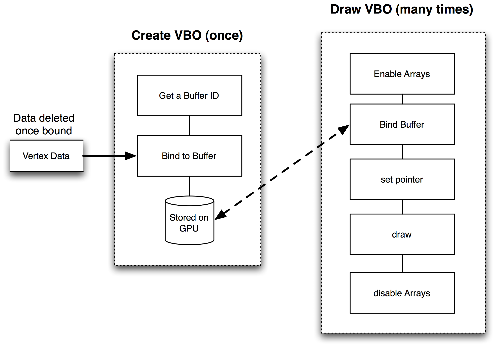
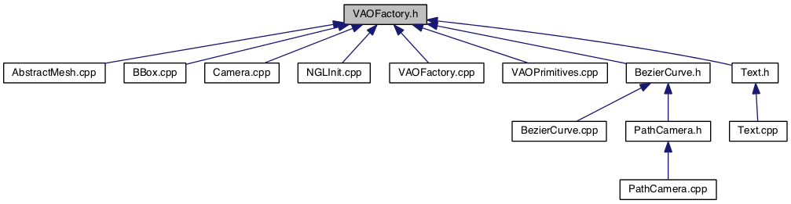
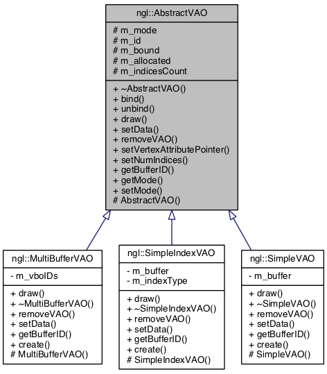
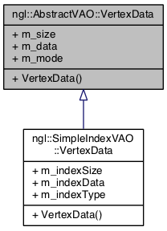

# Introduction to Modern OpenGL
## Vertex Buffers and Arrays
Jon Macey

jmacey@bournemouth.ac.uk

---

## GL Command Syntax
- GL commands are functions or procedures. 
- Various groups of commands perform the same operation but differ in how arguments are supplied to them. 
- To specify the type of parameter GL uses a specific syntax
- GL commands are formed from a name which may be followed, depending on the particular command, by a sequence of characters describing a parameter to the command. 
- If present, a digit indicates the required length (number of values) of the indicated type. 
- Next, a string of characters making up one of the type descriptors 

--

## GL Command Syntax

| Type descriptor | Corresponding GL Type |
|-----------------|-----------------------|
| b | byte |
| s | short |
| i | int     |
| f | float   |
| d | double  |
| ub | ubyte  |
| us | ushort |
| ui | uint   |

--

# GL Command Syntax
- There are also some 64bit versions but I have never seen them in use.
-  A final v character, if present, indicates that the command takes a pointer to an array (a vector) of values rather than a series of individual arguments. 

--

## GL Command Syntax


---

## Block Diagram of OpenGL


--

## Block Diagram of OpenGL
- To aid learning we will concentrate on each of the elements in turn
- Ignoring the others and assuming they just work out of the box without setup
- Finally we shall put the whole system together

--

## Block Diagram of OpenGL

- Commands enter the GL on the left. Some commands specify geometric objects to be drawn while others control how the objects are handled by the various stages. Commands are effectively sent through a processing pipeline.
- The first stage operates on geometric primitives described by vertices: points, line segments, and polygons.
- In this stage vertices may be transformed and lit, followed by assembly into geometric primitives, which may optionally be used by the next stage, geometry shading, to generate new primitives.

--

## Block Diagram of OpenGL

- The final resulting primitives are clipped to a viewing volume in preparation for the next stage, rasterization.
- The rasterizer produces a series of framebuffer addresses and values using a two-dimensional description of a point, line segment, or polygon.
- Each fragment produced is fed to the next stage that performs operations on individual fragments before they finally alter the framebuffer.
- Finally, values may also be read back from the framebuffer or copied from one portion of the framebuffer to another.

--

## Primitives and Vertices


- In the OpenGL, most geometric objects are drawn by specifying a series of generic attribute sets using DrawArrays or one of the other drawing commands.
- Points, lines, polygons, and a variety of related geometric objects can be drawn in this way.

--

## Primitives and Vertices
- Each vertex is specified with one or more generic vertex attributes. 
- Each attribute is specified with one, two, three, or four scalar values.	
- Generic vertex attributes can be accessed from within vertex shaders and used to compute values for consumption by later processing stages.
- For example we may set vertex colour, vertex normals, texture co-ordinates or generic vertex attributes used by the processing shader

--

## Primitive types
- OpenGL has a number of primitive types that can be specified to DrawArrays and other primitive drawing commands
- These are
  - Points, Line Strips, Line Loops, Separate Lines,Triangle Strips, Triangle Fans, Separate Triangles, Lines with adjacency, Line Strips with Adjacency, Triangles with Adjacency, Triangle Strips with Adjacency, Separate Patches
- We will investigate these elements later for now we will concentrate on drawing some points

---

## [Vertex Arrays](https://www.opengl.org/wiki/Vertex_Specification)
- Vertex data is placed into arrays that are stored in the server’s address space (GPU). 
- Blocks of data in these arrays may then be used to specify multiple geometric primitives through the execution of a single OpenGL command. 
- The client may specify up to the value of [MAX_VERTEX_ATTRIBS](https://www.opengl.org/sdk/docs/tutorials/ClockworkCoders/attributes.php) arrays to store one or more generic vertex attributes.

--

## [Vertex Arrays](https://www.opengl.org/wiki/Vertex_Specification)
- Vertex arrays are a simple way of storing data for models so that Vertices, normals and other information may be shared.
- This allows a more compact representation of data and reduces the number of calls OpenGL needs to make and the reduction of data stored.
- We can create the data in a series of arrays either procedurally or by loading it from some model format
- The data may then be stored either by downloading it to the GPU or storing it on the client side and telling the GPU to bind to it.


---


## [Vertex Buffer Objects](https://www.opengl.org/wiki/Buffer_Object)
- The idea behind VBOs is to provide regions of memory (buffers) accessible through identifiers. 
A buffer is made active through binding, following the same pattern as other OpenGL entities such as display lists or textures. 
- Data is effectively stored on the GPU for execution and this greatly increases the speed of drawing.

--

## VBO Allocation and process


--

## [Vertex Specification](https://www.opengl.org/wiki/Vertex_Specification)
- We can pack the data in a number of ways for passing to the VBO
- The two simplest schemes are
  - All Vertex Data - All Normal Data - All Texture Data etc etc
- Alternatively we can pack the data by interleaving the data.
- For the following examples we will use the 1st format.

--

## [Vertex Specification](https://www.opengl.org/wiki/Vertex_Specification)
 

```
struct StructOfArrays
{
  GLfloat positions[VERTEX_COUNT * 3];
  GLfloat normals[VERTEX_COUNT * 3];
  GLubyte colors[VERTEX_COUNT * 4];
};

StructOfArrays structOfArrays;

struct Vertex
{
  GLfloat position[3];
  GLfloat normal[3];
  Glubyte color[4];
};

Vertex vertices[VERTEX_COUNT];
```

---

## [Vertex Array Objects](https://www.opengl.org/wiki/Vertex_Specification#Vertex_Array_Object)
- Modern OpenGL use generic vertex attributes as the input to the vertex shader stage (more in a later lecture)
- This replaces the specific glVertex,glColour,glNormal pointers
- This gives us a more flexible approach to shader writing
- We need to bind these before we can use them and tell the shader which input does what

--

## [Vertex Array Objects](https://www.opengl.org/wiki/Vertex_Specification#Vertex_Array_Object)

- Vertex Array objects are way of storing this state information and recalling it when required.
- All modern OpenGL use these.
- The OpenGL spec defines a VAO as

" This extension introduces named vertex array objects which encapsulate vertex array state on the client side.  These objects allow applications to rapidly switch between large sets of array state.  In addition, layered libraries can return to the default array state by simply creating and binding a new vertex array object."

--

## [Vertex Array Objects](https://www.opengl.org/wiki/Vertex_Specification#Vertex_Array_Object)

- VAOs are a collection of state, like all OpenGL Objects. 
- Unlike texture objects or Buffer Objects, VAOs are pure state objects; they do not contain any large blocks of data or anything.

```
struct VertexAttribute
{
  bool bIsEnabled = GL_FALSE;
  //This is the number of elements in this attribute, 1-4. int iSize = 4;
  unsigned int iStride = 0;
  VertexAttribType eType = GL_FLOAT;
  bool bIsNormalized = GL_FALSE;
  bool bIsIntegral = GL_FALSE;
  void * pBufferObjectOffset = 0;
  BufferObject * pBufferObj = 0;
};
struct VertexArrayObject
{
  BufferObject *pElementArrayBufferObject = NULL;
  VertexAttribute attributes[GL_MAX_VERTEX_ATTRIB];
}
```

--

## [Vertex Array Objects](https://www.opengl.org/wiki/Vertex_Specification#Vertex_Array_Object)
 
- VAO basically store the state and attribute information for other buffers
- Once allocated we can use less commands to re-activate the state and draw (usually 3)

--

## Generate VAO
- [glGenVertexArrays](https://www.opengl.org/sdk/docs/man4/html/glGenVertexArrays.xhtml) generates n empty vertex array objects
- Once bound subsequent operations are applied to the currently bound object

```
GLuint m_vaoID[2];
// Two VAOs allocation
glGenVertexArrays(2, &m_vaoID[0]);
// First VAO setup
glBindVertexArray(m_vaoID[0]);
```

--

##  Data allocation

```
GLuint vboID;
glGenBuffers(1, &vboID);
glBindBuffer(GL_ARRAY_BUFFER, m_vboID);
glBufferData(GL_ARRAY_BUFFER, 9*sizeof(GLfloat), vert2, GL_STATIC_DRAW); 
glVertexAttribPointer((GLuint)0, 3, GL_FLOAT, GL_FALSE, 0, 0);
glEnableVertexAttribArray(0);
glBindVertexArray(0);
```
- Normal VBO operations are done now the VAO is bound, all state allocated in this operations is retained in the VAO

--

## Drawing
- Fist we bind the VAO which will set the stored attribute state into the current state
- Then draw as usual

```
// select first VAO
glBindVertexArray(m_vaoID[0]);
// draw first object 
glDrawArrays(GL_TRIANGLES, 0, 3);
```

---

## [Case Study Points](https://github.com/NCCA/ModernGL/tree/master/PointsGL3WSDL)

- This demo generates two arrays, one for x,y,z co-oridnates and one for colours
- This is bound to a single VAO and rendered using a shader to draw points

```
GLuint createPoints(size_t _ammount)
{
  GLuint vaoID;
  // allocate a VertexArray
  glGenVertexArrays(1, &vaoID);
  // now bind a vertex array object for our verts
  glBindVertexArray(vaoID);
  std::vector<float> points(_ammount*3);
  std::vector<float> colours(_ammount*3);
  std::random_device rd;
  std::mt19937 gen(rd());
  std::uniform_real_distribution<> p(-4.0f, 4.0f);
  std::uniform_real_distribution colour(0.0f, 1.0f);

  for(size_t i=0; i<_ammount; ++i)
  {
    points[i*3]=p(gen);
    points[i*3+1]=p(gen);
    points[i*3+2]=p(gen);
    colours[i*3]=colour(gen);
    colours[i*3+1]=colour(gen);
    colours[i*3+2]=colour(gen);
  }
  // we are going to allocate 3 buffers this time one for verts, colours and normals
  GLuint vboID[2];
  glGenBuffers(2, &vboID[0]);
  // now bind this to the VBO buffer
  glBindBuffer(GL_ARRAY_BUFFER, vboID[0]);
  // allocate the buffer data
  glBufferData(GL_ARRAY_BUFFER, points.size()*sizeof(float), &points[0], GL_STATIC_DRAW);
  // now fix this to the attribute buffer 0
  glVertexAttribPointer(0, 3, GL_FLOAT, GL_FALSE, 0, 0);
  // enable and bind this attribute (will be inPosition in the shader)
  glEnableVertexAttribArray(0);

  // now bind this to the VBO buffer
  glBindBuffer(GL_ARRAY_BUFFER, vboID[1]);
  // allocate the buffer data
  glBufferData(GL_ARRAY_BUFFER, colours.size()*sizeof(float), &colours[0], GL_STATIC_DRAW);
  // now fix this to the attribute buffer 1
  glVertexAttribPointer(1, 3, GL_FLOAT, GL_FALSE, 0, 0);
  // enable and bind this attribute (will be inColour in the shader)
  glEnableVertexAttribArray(1);

  // this basically switches off the current Vertex array object
  glBindVertexArray(0);
  return vaoID;
}
```

--

## Case Study Points

- In this demo we are use separate arrays for the data
- This is advantageous if we want to change the colour of the points without having to re-upload the vertex data
- It also makes setting the data easier as we can use the same VBO for all data types
- It is also possible to share these buffers between VAOs

---


## [Case Study Line Grid](https://github.com/NCCA/ModernGL/tree/master/GridLines)

- This demo creates a grid of lines by setting line pairs as the co-ordinates

```
std::pair<GLuint,size_t> createGrid(float _w, float _h, int _rows, int _cols)
{
  GLuint vaoID;
  // allocate a VertexArray
  glGenVertexArrays(1, &vaoID);
  // now bind a vertex array object for our verts
  glBindVertexArray(vaoID);
  // going to generate points with the center at 0,0,0
  // using half extents
  std::vector<float> points;
  // step values for x,y
  float colStep=_w/_cols;
  float rowStep=_h/_rows;

  float x= _w*0.5f;
  float z= -(_h*0.5f);

  for(size_t i=0; i<_rows+1; ++i)
  {
    points.push_back(-x);
    points.push_back(0.0f);
    points.push_back(z);
    points.push_back(x);
    points.push_back(0.0f);
    points.push_back(z);
    z+=rowStep;
  }
  z= (_h*0.5f);
  x= -(_w*0.5f);

  for(size_t i=0; i<_cols+1; ++i)
  {
    points.push_back(x);
    points.push_back(0.0f);
    points.push_back(-z);
    points.push_back(x);
    points.push_back(0.0f);
    points.push_back(z);
    x+=colStep;
  }

  std::cout<<"rows "<<_rows<<" cols "<<_cols<<" points "<<points.size()/3<<"\n";
  // we are going to allocate 3 buffers this time one for verts, colours and normals
  GLuint vboID;
  glGenBuffers(1, &vboID);
  // now bind this to the VBO buffer
  glBindBuffer(GL_ARRAY_BUFFER, vboID);
  // allocate the buffer data
  glBufferData(GL_ARRAY_BUFFER, points.size()*sizeof(float), &points[0], GL_STATIC_DRAW);
  // now fix this to the attribute buffer 0
  glVertexAttribPointer(0, 3, GL_FLOAT, GL_FALSE, 0, 0);
  // enable and bind this attribute (will be inPosition in the shader)
  glEnableVertexAttribArray(0);


  // this basically switches off the current Vertex array object
  glBindVertexArray(0);
  return std::pair(vaoID,points.size()/3);
}
```

--

## [Case Study Triangle Grid](https://github.com/NCCA/ModernGL/tree/master/TriangleGrid)

- This demo create a grid with triangles as well as setting the normals and UV co-ordinates
- It uses a structure to store the data and this needs to be accounted for when setting the shader inputs and vertex arrays.

```
struct vertData
{
  float x;
  float y;
  float z;
  float nx;
  float ny;
  float nz;
  float u;
  float v;
};
```

---

## [Case Study Triangle Grid](https://github.com/NCCA/ModernGL/tree/master/TriangleGrid)


```
std::pair<GLuint,size_t> createTrianglePlane( float _width, float _depth, int _wP,  int _dP, float _nx, float _ny,float _nz) 
{

  // as our plane is centered on 0.0 we range from Width/2.0 and Depth/2.0
  float w2 = _width / 2.0f;
  float d2 = _depth / 2.0f;
  // calculate the steps for each quad / tri
  float wStep = _width / _wP;
  float dStep = _depth / _dP;
  // texture co-ords start at 0,0
  // texture steps
  float du = 0.9f / _wP;
  float dv = 0.9f / _dP;

  float u = 0.0f;
  float v = 0.0f;

  // a std::vector to store our verts, remember vector packs contiguously so we can use it
  std::vector< vertData > data;
  vertData vert;

  for(float d = -d2; d < d2; d += dStep)
  {
    for(float w = -w2; w < w2; w += wStep)
    {
      /* tri 1
      // counter clock wise
      3
      | \
      |  \
      |   \
      1____2
      */
      // the normals are always the same so set them for d first
      vert.nx = _nx;
      vert.ny = _ny;
      vert.nz = _nz;
      // y is always 0 as in a plane
      vert.y = 0.0f;
      // now for the per vert stuff
      vert.u = u;
      vert.v = v + dv;
      vert.x = w;
      vert.z = d + dStep;
      data.push_back(vert);
      // 2
      vert.u = u + du;
      vert.v = v + dv;
      vert.x = w + wStep;
      vert.z = d + dStep;
      data.push_back(vert);
      // 3
      vert.u = u;
      vert.v = v;
      vert.x = w;
      vert.z = d;
      data.push_back(vert);

      /* tri 2 w,0,d
      // counter clock wise
      3_____2
      \    |
      \  |
      \ |
      \|
      1

      */
      vert.u = u + du;
      vert.v = v + dv;
      vert.x = w + wStep;
      vert.z = d + dStep;
      data.push_back(vert);
      // 2
      vert.u = u + du;
      vert.v = v;
      vert.x = w + wStep;
      vert.z = d;
      data.push_back(vert);
      // 3
      vert.u = u;
      vert.v = v;
      vert.x = w;
      vert.z = d;
      data.push_back(vert);
      u += du;
    } // end w loop
    u = 0.0f;
    v += du;
  } // end d loop

  GLuint vaoID;
  // allocate a VertexArray
  glGenVertexArrays(1, &vaoID);
  // now bind a vertex array object for our verts
  glBindVertexArray(vaoID);

  GLuint vboID;
  glGenBuffers(1, &vboID);
  // now bind this to the VBO buffer
  glBindBuffer(GL_ARRAY_BUFFER, vboID);
  // allocate the buffer data
  glBufferData(GL_ARRAY_BUFFER, data.size()*sizeof(vertData), &data[0].x, GL_STATIC_DRAW);
  // now fix this to the attribute buffer 0
  // enable and bind this attribute (will be inPosition in the shader)
  glVertexAttribPointer(0,3, GL_FLOAT, GL_FALSE, sizeof(vertData), static_cast< float * >(nullptr) + 0); 
  glEnableVertexAttribArray(0);
  glVertexAttribPointer(1,3, GL_FLOAT, GL_FALSE, sizeof(vertData), static_cast< float * >(nullptr) + 3);   
  glEnableVertexAttribArray(1);
  glVertexAttribPointer(2,2, GL_FLOAT, GL_FALSE, sizeof(vertData), static_cast< float * >(nullptr) + 6); 
  glEnableVertexAttribArray(2);

  glBindVertexArray(0);
  return std::pair(vaoID,data.size());
}

```


---

## [Case Study Mapping Buffers](https://github.com/NCCA/ModernGL/tree/master/MapBuffer)

- In this demo we map the buffer created for the grid and update the data on the GPU

```
void updateBuffer(GLuint _bufferID,size_t _size)
{
  static float offset = 0.0f;

  // bind the buffer object
  glBindBuffer(GL_ARRAY_BUFFER,_bufferID);
  // get the data from the buffer
  auto ptr=static_cast<vertData *>( glMapBuffer(GL_ARRAY_BUFFER,GL_WRITE_ONLY));
  // now update data to ptr
  for(size_t i=0; i<_size; ++i)
  {
    ptr[i].y=sin(( ptr[i].x + offset)) + cos( ptr[i].x - offset);
  }
  // unmap the buffer object
  glUnmapBuffer(GL_ARRAY_BUFFER);
  // unbind the buffer object
  glBindBuffer(GL_ARRAY_BUFFER,0);
  offset += 0.01f;
}

```


---

## ngl:: VAO Usage

- Internally ngl:: uses Vertex Array Objects (VAOs) to store and draw all of the graphical elements
- Originally a class called ngl::VertexArrayObject was used to encapsulates all the functionality for creating these objects and then binding and drawing them
- This class is still present in ngl:: but has been deprecated and replaced with a far more flexibile factory
  - it is always best to use the factory methods

--

## ngl:: Built in VAO's

```
VAOFactory::registerVAOCreator("simpleVAO",SimpleVAO::create);
VAOFactory::registerVAOCreator("multiBufferVAO",MultiBufferVAO::create);
VAOFactory::registerVAOCreator("simpleIndexVAO",SimpleIndexVAO::create);
```

--

## AbstractVAO.h

```
class NGL_DLLEXPORT AbstractVAO
{
  public :
    class VertexData
    {
        public :
          VertexData(size_t _size,const GLfloat &_data, GLenum _mode=GL_STATIC_DRAW ) :
           m_size(_size), m_data(_data), m_mode(_mode){}

        size_t m_size;
        const GLfloat &m_data;
        GLenum m_mode=GL_STATIC_DRAW;
    };

    //----------------------------------------------------------------------------------------------------------------------
    /// @brief dtor usually this will not be called
    //----------------------------------------------------------------------------------------------------------------------
    virtual ~AbstractVAO()=default;
    //----------------------------------------------------------------------------------------------------------------------
    /// @brief bind the VAO so it can be used.
    //----------------------------------------------------------------------------------------------------------------------
    void bind();
    //----------------------------------------------------------------------------------------------------------------------
    /// @brief unbind the VAO by binding default 0
    //----------------------------------------------------------------------------------------------------------------------
    void unbind();
    //----------------------------------------------------------------------------------------------------------------------
    /// @brief this is the draw method for the VAO the user must implement this per VAO data, usually this
    /// will be a call to glDrawArrays type function, VAO must be bound before calling this
    //----------------------------------------------------------------------------------------------------------------------
    virtual void draw()const =0;
    //----------------------------------------------------------------------------------------------------------------------
    /// @brief this method is used to set the data in the VAO, we have a base data type of
    /// VertexData above, but the user can extend this to create custom data types
    //----------------------------------------------------------------------------------------------------------------------
    virtual void setData(const VertexData &_data)=0;
    //----------------------------------------------------------------------------------------------------------------------
    /// @brief this will clean up the VAO and associated data, it is the users responsibility to do this
    /// usually this will be a call to the various delete buffers gl routines
    //----------------------------------------------------------------------------------------------------------------------
    virtual void removeVAO()=0;
    //----------------------------------------------------------------------------------------------------------------------
    /// @brief set the generic vertex attribute pointer data usually this method will do however the user
    /// may occasionally need to override this method.
    /// @param _size the size of the raw data passed (not counting sizeof(GL_FLOAT))
    /// @param _type the data type of the Pointer (eg GL_FLOAT)
    /// @param _stride the step between data values (need *sizeof _type) e.g. 10*sizeof(GLfloat) 0 means tightly packed / contiguous
    /// @param _dataOffset Specifies a pointer to the first component of the first generic vertex attribute in the array.
    /// The initial value is 0. and is calculated as static_cast<Real *>(NULL)  + _dataOffset
    /// @param _normalise specifies whether fixed-point data values should be normalized (GL_TRUE) or converted directly as
    /// fixed-point values (GL_FALSE) when they are accessed.
    //----------------------------------------------------------------------------------------------------------------------
    void setVertexAttributePointer(GLuint _id, GLint _size, GLenum _type, GLsizei _stride, unsigned int _dataOffset, bool _normalise=false );
    //----------------------------------------------------------------------------------------------------------------------
    /// @brief the number of indices to draw in the array. It may be that the draw routine can overide this at another time.
    /// @param _s the number of indices to draw (from 0)
    //----------------------------------------------------------------------------------------------------------------------
    void setNumIndices(size_t _s){m_indicesCount=_s;}
    //----------------------------------------------------------------------------------------------------------------------
    /// @brief return the id of the buffer, if there is only 1 buffer just return this
    /// if we have the more than one buffer the sub class manages the id's
    /// @param _buffer index (default to 0 for single buffer VAO's)
    //----------------------------------------------------------------------------------------------------------------------
    virtual GLuint getBufferID(unsigned int _id=0)=0;
    //----------------------------------------------------------------------------------------------------------------------
    /// @brief get the draw mode
    //----------------------------------------------------------------------------------------------------------------------
    GLenum getMode() const;
    //----------------------------------------------------------------------------------------------------------------------
    /// @brief set the draw mode
    /// @param _mode (GL_TRIANGLES etc)
    //----------------------------------------------------------------------------------------------------------------------
    void setMode(const GLenum &_mode);

  protected :
    //----------------------------------------------------------------------------------------------------------------------
    /// ctor to build the VAO
    /// @param _mode the mode to draw with.
    //----------------------------------------------------------------------------------------------------------------------
    AbstractVAO(GLenum _mode=GL_TRIANGLES) ;
    //----------------------------------------------------------------------------------------------------------------------
    /// @brief the draw mode
    //----------------------------------------------------------------------------------------------------------------------
    GLenum m_mode=GL_TRIANGLES;
    //----------------------------------------------------------------------------------------------------------------------
    /// @brief the id of the VAO allocated from OpenGL
    //----------------------------------------------------------------------------------------------------------------------
    GLuint m_id=0;
    //----------------------------------------------------------------------------------------------------------------------
    /// @brief debug flag to indicate if the vao is bound.
    //----------------------------------------------------------------------------------------------------------------------
    bool m_bound=false;
    //----------------------------------------------------------------------------------------------------------------------
    /// @brief debug flag to indicate if data has been set for the VAO
    //----------------------------------------------------------------------------------------------------------------------
    bool m_allocated=false;
    //----------------------------------------------------------------------------------------------------------------------
    /// @brief the number of indices stored in the VAO.
    //----------------------------------------------------------------------------------------------------------------------
    size_t m_indicesCount=0;
};

```

--

## vertexData

- The ngl::AbstractVAO::VertexData class encapsulates the data passed to the VAO
- It can be overidden by the user and extended for new VOA classes

--


## AbstractVAO.cpp

```
#include "AbstractVAO.h"
#include <iostream>
namespace ngl
{
  AbstractVAO::AbstractVAO(GLenum _mode)
  {
    // first we create a vertex array Object
    glGenVertexArrays(1, &m_id);
    m_mode=_mode;
  }

  GLenum AbstractVAO::getMode() const
  {
    return m_mode;
  }

  void AbstractVAO::setMode(const GLenum &_mode)
  {
    m_mode = _mode;
  }

  //----------------------------------------------------------------------------------------------------------------------
  void AbstractVAO::bind()
  {
    glBindVertexArray(m_id);
    m_bound=true;
  }
  //----------------------------------------------------------------------------------------------------------------------
  void AbstractVAO::unbind()
  {
    glBindVertexArray(0);
    m_bound=false;
  }


  void AbstractVAO::setVertexAttributePointer(GLuint _id, GLint _size, GLenum _type, GLsizei _stride, unsigned int _dataOffset, bool _normalise )
  {
    if(m_bound !=true)
    {
      std::cerr<<"Warning trying to set attribute on Unbound VOA\n";
    }
    // set and enable the generic vertex attribute
    glVertexAttribPointer(_id,_size,_type,_normalise,_stride,static_cast<Real *>(NULL)  + _dataOffset);//   ((Real *)NULL + (_dataOffset)));
    glEnableVertexAttribArray(_id);
  }

}

```

--

## SimpleVAO 
```
std::unique_ptr<AbstractVAO> m_vao;
m_vao.reset(ngl::VAOFactory::createVAO("simpleVAO",GL_TRIANGLES) );
```
- the "simpleVAO" is a single buffer VAO
- calling setData will replace existing buffers
- good for simple data with no changes

--

## SimpleVAO.h

```
class NGL_DLLEXPORT SimpleVAO : public AbstractVAO
{
  public :
    //----------------------------------------------------------------------------------------------------------------------
    /// @brief creator method for the factory
    /// @param _mode the mode to draw with.
    /// @returns a new AbstractVAO * object
    //----------------------------------------------------------------------------------------------------------------------
    static AbstractVAO *create(GLenum _mode=GL_TRIANGLES) { return new SimpleVAO(_mode); }
    //----------------------------------------------------------------------------------------------------------------------
    /// @brief draw the VAO using glDrawArrays
    //----------------------------------------------------------------------------------------------------------------------
    virtual void draw() const;
    //----------------------------------------------------------------------------------------------------------------------
    /// @brief dtor clears the VAO data
    //----------------------------------------------------------------------------------------------------------------------
    virtual ~SimpleVAO();
    //----------------------------------------------------------------------------------------------------------------------
    /// @brief remove the VAO and buffers created
    //----------------------------------------------------------------------------------------------------------------------
    virtual void removeVAO();
    //----------------------------------------------------------------------------------------------------------------------
    /// @brief, this method sets the data for the VAO if data has already been set it will remove the existing data
    /// and then re-set with the new data.
    //----------------------------------------------------------------------------------------------------------------------
    virtual void setData(const VertexData &_data);
    //----------------------------------------------------------------------------------------------------------------------
    /// @brief return the id of the buffer, if there is only 1 buffer just return this
    /// if we have the more than one buffer the sub class manages the id's
    /// @param _buffer index (default to 0 for single buffer VAO's)
    //----------------------------------------------------------------------------------------------------------------------
     GLuint getBufferID(unsigned int ){return m_buffer;}

  protected :
    //----------------------------------------------------------------------------------------------------------------------
    /// @brief ctor calles parent ctor to allocate vao;
    //----------------------------------------------------------------------------------------------------------------------
    SimpleVAO(GLenum _mode)  : AbstractVAO(_mode)
    {

    }
  private :
    //----------------------------------------------------------------------------------------------------------------------
    /// @brief the id of the buffer for the VAO
    //----------------------------------------------------------------------------------------------------------------------
    GLuint m_buffer=0;
};
```

--

## SimpleVAO.cpp

```
  SimpleVAO::~SimpleVAO()
  {
    removeVAO();
  }

  void SimpleVAO::draw() const
  {
    if(m_allocated == false)
    {
      std::cerr<<"Warning trying to draw an unallocated VOA\n";
    }
    if(m_bound == false)
    {
      std::cerr<<"Warning trying to draw an unbound VOA\n";
    }
    glDrawArrays(m_mode, 0, static_cast<GLsizei>(m_indicesCount));
  }

  void SimpleVAO::removeVAO()
  {
    if(m_bound == true)
    {
      unbind();
    }
    if( m_allocated ==true)
    {
        glDeleteBuffers(1,&m_buffer);
    }
    glDeleteVertexArrays(1,&m_id);
    m_allocated=false;
    }

  void SimpleVAO::setData(const VertexData &_data)
  {
    if(m_bound == false)
    {
      std::cerr<<"trying to set VOA data when unbound\n";
    }
    if( m_allocated ==true)
    {
        glDeleteBuffers(1,&m_buffer);
    }

    glGenBuffers(1, &m_buffer);
    // now we will bind an array buffer to the first one and load the data for the verts
    glBindBuffer(GL_ARRAY_BUFFER, m_buffer);
    glBufferData(GL_ARRAY_BUFFER,static_cast<GLsizeiptr>( _data.m_size), &_data.m_data, _data.m_mode);
    m_allocated=true;

  }

```

--

## MultiBuffer VAO
```
std::unique_ptr<AbstractVAO> m_vao;
m_vao.reset(ngl::VAOFactory::createVAO("multiBufferVAO",GL_TRIANGLES) );
```
- the "multiBufferVAO" is a multiple buffer VAO
- calling setData will create a new VBO for the VAO
- each Buffer ID can be accessed via array index ``` getBufferID(int _index); ```
- good for multiple buffer data (Vertex, Normal UV etc)

--

## multiBufferVAO.h

```
class NGL_DLLEXPORT MultiBufferVAO : public AbstractVAO
{
  public :
    //----------------------------------------------------------------------------------------------------------------------
    /// @brief creator method for the factory
    /// @param _mode the mode to draw with.
    /// @returns a new AbstractVAO * object
    //----------------------------------------------------------------------------------------------------------------------
    static AbstractVAO *create(GLenum _mode=GL_TRIANGLES) { return new MultiBufferVAO(_mode); }
    //----------------------------------------------------------------------------------------------------------------------
    /// @brief draw the VAO using glDrawArrays
    //----------------------------------------------------------------------------------------------------------------------
    virtual void draw() const;
    //----------------------------------------------------------------------------------------------------------------------
    /// @brief dtor don't do anything as the remove clears things
    //----------------------------------------------------------------------------------------------------------------------
    virtual ~MultiBufferVAO();
    //----------------------------------------------------------------------------------------------------------------------
    /// @brief remove the VAO and buffers created
    //----------------------------------------------------------------------------------------------------------------------
    virtual void removeVAO();
    //----------------------------------------------------------------------------------------------------------------------
    /// @brief, this method sets the data for the VAO if data has already been set it will remove the existing data
    /// and then re-set with the new data.
    //----------------------------------------------------------------------------------------------------------------------
    virtual void setData(const VertexData &_data);
    //----------------------------------------------------------------------------------------------------------------------
    /// @brief return the id of the buffer, if there is only 1 buffer just return this
    /// if we have the more than one buffer the sub class manages the id's
    /// @param _buffer index (default to 0 for single buffer VAO's)
    //----------------------------------------------------------------------------------------------------------------------
    virtual GLuint getBufferID(unsigned int _id);
  protected :
    //----------------------------------------------------------------------------------------------------------------------
    /// @brief ctor calles parent ctor to allocate vao;
    //----------------------------------------------------------------------------------------------------------------------
    MultiBufferVAO(GLenum _mode)  : AbstractVAO(_mode)
    {

    }

  private :
    //----------------------------------------------------------------------------------------------------------------------
    /// @brief the id of the buffers for the VAO
    //----------------------------------------------------------------------------------------------------------------------
    std::vector <GLuint> m_vboIDs;
};
```

--

## MultiBufferVAO.cpp

```
  MultiBufferVAO::~MultiBufferVAO()
  {
    removeVAO();
  }

  void MultiBufferVAO::draw() const
  {
    if(m_allocated == false)
    {
      std::cerr<<"Warning trying to draw an unallocated VOA\n";
    }
    if(m_bound == false)
    {
      std::cerr<<"Warning trying to draw an unbound VOA\n";
    }
    glDrawArrays(m_mode, 0, static_cast<GLsizei>(m_indicesCount));
  }

  void MultiBufferVAO::removeVAO()
  {
    if(m_bound == true)
    {
      unbind();
    }
    if( m_allocated ==true)
    {
      for(auto b : m_vboIDs)
      {
        glDeleteBuffers(1,&b);
      }
      glDeleteVertexArrays(1,&m_id);
      m_allocated=false;
    }
  }
  void MultiBufferVAO::setData(const VertexData &_data)
  {
    if(m_bound == false)
    {
      std::cerr<<"trying to set VOA data when unbound\n";
    }

    GLuint vboID;
    glGenBuffers(1, &vboID);
    m_vboIDs.push_back(vboID);
    // now we will bind an array buffer to the first one and load the data for the verts
    glBindBuffer(GL_ARRAY_BUFFER, vboID);
    glBufferData(GL_ARRAY_BUFFER,static_cast<GLsizeiptr>(_data.m_size), &_data.m_data, _data.m_mode);
    m_allocated=true;

  }

  GLuint MultiBufferVAO::getBufferID(unsigned int _id )
  {
    NGL_ASSERT(_id<m_vboIDs.size());
    return m_vboIDs[_id];
  }
```

--

## simpleIndexVAO
```
std::unique_ptr<AbstractVAO> m_vao;
m_vao.reset(ngl::VAOFactory::createVAO("simpleIndexVAO",GL_TRIANGLES) );
```
- the "simpleIndexVAO" is an index VAO with methods to set the data and the index values
- calling setData will create a new VBO for the VAO
- good for simple buffer data with index values

--

## SimpleIndexVAO.h

```
class NGL_DLLEXPORT SimpleIndexVAO : public AbstractVAO
{
  public :

    class VertexData : public AbstractVAO::VertexData
    {
        public :
          VertexData(size_t _size,const GLfloat &_data, unsigned int _indexSize,const GLvoid *_indexData,GLenum _indexType, GLenum _mode=GL_STATIC_DRAW ) :
            AbstractVAO::VertexData(_size,_data,_mode),
            m_indexSize(_indexSize), m_indexData(_indexData), m_indexType(_indexType){}

        unsigned int m_indexSize;
        const GLvoid *m_indexData;
        GLenum m_indexType;

    };
    //----------------------------------------------------------------------------------------------------------------------
    /// @brief creator method for the factory
    /// @param _mode the mode to draw with.
    /// @returns a new AbstractVAO * object
    //----------------------------------------------------------------------------------------------------------------------
    static AbstractVAO *create(GLenum _mode=GL_TRIANGLES) { return new SimpleIndexVAO(_mode); }
    //----------------------------------------------------------------------------------------------------------------------
    /// @brief draw the VAO using glDrawArrays
    //----------------------------------------------------------------------------------------------------------------------
    virtual void draw() const;
    //----------------------------------------------------------------------------------------------------------------------
    /// @brief dtor don't do anything as the remove clears things
    //----------------------------------------------------------------------------------------------------------------------
    virtual ~SimpleIndexVAO();
    //----------------------------------------------------------------------------------------------------------------------
    /// @brief remove the VAO and buffers created
    //----------------------------------------------------------------------------------------------------------------------
    virtual void removeVAO();
    //----------------------------------------------------------------------------------------------------------------------
    /// @brief, this method sets the data for the VAO if data has already been set it will remove the existing data
    /// and then re-set with the new data.
    /// @param _size the size of the raw data passed
    /// @param _data the actual data to set for the VOA
    /// @param _indexSize the size of the index array passed
    /// @param _indexData the actual data to set for the VOA indexes (only GLubyte data at present need to write more methods
    /// but usually only use this
    /// @param _indexType the type of the values in the indices buffer. Must be one of GL_UNSIGNED_BYTE, GL_UNSIGNED_SHORT, or GL_UNSIGNED_INT.
    /// @param _mode the draw mode hint used by GL

    //----------------------------------------------------------------------------------------------------------------------
    //void setData(size_t _size,const GLfloat &_data,unsigned int _indexSize,const GLvoid *_indexData,GLenum _indexType,GLenum _mode=GL_STATIC_DRAW);
    virtual void setData(const AbstractVAO::VertexData &_data);
    //----------------------------------------------------------------------------------------------------------------------
    /// @brief return the id of the buffer, if there is only 1 buffer just return this
    /// if we have the more than one buffer the sub class manages the id's
    /// @param _buffer index (default to 0 for single buffer VAO's)
    //----------------------------------------------------------------------------------------------------------------------
     GLuint getBufferID(unsigned int ){return m_buffer;}

  protected :
    //----------------------------------------------------------------------------------------------------------------------
    /// @brief ctor calles parent ctor to allocate vao;
    //----------------------------------------------------------------------------------------------------------------------
    SimpleIndexVAO(GLenum _mode)  : AbstractVAO(_mode)
    {

    }

  private :
    //----------------------------------------------------------------------------------------------------------------------
    /// @brief the id of the buffer for the VAO
    //----------------------------------------------------------------------------------------------------------------------
    GLuint m_buffer=0;
    //----------------------------------------------------------------------------------------------------------------------
    /// @brief data type of the index data (e.g. GL_UNSIGNED_INT)
    //----------------------------------------------------------------------------------------------------------------------
    GLenum m_indexType;

};
```

--

## SimpleIndexVAO.cpp

```
  SimpleIndexVAO::~SimpleIndexVAO()
  {
    removeVAO();
  }

  void SimpleIndexVAO::draw() const
  {
    if(m_allocated == false)
    {
      std::cerr<<"Warning trying to draw an unallocated VOA\n";
    }
    if(m_bound == false)
    {
      std::cerr<<"Warning trying to draw an unbound VOA\n";
    }
    glDrawElements(m_mode,static_cast<GLsizei>(m_indicesCount),m_indexType,static_cast<GLvoid *>(nullptr));
  }

  void SimpleIndexVAO::removeVAO()
  {
    if(m_bound == true)
    {
      unbind();
    }
    if( m_allocated ==true)
    {
        glDeleteBuffers(1,&m_buffer);
    }
    glDeleteVertexArrays(1,&m_id);
    m_allocated=false;
    }


  //void SimpleIndexVAO::setData(size_t _size, const GLfloat &_data, unsigned int _indexSize, const GLvoid *_indexData, GLenum _indexType, GLenum _mode  )
  void SimpleIndexVAO::setData(const AbstractVAO::VertexData &_data)
  {
    const VertexData &data = static_cast<const VertexData &>(_data);
    if(m_bound == false)
    {
    std::cerr<<"trying to set VOA data when unbound\n";
    }
    GLuint vboID;
    glGenBuffers(1, &vboID);

    GLuint iboID;
    glGenBuffers(1, &iboID);

    // now we will bind an array buffer to the first one and load the data for the verts
    glBindBuffer(GL_ARRAY_BUFFER, vboID);
    glBufferData(GL_ARRAY_BUFFER, static_cast<GLsizeiptr>(data.m_size), &data.m_data, data.m_mode);
    // we need to determine the size of the data type before we set it
    // in default to a ushort
    int size=sizeof(GLushort);
    switch(data.m_indexType)
    {
      case GL_UNSIGNED_INT   : size=sizeof(GLuint);   break;
      case GL_UNSIGNED_SHORT : size=sizeof(GLushort); break;
      case GL_UNSIGNED_BYTE  : size=sizeof(GLubyte);  break;
      default : std::cerr<<"wrong data type send for index value\n"; break;
    }
    // now for the indices
    glBindBuffer(GL_ELEMENT_ARRAY_BUFFER, iboID);
    glBufferData(GL_ELEMENT_ARRAY_BUFFER, data.m_indexSize * static_cast<GLsizeiptr>(size), const_cast<GLvoid *>(data.m_indexData),data.m_mode);

    m_allocated=true;
    m_indexType=data.m_indexType;
  }

```

---

## [simpleVAO factory](https://github.com/NCCA/VertexArrayObject/tree/master/SimpleVAOFactory)
<iframe width="560" height="315" src="https://www.youtube.com/embed/3UJdveQloCY" frameborder="0" allowfullscreen></iframe>

---

## [multiBuffer factory](https://github.com/NCCA/VertexArrayObject/tree/master/MultiBufferVAOFactory)

<iframe width="560" height="315" src="https://www.youtube.com/embed/df5FKT5dvbk" frameborder="0" allowfullscreen></iframe>

---

## [simpleIndex factory](https://github.com/NCCA/VertexArrayObject/tree/master/SimpleIndexVAOFactory)

<iframe width="560" height="315" src="https://www.youtube.com/embed/IbEkDvstX04" frameborder="0" allowfullscreen></iframe>

---

## [Sphere using simpleVAO](https://github.com/NCCA/VertexArrayObject/tree/master/VAOSphere)

<iframe width="560" height="315" src="https://www.youtube.com/embed/ylW87pSJe_Y" frameborder="0" allowfullscreen></iframe>

---

## [per frame VAO update](https://github.com/NCCA/VertexArrayObject/tree/master/ChangingVAO)

<iframe width="560" height="315" src="https://www.youtube.com/embed/7JIsMbFctzc" frameborder="0" allowfullscreen></iframe>

---

## references
- Segal M, Akeley K The OpenGL	Graphics System: A Specification (Version 4.0 (Core Profile) - March 11, 2010)
- F S. Hill  Computer Graphics Using Open GL (3rd Edition) 
- Shreiner Et Al OpenGL Programming Guide: The Official Guide to Learning OpenGL
- Foley & van Dam Computer Graphics: Principles and Practice in C (2nd Edition) 

