# Advanced OpenGL
Jon Macey

jmacey@bournemouth.ac.uk

---

## Geometry Shaders
- “The geometry processor is a programmable unit that operates on data for incoming vertices for a primitive assembled after vertex processing and outputs a sequence of vertices forming output primitives.”
- A single invocation of the geometry shader executable on the geometry processor will operate on a declared input primitive with a fixed number of vertices. 
- This single invocation can emit a variable number of vertices that are assembled into primitives of a declared output primitive type and passed to subsequent pipeline stages.

--

## Geometry shaders
- Unlike Vertex and Fragment shaders, Geo shaders have access to the whole primitive (triangle, line or point) at once 
- The geo shader can change the amount of data in the OpenGL pipeline
- This is in contrast with the vertex shader which works in a one in / one out form
- or the fragment shader which can only discard a fragment if it doesn’t want to process it.

--

## Basic pass through 

```
#version 150
layout (triangles) in; 
layout (triangle_strip) out; 
layout (max_vertices=3) out;

void main()
{
  for(int i=0; i<gl_in.length(); ++i) 
  {
    gl_Position=gl_in[i].glPosition;
    EmitVertex();
  }
  EndPrimitive();
}
```

--

## pass through
- This shader just sends the input to the output and doesn’t generate any new geometry
- The first elements of the shader are know as “layout qualifiers”
- These inform the shader what the input will be, the output format of the geometry and the max number of vertices that may be generated
- This have the following type

--

## in layout qualifiers

|Shader Input	 | Draw Modes |
|--------------|------------|
| ```points```|	```GL_POINTS``` |
| ```lines```	| ```GL_LINES```, ```GL_LINE_LOOP``` |
| | ```GL_LINE_STRIP``` |
| ```triangles```	 | ```GL_TRIANGLES```,```GL_TRIANGLE_FAN```, |
| | ```GL_TRIANGLE_STRIP``` |
| ```lines_adjacency```	| ```GL_LINES_ADJACENCY``` |
| ```triangles_adjacency```	| ```GL_TRIANGLES_ADJACENCY``` |

--

## output qualifiers
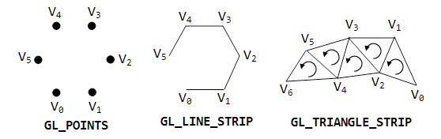
- The geometry shader can only output the following primitive types
  - points
  - line_strip
  - triangle_strip

--

## output qualifiers

- The max_vertices value is used to indicate the max size that may be output, this should be kept to a minimum as OpenGL may allocate buffer space for this and will reduce performance

--

## Geometry Shaders
- Geo shaders uses a the following structures to receive and emit vertices 

```
in gl_PerVertex 
{
  vec4 gl_Position;
  float gl_PointSize; 
  float gl_ClipDistance[];
} gl_in[];
in int gl_PrimitiveIDIn;

out gl_PerVertex 
{
  vec4  gl_Position;
  float gl_PointSize;
  float gl_ClipDistance[];
};
```

--

## Size of input array
| Input primitive	| Size of array |
|-----------------|---------------|
| ```points```	 | 1 |
| ```lines```	 | 2 |
| ```triangles```	| 3 |
| ```lines_adjacency```	| 4 |
| ```triangles_adjacency```	| 6 |

--

## ``` EmitVertex() ```
- ```EmitVertex()``` tells the geometry shader that all the information for the current vertex has been filled in
- Any other variables set at this stage will be passed to the fragment shader (for example colour)
- Other attributes active at this stage will also be passed onto the fragment shader
- ```EmitVertex()``` can be called as many times as you like as long as it doesn’t reach the max_vertices value 

--

## ```EmitPrimitive()```
- ```EmitPrimitive()``` indicates that we have finished emitting vertices.
- It is important that enough vertices have been created for the primitive type specified in the layout qualifier

---

## Visualising Normals
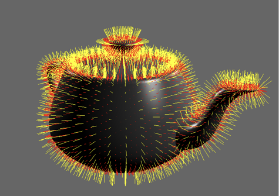
- The following geometry shader is used to draw both face and vertex normals
- The shader is split into 3 parts and loaded using ngl::ShaderLib

--

## Vertex Shader

```
#version 330 core
/// @brief the vertex passed in
layout (location =0) in vec3 inVert;
/// @brief the normal passed in
layout (location =2) in vec3 inNormal;
/// @brief the in uv
layout (location =1) in vec2 inUV;
uniform mat4 MVP;

uniform float normalSize;
uniform vec4 vertNormalColour;
uniform vec4 faceNormalColour;

out vec4 normal;

uniform bool drawFaceNormals;
uniform bool drawVertexNormals;

void main()
{
  gl_Position = MVP*vec4(inVert,1);
  normal=MVP*vec4(inNormal,0);
}
```

--

## Fragment Shader

```
#version 330 core

/// @brief our output fragment colour
layout (location =0 )out vec4 fragColour;
in vec4 perNormalColour;

void main ()
{
  fragColour = perNormalColour;
}
```

--

## Geometry Shader

```
#version 330 core
layout(triangles) in;
layout(line_strip, max_vertices = 8) out;

in vec4 normal[];

uniform  float normalSize;
uniform  vec4 vertNormalColour;
uniform  vec4 faceNormalColour;
uniform bool drawFaceNormals;
uniform bool drawVertexNormals;
out vec4 perNormalColour;

void main()
{
  if (drawVertexNormals == true)
  {

  for(int i = 0; i<gl_in.length(); ++i)
  {
    gl_Position = gl_in[i].gl_Position;
    perNormalColour=vec4(1,0,0,1);
    EmitVertex();
    gl_Position = gl_in[i].gl_Position+ normal[i] * abs(normalSize);
    perNormalColour=vec4(1,1,1,1);
    EmitVertex();
    EndPrimitive();
  }
 }
    if (drawFaceNormals == true)
    {
    perNormalColour=faceNormalColour;

    vec4 cent = (gl_in[0].gl_Position + gl_in[1].gl_Position + gl_in[2].gl_Position) / 3.0;
    vec3 face_normal = normalize(cross(gl_in[2].gl_Position.xyz - gl_in[0].gl_Position.xyz,
                                       gl_in[1].gl_Position.xyz - gl_in[0].gl_Position.xyz));

    gl_Position =  cent;
    EmitVertex();
    gl_Position =  (cent + vec4(face_normal * abs(normalSize), 0.0));
    EmitVertex();
    EndPrimitive();

    perNormalColour=vec4(0,1,0,1);
    }
}
```

--

## loading shader

- Adding a geometry shader is the same as any other ngl::shader we just set the type to ngl::GEOMETRY as shown

```
constexpr auto normalVertex="normalVertex";
constexpr auto normalFragment="normalFragment";
constexpr auto normalGeo="normalGeo";

shader->createShaderProgram(normalShader);

shader->attachShader(normalVertex,ngl::ShaderType::VERTEX);
shader->attachShader(normalFragment,ngl::ShaderType::FRAGMENT);
shader->loadShaderSource(normalVertex,"shaders/normalVertex.glsl");
shader->loadShaderSource(normalFragment,"shaders/normalFragment.glsl");

shader->compileShader(normalVertex);
shader->compileShader(normalFragment);
shader->attachShaderToProgram(normalShader,normalVertex);
shader->attachShaderToProgram(normalShader,normalFragment);

shader->attachShader(normalGeo,ngl::ShaderType::GEOMETRY);
shader->loadShaderSource(normalGeo,"shaders/normalGeo.glsl");
shader->compileShader(normalGeo);
shader->attachShaderToProgram(normalShader,normalGeo);
shader->linkProgramObject(normalShader);
shader->use(normalShader);
// now pass the modelView and projection values to the shader
shader->setUniform("normalSize",0.1f);
shader->setUniform("vertNormalColour",1.0f,1.0f,0.0f,1.0f);
shader->setUniform("faceNormalColour",1.0f,0.0f,0.0f,1.0f);

shader->setShaderParam1i("drawFaceNormals",true);
shader->setShaderParam1i("drawVertexNormals",true);
```

---

## Billboarding
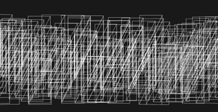
- Billboarding is the process of creating a quad that always faces the camera
- A texture is then applied to this quad to give the impression of a solid object
- Various techniques can then be applied to produce different effects

--

## Animated Fire Demo
- This demo will use several sprite sheets of textures for each frame of animation
- The position of the billboard is passed in as a point in space
- A geometry shader will be used to generate the correct billboard and texture co-ordinates
- The texture co-ordinates are updated based on a time parameter passed to the shader

--

## Animated Fire Demo
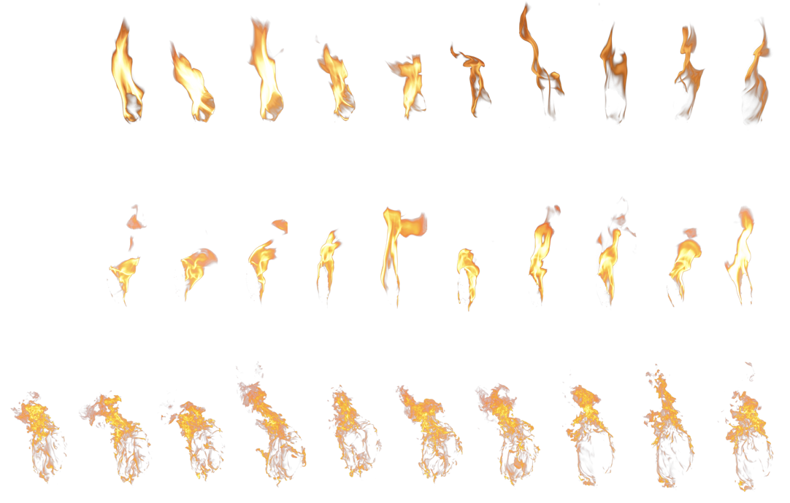

--

## Data Structure

```
typedef struct data
{
  ngl::Vec4 p;
  float offset;
};
```
- The data structure above is used to pass in the information about the billboard
- p.x/y/z is the position of the centre of the billboard
- p.w is used to indicate which of the 3 textures to use when drawing
- offset is used to indicate the frame offset for the texture

--

## Generate Data Points

```
// create a voa of points to draw
m_vao.reset( ngl::VAOFactory::createVAO(ngl::simpleVAO,GL_POINTS));
m_vao->bind();

ngl::Random *rng=ngl::Random::instance();

data p;
std::vector <data> points;
rng->setSeed();

for(int i=0; i<20000; ++i)
{
  float radius=8+rng->randomPositiveNumber(1);
  float x=radius*cosf( ngl::radians(i));
  float z=radius*sinf( ngl::radians(i));

  p.p.m_x=x;
  p.p.m_y=-rng->randomPositiveNumber(1);
  p.p.m_z=z;

  p.p.m_w=static_cast<int>(rng->randomPositiveNumber(3));
  // time offset we have 10 frames for each texture
  p.offset=static_cast<int>(rng->randomPositiveNumber(10));
  points.push_back(p);
}
std::sort(points.begin(),points.end(),NGLScene::depthSort);
m_vao->setData(ngl::AbstractVAO::VertexData(points.size()*sizeof(data),points[0].p.m_x));

m_vao->setVertexAttributePointer(0,4,GL_FLOAT,sizeof(data),0);
m_vao->setVertexAttributePointer(1,1,GL_FLOAT,sizeof(data),4);

m_vao->setNumIndices(points.size());
m_vao->unbind();

```

--

## Loading Textures
- In this case we are going to use multi-texturing to allow more than one texture to be accessed at a time.
- This is done using the glActiveTexture function passing in the texture we wish to be active when binding the data
- NGL::Texture has the same features as shown in the following code
- Note that we also need to associate the samplers with the correct texture ID

--

## Loading Textures

```
ngl::Texture t;

t.loadImage("textures/map1.png");
t.setMultiTexture(0);
m_maps[0]=t.setTextureGL();
glGenerateMipmap(GL_TEXTURE_2D);

t.loadImage("textures/map2.png");
t.setMultiTexture(1);
m_maps[1]=t.setTextureGL();
glGenerateMipmap(GL_TEXTURE_2D);

t.loadImage("textures/map3.png");
t.setMultiTexture(2);
m_maps[2]=t.setTextureGL();
glGenerateMipmap(GL_TEXTURE_2D);

shader->setUniform("tex1",0);
shader->setUniform("tex2",1);
shader->setUniform("tex3",2);

```

--

## Texture Index 

- The value of a sampler uniform in a program is not a texture object, but a texture image unit index. 
- So you set the texture unit index for each sampler in a program. 
- Then you bind the textures and sampler objects you wish to use to those texture units. 
- To set the value of a sampler, use glUniform1i  or glUniform1iv  for an array of samplers.

--

## Vertex Shader
- as both whichTexture and frameOffset are used as flags we don’t want interpolated values, the “flat” keyword stops this.

```
#version 330 core

layout (location = 0) in vec4 inVert;
layout (location =1) in float timeOffset;
flat out float whichTexture;
flat out float frameOffset;
void main()
{
  frameOffset=timeOffset;
  whichTexture=inVert.w;
  gl_Position = vec4(inVert.xyz, 1.0);
}
```

--

## Geometry Shader

```
#version 330 core

layout(points) in;
layout(triangle_strip) out;
layout(max_vertices = 4) out;
uniform mat4 VP;
uniform vec3 camerapos;
uniform int time;

out vec2 vertUV;
flat out float texID;
flat in float whichTexture[];
flat in float frameOffset[];
void main()
{
  float bbWidth=0.5;
  float bbHeight=1.0;
  float ctime=time+frameOffset[0];
  texID=whichTexture[0];
  float spriteOffset=0.1;
  vec3 pos = gl_in[0].gl_Position.xyz;
  vec3 toCamera = normalize(camerapos - pos);
  vec3 up = vec3(0.0, 1.0, 0.0);
  vec3 right = cross(toCamera, up);
  right*=bbWidth;
  up *= bbHeight;
  pos -= (right * 0.5);
  pos.z=gl_in[0].gl_Position.z;
  gl_Position = VP * vec4(pos, 1.0);
  vertUV = vec2(ctime*spriteOffset, 0.0);
  EmitVertex();

  pos.y += 1.0;
  gl_Position = VP * vec4(pos, 1.0);
  vertUV = vec2(ctime*spriteOffset, 1.0);
  EmitVertex();

  pos.y -= 1.0;
  pos += right;
  gl_Position = VP * vec4(pos, 1.0);
  vertUV = vec2((ctime+1)*spriteOffset, 0.0);
  EmitVertex();

  pos.y += 1.0;
  gl_Position = VP * vec4(pos, 1.0);
  vertUV = vec2((ctime+1)*spriteOffset, 1.0);
  EmitVertex();

  EndPrimitive();
}
```

--

## Fragment Shader

```
#version 330 core
/// @brief our output fragment colour
layout (location =0) out vec4 fragColour;

// this is a pointer to the current 2D texture object
uniform sampler2D tex1;
uniform sampler2D tex2;
uniform sampler2D tex3;
// the vertex UV
in vec2 vertUV;
flat in float texID;

void main ()
{
  // set the fragment colour to the current texture
  if(texID==0)
  {
    fragColour = texture(tex1,vertUV);
  }
  else if(texID==1)
  {
    fragColour = texture(tex2,vertUV);
  }
  else
  {
    fragColour = texture(tex3,vertUV);
  }

  if (fragColour.r == 0 && fragColour.g == 0 && fragColour.b == 0)
  {
   discard;
  }
}
```

---

## Frame Buffer Objects
- FBO’s are an extension to OpenGL that defines an interface for drawing to rendering destinations other than the buffer provided by the windows system
- Usually when we draw, it gets passed to the currently active OpenGL context (logical framebuffer).
- This will have a colour buffer, a depth buffer or a stencil buffer and in gl terms are know as the logical buffers.

--

## Frame Buffer Objects
- When creating an FBO we can re-direct the usual OpenGL rendering to a new buffer
- This buffer can be thought of as a simple texture object which other shaders can access
- But can be either the colour, depth or stencil buffers

--

## FBO Creation
- A FBO is created in a similar way to other OpenGL buffers

```
void glGenFramebuffersEXT(GLsizei n, GLuint* ids);
void glDeleteFramebuffersEXT(GLsizei n, const GLuint* ids);
```

- In this function n is the number of buffers we wish to create
- ids is the area we wish to store the buffer objects

--

## [Binding Framebuffers](https://www.opengl.org/sdk/docs/man/html/glBindFramebuffer.xhtml)

```
void glBindFramebuffer(GLenum target,GLuint framebuffer);
```

- target can be 

```
GL_FRAMEBUFFER
GL_READ_FRAMEBUFFER
GL_DRAW_FRAMEBUFFER
```
- framebuffer is the id of the FBO create with the gen function

--

## FBO targets
- ```GL_READ_FRAMEBUFFER```, or ```GL_DRAW_FRAMEBUFFER``` can be set to use either ```glReadPixels```, ```glCopyPixels``` for access to the FBO
- ```GL_FRAMEBUFFER``` sets both of the above
- Once a FBO is created we can attach what the gl spec refers to as an “image” to the FBO
- An image is defined as “a single 2D array of pixels” 

--

## FBO “images”
- The default framebuffer has buffers such as
```
GL_FRONT 
GL_BACK
GL_AUXi
GL_ACCUM
```
- In contrast a FBO has “attachment points” these are locations in the FBO where an image is attached
- These are shown next

--

##  GL_COLOR_ATTACHMENTi
- Each implementation has GL_MAX_COLOR_ATTACHMENTS number of colour attachments
- These are used to render colour data to the FBO and are usually used to render colour data to the FBO
- They can also be used to store multiple colour values in one FBO (such as cube maps)

--

## GL_DEPTH_ATTACHMENT
- These are used to store depth values
- Usually this can be used to store the z depth for shadow mapping and other effects
- ```GL_STENCIL_ATTACHMENT``` is used to store stencil values
- ```GL_DEPTH_STENCIL_ATTACHMENT``` is used for combining both values

--

## Attaching images
- The process of attaching an image is to create a texture object of the correct size
- This is then attached to the FBO for the correct target.
- The following code creates a texture object

--

## Create a Texture Objects

```
const static int TEXTURE_WIDTH=1024;
const static int TEXTURE_HEIGHT=1024;

void NGLScene::createTextureObject()
{
  // create a texture object
  glGenTextures(1, &m_textureID);
  // bind it to make it active
  glActiveTexture(GL_TEXTURE0);
  glBindTexture(GL_TEXTURE_2D, m_textureID);
  // set params
  glTexParameterf(GL_TEXTURE_2D, GL_TEXTURE_MAG_FILTER, GL_LINEAR);
  glTexParameterf(GL_TEXTURE_2D, GL_TEXTURE_MIN_FILTER, GL_LINEAR);
  //glGenerateMipmapEXT(GL_TEXTURE_2D);  // set the data size but just set the buffer to 0 as we will fill it with the FBO
  glTexImage2D(GL_TEXTURE_2D, 0, GL_RGBA8, TEXTURE_WIDTH, TEXTURE_HEIGHT, 0, GL_RGBA, GL_UNSIGNED_BYTE, 0);
  // now turn the texture off for now
  glBindTexture(GL_TEXTURE_2D, 0);
}

```

--

## FBO Creation
- The following code will create our FBO
- It will then create a depth buffer and a colour buffer
- The depth buffer is attached along with the render buffer

--

##  FBO Creation

```
void NGLScene::createFramebufferObject()
{
  // create a framebuffer object this is deleted in the dtor
  glGenFramebuffers(1, &m_fboID);
  glBindFramebuffer(GL_FRAMEBUFFER, m_fboID);
  GLuint rboID;
  // create a renderbuffer object to store depth info
  glGenRenderbuffers(1, &rboID);
  glBindRenderbuffer(GL_RENDERBUFFER, rboID);

  glRenderbufferStorage(GL_RENDERBUFFER, GL_DEPTH_COMPONENT, TEXTURE_WIDTH, TEXTURE_HEIGHT);
  // bind
  glBindRenderbuffer(GL_RENDERBUFFER, 0);

  // attatch the texture we created earlier to the FBO
  glFramebufferTexture2D(GL_FRAMEBUFFER, GL_COLOR_ATTACHMENT0, GL_TEXTURE_2D, m_textureID, 0);

  // now attach a renderbuffer to depth attachment point
  glFramebufferRenderbuffer(GL_FRAMEBUFFER, GL_DEPTH_ATTACHMENT, GL_RENDERBUFFER, rboID);
  // now got back to the default render context
  glBindFramebuffer(GL_FRAMEBUFFER, 0);
  // were finished as we have an attached RB so delete it
  glDeleteRenderbuffers(1,&rboID);
}
```

--

## [SimpleFBO](https://github.com/NCCA/FBODemos/tree/master/SimpleFBO)

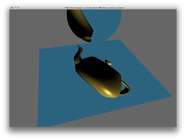
- In this example the scene of a teapot is rendered using a phong shader
- Next the scene of the sphere and the plane is rendered using a texture shader
- The FBO is read as the texture in this shader and used to texture the scene.
- This could for example be used in a game for a simple HUD

--

## Renderpasses

```
void NGLScene::paintGL()
{
  //----------------------------------------------------------------------------------------------------------------------
  // draw to our FBO first
  //----------------------------------------------------------------------------------------------------------------------
  // grab an instance of the shader manager
  ngl::ShaderLib *shader=ngl::ShaderLib::instance();
  (*shader)["Phong"]->use();

  // Rotation based on the mouse position for our global transform
  ngl::Mat4 rotX;
  ngl::Mat4 rotY;
  // create the rotation matrices
  rotX.rotateX(m_win.spinXFace);
  rotY.rotateY(m_win.spinYFace);
  // multiply the rotations
  m_mouseGlobalTX=rotY*rotX;
  // add the translations
  m_mouseGlobalTX.m_m[3][0] = m_modelPos.m_x;
  m_mouseGlobalTX.m_m[3][1] = m_modelPos.m_y;
  m_mouseGlobalTX.m_m[3][2] = m_modelPos.m_z;


  static float rot=0.0;
   // get the VBO instance and draw the built in teapot
  ngl::VAOPrimitives *prim=ngl::VAOPrimitives::instance();
  // we are now going to draw to our FBO
  // set the rendering destination to FBO
  glBindFramebuffer(GL_FRAMEBUFFER, m_fboID);
  // set the background colour (using blue to show it up)
  glClearColor(0,0.4f,0.5f,1);
  glClear(GL_COLOR_BUFFER_BIT | GL_DEPTH_BUFFER_BIT);
  // set our viewport to the size of the texture
  // if we want a different camera we wouldset this here
  glViewport(0, 0, TEXTURE_WIDTH, TEXTURE_HEIGHT);
  // rotate the teapot
  m_transform.reset();

  m_transform.setRotation(rot,rot,rot);
  loadMatricesToShader();
  prim->draw("teapot");
  rot+=0.5;

  //----------------------------------------------------------------------------------------------------------------------
  // now we are going to draw to the normal GL buffer and use the texture created
  // in the previous render to draw to our objects
  //----------------------------------------------------------------------------------------------------------------------
  // first bind the normal render buffer
  glBindFramebuffer(GL_FRAMEBUFFER, defaultFramebufferObject());
  // now enable the texture we just rendered to
  glBindTexture(GL_TEXTURE_2D, m_textureID);
  // do any mipmap generation
  glGenerateMipmap(GL_TEXTURE_2D);
  // set the screen for a different clear colour
  glClearColor(0.4f, 0.4f, 0.4f, 1.0f);			   // Grey Background
  // clear this screen
  glClear(GL_COLOR_BUFFER_BIT | GL_DEPTH_BUFFER_BIT);
  // get the new shader and set the new viewport size
  shader->use("TextureShader");
  // this takes into account retina displays etc
  glViewport(0, 0, width() * devicePixelRatio(), height() * devicePixelRatio());
  ngl::Mat4 MVP;
  m_transform.reset();
  MVP= m_mouseGlobalTX*m_cam.getVPMatrix();
  shader->setShaderParamFromMat4("MVP",MVP);
  prim->draw("plane");

  m_transform.setPosition(0,1,0);
  MVP= m_transform.getMatrix()*m_mouseGlobalTX*m_cam.getVPMatrix();
  shader->setShaderParamFromMat4("MVP",MVP);
  prim->draw("sphere");
  //----------------------------------------------------------------------------------------------------------------------
 }
```

---

## Shadows
- There are a number of methods available to create shadows in OpenGL and a huge amount of literature on how this may be achieved for different effects
- The following example is going to use depth mapped shadows to create our shadow map
- It is a two pass process :
  1. render from the light POV to an FBO
  2. Use the FBO depth texture to shadow map

--

## Projective Texture
- When rendering the 2nd pass the application must create a matrix that transforms incoming vertex positions into projective texture coordinates for each light source.
- The matrix is formed as follows

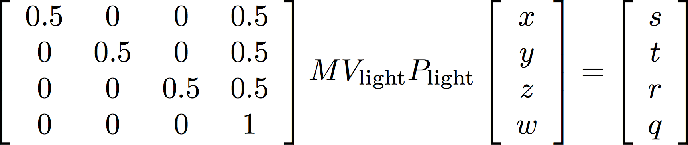

--

## Projective Texture

- The modelling matrix (M) that transforms modelling coordinates into world coordinates 
- A view matrix (Vlight) that rotates and translates world coordinates into a coordinate system that has the light source at the origin and is looking at the point (0, 0, 0) in world coordinates 
- A projection matrix (Plight) that defines the frustum for the view from the light source (field of view, aspect ratio, near and far clipping planes) 

--

## Projective Texture

- A scale and bias matrix that takes the clip space coordinates (i.e., values in the range [–1,1]) from the previous step into values in the range [0,1] so that they can be used directly as the index for accessing the shadow map. 

--

## [textureProj](https://www.opengl.org/sdk/docs/man4/html/textureProj.xhtml)
- Modern versions of glsl (>=130) have a built in sampler / lookup function called textureProj
- This does some of the elements of the previous matrix for us so it makes it easier to do the shadow mapping
- In the following example we use the sampler2DShadow along with the textureProj to create a simple shadowed scene

--

## A quick C++ diversion
- In the example that follows I decided to create a generic scene function that allows the user to pass in a class method as a function
- This allows the drawScene function to contain all the drawing elements but a different loadMatricesToShader to be called each time
- We can use [```std::function```](http://en.cppreference.com/w/cpp/utility/functional/function)

--

## pointer to member function
- The first thing to do is to create a pointer to a member function.
- In this case it will have the signature for the method

```
void drawScene(std::function<void()> _shaderFunc);
```

--

## calling function

- calling the function is quite simple we just use [```std::bind```](http://en.cppreference.com/w/cpp/utility/functional/bind)
- This is shown below

```
drawScene(std::bind(&NGLScene::loadMatricesToShadowShader,this));
```

--

## Simple Shadows
- This demo creates a simple light model by using an ngl::Vec4 to store the light position
- Two cameras are created, one for the scene and one to be placed at the POV of the light pointing to the origin
- The first pass will render to the FBO a depth texture pass which is then used in the shadow shader to create the shadows

--

## [Simple Shadows](https://github.com/NCCA/FBODemos/tree/master/Shadows)

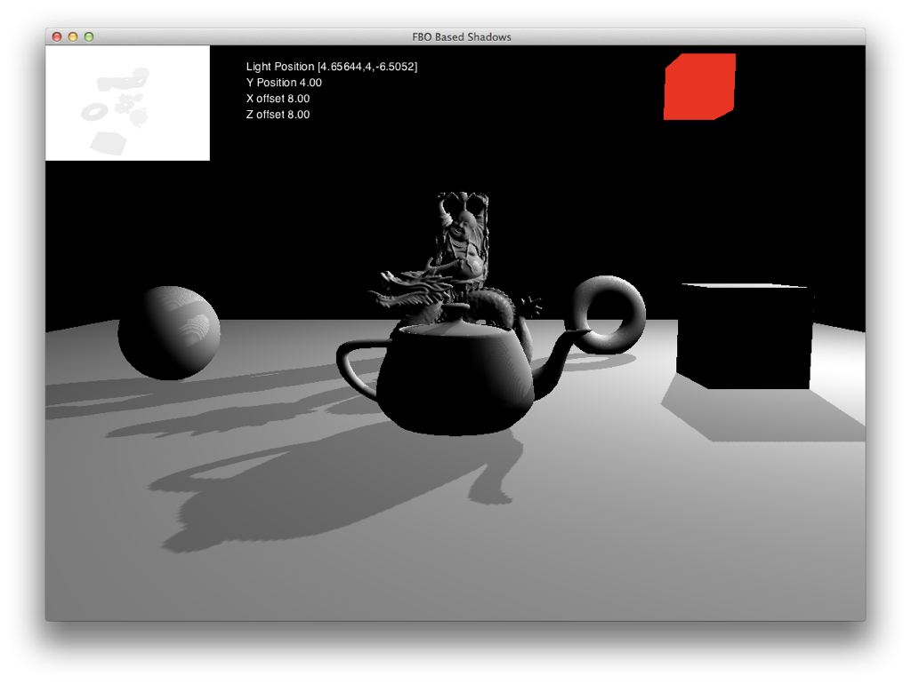

--

## [Percentage closer filtering](https://github.com/NCCA/FBODemos/tree/master/PCFShadows)
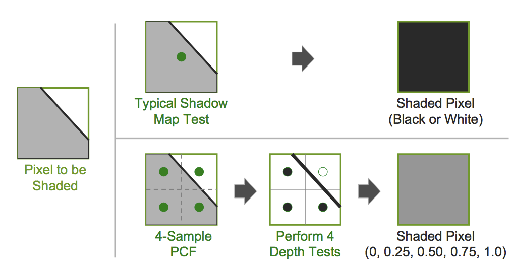

--

## [Percentage closer filtering](https://github.com/NCCA/FBODemos/tree/master/PCFShadows)
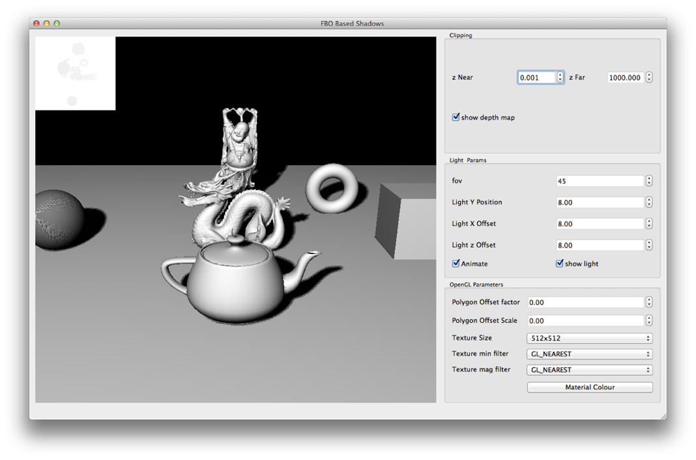

---

# Transform Feedback

- Transform feedback allows the capture of processed vertices data before rasterisation (just before clipping).
- It was originally an extension but is now a core feature of OpenGL 3.x and above
- This is the same as the Direct X Output stream (and started as an nVidia extension)

--

# Instancing

- One of the main uses of Transform Feedback is in the use of the instance version of the glDrawArray* functions
- When these are called each vertex shader has an invocation id for each instance called 
gl_InstanceID
- We can use this to identify the instance and use this with some other buffer to identify which particular instance we are using.

--

# Examples

- The following examples show three different methods of instancing.
  - [Uniform Buffer Object Instancing](https://github.com/NCCA/Instancing/tree/master/UBOInstancing)
  - [Texture Buffer Object Instancing](https://github.com/NCCA/Instancing/tree/master/TBOInstancing)
  - [Divisor Buffer Instancing](https://github.com/NCCA/Instancing/tree/master/DivisorInstancing)
- Most of the setup code for each demo is similar and a simple textured box will be used for drawing.

--

# Basic Process

- Create a set of data points for our instances
- Transform these using a simple shader
- Store the results in a buffer object
- re-use this buffer object when drawing
- In these examples we will use the feedback shader to calculate individual Model-View matrices for each of the instances to be drawn

---

# Blend Shape Animation
- Blend shape animation is a fairly simple process and tends to scale quite well.
- It does require the storage of quite a few large data elements
- However the computation required to compute the final mesh is quite simple
- Some speedups can be applied to make this more efficient
- Sometimes called morph target animation

--


# Blend Shapes

-  A blend shape is simply the per-vertex difference between a reference, or neutral, pose and the intended pose. 
- This set of per vertex differences can be thought of as a mesh of vectors.
- This should also be extended for all the per vertex attributes for example normals, uv etc etc


--

# Blend Shapes

- If P is a vertex in the mesh, then the following equation demonstrates how to compute the blend shape vector for the i th pose of P
- Where w is the pose blend weight

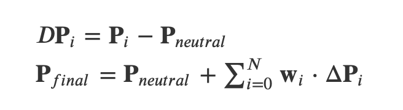

--

# Example

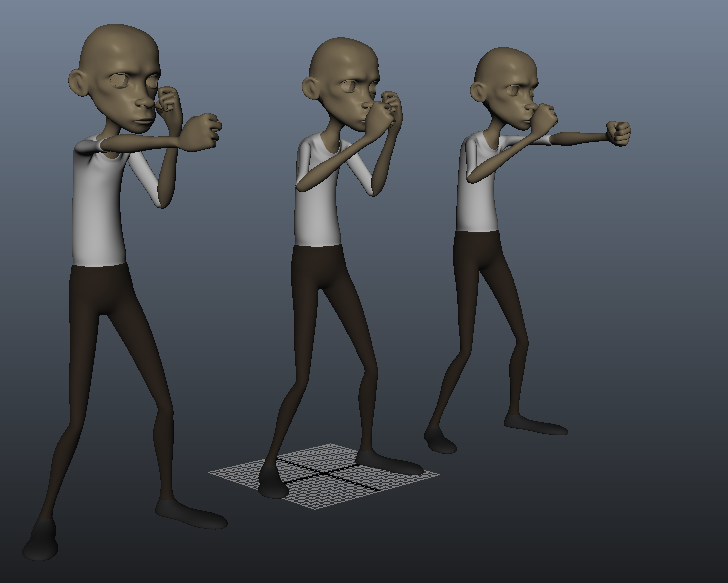

--

# Process

- Export each pose as an Obj (all at the same position)
- Load each blend shape mesh and subtract form neutral pose mesh
- Must ensure each mesh has the same face / vertex order or things will break
- Store pre-subtracted mesh (difference mesh) per blend shape

--

# [MorphObj](https://github.com/NCCA/MorphObj)

- Pass to shader each vertex position and normal for each blend shape per frame

```
struct vertData
{
  ngl::Vec3 p1; //  base pose
  ngl::Vec3 n1;
  ngl::Vec3 p2; // Blend shape 1
  ngl::Vec3 n2;
  ngl::Vec3 p3; // Blend shape 2
  ngl::Vec3 n3;
};

```

--

```
void NGLScene::createMorphMesh()
{

  // base pose is mesh 1 stored in m_meshes[0]
  // get the obj data so we can process it locally
  std::vector <ngl::Vec3> verts1=m_meshes[0]->getVertexList();
  // should really check to see if the poses match if we were doing this properly
  std::vector <ngl::Vec3> verts2=m_meshes[1]->getVertexList();
  std::vector <ngl::Vec3> verts3=m_meshes[2]->getVertexList();
  // faces will be the same for each mesh so only need one
  std::vector <ngl::Face> faces=m_meshes[0]->getFaceList();
  // now get the normals
  std::vector <ngl::Vec3> normals1=m_meshes[0]->getNormalList();
  std::vector <ngl::Vec3> normals2=m_meshes[1]->getNormalList();
  std::vector <ngl::Vec3> normals3=m_meshes[2]->getNormalList();

  // now we are going to process and pack the mesh into an ngl::VertexArrayObject
  std::vector <vertData> vboMesh;
  vertData d;
  auto nFaces=faces.size();
  // loop for each of the faces
  for(unsigned int i=0;i<nFaces;++i)
  {
    // now for each triangle in the face (remember we ensured tri above)
    for(unsigned int j=0;j<3;++j)
    {
      // pack in the vertex data first

      d.p1=verts1[faces[i].m_vert[j]];
      // the blend meshes are just the differences so we subtract the base mesh
      // from the current one (could do this on GPU but this saves processing time)
      d.p2=verts2[faces[i].m_vert[j]]-d.p1;
      d.p3=verts3[faces[i].m_vert[j]]-d.p1;

      // now do the normals
      d.n1=normals1[faces[i].m_norm[j]];
      // again we only need the differences so subtract base mesh value from pose values
      d.n2=normals2[faces[i].m_norm[j]]-d.n1;
      d.n3=normals3[faces[i].m_norm[j]]-d.n1;

    // finally add it to our mesh VAO structure
    vboMesh.push_back(d);
    }
  }
  // first we grab an instance of our VOA class as a TRIANGLE_STRIP
  m_vaoMesh=ngl::VAOFactory::createVAO("simpleVAO",GL_TRIANGLES);
  // next we bind it so it's active for setting data
  m_vaoMesh->bind();
  auto meshSize=vboMesh.size();
  // now we have our data add it to the VAO, we need to tell the VAO the following
  // how much (in bytes) data we are copying
  // a pointer to the first element of data (in this case the address of the first element of the
  // std::vector
  m_vaoMesh->setData(ngl::AbstractVAO::VertexData (meshSize*sizeof(vertData),vboMesh[0].p1.m_x));

  // so data is Vert / Normal for each mesh
  m_vaoMesh->setVertexAttributePointer(0,3,GL_FLOAT,sizeof(vertData),0);
  m_vaoMesh->setVertexAttributePointer(1,3,GL_FLOAT,sizeof(vertData),3);

  m_vaoMesh->setVertexAttributePointer(2,3,GL_FLOAT,sizeof(vertData),6);
  m_vaoMesh->setVertexAttributePointer(3,3,GL_FLOAT,sizeof(vertData),9);

  m_vaoMesh->setVertexAttributePointer(4,3,GL_FLOAT,sizeof(vertData),12);
  m_vaoMesh->setVertexAttributePointer(5,3,GL_FLOAT,sizeof(vertData),15);

  m_vaoMesh->setNumIndices(meshSize);
  // finally we have finished for now so time to unbind the VAO
  m_vaoMesh->unbind();
}
```

--

# Blend Shape Weights

- Each blend shape has a weight clamped between 0 and 1
- This is passed to the shader as a uniform

--

# Vertex Shader

- All of the calculations are done on the vertex shader
- This is quite an efficient way of processing the data as we can use the power of the GPU
- There is a small bottleneck as we are passing quite a lot of data to the GPU as attributes (which will be addressed in the next version)

--

## Vertex Shader

```
#version 330 core
// this is base on http://http.developer.nvidia.com/GPUGems3/gpugems3_ch03.html
layout (location =0) in vec3 baseVert;
layout (location =1) in vec3 baseNormal;
layout (location =2) in vec3 poseVert1;
layout (location =3) in vec3 poseNormal1;
layout (location =4) in vec3 poseVert2;
layout (location =5) in vec3 poseNormal2;

// transform matrix values
uniform mat4 MVP;
uniform mat3 normalMatrix;
uniform mat4 MV;
uniform float weight1;
uniform float weight2;
out vec3 position;
out vec3 normal;

void main()
{
	// first we computer the weighted normal
	vec3  finalN=baseNormal+(weight1*poseNormal1)+(weight2*poseNormal2);
	// then normalize and mult by normal matrix for shading
	normal = normalize( normalMatrix * finalN);
	// now calculate the eye cord position for the frag stage
	// now calculated the weighted vertices and add to the base mesh
	vec3  finalP=baseVert+(weight1*poseVert1)+(weight2*poseVert2);
	position = vec3(MV * vec4(finalP,1.0));
	// Convert position to clip coordinates and pass along
	gl_Position = MVP*vec4(finalP,1.0);
}
```

---

# Using a TBO for speed

- In the previous example much of the data passed is static
- Passing this in an attribute stream is a bit wasteful as the data is never going to change
- It makes more sense to put the unchanging data into a buffer object ( texture)
- We need to know which vertex we are dealing with so we use the gl_VertexID for the index 
- We must again ensure that the data is stored in a contiguous way.


--

# Process
- This time we calculate the same morph targets by getting the difference from the main mesh.
- However now the morph targets are placed into a single std::vector <ngl::Vec4>
- The data is packed Vertex Vertex Normal Normal
- We need to use a Vec4 as OpenGL 4.0 only allows texture buffer access on Vec4 types, later versions work with all types.

--

# [Creating Texture Buffer](https://github.com/NCCA/MorphObjTBO)

```c++
  GLuint morphTarget;
  glGenBuffers(1,&morphTarget);
  glBindBuffer(GL_TEXTURE_BUFFER, morphTarget);
  glBufferData(GL_TEXTURE_BUFFER, targets.size()*sizeof(ngl::Vec3), &targets[0].m_x, GL_STATIC_DRAW);

  glGenTextures(1, &m_tboID);
  glActiveTexture( GL_TEXTURE0 );
  glBindTexture(GL_TEXTURE_BUFFER,m_tboID);

  glTexBuffer(GL_TEXTURE_BUFFER, GL_RGB32F, morphTarget);

```

--

## using [texelFetch()](https://www.khronos.org/registry/OpenGL-Refpages/gl4/html/texelFetch.xhtml)

```
#version 330 core
// this is base on http://http.developer.nvidia.com/GPUGems3/gpugems3_ch03.html
layout (location =0) in vec3 baseVert;
layout (location =1) in vec3 baseNormal;

// transform matrix values
uniform mat4 MVP;
uniform mat3 normalMatrix;
uniform mat4 MV;
uniform float weight1;
uniform float weight2;
out vec3 position;
out vec3 normal;
uniform samplerBuffer TBO;
void main()
{
	// so the data is passed in a packed array, we have vec4's with
	// vert1 vert2 normal1 normal2 so we offset vertex Id by 4 and then index in
	// to get our correct value
  vec3 poseVert1=texelFetch(TBO,int(4 *gl_VertexID)).xyz;
  vec3 poseVert2=texelFetch(TBO,int(4*gl_VertexID+1)).xyz;
  vec3 poseNormal1=texelFetch(TBO,int(4*gl_VertexID+2)).xyz;
  vec3 poseNormal2=texelFetch(TBO,int(4*gl_VertexID+3)).xyz;

	vec3  finalN=baseNormal+(weight1*poseNormal1)+(weight2*poseNormal2);
	// then normalize and mult by normal matrix for shading
	normal = normalize( normalMatrix * finalN);
	// now calculate the eye cord position for the frag stage
	position = vec3(MV * vec4(baseVert,1.0));
	// now calculated the weighted vertices and add to the base mesh
	vec3  finalP=baseVert+(weight1*poseVert1)+(weight2*poseVert2);
	// Convert position to clip coordinates and pass along
	gl_Position = MVP*vec4(finalP,1.0);

}
```

---

# Mesh File Types

- There are many different mesh file types all having different formats and capabilities
- ngl:: Only really supports OBJ and writing parsers for other formats is a big task
- Usually it is best to use 3rd party libraries to load meshes / animation data and access it in your own applications
- For these demos I’ve decided to use Assimp (the Open Asset Import Library)

--

# [Assimp](http://www.assimp.org/)
- Assimp supports a huge number of file formats

```
Collada ( .dae ) Blender 3D ( .blend ) 3ds Max 3DS ( .3ds )
3ds Max ASE ( .ase ) Wavefront Object ( .obj )
Industry Foundation Classes (IFC/Step) ( .ifc )
XGL ( .xgl,.zgl ) Stanford Polygon Library ( .ply )
*AutoCAD DXF ( .dxf ) LightWave ( .lwo )
LightWave Scene ( .lws ) Modo ( .lxo )
Stereolithography ( .stl ) DirectX X ( .x )
AC3D ( .ac ) Milkshape 3D ( .ms3d )
* TrueSpace ( .cob,.scn ) Biovision BVH ( .bvh )
* CharacterStudio Motion ( .csm ) Ogre XML ( .xml )
Irrlicht Mesh ( .irrmesh ) * Irrlicht Scene ( .irr )
Quake I ( .mdl )Quake II ( .md2 )Quake III Mesh ( .md3 )
Quake III Map/BSP ( .pk3 )
* Return to Castle Wolfenstein ( .mdc )*Valve Model ( .smd,.vta )
*Starcraft II M3 ( .m3 )*Unreal ( .3d )
BlitzBasic 3D ( .b3d )Quick3D ( .q3d,.q3s )
Neutral File Format ( .nff )Sense8 WorldToolKit ( .nff )
Object File Format ( .off )PovRAY Raw ( .raw )
Terragen Terrain ( .ter )3D GameStudio (3DGS) ( .mdl )
3D GameStudio (3DGS) Terrain ( .hmp )
Izware Nendo ( .ndo )
```

--

# Assimp
- Is written in C++
-  There is a C API as well as bindings to various other languages, including Python
- Assimp loads models into a straightforward data structure for further processing.
- This feature set is augmented by various post processing steps  these can do things like triangulation, tangent calculations etc etc

--

# Assimp PostProcess

- These flags are useful when loading in the mesh to do processing / removal of data etc
- There are some helper ones that combine a number of different flags 

```
#define aiProcessPreset_TargetRealtime_MaxQuality (\
aiProcessPreset_TargetRealtime_Quality | \
aiProcess_FindInstances | \
aiProcess_ValidateDataStructure | \
aiProcess_OptimizeMeshes | \
aiProcess_Debone             |  \
0)
```

--

# [AIUtil](https://github.com/NCCA/AssetImportDemos/blob/master/MeshToNGL/src/AIUtil.cpp)

- Is a series of helper functions developed to link from Assimp to NGL

```
#ifndef AIUTIL_H_
#define AIUTIL_H_
#include <assimp/scene.h>
#include <assimp/cimport.h>
/// @brief some useful conversion routines for assimp to ngl
// to make things cleaner pre declare the classes
namespace ngl
{
  class Mat4;
  class Mat4;
  class Vec2;
  class Vec3;
  class Vec4;
  class Quaternion;
}


namespace AIU
{
  extern ngl::Mat4 aiMatrix4x4ToNGLMat4(const aiMatrix4x4 &_m);
  extern ngl::Mat4 aiMatrix4x4ToNGLMat4Transpose(const aiMatrix4x4 &_m);
  extern ngl::Vec3 aiVector3DToNGLVec3(const aiVector3D &_v);
  extern ngl::Vec4 aiVector3DToNGLVec4(const aiVector3D &_v);
  extern ngl::Vec2 aiVector2DToNGLVec2(const aiVector2D &_v);
  extern ngl::Quaternion aiQuatToNGLQuat(const aiQuaternion &_v);
  extern void getSceneBoundingBox(const aiScene * scene,ngl::Vec3 &o_min, ngl::Vec3 &o_max);
}

#endif

```

--

## aiScene

- The root structure of the imported data.
- Everything that was imported from the given file can be accessed from here. 
- Objects of this class are generally maintained and owned by Assimp, not by the caller.
  - shouldn't want to instance it
  - deletion should be managed by assimp as well (so use a raw pointer)

--

## aiScene

- We load a scene using the import method
- We can then query things like number of meshes, lights cameras etc etc

```
// in header
const aiScene *m_scene;
// in cpp
m_scene = aiImportFile(_fname.c_str(),
  aiProcessPreset_TargetRealtime_MaxQuality |
  aiProcess_Triangulate |
  aiProcess_PreTransformVertices |
  aiProcess_FixInfacingNormals
  );
if(m_scene == nullptr)
{
    std::cout<<"error opening file "<<_fname<<"\n";
    exit(EXIT_FAILURE);
}

```

--

# aiMesh

- The scene may contain a number of aiMesh structures.
- These will be held in a hierarchy 
- A mesh represents a geometry or model with a single material.
  - In addition there might be a series of bones, each of them addressing a number of vertices with a certain weight. 
  - Vertex data is presented in channels with each channel containing a single per-vertex information such as UV’s and normals.

--

# Mesh

- To Convert the Mesh to ngl I will create one VertexArrayObject and add all the vertices to it
- We may have to traverse the scene for each mesh element
- As we have forced triangulation with the load we don’t have to check 

```
/// @brief our mesh with local transform and VAO
struct meshItem
{
  ngl::Mat4 tx;
  std::unique_ptr<ngl::AbstractVAO> vao;
};

std::vector<meshItem > m_meshes;
```

---

# Animated Meshes

- Assimp supports a number of animation formats but for ease I will use collada
- This can be exported from maya very easily using the default DAE_Fbx export option
- Due to a strange bug in the export make sure that the start and end frames are set to the loop points of the export as the timeline in the export fails
- I usually also triangulate the mesh and bake the animation for ease.

--

# Bones

- In the animated mesh there are a series of bones (the skeleton rig)
- Each bone has a weight that influences the vertex
- For each vertex we calculate this and change the vertex position
- As the structure is hierarchical we need to traverse this structure and add the transforms.


--

# [Internal Structure](http://ogldev.atspace.co.uk/www/tutorial38/tutorial38.html)

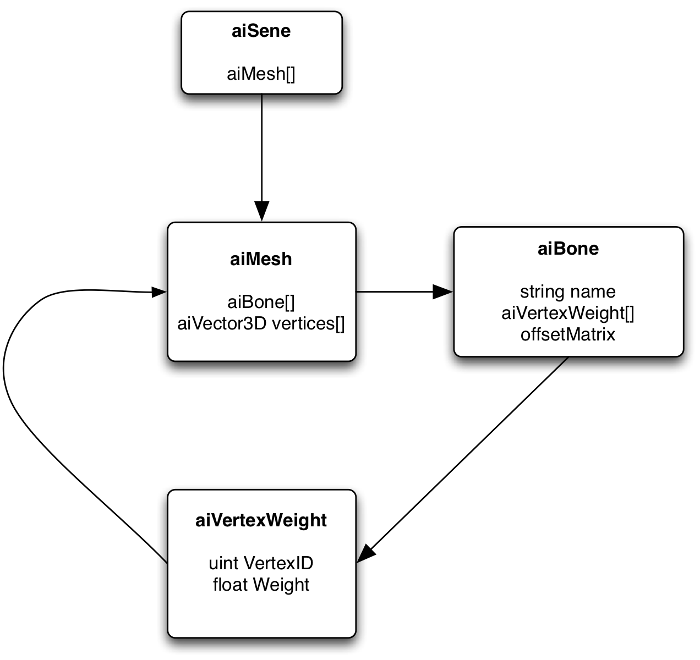

--

# [Animation Structure](http://ogldev.atspace.co.uk/www/tutorial38/tutorial38.html)

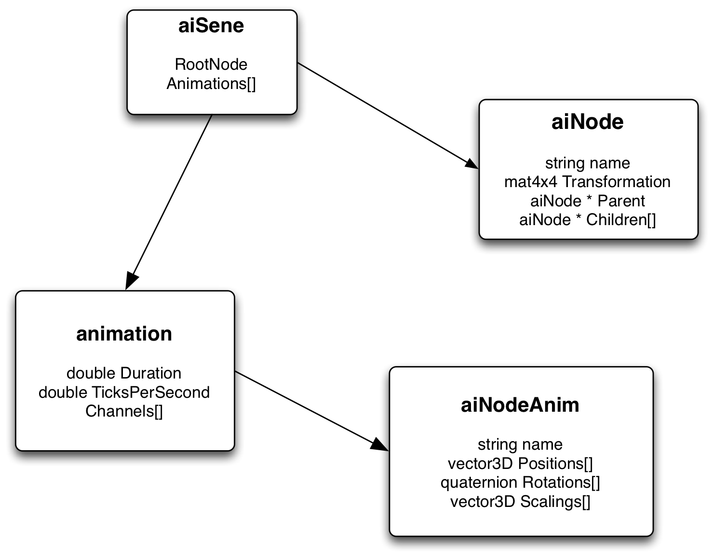

--

# Data Structures

```
constexpr int s_bonesPerVertex=4;

struct BoneInfo
{
  ngl::Mat4 boneOffset;
  ngl::Mat4 finalTransformation;
};

struct VertexBoneData
{
    std::array<unsigned int,s_bonesPerVertex> ids;
    std::array<float,s_bonesPerVertex> weights;
    void addBoneData(uint BoneID, float Weight);
};

```

--

# [Mesh.cpp](https://github.com/NCCA/AssetImportDemos/blob/master/SkeletalAnimation/src/Mesh.cpp)

- The mesh has a number of differenent elements which are loaded by the function initFromScene
- We need to use a custom VAO class to allow mixed data (i.e. float and integer) to the input of the shader


--


# Interpolated Data

- For the scale and position we find the current animation value and interpolate to the next. 
- This is done with linear interpolation as shown

```
ngl::Vec3 Mesh::calcInterpolatedPosition(float _animationTime, const aiNodeAnim* _nodeAnim)
{
  if (_nodeAnim->mNumPositionKeys == 1)
  {
    return AIU::aiVector3DToNGLVec3(_nodeAnim->mPositionKeys[0].mValue);
  }

  unsigned int positionIndex =0;
  for (unsigned int i = 0 ; i < _nodeAnim->mNumPositionKeys - 1 ; ++i)
  {
    if (_animationTime < (float)_nodeAnim->mPositionKeys[i + 1].mTime)
    {
      // if we find the key assign and exit search
      positionIndex=i;
      break;
    }
  }
  unsigned int nextPositionIndex = (positionIndex + 1);
  assert(nextPositionIndex < _nodeAnim->mNumPositionKeys);
  float deltaTime = _nodeAnim->mPositionKeys[nextPositionIndex].mTime - _nodeAnim->mPositionKeys[positionIndex].mTime;
  float factor = (_animationTime - (float)_nodeAnim->mPositionKeys[positionIndex].mTime) / deltaTime;
  ngl::Vec3 start = AIU::aiVector3DToNGLVec3(_nodeAnim->mPositionKeys[positionIndex].mValue);
  ngl::Vec3 end = AIU::aiVector3DToNGLVec3(_nodeAnim->mPositionKeys[nextPositionIndex].mValue);

  return ngl::lerp(start,end,factor);
}
```

--

# Rotations

- Rotations are stored as quaternions so we use Spherical interpolation ([SLERP](https://en.wikipedia.org/wiki/Slerp))

```
ngl::Quaternion Mesh::calcInterpolatedRotation( float _animationTime, const aiNodeAnim* _nodeAnim)
{
  // we need at least two values to interpolate...
  if (_nodeAnim->mNumRotationKeys == 1)
  {
     return AIU::aiQuatToNGLQuat(_nodeAnim->mRotationKeys[0].mValue);
  }

  unsigned int rotationIndex =0;

  for (unsigned int i = 0 ; i < _nodeAnim->mNumRotationKeys - 1 ; ++i)
  {
    if (_animationTime < (float)_nodeAnim->mRotationKeys[i + 1].mTime)
    {
      // search for index and break out of loop
      rotationIndex=i;
      break;
    }
  }

  unsigned int nextRotationIndex = (rotationIndex + 1);
  float deltaTime = _nodeAnim->mRotationKeys[nextRotationIndex].mTime - _nodeAnim->mRotationKeys[rotationIndex].mTime;
  float factor = (_animationTime - (float)_nodeAnim->mRotationKeys[rotationIndex].mTime) / deltaTime;
  ngl::Quaternion startRotation = AIU::aiQuatToNGLQuat(_nodeAnim->mRotationKeys[rotationIndex].mValue);
  ngl::Quaternion endRotation   = AIU::aiQuatToNGLQuat(_nodeAnim->mRotationKeys[nextRotationIndex].mValue);
  ngl::Quaternion out=ngl::Quaternion::slerp(startRotation,endRotation,factor);
  out.normalise();
  return out;
```

--

# Vertex Shader

- again the vertex shader is used to do the main animation with the current frame values passed as uniforms (this can again be sped up using TBO data)

```
#version 330 core
/// @brief the vertex passed in
layout (location = 0) in vec3 inVert;
/// @brief the in uv
layout (location = 1) in vec2 inUV;
/// @brief the normal passed in
layout (location = 2) in vec3 inNormal;
// Bone data
layout (location=3) in ivec4 BoneIDs;
layout (location=4) in vec4  Weights;

const int MAX_BONES = 100;
uniform mat4 MVP;
uniform mat4 M;
uniform mat4 MV;

uniform mat4 gBones[MAX_BONES];
out vec2 texCoord;
out vec3 outNormal;
out vec3 worldPosition;
// the eye position of the camera
uniform vec3 viewerPos;
/// @brief the current fragment normal for the vert being processed
out vec3 fragmentNormal;
struct Materials
{
	vec4 ambient;
	vec4 diffuse;
	vec4 specular;
	float shininess;
};


struct Lights
{
	vec4 position;
	vec4 ambient;
	vec4 diffuse;
	vec4 specular;
};
// our material
uniform Materials material;
// array of lights
uniform Lights light;
// direction of the lights used for shading
out vec3 lightDir;
// out the blinn half vector
out vec3 halfVector;
out vec3 eyeDirection;
out vec3 vPosition;

void main()
{
	 mat4 BoneTransform = gBones[BoneIDs[0]] * Weights[0];
   BoneTransform     += gBones[BoneIDs[1]] * Weights[1];
   BoneTransform     += gBones[BoneIDs[2]] * Weights[2];
   BoneTransform     += gBones[BoneIDs[3]] * Weights[3];
   vec4 pos   = BoneTransform*vec4(inVert, 1.0);
	 gl_Position    = MVP * pos;

	 texCoord = inUV;
	 vec4 Normal   = BoneTransform * vec4(inNormal, 0.0);
	 fragmentNormal   = normalize((M * Normal).xyz);


   vec4 worldPosition = M * vec4(inVert, 1.0);
	 eyeDirection = normalize(viewerPos - worldPosition.xyz);
	 // Get vertex position in eye coordinates
	 // Transform the vertex to eye co-ordinates for frag shader
	 /// @brief the vertex in eye co-ordinates  homogeneous
	 vec4 eyeCord=MV*pos;

	 vPosition = eyeCord.xyz / eyeCord.w;

	 float dist;

	 lightDir=vec3(light.position.xyz-eyeCord.xyz);
	 dist = length(lightDir);
	 lightDir/= dist;
	 halfVector = normalize(eyeDirection + lightDir);

}
```


---

## References

- Rost, R, Licea-Kane B (2009). OpenGL Shading Language. 3rd. ed. New York: Addison Wesley.
- OpenGL Architecture Review Board, OpenGL Reference Manual, Fourth Edition: The Official Reference to OpenGL, Version 1.4, Editor: Dave Shreiner, Addison-Wesley, Reading, Massachusetts, 2004.
- Segal, Mark, and Kurt Akeley, The OpenGL Graphics System: A Specification (Version 3.1), Editor (v1.1): Chris Frazier, (v1.2–3.1): Jon Leech, (v2.0): Jon Leech and Pat Brown, March 2008. - - www.opengl.org/documentation/spec.html

--

## References
- http://oss.sgi.com/projects/ogl-sample/registry/EXT/framebuffer_object.txt
- http://www.songho.ca/opengl/gl_fbo.html
- http://www.opengl.org/wiki/Renderbuffer_Object
- http://www.parashift.com/c++-faq-lite/pointers-to-members.html
- Percentage closer soft shadows Randy Fernando Nvidia 
- http://www.opengl.org/wiki/Sampler_(GLSL)

--

## References

- http://www.opengl.org/registry/specs/EXT/transform_feedback.txt
- http://www.opengl.org/registry/specs/ARB/transform_feedback2.txt
- http://www.opengl.org/wiki/GLAPI/glBeginTransformFeedback