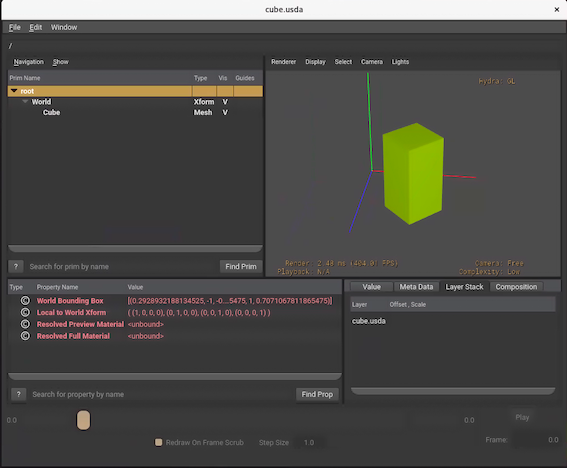
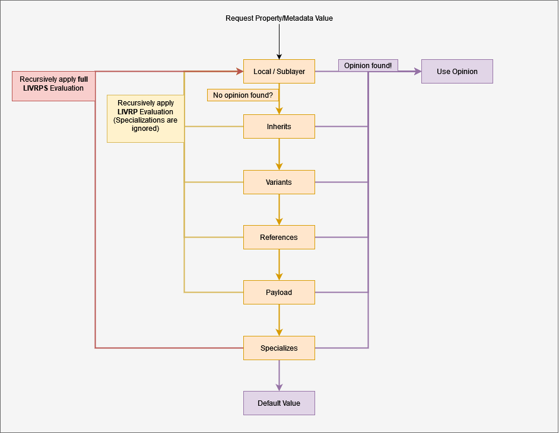

## Let's talk about Data
### serialization,formats and schema's 

Jon Macey

jmacey@bournemouth.ac.uk

---

## Introduction

- Formatted data is the core to most animation pipelines
- There are many formats we can use to store data
  - in this lecture we will look at some of the more common ones
- But first we need to look at the wider picture

--

#### What comes first Saving or Loading?

- Typically we design data formats around a specification
  - In animation tools we are saving structured data (Vertex?)
- In programs we are saving state 
  - however sometimes we save both program state and structured data (Maya scenes, hip files etc.)
- What to do is dependent upon context

--

## Serialization (CompSci)

- is the process of translating a data structure or object state into a format that can be stored
  - typically this means files but could be for transmission (network)
- deserialization is the loading of this data back into the object or structures
- Usually we need to add extra information about the saved data as the receiving object need to know about amount.

--

## Serialization 

- some languages have this built in (not C / C++)
- in most cases we can use a library or 3rd party format.
- C++ 
  - [Boost.Serialization](https://www.boost.org/doc/libs/1_81_0/libs/serialization/doc/index.html) [ProtoBuf](https://protobuf.dev/)
- Python [```import pickle```](https://docs.python.org/3/library/pickle.html) 
- most people now use [json](https://www.json.org/json-en.html) as the core format with some [yaml](https://yaml.org/) or [toml](https://toml.io/en/).

--

## Serialization

- Most formats will have a library use them!
  - for example [rapidxml](https://rapidxml.sourceforge.net/) and [rapidjson](https://rapidjson.org/) are part of NGL
- Most DCC tools will ship with C++ and python libraries that allow us to read and write the file formats
- 3rd party library support for others ([FBX](https://www.autodesk.com/products/fbx/overview),[Collada](https://www.khronos.org/collada/),[Alembic](https://www.alembic.io/),[USD](https://www.openusd.org/release/index.html))

--

## Renderers

- As seen with Renderman rib most renderers have file / scene formats too
- These are generally much simpler than DCC formats
- We will most likely not look too much at these but the principles are similar to other DCC tools so easy to pickup.

---

## Program Serialization 

- There are many ways to save and load program state and data
- We can use 3rd party libraries or use our own formats
  - either way is acceptable and usually depends upon context
- The following examples do simple object serialization 

--

## [Boost.Serialization](https://www.boost.org/doc/libs/1_81_0/libs/serialization/doc/index.html)

- A reversible deconstruction of an arbitrary set of C++ data structures to a sequence of bytes. 
- In Boost.Serialization they use the term "archive" to refer to a specific rendering of this stream of bytes. 
- By overloading a template Archive class we can write and read our data.

--

## C++ example 

- A simple Sphere class with x,y,z parameters a std::string for a name and a double as radius.

```c++
// When the class Archive corresponds to an output archive, the
// & operator is defined similar to <<.  Likewise, when the class Archive
// is a type of input archive the & operator is defined similar to >>.
template<class Archive>
/// @brief the serialize method using boost::serialize
/// @param the archive to output to

void serialize(Archive & _ar, const unsigned int)
{
    _ar & m_name;
    _ar & m_x;
    _ar & m_y;
    _ar & m_z;
    _ar & m_radius;
}
```

--

# [main.cpp](https://github.com/NCCA/PipelineAndTD/blob/main/DataLecture/BoostSerialization/src/main.cpp)

```c++
#include <iostream>
#include <cstdlib>
#include <fstream>
#include "Sphere.h"

int main()
{
  std::cout<<"creating object\n";
  Sphere s1("Sphere1 test 1 2",0.0f,2.4f,0.4f,2.3l);
  std::cout<<s1<<"\n\n";
  std::ofstream ofs("Sphere.txt");
  // save data to archive
  {
    boost::archive::text_oarchive oa(ofs);
    // write class instance to archive
    oa << s1;
    // archive and stream closed when destructors are called
  }
  Sphere s2;
  std::cout<<"created Empty object \n";
  std::cout<<s2<<"\n\n";
  {
    // create and open an archive for input
    std::ifstream ifs("Sphere.txt");
    boost::archive::text_iarchive ia(ifs);
    // read class state from archive
    ia >> s2;
    // archive and stream closed when destructors are called
  }
  std::cout<<s2<<"\n\n";
  return EXIT_SUCCESS;
}


```


--

## Python [pickle](https://docs.python.org/3/library/pickle.html)

- The pickle module can be used to serialize python objects
- a byte stream can be used to re-create the original object hierarchy by unpickling the stream
- the pickle module creates an instance of the original object first and then populates the instance with the correct data. 


--

## pickle types

- pickle can serialize the following types
  - None, true, and false
  - Numeric types 
  - Normal and Unicode strings
  - Tuples, lists, sets, and dictionaries containing only picklable objects
  - Functions defined at the top level of a module
  - Built-in functions defined at the top level of a module
  - Classes that are defined at the top level of a module

--

## example [Sphere.py]()

```python
#!/usr/bin/env python
import pickle

class Sphere :
    def __init__(self,name : str, x : float, y : float, z : float , radius : float ) -> None :
        self.name=name
        self.x=x
        self.y=y
        self.z=z
        self.radius=radius
    def __str__(self) -> str:
        return f"{self.name=} {self.x=} {self.y=} {self.z=} {self.radius=}"

if __name__ =="__main__" :
    s=Sphere("test",2.0,0.0,1.0,2.3)

    with open("sphere","wb") as file :
        pickle.dump(s,file)

    with open("sphere","rb") as file :
        n=pickle.load(file)
        print(n)
```

---

## [QSettings](https://doc.qt.io/qt-6/qsettings.html)

- The QSettings class provides persistent platform-independent application settings.
- Users normally expect an application to remember its settings (window sizes and positions, options, etc.) across sessions. 
- Different OS's use different systems
  - Windows the system registry
  - MacOS and iOS property lists files
  - Unix INI files
- QSettings abstracts these to a single class

--

## [QSettings](https://doc.qt.io/qt-6/qsettings.html)

- Based on QVariant, allowing you to save most value-based types, such as QString, QRect, and QImage
- When creating a QSettings object, you must pass the name of your company or organization as well as the name of your application (standard with most apps now)

```c++
QSettings settings("NCCA", "ClutterBase");
```

- This can also be done using the core application module as well

```c++
QCoreApplication::setOrganizationName("NCCA");
QCoreApplication::setOrganizationDomain("ncca.bournemouth.ac.uk");
QCoreApplication::setApplicationName("ClutterBase");
QSettings settings;
```

--

## [Settings.py](https://github.com/NCCA/PipelineAndTD/blob/main/DataLecture/QSettings/Settings.py)

```python
#!/usr/bin/env python
try:  #  support either PyQt5 or 6
    from PyQt5 import uic
    from PyQt5.QtCore import *
    from PyQt5.QtGui import QCloseEvent
    from PyQt5.QtWidgets import QApplication, QMainWindow

    PyQtVersion = 5
except ImportError:
    print("trying Qt6")
    from PyQt6 import uic
    from PyQt6.QtCore import *
    from PyQt6.QtGui import QCloseEvent
    from PyQt6.QtWidgets import QApplication, QMainWindow
    PyQtVersion = 6

import sys


class MainWindow(QMainWindow):
    def __init__(self):
        super(MainWindow, self).__init__()
        self.settings = QSettings("NCCA", "NCCA_Settings_Demo")
        self.load_settings()

    def load_settings(self) :
        self.resize(self.settings.value("size", QSize(100, 100)))

    def save_settings(self)   :
        self.settings.setValue("size", self.size())  

    def closeEvent(self, event: QCloseEvent) -> None:
        self.save_settings()


if __name__ == "__main__":
    app = QApplication([])
    widget = MainWindow()
    widget.show()
    sys.exit(app.exec())

```

--

## QSettings

- it is possible to group settings and save many types
- this can get quite large so we can split this into many sections / functions
- I have a slightly more complex example of using this in my [MayaEditor](https://github.com/NCCA/MayaEditor/blob/main/plug-ins/MayaEditorCore/EditorDialog.py) code.
- The C++ approach is similar to the python one

---

## [Protocol Buffers](https://protobuf.dev/)

- Protocol Buffers are a language-neutral, platform-neutral extensible mechanism for serializing structured data.
- It works by defining a "Message" structure to be serialized.  

```
message Person {
  optional string name = 1;
  optional int32 id = 2;
  optional string email = 3;
}
```

--

## Compiler

- The ```protoc``` compiler takes an input file describing the data and then generates code for reading and writing this data in a formatted way.
- We can use this directly in [CMake](https://cmake.org/cmake/help/latest/module/FindProtobuf.html) when using C++ or generate python code to read and write our data.
- For C++, the compiler generates a .h and .cc file from each .proto, with a class for each message type described in your file.

--

## Proto file format

- Proto1 is deprecated.
- Proto3 is a simplification of Proto2. 
- Both Proto2 and Proto3 are active
- Will use Proto2 as more complex an needs more explanation.

--

## [scene.proto](https://github.com/NCCA/PipelineAndTD/blob/main/DataLecture/Protobuf/scene.proto)

```
syntax = "proto2";
package NCCA;

message Asset {
  required string name = 1;
  required int32 id = 2;
  optional string description = 3;

  enum AssetType {
    FBX = 0;
    USD = 1;
    COLLADA = 2;
  }

  message MeshType {
    required string location = 1;
    optional AssetType type = 2 [default = USD];
  }

  repeated MeshType meshes = 4;
}

message Scene {
  repeated Asset assets = 1;
}

```

--

## C++ Demos

- there are two demos 
- [write.cpp](https://github.com/NCCA/PipelineAndTD/blob/main/DataLecture/Protobuf/write.cpp) to generate or append to a file
- [read.cpp](https://github.com/NCCA/PipelineAndTD/blob/main/DataLecture/Protobuf/read.cpp) to read in the existing scene file.

--

## Python

- need to ```pip install protobuf``` first so we have the python module

- Next we need to run the protoc tool on the .proto file for a schema, this is located here

```
/public/devel/2022/vcpkg/installed/x64-linux/tools/protobuf/protoc
``` 

- we need to add flags for python as follows   

```
-I. --python_out=. scene.proto
```

- this will generate the file scene_pb2.py which is included in the demo

--

## [read.py](https://github.com/NCCA/PipelineAndTD/blob/main/DataLecture/Protobuf/read.py)

- the data is loaded into a python dictionary so is easy to process 

```python
#!/usr/bin/env python

import pprint
import sys

import scene_pb2

if __name__ == "__main__" :

    # Main procedure:  Reads the entire address book from a file and prints all
    #   the information inside.
    if len(sys.argv) != 2:
        print ("Usage: {sys.argv[0]} scene file")
        sys.exit(-1)

    scene = scene_pb2.Scene()

    # Read the existing address book.
    f = open(sys.argv[1], "rb")
    scene.ParseFromString(f.read())
    f.close()
    pprint.pprint(scene)
```

---

## Schemas

- "a representation of a plan or theory in the form of an outline or model". 
- "a schema of scientific reasoning"
- To us a way of representing data typically in a database but also for structured file data.
- Most file format specifications have a schema too
  - [xml](https://www.w3.org/standards/xml/schema)
  - [json](https://json-schema.org/)
  - [USD](https://openusd.org/release/tut_generating_new_schema.html)

--

## Some terms

- [DOM](https://en.wikipedia.org/wiki/Document_Object_Model) document object model 
  - "is a cross-platform and language-independent interface that treats an HTML or XML document as a tree structure wherein each node is an object representing a part of the document"
- [SAX](https://en.wikipedia.org/wiki/Simple_API_for_XML) Simple API for XML A programming interface (API) for accessing the contents of an XML
- [expat](https://libexpat.github.io/) Expat, a stream-oriented XML parser library written in C great for large files


---

#### XML eXtensible Markup Language

- Doesn't really do anything just contains data, we use <tags> </tags> like html but define our own
- Uses much more space as needs open and close tags 
- XML forms a tree structure using <> tags to enclose the different elements

 ```
<?xml version="1.0" encoding="UTF-8"?>
<NCCAModelViewer>
  <keyLight>
    <position>-2 1 1 </position>
    <active>1</active>
    <colourSlider>153</colourSlider>
    <colour>153 153 153</colour>
    <specSlider>153</specSlider>
    <specColour>76 76 76</specColour>
  </keyLight>
</NCCAModelViewer>
```

--

## Escaping
- XML provides escape facilities for including characters which are problematic to include directly.
```
&lt; represents <
&gt; represents >
&amp; represents &
&apos; represents '
&quot; represents "
```

--

## XML Usage 

- Most DCC tools use XML for setup and parameters
  - Maya uses it for the render node descriptions in hypershade
  - The render description files for the renderers
  - Houdini Menus and tabs are xml files
  - Houdini shelves are xml (but with a .shelf extension)
- There are many more cases, this is a legacy and is gradually changing to json.

--

## XML libraries

- There are many xml libraries we can use
  - C++ I suggest [RapidXML](https://github.com/Fe-Bell/RapidXML)
  - if using Qt they have their own [QtXml](https://doc.qt.io/qt-5/qtxml-index.html)
- The python standard library has an [xml](https://docs.python.org/3/library/xml.html) module
  - there are many more 3rd party ones to choose as well

--

## Designing data formats
- Writing XML files is largely up to the developer 
- We specify the format we need and which data tags are required
- These can then be written to the file using normal file writing processes

--

## Point Bake Format

```
<?xml version="1.0" encoding="UTF-8" ?>
<NCCAPointBake>
  <MeshName> polySurface1 </MeshName>
  <NumVerts> 912 </NumVerts>
  <StartFrame> 0 </StartFrame>
  <EndFrame> 151 </EndFrame>
  <NumFrames> 151 </NumFrames>
  <TranslateMode> absolute </TranslateMode>
  <Frame number="0">
  </Frame>
</NCCAPointBake>
```

--

## Per Vertex Data

```
<Vertex number="0" attrib="translate"> -0.103412 15.294069 3.914999 </Vertex>
<Vertex number="1" attrib="translate"> -0.114753 15.167216 3.920175 </Vertex>
<Vertex number="2" attrib="translate"> -0.073407 15.167994 3.865294 </Vertex>
<Vertex number="3" attrib="translate"> -0.075351 15.262026 3.872085 </Vertex>
```
- The per vertex values are written out as shown above
- The attribute is used to indicate what the data is
- Then the actual point data is written

--


## Demos

- There are a series of demos for thing in the following repo https://github.com/NCCA/PointBake 
- Simple scripts to export and load from maya and C++ code for NGL
- There is also another example to import into Houdini


---

## JSON

- JavaScript Object Notation a text format for storing Javascript objects
- Now used a lot for config and setup files
- Similar to XML as "self describing" schema
- scheme used to define and validate data

--

## example Schema

```
{
    "$schema": "https://json-schema.org/draft/2020-12/schema",
    "$id": "",
    "title": "Simple Scene",
    "description": "A Simple cross platform scene schema",
    "type": "object",
    "properties": {
      "scene_name": {
        "type": "string",
        "description": "The name of the scene"
      },
      "meshes": {
        "type": "array",
        "description": "The meshes in the scene",
        "items": {
          "type": "object",
          "properties": {
            "name": {
              "type": "string",
              "description": "The name of the mesh"
            },
            "path": {
              "path": "string",
              "description": "the location of the mesh"
            },
            "position": {
              "type": "object",
              "description": "The position of the mesh",
              "properties": {
                "x": {
                  "type": "number",
                  "description": "The x position of the mesh"
                },
                "y": {
                  "type": "number",
                  "description": "The y position of the mesh"
                },
                "z": {
                  "type": "number",
                  "description": "The z position of the mesh"
                }
              }
            },
            "rotation": {
              "type": "object",
              "description": "The rotation of the mesh",
              "properties": {
                "x": {
                  "type": "number",
                  "description": "The x rotation of the mesh"
                },
                "y": {
                  "type": "number",
                  "description": "The y rotation of the mesh"
                },
                "z": {
                  "type": "number",
                  "description": "The z rotation of the mesh"
                }
              }
            },
            "scale": {
              "type": "object",
              "description": "The scale of the mesh",
              "properties": {
                "x": {
                  "type": "number",
                  "description": "The x scale of the mesh"
                },
                "y": {
                  "type": "number",
                  "description": "The y scale of the mesh"
                },
                "z": {
                  "type": "number",
                  "description": "The z scale of the mesh"
                }
              }
            }
          }
        }
      }
    },
    "required": ["scene_name", "meshes"]
  }
```


--

### write_scene.py

```python
#!/usr/bin/env python

import json
from jsonschema import validate

with open('scene_schema.json') as f:
    schema = json.load(f)

scene={}

scene["scene_name"] = "test_scene"
scene["meshes"] = []

# add mesh
mesh = {}
mesh["name"] = "test_mesh"
mesh["path"] = "1.obj"
mesh["position"] = { "x"  : 0, "y" :  0, "z" : 0}
scene["meshes"].append(mesh)

validate(instance=scene, schema=schema)

with open('scene.json', 'w') as f:
    json.dump(scene, f, indent=4)
```

--

## read_scene.py

- The data gets read back in as a dictionary. 

```python
#!/usr/bin/env python

import json

with open('scene.json') as f:
    scene = json.load(f)

print(scene)

```

---


## HDF5

- supports large, complex, heterogeneous data.
- HDF5 uses a "file directory" like structure that allows you to organize data within the file in many different structured ways, as you might do with files on your computer.
- The HDF5 format also allows for embedding of metadata making it _self-describing_.
- Can be used within other formats as data encoder (Alembic used to use it)

--

# Python Install

- ```pip install h5py``` 

```python
#!/usr/bin/env python

import random
import h5py

def write_data(n : int = 1000 ) -> None :
	"""write a single layer of data to the file this is an array of n lists of floats"""
	points=[[random.uniform(-1.0,1.0),random.uniform(-1.0,1.0),random.uniform(-1.0,1.0)] for _ in range(0,n)]
	with h5py.File("points.hdf5", "w") as file :
		file.create_dataset("points",data=points)

def read_data() -> None :
	with h5py.File("points.hdf5", "r") as file :
		data=file['points']
		print(data)
		# we can now slice the data
		print(data[:20])

  
def main() -> None :
	write_data()
	read_data()

if __name__ == "__main__" :
	main()
```

--

# Custom Dataset

```python
#!/usr/bin/env python
from __future__ import annotations

import random
from itertools import chain

import h5py


class Vec3() :
    __slots__ = ("x", "y", "z")
    def __init__(self,x : float=0.0 , y : float=0.0 , z : float =0.0) -> None:
        self.x=x
        self.y=y
        self.z=z

    @staticmethod
    def random(min : float=-1.0 , max : float=1.0)-> Vec3 :
        return Vec3(random.uniform(min,max),random.uniform(min,max),random.uniform(min,max))

    def to_list(self)  -> List :
        return [self.x,self.y,self.z]

    def __str__(self) ->str :
        return f"[{self.x},{self.y},{self.z}]\n"
    def __repr__(self) ->str :
        return f"[{self.x},{self.y},{self.z}]\n"

def write_data(n : int = 1000 ) -> None :
    """write a single layer of data to the file this is an array of n lists of floats"""
    points=[ Vec3.random(-10,10).to_list() for _ in range(0,n)]
    with h5py.File("points.hdf5", "w") as file :
        file.create_dataset("points",data=points)

def read_data() -> None :
    with h5py.File("points.hdf5", "r") as file :
        data=file['points']
        print(data)
        points=[]
        for point in data :
            points.append(Vec3(point[0],point[1],point[2]))

        print(points[:10])        

def main() -> None :
    write_data()
    read_data()


if __name__ == "__main__" :
    main()

```

---


## [USD](https://remedy-entertainment.github.io/USDBook/usd_primer.html)

- USD is a way to describe 3D scene Hierarchies
- It is a file format and a set of libraries to read and write this data
- Scenes are composed of layers, prims, and properties
  - you can no-destructively layer changes on top of each other (create edits)

--

## [USD](https://www.pixar.com/usd)

- Wow it can do everything this solves all of the problems
  - well not quite but it is a very powerful format
  - it is also very complex and has a steep learning curve
  - it is also very new and not widely adopted yet (but getting there)

--

# Lab Installation

- I have installed a version of OpenUSD in /public/devel to be used with the pyenv python 3.9.7 version
- You need to add the following to your .bashrc file

```
export PYTHONPATH=$PYTHONPATH:/public/devel/23-24/OpenUSD/lib/python
export PATH=$PATH:/public/devel/23-24/OpenUSD/bin
```

```
python -c "from pxr import Usd"
```

- If you need other versions of python you will need to build your own version of USD from source, for the DCC tools use the version they ship with.


---

## USD Concepts

- A USD file is called a Layer , it can contain anything such as meshes,lights, shaders primitives etc.
- 3 main extensions are used
  - USDC (crate) compressed memory mapped files with fast access
  - USDA (ascii) human readable text files
  - USDZ (zip) compressed files which can also contain supporting files like textures etc (typically 3rd party tools used for authoring)
- We will mainly use usda files as they are human readable and easy to understand

--

# cube.usda

```
#usda 1.0

def Xform "World"
{
  def Mesh "Cube"
  {
    # Cube geometry:
    float3[] extent = [(-0.5, -0.5, -0.5), (0.5, 0.5, 0.5)]
    int[] faceVertexCounts = [4, 4, 4, 4, 4, 4]
    int[] faceVertexIndices = [0, 1, 3, 2, 2, 3, 5, 4, 4, 5, 7, 6, 6, 7, 1, 0, 1, 7, 5, 3, 6, 0, 2, 4]
    point3f[] points = [(-0.5, -0.5, 0.5), (0.5, -0.5, 0.5), (-0.5, 0.5, 0.5), (0.5, 0.5, 0.5), (-0.5, 0.5, -0.5), (0.5, 0.5, -0.5), (-0.5, -0.5, -0.5), (0.5, -0.5, -0.5)]
    
    # Surface color:
    color3f[] primvars:displayColor = [(0.463, 0.725, 0.0)]
    
    # Coordinates:
    double3 xformOp:translate = (1.0, 0.0, 0.0)
    double3 xformOp:rotateXYZ = (0.0, 45.0, 0.0)
    float3 xformOp:scale = (1.0, 2.0, 1.0)
    uniform token[] xformOpOrder = ["xformOp:translate", "xformOp:rotateXYZ", "xformOp:scale"]
  }
}
```

```
usdtree cube.usda
/
 `--World [def Xform]
     `--Cube [def Mesh]
```


--

# cube.usda

- In this file there is a transform called "World" which contains a mesh called "Cube"
- The mesh has a number of properties
  - extent is the size of the cube
  - faceVertexCounts is the number of vertices for each face
  - faceVertexIndices is the index of the vertices for each face
  - points is the actual vertex data

--

# cube.usda

  - primvars:displayColor is the colour of the cube (used in vsdview)
  - xformOp:translate is the position of the cube
  - xformOp:rotateXYZ is the rotation of the cube
  - xformOp:scale is the scale of the cube
  - xformOpOrder is the order of the operations

--

# usdview

- usdview is a tool to view usd files




--

## a python version

- This script will create the cube.usda file presented before. Note USD also has a cube primitive we could use as well. 

```python
#!/usr/bin/env python
from pxr import Usd, UsdGeom

# Create a temporary stage in memory
stage = Usd.Stage.CreateInMemory("Cube.usda")

# Create a transform and add a Cube as mesh data
xformPrim = UsdGeom.Xform.Define(stage, "/World")


prim = UsdGeom.Mesh.Define(stage, "/World/Cube")
prim.CreatePointsAttr().Set([(-0.5, -0.5, 0.5), (0.5, -0.5, 0.5), (-0.5, 0.5, 0.5), (0.5, 0.5, 0.5), (-0.5, 0.5, -0.5), (0.5, 0.5, -0.5), (-0.5, -0.5, -0.5), (0.5, -0.5, -0.5)])
prim.CreateFaceVertexCountsAttr().Set([4, 4, 4, 4, 4, 4])
prim.CreateFaceVertexIndicesAttr().Set([0, 1, 3, 2, 2, 3, 5, 4, 4, 5, 7, 6, 6, 7, 1, 0, 1, 7, 5, 3, 6, 0, 2, 4])
prim.CreateExtentAttr().Set([(-0.5, -0.5, -0.5), (0.5, 0.5, 0.5)])

# Set the color of the cube
colorAttr = prim.GetDisplayColorAttr()
colorAttr.Set([(0.463, 0.725, 0.0)])

# Add transforms to the cube
UsdGeom.XformCommonAPI(prim).SetRotate((0, 45.0, 0))
UsdGeom.XformCommonAPI(prim).SetTranslate((1, 0, 0))
UsdGeom.XformCommonAPI(prim).SetScale((1, 2.0, 1.0))


# Print out the stage
print(stage.GetRootLayer().ExportToString())

# Save the resulting layer
stage.Export("cube.usda", addSourceFileComment=False)
```


---

## [Composition Arcs](https://openusd.org/release/glossary.html#usdglossary-compositionarcs)

- There are a number of ways you can combine USD files, and these are usually referred to as _composition arcs_.
- **Sublayers**: similar to layers in Photoshop, sublayers in USD define a stack of USD layers. A stack is in strength order, and sublayers can override each other. If two sublayers have values for the same attribute, the strongest sublayer wins.
- **References**: used to add new items into a scene. For instance, if you have a chair model, and you want 4 chairs around a table, you could add 4 references to the chair model.

--

# [Composition Arcs](https://openusd.org/release/glossary.html#usdglossary-compositionarcs)
 
- **Payloads**: like a reference that can be loaded in a deferred way. You can open a scene and choose which item of the scene to load in memory.

-  **Variants**: used to switch between items in a collection. For example, if the chair model had a weather version, a wood version and an Office version, a variant would let us choose between them.


--

## [Composition Arcs](https://openusd.org/release/glossary.html#usdglossary-compositionarcs)

- **Specializes**: behaves in a similar way to _Inherits_, but with subtle differences that may be too specific for the scope of this brief overview.
-  **Inherits**: works in a similar fashion to a class in an object-oriented programming language. You define a class of items, like "Humans", which all have an `eyeColour` property. All human Prims could inherit from that class, and automatically have the shared `eyeColour` property.


---

## Sublayers

- Sublayers are used to build up a scene from a number of different files

```
#usda 1.0

over  "World" {
  over  "Cube" {
    color3f[] primvars:displayColor = [(0.0, 0.0, 1.0)]
    # double3 xformOp:rotateXYZ = (45.0, 45.0, 0.0)
    # float3 xformOp:scale = (1.0, 2.0, 3.0)
  }
}
```

```python
#!/usr/bin/env python
from pxr import Usd, UsdGeom,Sdf


# Create a temporary stage in memory
stage = Usd.Stage.CreateInMemory("stage.usda")

# Override the world as a prim
world = stage.OverridePrim("/World")
cube = stage.OverridePrim("/World/Cube")
prim = UsdGeom.Gprim(cube)
prim.CreateDisplayColorAttr([(0.0, 0.0, 1.0)])
xformable = UsdGeom.Xformable(cube)

xformable.AddRotateXYZOp().Set((45.0, 45.0, 0.0))

# Print out the stage
print(stage.GetRootLayer().ExportToString())

# Save the resulting layer
stage.Export("blue-cube.usda", addSourceFileComment=False)
```
--

## Sublayers

```
#usda 1.0

(
  subLayers = [
    @./blue-cube.usda@,
    @./cube.usda@
  ]
)
```

```python
#!/usr/bin/env python
from pxr import Usd, UsdGeom, Sdf

def add_sub_layer(sub_layer_path: str, root_layer) -> Sdf.Layer:
    sub_layer: Sdf.Layer = Sdf.Layer.CreateNew(sub_layer_path)
    # You can use standard python list.insert to add the subLayer to any position in the list
    root_layer.subLayerPaths.append(sub_layer.identifier)
    return sub_layer

# Open a stage for writing
stage = Usd.Stage.CreateNew('layer-cube.usda')

# Add the sub layer to the root layer
root=stage.GetRootLayer()
add_sub_layer("./blue-cube.usda", root)
add_sub_layer("./cube.usda", root)

# Print out the stage
print(stage.GetRootLayer().ExportToString())

# Save the resulting layer
#stage.Export("layer-cube.usda", addSourceFileComment=False)
stage.GetRootLayer().Save()

```
--

## Sublayers

- _cube.usda_ is  on top of  a new _blue-cube.usda_ file in a stack
- The _blue-cube.usda_ file being on top of the sublayer stack, the properties it has in common with the "weaker" _cube.usda_ file carry more weight. 
- The `displayColor` property is using an `over` on the mesh to overwrite any values.

---

## USD References

- used to combine assets together 
- this example uses the cube from the previous example and references it into a new file
- the asset will only be loaded into memory once even though it is used multiple times


```
#usda 1.0

def Xform "World" {

  def "CubeOne" (references = @./cube-model.usda@</World/Cube>) {
    
  }

  def "CubeTwo" (references = [@./cube-model.usda@</World/Cube>]) {
    # Try changing the position of one of the references:
    double3 xformOp:translate = (4.0, 0.0, 0.0)
    uniform token[] xformOpOrder = ["xformOp:translate"]
  }

  def "CubeThree" (references = [@./cube-model.usda@</World/Cube>]) {
    # ... or its scale:
    float3 xformOp:scale = (2.0, 2.0, 2.0)
    double3 xformOp:translate = (2.25, 0.0, 0.0)
    uniform token[] xformOpOrder = ["xformOp:scale", "xformOp:translate"]
  }

  def "CubeFour" (references = [@./cube-model.usda@</World/Cube>]) {
    # ... or even multiple properties at once:
    float3 xformOp:scale = (1.5, 2.5, 4.0)
    double3 xformOp:translate = (4.5, 0.0, 0.0)
    uniform token[] xformOpOrder = ["xformOp:scale", "xformOp:translate"]
    color3f[] primvars:displayColor = [(0.8, 0.2, 0.5)]
  }
}

```

--

## USD References

- USD can infer the type from the reference  
- The prim path [@./cube-model.usda@</World/Cube>] indicates we only want the Cube prim from the cube-model.usda file
- The prim path [@./cube-model.usda@</World>] would reference the entire World prim from the cube-model.usda file

---

##  [Strength Ordering (LIVERPS)](https://remedy-entertainment.github.io/USDBook/terminology/LIVRPS.html)

> Each composition arc has a “strength” assigned to it. Meaning that if for example opinions targeting a property are authored on 3 different composition arcs within the same layer stack, the composition arc that is the “strongest” wins. This is where the acronym `LIVRPS (Liver Peas)` comes into play.

--

## LIVERPS

- `L`ocal
- `I`nherits
- `V`ariants
- `R`eferences
- `P`ayloads
- `S`pecializes

--

## order




---

#### Graphics Foundation Gf module

-  The Gf (Graphics Foundations) library contains classes and functions for working with basic mathematical aspects of graphics.

```python
#!/usr/bin/env python

from pxr import Gf, Usd, UsdGeom

# create a point
point = Gf.Vec3f(1, 2, 3)
print(point)
# Now a matrix
tx = Gf.Matrix3f()
print(tx)
# We can do maths as normal
print(tx * point)
print(point * tx)

# We can set the matrix using various methods for example rotate.
tx.SetRotate(Gf.Rotation(Gf.Vec3d(0, 0, 1), 45.0))
print(tx)
print(tx * point)
print(point * tx)


# for more complex operations we can combine matrices as per normal

rotation = Gf.Matrix4f().SetRotate(Gf.Rotation(Gf.Vec3d(0, 0, 1), 45.0))
translation = Gf.Matrix4f().SetTranslate(Gf.Vec3f(1, 2, 3))
scale = Gf.Matrix4f().SetScale(Gf.Vec3f(1, 2, 1))

points = [
    Gf.Vec4f(1, 0, 1, 1),
    Gf.Vec4f(1, 0, -1, 1),
    Gf.Vec4f(-1, 0, -1, 1),
    Gf.Vec4f(-1, 0, 1, 1),
]

# now create transform matrix

tx = scale * rotation * translation
print(tx)

for point in points:
    print(tx * point)


quat = Gf.Quath(1, 0.1, 0.2, 0)
print(quat)
print(quat.GetImaginary())
print(quat.GetReal())
print(quat.GetInverse())
print(quat.GetNormalized())
print(quat.GetConjugate())
print(quat.Transform(Gf.Vec3h(1, 2, 3)))

rot=Gf.Rotation(Gf.Vec3d(0, 0, 1), 45.0)
print(rot)
print(rot.GetQuaternion())
```

--

# USD Types

```
from pxr import Sdf
>>> print(dir(Sdf.ValueTypeNames))
['Asset', 'AssetArray', 'Bool', 'BoolArray', 'Color3d', 'Color3dArray',
 'Color3f', 'Color3fArray', 'Color3h', 'Color3hArray', 'Color4d',
 'Color4dArray', 'Color4f', 'Color4fArray', 'Color4h', 'Color4hArray', 'Double',
 'Double2', 'Double2Array', 'Double3', 'Double3Array', 'Double4',
 'Double4Array', 'DoubleArray', 'Find', 'Float', 'Float2', 'Float2Array',
 'Float3', 'Float3Array', 'Float4', 'Float4Array', 'FloatArray', 'Frame4d',
 'Frame4dArray', 'Group', 'Half', 'Half2', 'Half2Array', 'Half3', 'Half3Array',
 'Half4', 'Half4Array', 'HalfArray', 'Int', 'Int2', 'Int2Array', 'Int3',
 'Int3Array', 'Int4', 'Int4Array', 'Int64', 'Int64Array', 'IntArray',
 'Matrix2d', 'Matrix2dArray', 'Matrix3d', 'Matrix3dArray', 'Matrix4d',
 'Matrix4dArray', 'Normal3d', 'Normal3dArray', 'Normal3f', 'Normal3fArray',
 'Normal3h', 'Normal3hArray', 'Opaque', 'PathExpression', 'PathExpressionArray',
 'Point3d', 'Point3dArray', 'Point3f', 'Point3fArray', 'Point3h',
 'Point3hArray', 'Quatd', 'QuatdArray', 'Quatf', 'QuatfArray', 'Quath',
 'QuathArray', 'String', 'StringArray', 'TexCoord2d', 'TexCoord2dArray',
 'TexCoord2f', 'TexCoord2fArray', 'TexCoord2h', 'TexCoord2hArray', 'TexCoord3d',
 'TexCoord3dArray', 'TexCoord3f', 'TexCoord3fArray', 'TexCoord3h',
 'TexCoord3hArray', 'TimeCode', 'TimeCodeArray', 'Token', 'TokenArray', 'UChar',
 'UCharArray', 'UInt', 'UInt64', 'UInt64Array', 'UIntArray', 'Vector3d',
 'Vector3dArray', 'Vector3f', 'Vector3fArray', 'Vector3h', 'Vector3hArray',
 '__class__', '__delattr__', '__dict__', '__dir__', '__doc__', '__eq__',
 '__format__', '__ge__', '__getattribute__', '__gt__', '__hash__', '__init__',
 '__init_subclass__', '__le__', '__lt__', '__module__', '__ne__', '__new__',
 '__reduce__', '__reduce_ex__', '__repr__', '__setattr__', '__sizeof__',
 '__str__', '__subclasshook__', '__weakref__']
```


---

### Prims

-  [Prims](https://graphics.pixar.com/usd/docs/USD-Glossary.html#USDGlossary-Prim)  are the most powerful objects in USD. 
- Prims are referenced by their path in the stage, 
	- which is a string in the form of `/Prim/ChildPrim`. 
- `/` is a special prim known as the root prim in a stage.
- To get a reference to a prim at a path use `stage_ref.GetPrimAtPath(path)`:

--

### Attributes

- [Attributes](https://graphics.pixar.com/usd/docs/USD-Glossary.html#USDGlossary-Attribute) are used for storing actual data inside a Prim.
- Attributes are often defined as part of [Schemas](https://graphics.pixar.com/usd/docs/USD-Glossary.html#USDGlossary-Schema) to make it easier to access context-relevant data from within an instance of that Type.
- For example, `Xform` typed Prims have an attribute called `Purpose` which is used to specify the purpose of an imageable prim. It contains one of the following values: `[default, render, proxy, guide]`

--

### Attributes

- To get attriburtes we use  `prim_ref.GetAttribute(name)` 

- The other way is to use the Xform Schema's exposed function for getting the purpose, which is `xform_ref.GetPurposeAttr()`, which returns the same object   
- after we get an Attribute object, we will want to get the attribute's actual value or set it.
- That can be done with *attribute_ref.Get()* to retrieve the value, and `attribute_ref.Set(value)` to set the value.

---

## Hierarchy and Traversal

- Stages are organised in a hierarchy of Prims: there is a special root prim at `/` and it may have any number of direct Prim descendants
 - Each branch can have more descendants as well. 
- Paths are string and similar to unix paths (or Houdini ones)
  

---

## References

- https://www.pythonforthelab.com/blog/how-to-use-hdf5-files-in-python/
- https://developer.nvidia.com/usd/tutorials

