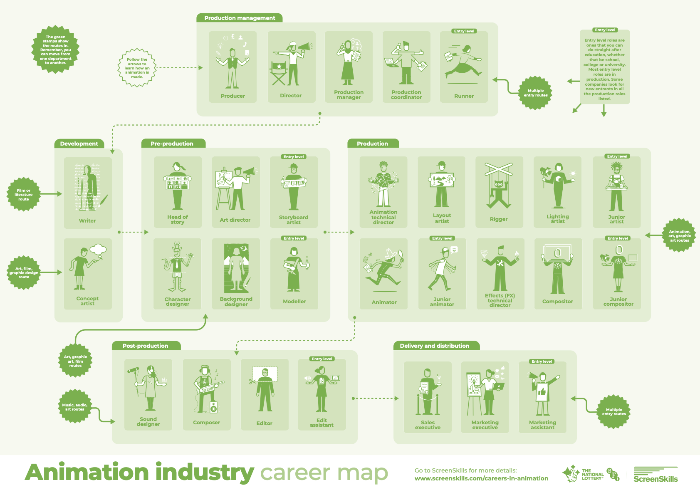

# Pipeline and Technical Direction
Jon Macey

jmacey@bournemouth.ac.uk

---

## Introduction

- This is a new Unit developed specifically for the MSc CAVE
- It aims to build on the ASE unit to develop more technical animation knowledge
- As well as introduce more Python and other technologies.

--

## Aims

> The aim of this unit is to enable the student to define the technological strategy required for an animation project or pipeline by defining and developing the tools and key development procedures required to see a project to completion. This will require the definition, design, implementation and maintenance of an animation pipeline and requisite data transformations.  

--

## Intended learning outcomes (ILOs)

1. critically evaluate and specify the required components of an animation pipeline and associated data. 
2. implement animation, games or VFX pipelines using a variety of digital content creation tools and techniques. 
3. maintain, document and deploy animation tools and pipelines on a specified platform.

--

## Assessment

- This unit is assessed by a project worth 100% of the unit grade.
- Due in 12 noon, Tuesday 24th May 2022
- Brief is on BrightSpace and we will go over it in the Lab session.

---

## Course Overview

- Data and the Structure of DCCs
- Python and Production API's
- Problem Solving / Documentation / DevOps
- Deployment
- GUI's and HCI (PyQt / PySide)
- Databases / SQL
- And much more!

---

# [Roles](https://www.screenskills.com/media/3232/animation-map-web-2019.pdf) 

--

# What is a Pipeline?

- At it's simplest level it can be split into 3 elements
  1. Pre-Production
  2. Production 
  3. Post-Production

- This is similar for most productions such as Full CG, VFX and to some extent games.

--

# Pre-Production

- Script / Story development
- Production design
- Concept Art / Design Bible
- Storyboarding
- Animatics

--

# Pre-Production

- predominantly an artistic role.
- still lots of data
  - can also be physical assets which may need to be digitized.
- This will feed into next production stage and data needs to be accessible to all.

--

# Production 

- This is the main area for pipeline, there are lots of sub elements but a simple taxonomy is as follows
- 3D Layout
- 3D Modeling
- VFX
- Lighting
- Rendering

--

# Production

- Some of the previous elements can be concurrent
  - for example layout can use proxy models until final ones are complete
- Some sub elements within the groups have to be sequential

--

# 3D Modelling

- This can be split into many parts
  - Basic Mesh / Model creation
  - Texturing (including sculpt)
  - UV Layout
  - Rigging
  - Animation
- Lots of data and versions. Needs careful management and control.

---

## References and Links

- https://www.vegascreativesoftware.com/gb/post-production/3d-animation-pipeline-for-efficient-animation-production/

