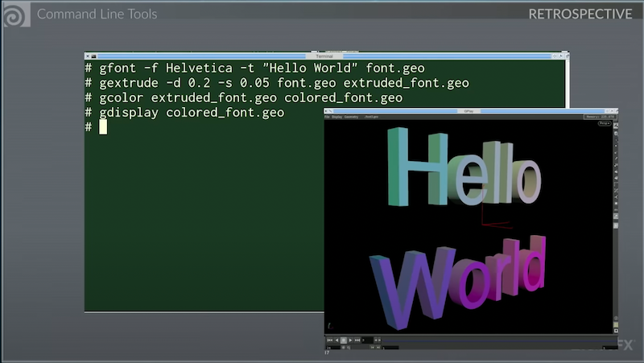
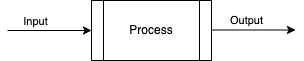

## Pipeline and Technical Direction
## Lecture 2 DCC Data structures
Jon Macey

jmacey@bournemouth.ac.uk

---

## Introduction

- In this lecture we will look at _some_ of the data structures used in DCC tools
- We will determine some of architectural patterns used (Graphs etc)
- We will discuss formats and structure for data

--

# Motivation

- The main reason to look at this is to help us understand how data is formatted so we can process it
- This helps with pipelines and data transfer
- Gives us an understanding of the design / API's of the DCC Tools 
- Will mainly focus on Maya and Houdini (with some mention of other tools)

---

# A DCC as a data filter

- At it's simplest level we could see most DCC tools as a simple Input -> Process -> Output [IPO](https://en.wikipedia.org/wiki/IPO_model) model.
  - These are usually represented as Nodes in a bigger Graph
- A lot of this goes back to the early days of the tools (80's and 90's)

--

# [Before Houdini](https://www.youtube.com/watch?v=2YXwg0n9e7E&t=4s&ab_channel=CppCon)



--

# [Before Houdini](https://www.youtube.com/watch?v=2YXwg0n9e7E&t=4s&ab_channel=CppCon)

- Artist used discrete tools piped into each other
- Makefiles where then use to build pipelines
- Tools like [sed](https://www.gnu.org/software/sed/manual/sed.html) and [awk](https://www.gnu.org/software/gawk/manual/gawk.html) were used to change params per frame
- Most early production pipelines were like this (and under Unix systems)
- These ideas are still prevalent in DCC tools, now just using GUI's instead.

--

# A Procedural Approach


- Nodes are basically procedures
  - Can use encapsulation to hide other procedures
- Attributes are set for the process and usually apply to all inputs
- This allows the data to be processed in a SIMD fashion


---

## A Taxonomy of Parallel Machines

- Earliest parallel machines were developed in the 60's
- In 1966 [Michael Flynn](https://en.wikipedia.org/wiki/Flynn%27s_taxonomy) introduced a taxonomy of computer architectures where by machines are classified based on how many data items they can process concurrently.

--

## Single Instruction, Single Data (SISD)
- A simple sequential machine that executes one instruction at a time.
- Most modern CPU's don't work in this way
  - it is now more common that even micro-controllers have multiple cores.
- Each individual core is still a SISD system. 

--

## Single Instruction, Multiple Data (SIMD)
- A machine in which each instruction is applied on a collection of items (data).
- [Vector processors](https://en.wikipedia.org/wiki/Vector_processor) were the very first machines that followed this paradigm.
- GPU's also follow this design at the level of the [streaming multi-processor](https://en.wikipedia.org/wiki/Stream_processing). 
- nVidia and AMD both use these but with different names (SM vs SIMD)

--

## Multiple Instructions, Single Data (MISD)
- This configuration seems like an oddity.
- How can multiple instructions be applied to the same data item?
- If fault tolerance is required (i.e. military, industrial processing etc.) data is processed and pooled to gain a consensus (majority principle).

--

## Multiple Instructions, Multiple Data (MIMD)
- This is the most versatile machine category.
- Multi-core machines including GPU's follow this paradigm.
- GPU's are made from a collection of SM/SIMD units, whereby each can execute its own program.
- Collectively they act as MIDM machines.

--


## Modern refinements
<image src="images/flyn.png" width=60%>
- The taxonomy has been refined of the years with added sub categories.
- In particular MIMD can be defined with either Shared or Distributed memory

--

## Shared Memory MIMD
- has universally accessible shared memory space.
- This simplifies transactions that need to take place between CPUs with minimum overhead, but is a bottleneck to scalability.
- Some systems partition memory so each CPU has it's own memory and (slower) access to the non-local memory of other CPUs.
- This is know as Non-Uniform Memory Access ([NUMA](https://en.wikipedia.org/wiki/Non-uniform_memory_access))

--

## Distributed Memory MIMD
- sometime know as "shared nothing MIMD" 
- are machines that communicate by exchanging messages.
- such machines scale well but have a high communication cost.

--

## Current Trends
- Increase the on-chip core count.
  - Addition of new SIMD instruction sets ([SSE](https://en.wikipedia.org/wiki/Streaming_SIMD_Extensions), [MMX](https://en.wikipedia.org/wiki/MMX_(instruction_set), [AVE](https://en.wikipedia.org/wiki/Advanced_Vector_Extensions) [AESNI](https://en.wikipedia.org/wiki/AES_instruction_set))
  - Larger caches.
- Combine heterogeneous cores in the same package, typically CPU and GPU ones.
  - optimized for a different type of task. 
  - AMD's APU ([Accelerated Processing Unit](https://en.wikipedia.org/wiki/AMD_Accelerated_Processing_Unit)) chips. 
  - Intel is also offering OpenCL-based computing on its line of CPUs with integrated graphics chips.

---

# Why does this matter

- Making use of SIMD means we need to layout data in particular ways
- Usually we use SOA formats (Structure of Arrays)
- Internally most DCC's use variants of this
  - They will have their own containers to utilise this data format
- Also influences how the API's (C++ / Python) work and interface with the tools
  - See ```MVectorArray``` (Maya) ```UT_Array``` (Houdini) etc

--

# What no stl:: ?

- stl proposed in 1994 added in 1998
  - Most DCC tools predate this so had their own
- Also allows for internal structures to be optimized
- Usually Array types and other containers
- Strings can also be problematic so optimized

--

## Custom Memory allocation

- internally most DCC will manage memory allocation and layout
  - Either using external tools [jemalloc](https://github.com/jemalloc/jemalloc) or [tbb malloc](https://github.com/oneapi-src/oneTBB)
- Will use page allocation to save on copies down trees

--

# COW
- [Copy on Write](https://en.wikipedia.org/wiki/Copy-on-write) used to save memory
  - DCC's can be moving GB's of data around so we try to avoid copy's
- Page allocation helps as we can decide what to copy and what to share
- Obvious overhead in code complexity but save memory
  - Usually transparent to the user


---


## References and Links

- [Mark Elendt CPP Con talk on Houdini](https://www.youtube.com/watch?v=2YXwg0n9e7E&t=4s&ab_channel=CppCon)