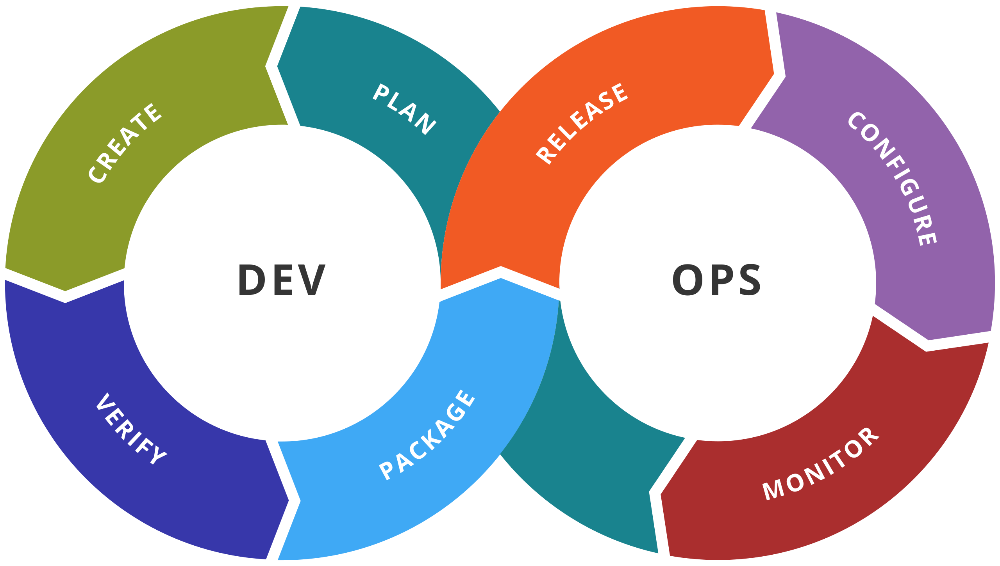

# DEVOPS and Docker
Jon Macey 
jmacey@bournemouth.ac.uk

---

# What is DevOps?

- Development 
  - Programming / delivery / deployment
- Operations
  - People using the product, raising issues
- roles such as development, IT operations, quality engineering and security can co-ordinate to produce a product.

--

## What is DevOps?

>DevOps is a set of practices intended to reduce the time between committing a change to a system and the change being placed into normal production, while ensuring high quality.

[](https://learning.oreilly.com/library/view/devops-a-software/9780134049885/ch01.html#ch01lev1sec1)

## DevOps

- In its broadest meaning, DevOps is a philosophy that promotes better communication and collaboration between teams mentioned previously.
- In its most narrow interpretation, DevOps describes the adoption of iterative software development, automation, and programmable infrastructure deployment and maintenance.
- This 2nd definition is what we will look at today, however it scales to larger systems and ideas well.


--

## DevOps

- DevOps is a number of things combined together (a bit like a pipeline)
- It can include
  - CI (Continuous integration) CD (delivery / deployment) 
  - Configuration Management
  - Cloud / SAAS / Microservices
  - Security

---

## DevOps



--

# Plan

- This stage has two elements :-
  - Define (what is it we are doing)
  - Plan (how to we do it)
- Requirements, timelines, impact  

--

# Create

- This is where we develop the product
  - programming, testing (TDD)
  - Configuration (Hardware / software)
- Could allocate teams for different parts of product

--

# Verify

- Part of the Q/A process and release cycle
  - Acceptance testing
  - Regression testing
- Can check performance (has it go slower?)
- Make sure there is an upgrade path for configuration if needed


--

# Packaging

- This is what happens once the software is verified
  - A pre-step to the release (could be part of a beta cycle)
- May release to get approval from users
- Daily Builds?

--

# Release

- Release to users / customers
- May involve marketing if paid product etc
- Is it an LTS?
- Fallbacks and recovery may be needed.

--

# Configure

- Part of the operations part of the DevOps cycle
  - Usually part of setup and install
  - Especially if big SAAS / Microservice type system
- Could include cloud servers etc

--

# Monitor

> It allows IT organization to identify specific issues of specific releases and to understand the impact on end-users

- Telemetry may be used (or user can opt out)
- with in house easier to monitor

---

# Virtualization

- Virtualization was first introduced in the 1960 ("pseudo machine") 
- Used to create a simulated computer 
  - Will give a performance penalty 
- Hardware virtualization will allow full OS to run
- This requires a [Hypervisor](https://en.wikipedia.org/wiki/Hypervisor)

--

# OS level virtualization

- This allows the kernel on a host OS to create a new isolated user space os instance
  - These are usually called containers (Docker now seems to be the ubiquitous name for this)
- This can also be used to refer to full Virtual machines (Hyper V) which sometimes causes confusion
- Containers virtualize the OS not the Hardware


--

## The cloud

- Containers may be used on the cloud or local machines
  - AWS / Microsoft Azure
- Most of these wrap up some level of container with extra infrastructure
- Management can be hard and cost expensive.


---

# What is Docker?

- Docker is a tool to help automate the generation of running of OS level Virtual Machines
- It works by building up layers of OS software on a virtual disk
- We can then add our own tools / software to this and run it
- Gives us a stable and repeatable platform (Thanks to the Dockerfile)

--

# Docker Layers

- Docker builds in layers, where each layer adds to the previous
- Each one is an image and may be cached from other containers
- Each layer stores the changes compared to the image it’s based on.
- Each instruction in a Dockerfile results in a layer

---

# Getting Started

- In our first example we are going to build a simple python container
- We will then copy across a python file which we can run
- We will also use a Docker file to build are basic system.

--

## Dockerfile

```bash
FROM python:latest

# setup working dir
WORKDIR /tmp
COPY . .

CMD ["python","./hello.py"]
```

```python
#!/usr/bin/env python
import os
import sys

print(f"{sys.version}")
print(os.uname())
```

--

# Build and Run

```
docker build -t pythontest .
docker run pythontest

3.10.2 (main, Mar  2 2022, 03:29:23) [GCC 10.2.1 20210110]
posix.uname_result(sysname='Linux', nodename='9e8f89239e52', release='3.10.0-1062.18.1.el7.x86_64', version='#1 SMP Wed Feb 12 14:08:31 UTC 2020', machine='x86_64')

```
 - we can also login and use a shell

```
 docker run -it pythontest bash
```

--

## [Some useful commands](https://docs.docker.com/engine/reference/commandline/cli/)

- show all the images on the current system
- 
```
docker images
REPOSITORY   TAG       IMAGE ID       CREATED         SIZE
pythontest   latest    6ea69a2b35bb   2 minutes ago   917MB
python       latest    85d2ece591c7   5 days ago      917MB
ubuntu       latest    54c9d81cbb44   4 weeks ago     72.8MB
centos       latest    5d0da3dc9764   5 months ago    231MB

```

--

## Docker ps

- show running containers
```
docker ps
CONTAINER ID   IMAGE     COMMAND     CREATED         STATUS         PORTS     NAMES
5da0ac0ac4c0   python    "python3"   4 seconds ago   Up 3 seconds             eager_mclaren
```

--

## removing images

```
docker images
REPOSITORY   TAG       IMAGE ID       CREATED          SIZE
pythontest   latest    6ea69a2b35bb   10 minutes ago   917MB
python       latest    85d2ece591c7   5 days ago       917MB
ubuntu       latest    54c9d81cbb44   4 weeks ago      72.8MB
centos       latest    5d0da3dc9764   5 months ago     231MB
[jmacey@w11901:PythonExample$]docker rmi 6ea69a2b35bb
Error response from daemon: conflict: unable to delete 6ea69a2b35bb (must be forced) - image is being used by stopped container 9e8f89239e52
[jmacey@w11901:PythonExample$]docker rmi -f 6ea69a2b35bb
Untagged: pythontest:latest
Deleted: sha256:6ea69a2b35bb2704c5bf3403143527d7d7cdbd9ac5b1a643fe21fd14f911027d
Deleted: sha256:4de03d6d03a5516f85bc2e1eebde6fed0163bd9a4f69020c7f245f9ee4abbf4b
Deleted: sha256:1fb8e72cd41ef7e812593b682cfa207300cb91c6b7e6e5e0fdd10fadfd8ba1e4
```

--

## Mounting local file-system

- We can use the ```--volume``` flag to mount a local directory
- We must ensure that a full path is passed 
- Changes to the files in the folders work both ways so good for testing development environments

--

## Is that all

- This is just a basic example of what docker can do 
  - lots of examples on hubs.docker.com (needs sign in)
- Useful for many tools and CI / CD platforms
- Great for sandbox web development
- Great for testing new versions.
- is possible to do GUI / X11 but needs same drivers as host 


---

## References

https://searchitoperations.techtarget.com/definition/DevOps
https://learning.oreilly.com/library/view/devops-a-software/9780134049885/
https://en.wikipedia.org/wiki/DevOps_toolchain


