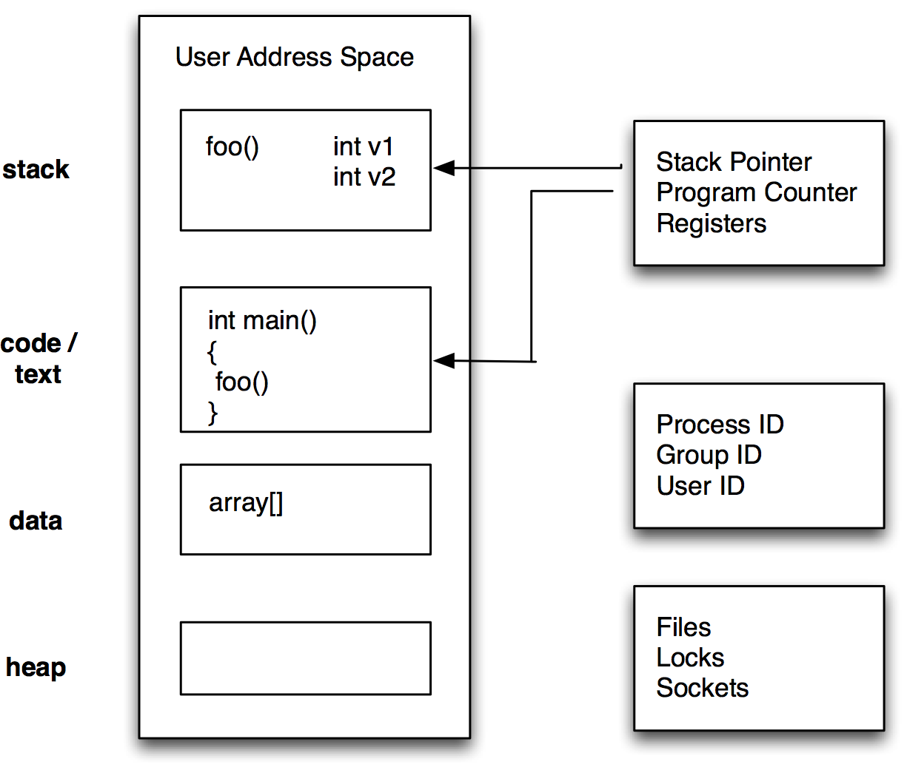
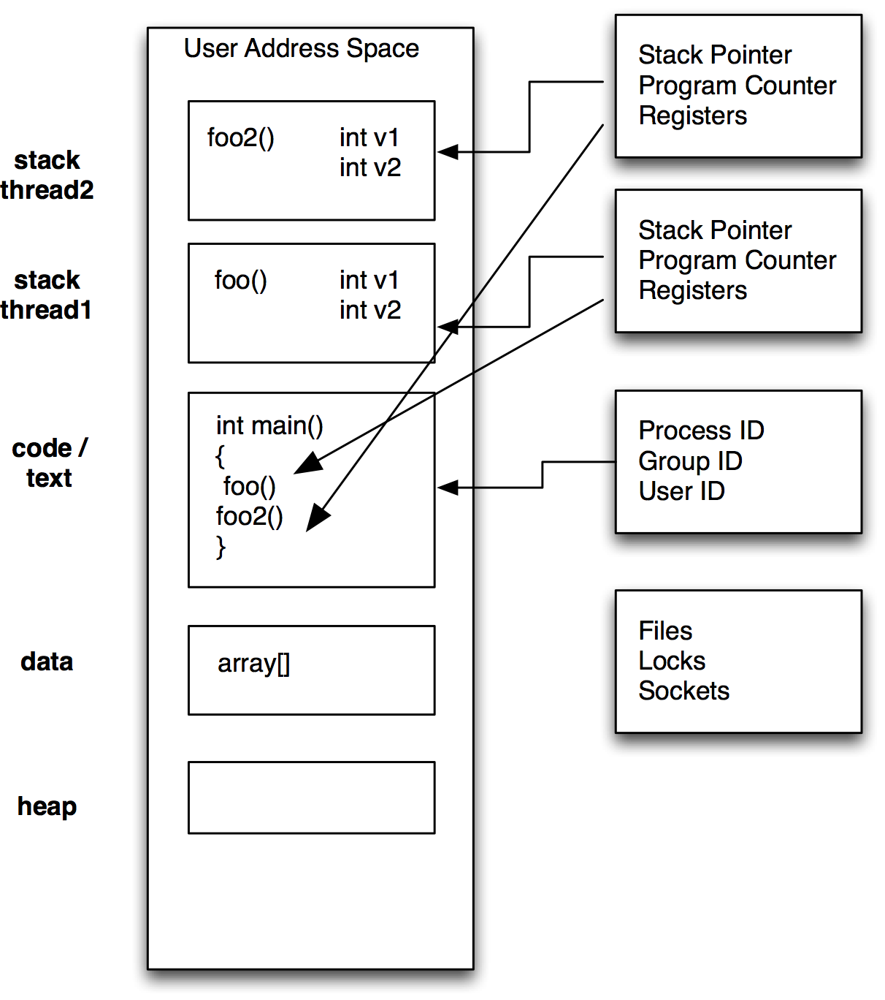

## Introduction to Threading
### Part 1 concepts, pthreads, c++11 and Qt

Jon Macey

jmacey@bournemouth.ac.uk

---

## Why Parallel Computing?
- Simply adding processors will not magically improve performance.
  - so far most of the programs we have written have been serial
  - even when using frameworks like Qt, we only have two processes (Our App and the GUI)
- Most of the time we have many cores in our CPU doing nothing!

--

## Introduction

- Concurrent execution of multiple programs has been around since 1960's [CTSS](https://en.wikipedia.org/wiki/Compatible_Time-Sharing_System)
- This was done by interrupting execution of one program and giving the CPU to another.
- This is triggered by
	- Regular Hardware interrupts generated by the clock
	- Irregular interrupts (e.g. hardware needing attention)
	- A call to the OS (e.g. a request to perform I/O)

--

## [Concurrency vs. parallelism](https://accu.org/journals/overload/28/159/teodorescu/)

- Parallelism is about running multiple things in parallel
- concurrency is about ensuring that multiple things __can__ run in parallel (or, more correctly, at the same time)
- Having two threads doesn’t imply parallelism, but it implies concurrency.


--

## Time Sharing

- Time sharing allows for efficient use of computational resources but it cannot speed things up for each individual process.
- Time sharing can actually slow down a program as it limits the CPU time the program can use (OS dispatcher dictates this)

--

## What is a thread?

- A thread is an independent stream of instructions scheduled by the operating system to be executed
- It may be easier to think of this as a procedure that run independently from the main program
- This is tied in closely to the Unix process model and in most operating systems this is fairly similar

--

## What is a thread?

- A more precise definition is
> "that it is an execution path, a sequence of instructions, that is managed separately by the operating system scheduler as a unit. 

- There can be multiple threads per unit.

--

## What are Threads good for?

- **Improved performance** breaks up load, places them on multiple cores.
- **Background tasks** Interactive tasks can use threads to allow things to process whilst main task is being executed (GUI / Qt)
- **Asynchronous processing** Sending a request to a server over a network produces latency, threads can be used to wait thus freeing CPU for other tasks.
- **Improving program structure** Games are a good example, we have different tasks that require different times. AI, Render Update Sound etc.

--

## Design for threading

- This is achievable by following a relatively simple set of rules:
  - we break the algorithm into a set of tasks (independent unit of work)
  - we add constraints between tasks, modelling dependencies and possible race conditions
  - we use a dynamic execution strategy for tasks; one worker thread per core
  - we ensure that the algorithm is decomposed in enough tasks at every given point in time


---

## Unix Processes

- A process is created by the operating system and copies a large amount of the environment when it is created
- It will be allocated ID’s as well as it’s own registers heap etc
- We can create a simple version of this using the C ```fork()``` routine

--



---

##  [fork](http://man7.org/linux/man-pages/man2/fork.2.html)
- The ```fork()``` function shall create a new process. 
- The new process (child process) shall be an exact copy of the calling process (parent process) except
  - It will have it’s own id’s and environment
  - it’s own copy of any file descriptors
  - locks are not inherited
- more information can be found in the man pages 

--

## [fork.cpp](https://github.com/NCCA/Threads/blob/master/fork/fork.cpp)

<pre><code data-sample='code/lecturecode.cpp#fork1'></code></pre>


--

##  [fork](http://man7.org/linux/man-pages/man2/fork.2.html)
- The typical usage for fork is writing [unix daemons](http://tinyurl.com/8r9t7ru), these are programs that start and detach from the parent console (becomes a background process)
- After the fork we create an infinite loop which will do the daemon processing
- It is important that the [sleep](https://www.gnu.org/software/libc/manual/html_node/Sleeping.html) command is called else we may thrash the OS

--

## [deamon.cpp](https://github.com/NCCA/Threads/blob/master/fork/daemon.cpp)

<pre><code data-sample='code/lecturecode.cpp#deamon'></code></pre>


--

## Python Version

```python
#!/usr/bin/env python
import os
import sys
import time


def daemonInit():
    # note use of := to assign value of fork to pid
    # https://docs.python.org/3/whatsnew/3.8.html#assignment-expressions
    if (pid := os.fork()) < 0:
        return -1
    elif pid != 0:
        sys.exit(os.EX_OK)
    try:
        os.setsid()
    except PermissionError:
        print("pererror")
        pass
    return 0


if __name__ == "__main__":
    daemonInit()
    while True:
        print(f"ping {os.getpid()}")
        time.sleep(4)

```

---


## Threads

- Threads live in the same process resources as the normal unix model
- However they are scheduled by the operating system to run in their own space as they have their own
  - Stack pointer
  - Registers
  - Scheduling properties
  - Set of pending and blocked signals
  - Thread specific data.

--



--

## Terminology

- Resource : usually memory (variables etc) but anything the program can access
- [Critical Section](https://en.wikipedia.org/wiki/Critical_section) : code that accesses a shared resource
- [Semaphore](http://tinyurl.com/ckvbupf) : controls access to a shared resource
- Condition : a construct used to synthesise access to a resource 
- [Mutex](https://en.wikipedia.org/wiki/Mutual_exclusion) : Mutual Exclusion (semaphores and Conditions are both examples of these)

--

## Mutex

- Short for Mutual Exclusion
- Only one thread can lock (own) a mutex at one time.
- This means critical sections can be locked so only one thread can access at any one time
- This is good for accessing data that is critical to the processing of the thread

--

## Mutex

- Typical process is :
  - create a mutex
  - many threads may try to access
  - only one succeeds and then performs an action
  - once done thread unlocks so others may access
  - repeat (with different threads)
- Two approaches, either thread not accessing blocks until free or can try and not block

--

## Condition Variables

- Used to wait on a condition (for example a thread to finish)
- We use a condition variable in conjunction with a mutex and a predicate (bool) to see if we can access the resource
- We then wait on the condition variable until it is set then access the resource.
- It is a signalling type approach to accessing the data.

---

## [pthreads](https://en.wikipedia.org/wiki/POSIX_Threads)

- Short for “POSIX” threads, the standard unix library for multi-threading under unix style operating systems
- A C library with wrappers to other languages
- Is a standard IEEE POSIX 1003.1c standard (1995).
- Most OS have an implementation of PThreads (can be a wrapper around own code)
- Many higher level API’s also use pthreads below a managed layer

--

## pthreads

- pthreads is quite an old library and there are now better managed layers to use above pthreads for unix systems and windows threads
- c++ 11 introduced threads to the language and new threading and co-routines elements are being added all the time
- most developers will use these or [TBB](https://github.com/oneapi-src/oneTBB) or [OpenMP](https://www.openmp.org/) 

--

## pthread functions

- Can be split into three main areas
  - creating, joining and destroying threads
  - mutexes (locking and un-locking access)
  - conditional variables

--

## [pthread1.cpp](https://github.com/NCCA/Threads/blob/master/pthread/pthread1.cpp)
<pre><code data-sample='code/lecturecode.cpp#pthread1'></code></pre>

- need to use the -lpthread flag when compiling on some systems

--

## [pthread_create](http://man7.org/linux/man-pages/man3/pthread_create.3.html)

```
#include <pthread.h>

int pthread_create(pthread_t *thread, 
                  const pthread_attr_t *attr,
                  void *(*start_routine) (void *), 
                  void *arg);
```

- ```thread``` is the id of the thread created
- ```attr``` is a list of attributes (0 = default)
- ```start_routine``` : the function to run
- ```arg``` the arguments to the function

--

## attributes

- To set attributes for the thread the ```pthread_attr_init``` function is called
- This allows you to set the way the thread may be joined
- The initial state such as stack size etc
- For most cases the default version can be used

--

## thread function

- The thread function is in the form

```
void *function(void *)
```

- We can pass arguments to the function using a structure and re-cast it within the thread function (examples later)

--

## pthread_join

- The ```pthread_join()``` function suspends execution of the calling thread until the target thread terminates.
- If successful, the ```pthread_join()``` function returns zero
- otherwise error values are returned.

--

## ```std::cout```

- ```std::cout``` is not thread safe (as we will see in the next example)
- ```printf``` behaves better but is also not guaranteed to be safe.
- We may need to use other thread safe logging libs to make it work properly
- I will use ```printf``` for now as it makes it clearer what is happening in the examples

--

## [pthread2.cpp](https://github.com/NCCA/Threads/blob/master/pthread/pthread2.cpp)
<pre><code data-sample='code/lecturecode.cpp#pthread2'></code></pre>

--

## [pthread3.cpp](https://github.com/NCCA/Threads/blob/master/pthread/pthread3.cpp)
<pre><code data-sample='code/lecturecode.cpp#pthread3'></code></pre>

--

## [pthread4.cpp](https://github.com/NCCA/Threads/blob/master/pthread/pthread4.cpp)
<pre><code data-sample='code/lecturecode.cpp#pthread4'></code></pre>

---

## [Race Conditions](https://en.wikipedia.org/wiki/Race_condition)

- Race conditions or Race Hazards are when two threads are tying to access the same resource at the same time
- The following example has a single shared memory block with three threads trying to access the same data
- This produces a race hazard

--

## [racehazard.cpp](https://github.com/NCCA/Threads/blob/master/pthread/racehazard.cpp)
<pre><code data-sample='code/lecturecode.cpp#racehazard1'></code></pre>

--

## pthread_mutex_t

- mutex are created using the data type ```pthread_mutex_t```
- To create a mutex we use ```pthread_mutex_init``` passing in the mutex and any attributes needed for the creation
- We then use the lock and unlock functions to use the mutex in the code.
- The following example show this (but is still flawed)

--

## [A note on locks](https://accu.org/journals/overload/28/157/teodorescu_2795/)

- By design, mutexes block threads from executing certain regions of code
  - by design, they limit the throughput of the application
  - by design, they are bottlenecks
- If we can we need to reduce locks (lock free programming) better still not use them at all

--

## [mutex1.cpp](https://github.com/NCCA/Threads/blob/master/pthread/mutex1.cpp)

<pre><code data-sample='code/lecturecode.cpp#mutex1'></code></pre>

--


## Problems

- As you can see whilst the data is now being filled in one go the program still has problems
- The threads do not wait for each other and the sequence is out of order
- We need to use conditional waits to make this work correctly.

--

## ```pthread_cond_t```

- This type is used for the conditional wait signals
- It works in a similar way to the mutex values, first we initialize the variable then call
- ```pthread_cond_wait``` with the conditional variable as well as a locked mutex
- The thread will then wait until the condition is met, we must also signal to say we are done

--

## [conwait.cpp](https://github.com/NCCA/Threads/blob/master/pthread/conwait.cpp)

<pre><code data-sample='code/lecturecode.cpp#conwait'></code></pre>

--

## Problems

- As you can see there are still problems with this, whilst the program locks and fills correctly we still have some synchronization issues.
- The way to overcome this is using two signals
- They will all be blocked by default then we will unblock one to allow the system to start
- Then filler and consumer will show when they are ready

--

## [conwait2.cpp](https://github.com/NCCA/Threads/blob/master/pthread/conwait2.cpp)

<pre><code data-sample='code/lecturecode.cpp#conwait2'></code></pre>

---

## c++ 11 threads

- [Concurrency support library
](https://en.cppreference.com/w/cpp/thread) 
- C++ 11  has native, cross platform  threading support
- No longer need to use pthreads directly and will use platform threads as required

--

## [std::thread](https://en.cppreference.com/w/cpp/thread/thread)


```c++
#include <thread>
#include <iostream>

void threadFunc()
{
	std::cout << "ID " << std::this_thread::get_id() << '\n';
}

int main()
{
	std::cout << "Parent " << std::this_thread::get_id() << '\n';
	std::thread t1(threadFunc);
	t1.join();
}
```

--

## Thread id’s

- Each thread has an id so we can tell them apart
- We can call the std::this_thread::get_id() to get the id
- As with most C++ 11 we can also use auto for ease as shown in the following example

--

## Logging

- std::cout can be problematic so I have developed a simple header only logger 

```c++
#ifndef LOGGER_H_
#define LOGGER_H_
#include <iostream>
#include <string_view>
#include <iomanip>
#include <mutex>
#include <chrono>

void cleanConsole();

class Logger
{
public:
  static void debug(std::string_view _str, bool _newline = true)
  {
    message(BLUE, "Debug", _str, _newline);
  }
  static void info(std::string_view _str, bool _newline = true)
  {
    message(GREEN, "Info", _str, _newline);
  }
  static void warning(std::string_view _str, bool _newline = true)
  {
    message(YELLOW, "Warning", _str, _newline);
  }

  static void error(std::string_view _str, bool _newline = true)
  {
    message(RED, "Error", _str, _newline);
  }
  static void critical(std::string_view _str, bool _newline = true)
  {
    message(RED, "Critical", _str, _newline);
  }
  static constexpr std::string_view RED = "\x1B[31m";
  static constexpr std::string_view GREEN = "\x1B[32m";
  static constexpr std::string_view YELLOW = "\x1B[33m";
  static constexpr std::string_view BLUE = "\x1B[34m";
  static constexpr std::string_view MAGENTA = "\x1B[35m";
  static constexpr std::string_view CYAN = "\x1B[36m";
  static constexpr std::string_view WHITE = "\x1B[37m";
  static constexpr std::string_view RESET = "\033[0m";

private:
  inline static std::mutex s_printMutex;
  inline static bool s_displayTime = true;
  // use atexit to clean up, this will ensure the consloe colours are reset
  // basically I'm using a static init to ensure the function is registered
  struct exitProc
  {
    exitProc() { std::atexit(cleanConsole); }
  };
  // this will be called at instantiation just to regester the at exit
  // function
  inline static exitProc s_cleanup = exitProc();

  static void
  message(std::string_view _colour, std::string_view _level, std::string_view _str, bool _newLine)
  {
    const std::lock_guard<std::mutex> lock(s_printMutex);
    auto tm = std::chrono::system_clock::to_time_t(std::chrono::system_clock::now());
    std::cout << _colour << std::put_time(std::localtime(&tm), "[%I:%M%p]") << ' ' << _level << ' ' << _str << (_newLine ? '\n' : ' ');
  }
};

void cleanConsole()
{
  std::cout << Logger::RESET << '\n';
}

#endif
```

--

## [std::mutex](https://en.cppreference.com/w/cpp/thread/mutex) / [std::lock_guard](https://en.cppreference.com/w/cpp/thread/lock_guard)

- to stop different functions calling cout at the same time the logger locks a shared mutex.
- std::lock_guard uses RAII to ensure the lock is released once finished

```
const std::lock_guard<std::mutex> lock(s_printMutex);
```

--

## Threading Functions

- We can use [std::bind](http://en.cppreference.com/w/cpp/utility/functional/bind) to bind functions to threads
- Note the use of [std::mem_fun](http://en.cppreference.com/w/cpp/utility/functional/mem_fn) to bind the join method.

```c++
#include <thread>
#include <iostream>
#include <vector>
#include <cstdlib>
#include <string>
#include <algorithm>
#include <chrono>
#include <functional>
#include <fmt/format.h>
#include <fmt/ostream.h>

#include "Logger.h"

void threadFunc(const std::string &a, const std::string &b)
{
  while (true)
  {

    Logger::info(fmt::format("threadFunc(str,str) ID {} value {}  {}", std::this_thread::get_id(), a, b));
    std::this_thread::sleep_for(std::chrono::seconds(2));
  }
}
void threadFunc(int a)
{
  while (true)
  {
    Logger::warning(fmt::format("threadFunc(int) ID {} value {} \n", std::this_thread::get_id(), a));
    std::this_thread::sleep_for(std::chrono::seconds(3));
  }
}

void threadFunc(double a)
{
  while (true)
  {

    Logger::error(fmt::format("threadFunc(double) ID {} value {} ", std::this_thread::get_id(), a));
    std::this_thread::sleep_for(std::chrono::seconds(6));
  }
}

int main()
{
  std::vector<std::thread> threads;
  threads.reserve(4);

  auto funca = std::bind<void(int)>(threadFunc, 1);
  threads.emplace_back(funca);

  auto funcb = std::bind<void(double)>(threadFunc, 0.002);
  threads.emplace_back(funcb);

  std::string a = "hello";
  std::string b = " c++ 11 threads";
  auto funcs = std::bind<void(const std::string &, const std::string &)>(threadFunc, a, b);
  threads.emplace_back(funcs);

  using namespace std::placeholders; // for _1, _2, _3...
  auto funcs2 = std::bind<void(const std::string &, const std::string &)>(threadFunc, _1, _2);
  threads.emplace_back(funcs2, "placeholders", "are cool");
  std::for_each(std::begin(threads), std::end(threads), std::mem_fn(&std::thread::join));
  return EXIT_SUCCESS;
}
```

--

## thread.detatch()

- join() waits for the thread to end, if we use detach main will continue running, however when main ends so do the threads

```c++
#include <iostream>
#include <thread>
#include <cstdlib>
#include "Logger.h"
#include <vector>
#include <fmt/format.h>
#include <fmt/ostream.h>

void func()
{
  while (true)
  {
    Logger::info("Thread function");
    std::this_thread::sleep_for(std::chrono::seconds(1));
  }
}

int main()
{
  std::thread t(func);
  t.detach();
  while (true)
  {
    Logger::warning("In Main");
    std::this_thread::sleep_for(std::chrono::seconds(2));
  }

  return EXIT_SUCCESS;
}
```

--

## [std::future](https://en.cppreference.com/w/cpp/thread/future)

- The class template std::future provides a mechanism to access the result of asynchronous operations
- We can use them to retrieve or set values from one thread to another
- Useful to create stoppable tasks
- Can be forced to wait for timeout or when work is ready
- The following example show this in action

--

## [std::future::wait_for](https://en.cppreference.com/w/cpp/thread/future/wait_for)

```c++
#include <thread>
#include <iostream>
#include <assert.h>
#include <chrono>
#include <future>
#include "Logger.h"

void threadFunction(std::future<void> futureObj)
{
  Logger::info("Thread Start");
  // check every so often for the exit signal
  while (futureObj.wait_for(std::chrono::milliseconds(1)) == std::future_status::timeout)
  {
    Logger::warning("Thread Working");
    std::this_thread::sleep_for(std::chrono::seconds(1));
  }
  Logger::critical("Thread End");
}
int main()
{
  // Create a std::promise to signal our exit
  std::promise<void> exitSignal;
  // grab the future and pass to thread when starting
  std::future<void> futureObj = exitSignal.get_future();
  //
  std::thread t(&threadFunction, std::move(futureObj));

  Logger::info("Press enter to stop");
  std::getchar();
  // Set the value in promise
  exitSignal.set_value();
  // we can join or detach here to release the thread
  // if we don't we get an abort
  t.detach();

  // Wait for thread to join
  Logger::info("Exiting Main Function");
  return EXIT_SUCCESS;
}
```


---

## Threading classes

```c++
#include <thread>
#include <iostream>
#include <vector>
#include <memory>
#include <cstdlib>
#include <string>
#include <functional>
#include <fmt/format.h>
#include <fmt/ostream.h>

#include "Logger.h"

class Task
{
public:
  Task(int id) : m_id(id) {}
  void task(const std::string &a, const std::string &b)
  {
    while (true)
    {
      Logger::info(fmt::format("task(str,str) {} ID {} value {} {}", m_id, std::this_thread::get_id(), a, b));
    }
  }
  void task(int a)
  {
    while (true)
    {
      Logger::warning(fmt::format("task(int) {} ID {} value {}", m_id, std::this_thread::get_id(), a));
    }
  }
  void task(double a)
  {
    while (true)
    {
      Logger::error(fmt::format("task(double) {} ID {} value {}", m_id, std::this_thread::get_id(), a));
    }
  }

private:
  int m_id;
};

int main()
{
  std::vector<std::thread> threads;
  threads.reserve(6);
  std::shared_ptr<Task> pTask(new Task(10));
  Task b(20);

  auto funca = std::bind(static_cast<void (Task::*)(int)>(&Task::task), b, 2);
  threads.emplace_back(funca);

  auto funcb = std::bind(static_cast<void (Task::*)(int)>(&Task::task), pTask.get(), 99);
  threads.emplace_back(funcb);

  auto funcc = std::bind(static_cast<void (Task::*)(double)>(&Task::task), b, 2.23);
  threads.emplace_back(funcc);

  auto funcd = std::bind(static_cast<void (Task::*)(double)>(&Task::task), pTask, 9.9);
  threads.emplace_back(funcd);

  std::string sa = "hello";
  std::string sb = " c++ 11 threads";
  auto funce = std::bind(static_cast<void (Task::*)(const std::string &, const std::string &)>(&Task::task), b, sa, sb);
  threads.emplace_back(funce);
  auto funcf = std::bind(static_cast<void (Task::*)(const std::string &, const std::string &)>(&Task::task), pTask.get(), sa, sb);
  threads.emplace_back(funcf);

  std::for_each(std::begin(threads), std::end(threads), std::mem_fn(&std::thread::join));

  return EXIT_SUCCESS;
}
```

--

## Threading classes

- We can also overload the function call operator and use this as the thread function
- This is sometimes easier to implement if we need a simple call for a class
- This is more difficult if we need arguments and the previous bind method is easier to implement.

--

## overload ()

```c++
#include <thread>
#include <iostream>
#include <cstdlib>
#include "Logger.h"
#include <fmt/format.h>

class Task
{
public:
  Task() { m_id = 99; }
  Task(int _t) : m_id(_t) { ; }

  void operator()() const
  {
    Logger::info(fmt::format("class operator called {} ", m_id));
  }

private:
  int m_id;
};

int main()
{
  Task t;
  unsigned long const nThreads = std::thread::hardware_concurrency();
  std::cout << "num threads " << nThreads << "\n";
  std::thread thread((Task(2)));
  thread.join();

  return EXIT_SUCCESS;
}

```

---

## Threading in Qt

- Qt threads wrap up the native API into a consistent threading model
- Under Linux Operating systems it will use pthreads
- Under windows it will use the native win32 threads
- Other OS will vary depending upon native thread model.
- Signals and slots are used for interprocess communication in this model so all inherit from QOBJECT

--

## [QThread](http://doc.qt.io/qt-5/qthread.html)

- We inherit from the ```QThread``` class and must implement the run method
- Then, create an instance of the thread object and call ```QThread::start()```. 

- Note that you must create the ```QApplication``` (or ```QCoreApplication```) object before you can create a ```QThread```.

- The function will return immediately and the main thread will continue. 
- The code that appears in the ```run()``` reimplementation will then be executed in a separate thread.

--

## [QThread](https://github.com/NCCA/Threads/tree/master/QtThread)

<pre><code data-sample='code/lecturecode.cpp#qthread1'></code></pre>

--

## [QThread](https://github.com/NCCA/Threads/tree/master/QtThread)

<pre><code data-sample='code/lecturecode.cpp#qthread2'></code></pre>


--

## [QThread](https://github.com/NCCA/Threads/tree/master/QtThread)

<pre><code data-sample='code/lecturecode.cpp#qthread3'></code></pre>


--

## Synchronizing Threads

- Qt provides the following synch methods
- [QMutex](http://doc.qt.io/qt-5/qmutex.html), [QReadWriteLock](http://doc.qt.io/qt-5/qreadwritelock.html), [QSemaphore](http://doc.qt.io/qt-5/qsemaphore.html), and [QWaitCondition](http://doc.qt.io/qt-5/qwaitcondition.html) 
- Each class has a subtly different approach to synchronization

--

## [QMutex](http://doc.qt.io/qt-5/qmutex.html)

- QMutex provides a mutually exclusive lock, or mutex
- At most one thread can hold the mutex at any time
- If a thread tries to acquire the mutex while the mutex is already locked, the thread will be put to sleep until the thread that currently holds the mutex unlocks it

--

## [QReadWriteLock](http://doc.qt.io/qt-5/qreadwritelock.html)

- QReadWriteLock is similar to QMutex, except that it distinguishes between "read" and "write" access to shared data and allows multiple readers to access the data simultaneously
- Using QReadWriteLock instead of QMutex when it is possible can make multithreaded programs more concurrent

--

## [QSemaphore](http://doc.qt.io/qt-5/qsemaphore.html)

- QSemaphore is a generalization of QMutex that protects a certain number of identical resources
- In contrast, a mutex protects exactly one resource

--

## [QWaitCondition](http://doc.qt.io/qt-5/qwaitcondition.html) 

- QWaitCondition allows a thread to wake up other threads when some condition has been met
- One or many threads can block waiting for a QWaitCondition to set a condition with wakeOne() or wakeAll()
- Use wakeOne() to wake one randomly selected event or wakeAll() to wake them all


---

## References

- Gerassimos Barlas. 2014. Multicore and GPU Programming: An Integrated Approach. Morgan Kaufmann Publishers Inc., San Francisco, CA, USA.

- Peter Pacheco. 2011. An Introduction to Parallel Programming (1st ed.). Morgan Kaufmann Publishers Inc., San Francisco, CA, USA.
- https://bartoszmilewski.com/2014/02/26/c17-i-see-a-monad-in-your-future/

--

## References


- https://accu.org/journals/overload/28/159/teodorescu/
- https://accu.org/journals/overload/28/157/teodorescu_2795/
- https://accu.org/journals/overload/28/158/teodorescu/