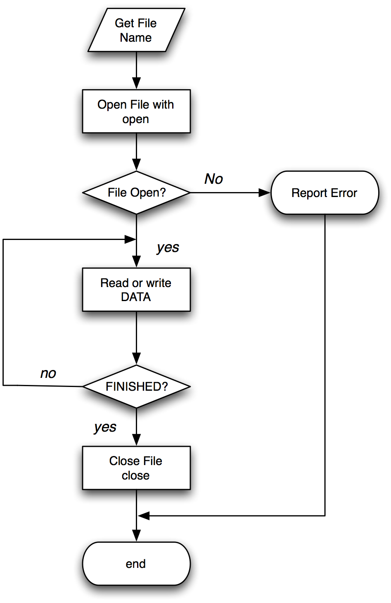

# Lecture 3
## File, Commandline arguments
## Object Orientation and more!

<p/>Jon Macey <br/>

<p/>jmacey@bournemouth.ac.uk

---

# Outline 

- We are going to look at how to read and write files today as well as how to generate stand alone programs
- By the end of the lecture we should have a good understanding of the concepts of
  - stream based file I/O
  - Command Line Arguments
  - Stand Alone programs
  - Simple Classes

---

## Making executables

- Under mac and linux we can make the python script runnable using [chmod](https://www.gnu.org/software/coreutils/manual/html_node/chmod-invocation.html#chmod-invocation)

```
chmod +x myscript.py
```

- we also need to tell the shell which interpreter to use.

```
#!/usr/bin/python
```

- This is know as a "Shebang" or "hash bang"

--

## [#!](https://en.wikipedia.org/wiki/Shebang_%28Unix%29)

- This is the first line of the script and informs the shell which interpreter to use.
- There are a few variants, but we usually use either

```
#!/usr/bin/env python
```

or 

```
#!/usr/bin/python
```

- If you have several versions of Python installed ```/usr/bin/env``` will ensure the interpreter used is the first one on your environment ```$PATH```

--

## Windows

- Under windows the situation is a little different
- Usually to run a python script we need to invoke it using the python.exe command

```
python myScript.py
python.exe myScipt.py
```

- It is possible to generate python executables under windows however this requires 3rd party tools such as [pyinstaler](http://www.pyinstaller.org/) which also work under linux and mac.

---

## Environment Variables
- Environment variables are global system variables available to all processes (i.e. programs)
- Most operating systems have a number of default values set which programs can query to set the way things operate.
- Users can also se their own environment variables to customise how things work.
- It is not uncommon for software packages to install their own environment variables when the program is installed.

--

## Environment Variables
- The PATH environment variable allows us to set a directory where the OS will look for scripts and programs
- We can add a local directory to our system which contains user scripts which can be executed by the user
- The configuration is different for both Windows and Unix

--

## Unix Environment variables

- The default shell used in the linux studios is the bash shell (Bourne again Shell)
- To set environment variable in this shell we use a file called .bashrc which is hidden in the home directory
- if you type ```code ~/.bashrc``` you can access it 

```bash
export PATH=$PATH:$HOME/scripts
```
- if you re-open the shell this will be made permanent
- Now any program placed in this directory may be found and executed

--

## The [os](https://docs.python.org/3/library/os.html) module
 
- The ```import os```  module provides a portable way of using operating system dependent functionality
- This includes opening files, accessing and manipulating paths

```python
#!/usr/bin/env python

from __future__ import print_function
import os

for (var,value) in os.environ.items() :
  print('Key {} : Value {}'.format(var,value))
```

--

## [PYTHONPATH](https://docs.python.org/3/using/cmdline.html?highlight=pythonpath#environment-variables)

- Python uses a number of environment variables to help it work
- PYTHONPATH is used to set the default search directories for python modules
  - this is where the ```import``` statement searches
- We can add to this in a number of ways


```python
#!/usr/bin/env python
from __future__ import print_function
import sys,os

print(sys.path)

sys.path.append('c:\\')

print(sys.path)

```

--

## Modules and packages

- A module is a single .py file with Python code
- A package is a directory that can contains multiple Python modules
- there are different ways of loading in modules as show in the next examples each does the same thing.

--

## Modules and packages

```python
import random
random.randint(0,10)
```


```python
from random import randint
randint(0,10)
```

```python
from random import *
randint(0,10)
```

```python
from random import randint as ri
ri(0,10)
```

--

## [Modules and packages](https://docs.python.org/3/reference/simple_stmts.html#the-import-statement)

- ```from module import *``` is generally frowned upon as it imports everything into the current namespace
- ```import math``` for example will import all the math module code into the module but will need to be prefixed with math
- If this becomes problematic import the elements that are needed.
```python
from math import pi,cos,sin
cos(2*pi)+sin(2*pi)
```


--

## The main function

- The main function is a special function for most programming languages 
- It is the first function to be executed and is the entry point for most programs
- The main function is usually passed a set of global system variables called arguments
- These are available through the life of the program and are a good way of passing values to a program

--

## Python main


``` python
#!/usr/bin/env python
from __future__ import print_function
import sys

def aFunction(argv=None):
	print "in a function"
	print "my name is ",__name__

if __name__ == "__main__":
    sys.exit(foo())

```
```python
#!/usr/bin/python
import sys
import foo

def main(argv=None):
	print "in main function"
	print __name__
	foo.foo()

if __name__ == "__main__":
    sys.exit(main())
```

--


## Command Line arguments

- When a program is executed form the command line the whole line typed is passed to the program using the variable argv
- argv is a text string array split based on white space
- The following program show how we can print these values out

--


## arguments

```python
#!/usr/bin/env python3
from __future__ import print_function
import sys

def main(argv=None):
	if argv is None:
		argv = sys.argv
	for index,args in enumerate(argv) :
		print('{} : {}'.format(index,args))


if __name__ == "__main__":
    sys.exit(main())
```

--

## getopt
- The getopt function is used to process a list of arguments in the form 
- -l or -vfx will be split into -v -f -x
- -f [optional argument]
- --help (know as a long option)
- The programmer passes a list of these options and the getopt function will split them (any additional command line values will be ignored)
- This is quite an old function and similar to the C library function of the same name

--

## The [argparse](https://docs.python.org/2.7/library/argparse.html) module

- The argparse module makes it easy to write user friendly command-line interfaces. 
- The program defines what arguments it requires, and argparse will figure out how to parse those out of sys.argv. 
- The argparse module also automatically generates help and usage messages and issues errors when users give the program invalid arguments.

--

## argparse example

- I use this in all my renderman examples

```
#!/usr/bin/python3

import sys
import argparse
import inspect

def main(shadingrate=10,pixelvar=0.1,
         fov=48.0,width=1024,height=720,
         integrator='PxrPathTracer',integratorParams={}
        ) :
    args, _, _, _ = inspect.getargvalues(inspect.currentframe()) 
    for arg in args: 
        print (arg , locals()[arg])


if __name__ == '__main__':
    parser=argparse.ArgumentParser()
    parser = argparse.ArgumentParser(description='Modify render parameters')

    parser.add_argument('--shadingrate', '-s', nargs='?', 
                                            const=10.0, default=10.0, type=float,
                                            help='modify the shading rate default to 10')

    parser.add_argument('--pixelvar', '-p' ,nargs='?', 
                                            const=0.1, default=0.1,type=float,
                                            help='modify the pixel variance default  0.1')
    parser.add_argument('--fov', '-f' ,nargs='?', 
                                            const=48.0, default=48.0,type=float,
                                            help='projection fov default 48.0')
    parser.add_argument('--width' , '-wd' ,nargs='?', 
                                            const=1024, default=1024,type=int,
                                            help='width of image default 1024')
    parser.add_argument('--height', '-ht' ,nargs='?', 
                                            const=720, default=720,type=int,
                                            help='height of image default 720')

    parser.add_argument('--rib', '-r' , action='count',help='render to rib not framebuffer')
    parser.add_argument('--default', '-d' , action='count',help='use PxrDefault')
    parser.add_argument('--vcm', '-v' , action='count',help='use PxrVCM')
    parser.add_argument('--direct', '-t' , action='count',help='use PxrDirect')
    parser.add_argument('--wire', '-w' , action='count',help='use PxrVisualizer with wireframe shaded')
    parser.add_argument('--normals', '-n' , action='count',help='use PxrVisualizer with wireframe and Normals')
    parser.add_argument('--st', '-u' , action='count',help='use PxrVisualizer with wireframe and ST')

    args = parser.parse_args()
    if args.rib :
        filename = 'rgb.rib' 
    else :
        filename='__render'

    integratorParams={}
    integrator='PxrPathTracer'
    if args.default :
        integrator='PxrDefault'
    if args.vcm :
        integrator='PxrVCM'
    if args.direct :
        integrator='PxrDirectLighting'
    if args.wire :
        integrator='PxrVisualizer'
        integratorParams={'int wireframe' : [1], 'string style' : ['shaded']}
    if args.normals :
        integrator='PxrVisualizer'
        integratorParams={'int wireframe' : [1], 'string style' : ['normals']}
    if args.st :
        integrator='PxrVisualizer'
        integratorParams={'int wireframe' : [1], 'string style' : ['st']}


    main(args.shadingrate,args.pixelvar,args.fov,args.width,args.height,integrator,integratorParams)```


---

## Accessing the Filesystem
- The python [os module](https://docs.python.org/3/library/os.html) contains a number of functions which allow us to access the file system
- This module allows us to create files and directories
- Change directories
- List the contents of a directory
- and much more 

--

## A Note about filesystems

- Filesystems are complex
    - different platforms work in different ways (case sensitive)
- Windows has Drives (C:\) linux does not
- the ```\``` has meaning in programming languages (it is know as an escape character)
    - quite often need to use ```\\``` which means ```\```  in scripts
- Linux / Mac OSX uses ```/``` for paths and no drive letter
- And don't get me started on the use of spaces in filenames! 

--

## simple example

```
#!/usr/bin/env python3

import os

cwd=os.getcwd()
print('Current directory is {}'.format(cwd))
try :
  os.mkdir('testdir')
except FileExistsError :
  print('directory testdir already exists')
  pass

os.chdir('testdir')
newdir=os.getcwd()
print('Current directory is {}'.format(cwd))

try :
  os.chdir(cwd)
  os.rmdir(newdir)
except FileNotFoundError :
  print("can't remove the specified directory")

```

--

## Directory traversal

- python has a number of different functions to allow the traversal of directories in the filesystem
- to grab just the filenames we can use the function ```os.listdir()``` as follows

```
#!/usr/bin/env python3

from __future__ import print_function
import os

for item in os.listdir() :
    print(item)
```

--

## ```os.scandir()```

- ```scandir()``` is a directory iteration function like ```os.listdir()```
- unlike ```os.listdir()``` it gives us a ```DirEntry``` objects that include file type and stat information along with the name

```
#!/usr/bin/env python3

from __future__ import print_function
import os

with os.scandir('.') as it:
    for entry in it:
        if not entry.name.startswith('.') and entry.is_file():
            print('Name {} path {} \nStat : {}'.format(entry.name,entry.path,entry.stat()) )

```


--

## [```with```](https://www.python.org/dev/peps/pep-0343/)
- The with statement is a form of [RAII](https://en.cppreference.com/w/cpp/language/raii)
>The with statement is used to wrap the execution of a block with methods defined by a context manager.  This allows common ```try…except…finally``` usage patterns to be encapsulated for convenient reuse.

- [see here](https://docs.python.org/3/reference/compound_stmts.html#the-with-statement)
- This is used a lot in file opening and other i/o idioms

--

## [```os.walk()```](https://docs.python.org/3/library/os.html#os.walk)

- the walk function allows us to traverse the full directory tree

```
#!/usr/bin/env python3

from __future__ import print_function
import os

for root,dirs,files in os.walk('.', topdown=True): 
  print('Root :{}\n\tDirectories : {}\n\tFiles {}'.format(root,dirs,files))
```

--

## [shutil](https://docs.python.org/2/library/shutil.html#module-shutil)
- The shutil module offers a number of high-level operations on files and collections of files.
- As different operating systems use different commands this is a good way of doing operating system independent operations
- This allows us to write scripts which will work on all operating systems

---

## Files
- One of the simplest way of communicating between different packages and different programs is by the use of text files.
- Reading and writing files in python is very simple and allows us to very quickly output elements from one software package to another in an easily readable hence debuggable way.

--

## Files



--

## Stream I/O

- When a file is opened a file descriptor is returned and this file descriptor is used for each subsequent I/O operation, when any operation is carried out on the file descriptor its is known as a stream.
- When a stream is opened the stream object created is used for all subsequent file operations not the file name.

--

## [The open function](https://docs.python.org/2/library/functions.html#open)

```python
# open a file for reading
FILE=open('test.txt','r')

# open a file for writing
FILE=open('text.txt',''w')
```
- The open function takes two parameters
  - The first is a String for the name of the file to open
  - The 2nd  is the open mode 'r' for reading from a file 'w' for writing to a file

--

## The close method

``` python
FILE.close()
```

- Once a file has been finished with it must be closed.
- This is especially important if we are writing to a file as the OS may be storing these values in memory.
- The close function actually forces the OS to flush the file to disk and closes thing properly

--

## Errors and Exceptions

- the open function will throw an exception if 
    - The file is not found ```FileNotFoundError``` (python 2 ```IOError```)
    - ```PermissionError``` or python 2 ```IOError``` if permission is denied
- because of this it is good practice to use the with clause, this also has the bonus effect of closing the file when finished

--

## readFile.py

```
#!/usr/bin/env python

from __future__ import print_function
import os,sys


def main(argv=None):
  if argv is None:
    argv = sys.argv[1:] # skip first arg

  for name in argv :
    with open(name) as file :
      lines=file.readlines()
      for i,line in enumerate(lines) :
        print('{:04d}: {}'.format(i,line),end='')
    print('-'*80)


if __name__ == "__main__":
    sys.exit(main())
```

--

## writing files

- to write to a file we can use similar processes to printing
- first we must open the file for writing, to do this we use

```
file = open('filename','w')
```

- next we use the write method (along with usual formatting processes) as shown in the following example

--

## Random Points on a sphere

```
#!/usr/bin/env python

from __future__ import print_function
import random,math
import argparse

def randomPointOnSphere(radius=1) :
  phi = random.uniform(0,2*math.pi)
  costheta = random.uniform(-1,1)
  u = random.uniform(0,1)
  theta = math.acos(costheta)
  # note we could use np.cbrt to calculate cube root
  cbrt = lambda x: x**(1./3.) if 0<=x else -(-x)**(1./3.)

  r = radius * cbrt(u)
  x=r * math.sin(theta) * math.cos(phi)
  y=r * math.sin(theta) * math.sin(phi)
  z=r * math.cos(theta)
  return x,y,z


def main(numPoints,filename,radius) :
  with open(filename,'w') as file :
    for i in range(0,numPoints) :
      x,y,z=randomPointOnSphere(radius)
      file.write('{} {} {}\n'.format(x,y,z))


if __name__ == '__main__':
  parser=argparse.ArgumentParser()
  parser = argparse.ArgumentParser(description='generate random points on a sphere')
  parser.add_argument('--num', '-n' ,nargs='?', 
                                          const=10, default=10,type=int,
                                          help='number of points to generate default 10')
  parser.add_argument('--radius', '-r' ,nargs='?', 
                                          const=1.0, default=1.0,type=float,
                                          help='radius of sphere default 1.0')
  parser.add_argument('--file','-f' ,type=str,required=True)
  args = parser.parse_args()
  main(args.num,args.file,args.radius)

```

--

## Loading files

- the data stored in this file will be text 
- it will need to be converted to float

```

with open('test.txt','r') as file:
  lines=file.readlines()
  for line in lines :
    numbers=line.split(' ')
    print(numbers)
    if len(numbers) == 3 :
      try :
        x= float(numbers[0])
        y= float(numbers[1])
        z= float(numbers[2])
        print('{} {} {}'.format(x,y,z))

      except ValueError :
        print('unable to convert value to float')
        
```

--

## A maya Version

```
import maya.OpenMaya as om
import maya.cmds as cmds


basicFilter = "*.*"

name=cmds.fileDialog2(caption="Please select inputfile",fileFilter=basicFilter, fm=1)


with open(str(name[0]),'r') as file:
  lines=file.readlines()
  for line in lines :
    numbers=line.split(' ')
    if len(numbers) == 3 :
      try :
        x= float(numbers[0])
        y= float(numbers[1])
        z= float(numbers[2])
        cmds.spaceLocator( p=(x, y, z) )

      except ValueError:
        print('unable to convert value to float')
        
```

---

## Object Orientation

- Python is fully object−oriented and supports class inheritance
- Defining a class in Python is simple  as with functions, there is no separate interface definition (as used in languages like c++)
- A Python class starts with the reserved word class, followed by the class name. 
- Technically, that's all that's required, since a class doesn't need to inherit from any other class.

--

## Python Classes

- Typically a Python class is a self contained .py module with all the code for that module contained within it.
- The class may also have special methods to initialise the data and setup any basic functions

```
class ClassName :
  <statement 1>
  .
  .
  .
  <statement N>
```

--

## A simple Colour Class

<iframe src="https://trinket.io/embed/python/0e6f206748" width="100%" height="356" frameborder="0" marginwidth="0" marginheight="0" allowfullscreen></iframe>

--

## ```__init__```

- Is the python class initialiser, at it’s simplest level it can be thought of as a constructor but it isn’t!
- The instantiation operation (“calling” a class object) creates an empty object. 
- The ```__init__``` method allows use to set an initial state
- The actual process is the python constructor is ```__new__```
- Python uses automatic two-phase initialisation 
  - ```__new__``` returns a valid but (usually) unpopulated object, 
  - which then has ```__init__``` called on it automatically.

--

  ## methods

- The class methods are defined within the same indentation scope of the rest of the class
- There is no function overloading in Python, meaning that you can't have multiple functions with the same name but different arguments
- The last method defined with a name will be used

--


## self

- There are no shorthands in Python for referencing the object’s members from its methods the method function is declared with an explicit first argument representing the object, which is provided implicitly by the call.
- By convention the first argument of a method is called self. 
- The name self has absolutely no special meaning to Python. 
- Note, however, that by not following the convention your code may be less readable to other Python programmers, and it is also conceivable that a class browser program might be written that relies upon such a convention.


--

## Problems

- some programming languages allow us to define multiple constructors for different types
	- python does not so I can construct the class with a string as demonstrated
- There are different ways to overcome this
	- using type hints to show what should be used [type hints](https://www.python.org/dev/peps/pep-0484/)
	- check type in constructor and respond
	- use [@classmethod](https://stackabuse.com/pythons-classmethod-and-staticmethod-explained/) 

--


## [@classmethod](https://docs.python.org/3/library/functions.html#classmethod)

- the classmethod returns a new instance of an object
<iframe src="https://trinket.io/embed/python/2b7e59ef2b" width="100%" height="356" frameborder="0" marginwidth="0" marginheight="0" allowfullscreen></iframe>


---

## encapsulation

- In python there is no private or protected encapsulation
- We can access all class attributes using the . operator
- We can also declare instance variables where ever we like in the methods (for example ```self.foo=10 ``` in a method will be available once that method has been called)
- By convention it would be best to declare all instance variables (attributes) in the  ```__init__``` method

--

## Making attributes private
- Whilst python doesn’t support private encapsulation we can fake it using name mangling
- If we declare the ```class``` attributes using ```__``` they will be mangled and hidden from the outside of the class
- This is shown in the following example

--

## Attribute Access

<iframe src="https://trinket.io/embed/python/ecc0bb72db" width="100%" height="356" frameborder="0" marginwidth="0" marginheight="0" allowfullscreen></iframe>

--


## ```__del__```
- ```__del__``` is analogous to the destructor
- It defines behaviour for when an object is garbage collected
- As there is no explicit delete in python it is not always called
- Be careful, however, as there is no guarantee that ```__del__``` will be executed if the object is still alive when the interpreter exits
- ```__del__``` can't serve as a replacement for good coding practice

---


## [vec3 class](https://github.com/NCCA/DemoPythonCode/blob/master/Classes/Vec3.py)
- The following examples are going to use the following Vec3 class definition

```python
class Vec3 :
	''' a simple Vec3 class for basic 3D calculations etc'''
	def __init__(self,x=0.0,y=0.0,z=0.0) :
		self.x=x
		self.y=y
		self.z=z


	def __str__(self) :
		''' this method will return our data when doing something like print v '''
		return "[%f,%f,%f]" %(self.x,self.y,self.z)

	def __eq__(self,rhs) :
		''' equality test'''
		return self.x == rhs.x and self.y == rhs.y and self.z == rhs.z

	def __ne__(self,rhs) :
		''' not equal test'''
		return self.x != rhs.x or self.y != rhs.y or self.z != rhs.z


	def __add__(self,rhs) :
		''' overloaded + operator for Vec3 = V1+V2'''
		r=Vec3()
		r.x=self.x+rhs.x
		r.y=self.y+rhs.y
		r.z=self.z+rhs.z
		return r

	def __sub__(self,rhs) :
		''' overloaded - operator for Vec3 = V1-V2'''
		r=Vec3()
		r.x=self.x-rhs.x
		r.y=self.y-rhs.y
		r.z=self.z-rhs.z
		return r

	def __mul__(self,rhs) :
		''' overloaded * scalar operator for Vec3 = V1*S'''
		r=Vec3()
		r.x=self.x*rhs
		r.y=self.y*rhs
		r.z=self.z*rhs
		return r

	def __rmul__(self,lhs) :
		''' overloaded * scalar operator for Vec3 = V1*S'''
		r=Vec3()
		r.x=self.x*lhs
		r.y=self.y*lhs
		r.z=self.z*lhs
		return r

	def __iadd__(self,rhs) :
		''' overloaded +- operator for V1+=V2'''
		self.x+=rhs.x
		self.y+=rhs.y
		self.z+=rhs.z
		return self

	def __imul__(self,rhs) :
		''' overloaded *= scalar operator for V1*=2'''
		self.x*=rhs
		self.y*=rhs
		self.z*=rhs
		return self
```

--

## Comparison Operators

- ```__cmp__(self,other)``` is the default comparison operator
- It actually implements behavior for all of the comparison operators (<, ==, !=, etc.)
- It is however best to define your own operators using the individual operator overloads as shown in the next code segment

--

## Comparison Operators

```python
# equality operator ==
__eq__(self,rhs) 
# inequality operator !=
__ne__(self,rhs) 
# less than operator <
__lt__(self,rhs) 
# greater than operator >=
__gt__(self,rhs) 
# less or equal than operator <=
__le__(self,rhs) 
# greater than or equal operator >=
__ge__(self,rhs)

```

--

## ```__str__```
- is used with the built in print function, we can just format the string to do what we want.
- There is also a ```__repr__``` method  used to print a human readable presentation of an object.

--

## Numeric Operators

- The numeric operators are fairly easy, python supports the following operators which take a right hand side argument.

```python
__add__(self, other)
__sub__(self, other)
__mul__(self, other) 
__floordiv__(self, other) 
__div__(self, other) 
__truediv__(self, other) # python 3
__mod__(self, other) 
__divmod__(self, other)
__pow__  # the ** operator
__lshift__(self, other) #<< 
__rshift__(self, other) #>> 
__and__(self, other) # bitwise & 
__or__(self, other) # bitwise | 
__xor__(self, other) # ˆ operator
```

--

## Reflected Operators

- In the previous examples the operators would work like this ```Vec3 * 2``` to make operators that work the other way round we use reflected operators
- In most cases, the result of a reflected operation is the same as its normal equivalent, so you may just end up defining ```__radd__``` as calling ```__add__``` and so on. 

--

## Reflected Operators

```python
__radd__(self, other)
__rsub__(self, other)
__rmul__(self, other) 
__rfloordiv__(self, other) 
__rdiv__(self, other) 
__rtruediv__(self, other) # python 3 
__rmod__(self, other) 
__rdivmod__(self, other)
__rpow__ # the ** operator 
__rlshift__(self, other) #<< 
__rrshift__(self, other) #>> 
__rand__(self, other) # bitwise & 
__ror__(self, other) # bitwise | 
__rxor__(self, other) # ˆ operator

```

--

## Augmented Assignment
- These are the += style operators
```python
__iadd__(self, other)
__isub__(self, other)
__imul__(self, other) 
__ifloordiv__(self, other) 
__idiv__(self, other) 
__itruediv__(self, other) # python 3 
__imod__(self, other) 
__idivmod__(self, other)
__ipow__ # the ** operator 
__ilshift__(self, other) #<< 
__irshift__(self, other) #>> 
__iand__(self, other) # bitwise & 
__ior__(self, other) # bitwise | 
__ixor__(self, other) # ˆ operator
```

--

## Class Representation
- There are quite a few other special class methods that can be used if required

```python
__unicode__(self)
__format__(self, formatstr)
__hash__(self)
__nonzero__(self)
__dir__(self)
__sizeof__(self)
```

---

## Composition and Aggregation

- To build more complex classes we can use composition, we just need to import the correct module


--

## Aggregation

<iframe src="https://trinket.io/embed/python/d627452b0b" width="100%" height="356" frameborder="0" marginwidth="0" marginheight="0" allowfullscreen></iframe>

---

## Inheritance

- in python inheritance is generated by passing in the parent class(es) to the child class
- This will allow all the base class functions to be accessed or override them if defined in the child
- The first example shows a basic inheritance

--

## example

<iframe src="https://trinket.io/embed/python/4ae08d5413" width="100%" height="356" frameborder="0" marginwidth="0" marginheight="0" allowfullscreen></iframe>

--

## override

<iframe src="https://trinket.io/embed/python/4e308c128f" width="100%" height="356" frameborder="0" marginwidth="0" marginheight="0" allowfullscreen></iframe>

--

## over ride constructor

<iframe src="https://trinket.io/embed/python/a7998b03b8" width="100%" height="356" frameborder="0" marginwidth="0" marginheight="0" allowfullscreen></iframe>

---

## References

- [http://en.wikipedia.org/wiki/Environment_variable](http://en.wikipedia.org/wiki/Environment_variable)
- [http://en.wikipedia.org/wiki/Main_function_(programming)](http://en.wikipedia.org/wiki/Main_function_(programming))
- [http://docs.python.org/library/shutil.html](http://docs.python.org/library/shutil.html)
- [http://www.devshed.com/c/a/Python/String-Manipulation/](http://www.devshed.com/c/a/Python/String-Manipulation/)
- [http://docs.python.org/library/string.html](http://docs.python.org/library/string.html)
- [http://www.rafekettler.com/magicmethods.html](http://www.rafekettler.com/magicmethods.html)

