## Introduction to Rendering

`$$ L_{\text{o}}(\mathbf x,\, \omega_{\text{o}},\, \lambda,\, t) \,=\, $$`
` $$L_e(\mathbf x,\, \omega_{\text{o}},\, \lambda,\, t) \ +\, \int_\Omega f_r(\mathbf x,\, \omega_{\text{i}},\, \omega_{\text{o}},\, \lambda,\, t)\, L_{\text{i}}(\mathbf x,\, \omega_{\text{i}},\, \lambda,\, t)\, (\omega_{\text{i}}\,\cdot\,\mathbf n)\, \operatorname d \omega_{\text{i}} $$`


Jon Macey

jmacey@bournemouth.ac.uk


---

## Why all the Maths?

- Don't worry this is not going to be a maths lesson
  - however every time you render that equation (or similar) is being executed
  - for every pixel!
  - your doing maths without even knowing it.

--

## Why all the Maths?

- With a little work we are going to break the equation down into sections which explain what they are doing.
- [we will use diagrams not formula](https://en.wikipedia.org/wiki/Rendering_equation)

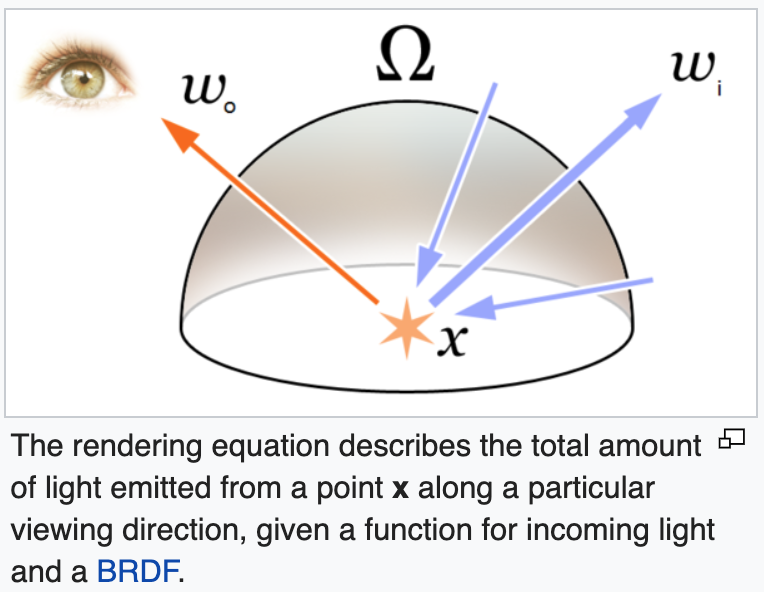


--

## We will also cover some Physics

> In physics and chemistry, the law of conservation of energy states that the total energy of an isolated system remains constant; it is said to be conserved over time. This law means that energy can neither be created nor destroyed; rather, it can only be transformed or transferred from one form to another.
[source](https://en.wikipedia.org/wiki/Conservation_of_energy)

--

## We will also cover some Physics

<blockquote/><small/><p/>Energy Conservation plays a vital role in physically-based rendering solutions. It states that the total amount of light re-emitted by a surface (reflected and scattered back) is less than the total amount it received. In other words, the light reflected off the surface will never be more intense than it was before it hit the surface. As artists, we don't have to worry about controlling Energy Conservation. This is one of the nice aspects of PBR in that energy conservation is always enforced by the shader. It’s part of the physically-based model and it allows us to focus more on art rather than physics.
[PBR Guide Vol 1](https://www.substance3d.com/system/files/software/download/build/PBR_Guide_Vol.1.pdf)


---


## A brief history or rendering

> As technology advances, rendering time remains constant.
  — [Blinn’s Law](http://boxxblogs.blogspot.com/2013/07/blinns-law-and-paradox-of-increasing.html)

- Early computer graphics research started in the 1970's however some of the foundations go back even earlier.

- Many of the principles used then are still relevant today we've just increased the complexity of what we are simulating
- Hence the truism of Blinn's Law.


--

## 1950's - 1960's
- [Ray Tracing / Casting by Arthur Appel 1968](http://people.reed.edu/~jimfix/math385/lec01.1/Light/Appel.pdf)
- CRT displays (not colour)
- [SketchPad](https://en.wikipedia.org/wiki/Sketchpad)

<iframe width="560" height="315" src="https://www.youtube.com/embed/495nCzxM9PI" frameborder="0" allow="accelerometer; autoplay; encrypted-media; gyroscope; picture-in-picture" allowfullscreen></iframe>

--

## 1970's

- University of Utah computer group
- Hidden surface determination
- Shading  Henri Gouraud, Jim Blinn and Bui Tuong Phong
  - Textures, Environment Maps, Bump mapping :- Jim Blinn
- Z buffer and Alpha 
- Recursive ray tracing algorithm [Turner Whitted  1979](https://blogs.nvidia.com/blog/2018/08/01/ray-tracing-global-illumination-turner-whitted/) 


--

## 1980's
- Ray tracing improvements

<iframe width="560" height="315" src="https://www.youtube.com/embed/0KrCh5qD9Ho" frameborder="0" allow="accelerometer; autoplay; encrypted-media; gyroscope; picture-in-picture" allowfullscreen></iframe>

- Pixar start to develop Shaders / Shading Languages
- Introduction of real time graphics boards (first GPU's)


--

## 1990's

- Toy Story 
- Beginnings of photorealism in CGI
- Normal Mapping
- Better GPU's
- Introduction of Physically Based Models 

--

## 2000's till now
- more access to texture maps 
- HDRI
- Real Time Ray-tracing on consumer hardware
- [Physically Based Rendering](http://www.pbr-book.org/3ed-2018/Introduction/A_Brief_History_of_Physically_Based_Rendering.html) 


---

## Raytracing

<a href="https://upload.wikimedia.org/wikipedia/commons/8/83/Ray_trace_diagram.svg">  </a>

--

## How about some Code!

```
for (int j = 0; j < imageHeight; ++j) { 
    for (int i = 0; i < imageWidth; ++i) { 
        // compute primary ray direction
        Ray primRay; 
        computePrimRay(i, j, &primRay); 
        // shoot prim ray in the scene and search for intersection
        Point pHit; 
        Normal nHit; 
        float minDist = INFINITY; 
        Object object = NULL; 
        for (int k = 0; k < objects.size(); ++k) { 
            if (Intersect(objects[k], primRay, &pHit, &nHit)) { 
                float distance = Distance(eyePosition, pHit); 
                if (distance < minDistance) { 
                    object = objects[k]; 
                    minDistance = distance; // update min distance 
                } 
            } 
        } 
        if (object != NULL) { 
            // compute illumination
            Ray shadowRay; 
            shadowRay.direction = lightPosition - pHit; 
            bool isShadow = false; 
            for (int k = 0; k < objects.size(); ++k) { 
                if (Intersect(objects[k], shadowRay)) { 
                    isInShadow = true; 
                    break; 
                } 
            } 
        } 
        if (!isInShadow) 
            pixels[i][j] = object->color * light.brightness; 
        else 
            pixels[i][j] = 0; 
    } 
} 
```

<p><small><a href="https://www.scratchapixel.com/lessons/3d-basic-rendering/introduction-to-ray-tracing/implementing-the-raytracing-algorithm">source</a></small></p>

--

## Raytracing


<blockquote><small><p>Almost all photorealistic rendering systems are based on the ray-tracing algorithm. Ray tracing is actually a very simple algorithm; it is based on following the path of a ray of light through a scene as it interacts with and bounces off objects in an environment. Although there are many ways to write a ray tracer, all such systems simulate at least the following objects and phenomena [PBR Book](http://www.pbr-book.org/3ed-2018/Introduction/Photorealistic_Rendering_and_the_Ray-Tracing_Algorithm.html)</p></small></blockquote>


- Cameras
- Ray–object intersections
- Light sources
- Visibility
- Surface scattering
- Indirect light transport
- Ray propagation

--

## Cameras


[source](http://www.pbr-book.org/3ed-2018/Introduction/Photorealistic_Rendering_and_the_Ray-Tracing_Algorithm.html)
- The simplest model of a camera is the ["pinhole camera"](https://en.wikipedia.org/wiki/Pinhole_camera)
- The generally need long exposures when using film, be in CGI can make things a lot simpler.

--

## Cameras

- When we simulate pinhole cameras we place the film in the front of the hole at the near plane, the hole is then called the "eye"
- We can then add other transformations to simulate, projections and lenses.

--

## Ray–object intersections

- Each time the camera generates a ray, the renderer must determine which object, if any, the ray intersects first and where the intersection occurs.
- This intersection point is the visible point along the ray, and we then simulate the interaction of light with the object at this point.
- To find the intersection, we must test the ray for intersection against all objects in the scene and select the one that the ray intersects first.
- There is a relationship between the image size, number of objects and ray count with respect to render time.


--

## Light sources

- we need to find the amount of light leaving this point in the direction of the camera.
- so we need to know how much light is arriving at this point. 
- This involves both the geometric and radiometric distribution of light in the scene. 
- Whilst point and spot light sources are common in CGI tools they are not really that good for PBR systems
- Tend to use area light sources.

--

## Visibility

-  Each light contributes illumination to the point being shaded only if the path from the point to the lights position is unobstructed


--

## Surface Scattering


- Now we need to determine how the incident lighting is scattered at the surface. 
- Specifically, we are interested in the amount of light energy scattered back along the ray that we originally traced to find the intersection point, since that ray leads to the camera

--

## Surface Scattering

- Each object in the scene provides a material, which is a description of its appearance properties at each point on the surface. 
- This description is given by the bidirectional reflectance distribution function (BRDF).

```
for each light:
    if light is not blocked:
        incident_light = light.L(point)
        amount_reflected = 
            surface.BRDF(hit_point, camera_vector, light_vector)
        L += amount_reflected * incident_light
```

--

## Indirect light transport


<blockquote><small><p>Turner Whitted’s original paper on ray tracing (1980) emphasized its recursive nature, which was the key that made it possible to include indirect specular reflection and transmission in rendered images.</p></small></blockquote>


--

## Ray propagation

- So far we have assumed the rays are traveling in a vacuum. 
- There are two ways in which a participating medium can affect the light propagating along a ray. 
  - the medium can extinguish (or attenuate) light, either by absorbing it or by scattering it in a different direction
  - medium can also add to the light along a ray. This can happen either if the medium emits light (as with a flame) or if the medium scatters light from other directions back along the ray.

--


## Ray propagation

- This is usually generated by adding a Volume to the scene
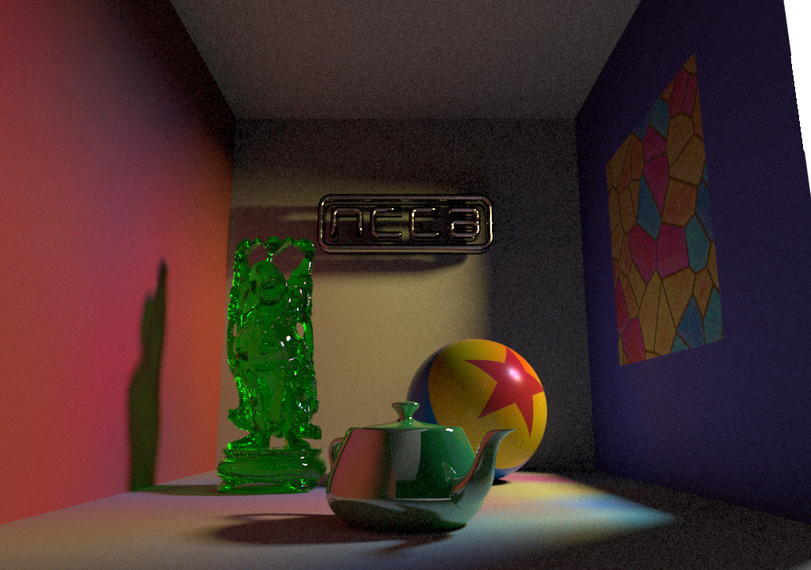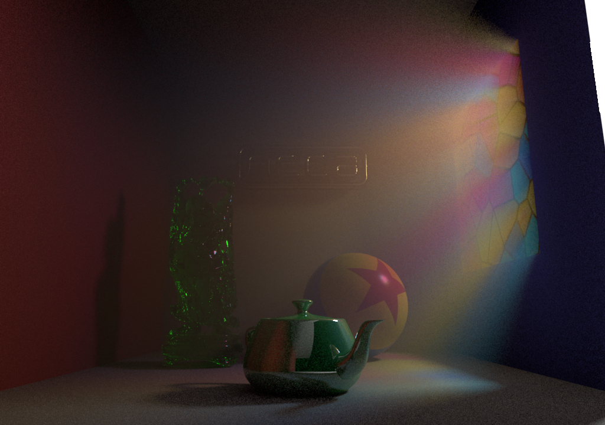

---

## Theory of Light

<iframe width="1024" height="800" src="lights.html"></iframe>


--

## Theory of Light

- Light is technically an electromagnetic transverse wave, which means that the electromagnetic field wiggles sideways as the energy propagates forwards. 
- This wiggling in the electromagnetic field can be seen as two coupled fields, electric and magnetic, wiggling at 90 degrees to each other.
- The closest we get to this in the real world is a Laser.

--

## Frequency of Light

<a href="https://blog.selfshadow.com/publications/s2015-shading-course/hoffman/s2015_pbs_physics_math_slides.pdf#page=4" >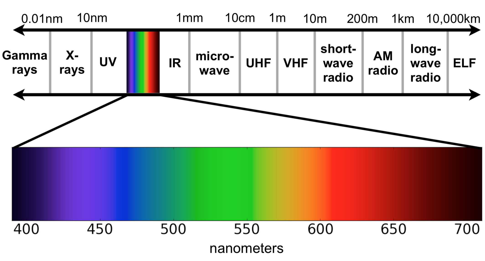</a>

--

## Some Scale

<a href="https://blog.selfshadow.com/publications/s2015-shading-course/hoffman/s2015_pbs_physics_math_slides.pdf#page=5"> 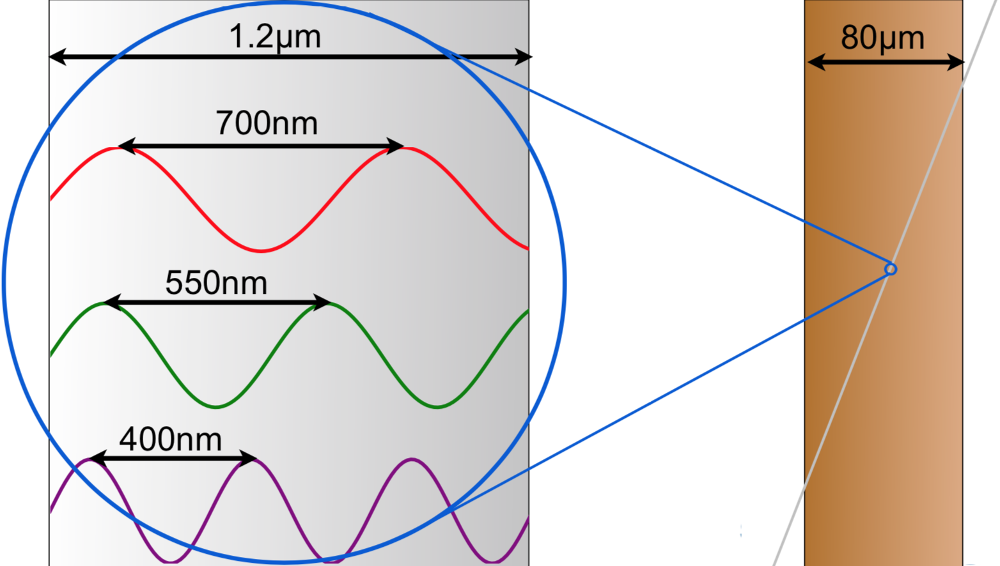</a>

--


## Theory of Light

- Most light waves contain many different wavelengths, with a different amount of energy in each. 
- This is know as the Spectral power distribution (SPD)

<a href="https://blog.selfshadow.com/publications/s2015-shading-course/hoffman/s2015_pbs_physics_math_slides.pdf#page=8">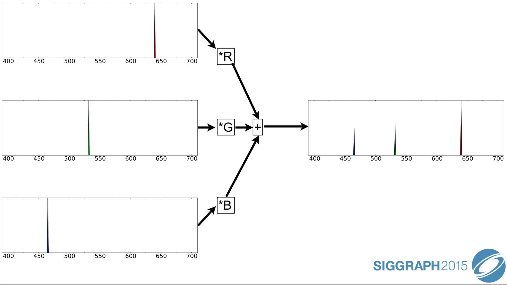</a>


--

## Theory of Light


<div class="stretch">
<iframe width="900" height="90%" src="add.html"></iframe>
</div>

--

## [D65](https://www.waveformlighting.com/color-matching/what-is-d65-and-what-is-it-used-for)

<a href="https://blog.selfshadow.com/publications/s2015-shading-course/hoffman/s2015_pbs_physics_math_slides.pdf#page=10">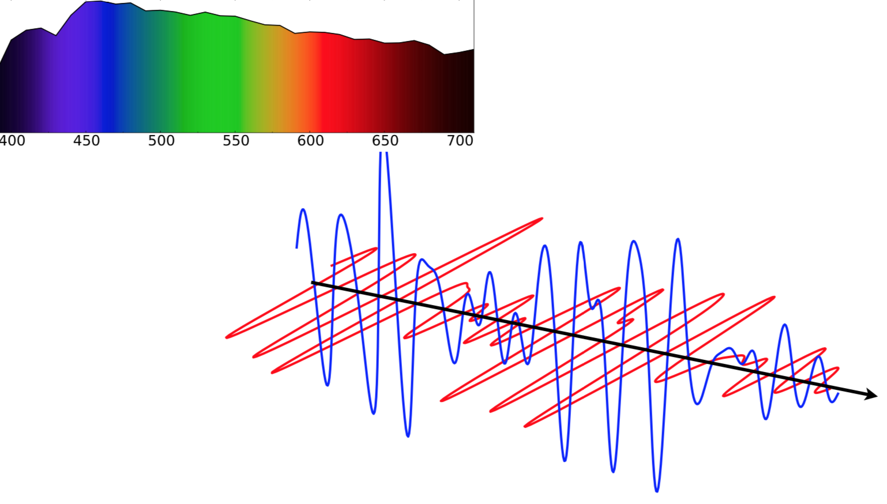</a>

--

# Light in a Vacuum

- In a Vacuum light will propagate forever.
- But we are not interested in that
    - When light hits atoms or molecules it has the effect of [polarizing](https://www.physicsclassroom.com/class/light/u12l1e.cfm) them.
    - effectively re-radiating the light (scattering).
    - whilst some is lost as heat.


--

<a href="https://blog.selfshadow.com/publications/s2015-shading-course/hoffman/s2015_pbs_physics_math_slides.pdf#page=15">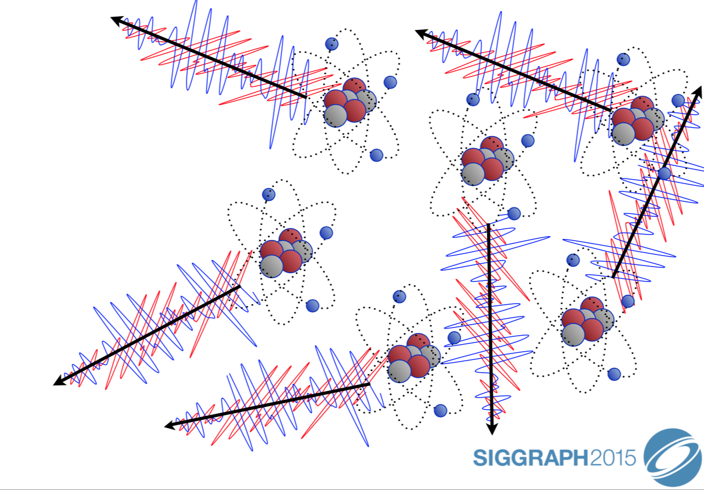</a>

--

## Physical (Wave) Optics

- This model is very complex
- not particularly good for CGI simulations as too expensive computationally to calculate
- One simplification is the concept of a homogeneous medium
    - we assume that light travels in a straight line.
    - Works well for most materials we want to simulate.

--

##  [Index of Refraction](https://en.wikipedia.org/wiki/Refractive_index)

- The IOR is a [complex number](https://en.wikipedia.org/wiki/Complex_number) (it has two parts).
  
    - One part of the IOR describes the speed of light through the medium.
    - the other describes how much light is absorbed by the medium (zero for non-absorbent media).
- Two parameters Absorption and Scattering

--

<a href="https://blog.selfshadow.com/publications/s2015-shading-course/hoffman/s2015_pbs_physics_math_slides.pdf#page=20">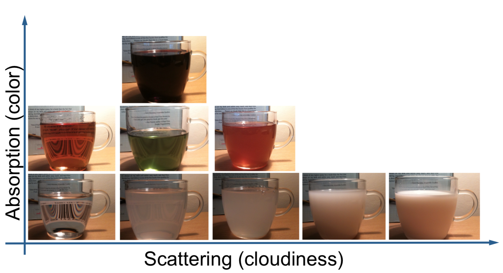</a>


--

# Watch this

<iframe width="560" height="315" src="https://www.youtube.com/embed/j-A0mwsJRmk" frameborder="0" allow="accelerometer; autoplay; encrypted-media; gyroscope; picture-in-picture" allowfullscreen></iframe>


---

## Geometric (Ray) Optics
- a perfectly flat surface splits light into exactly two directions: reflection and refraction.

<a href="http://www.realtimerendering.com/book.html">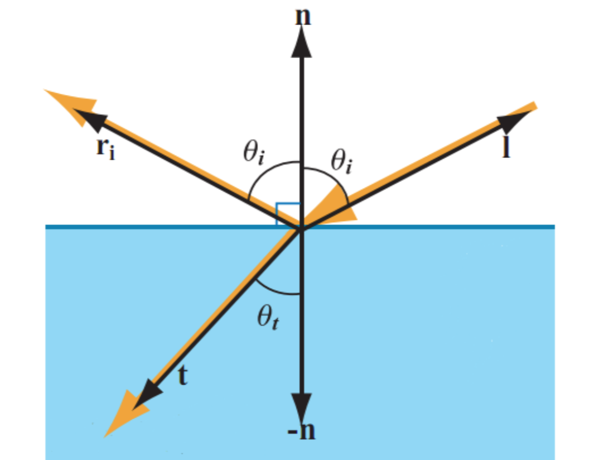</a>


--

## Microgeometry

<a href="http://www.realtimerendering.com/book.html">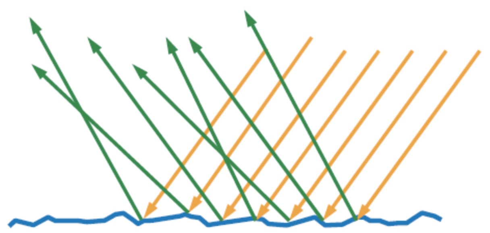</a>

- causes each surface point to reflect (and refract) light in a different direction
- the appearance is the aggregate result of these reflection and refraction directions.
- use a statistical model to generate.

--

## Rougher = Blurrier Reflections

<a href="http://www.realtimerendering.com/book.html">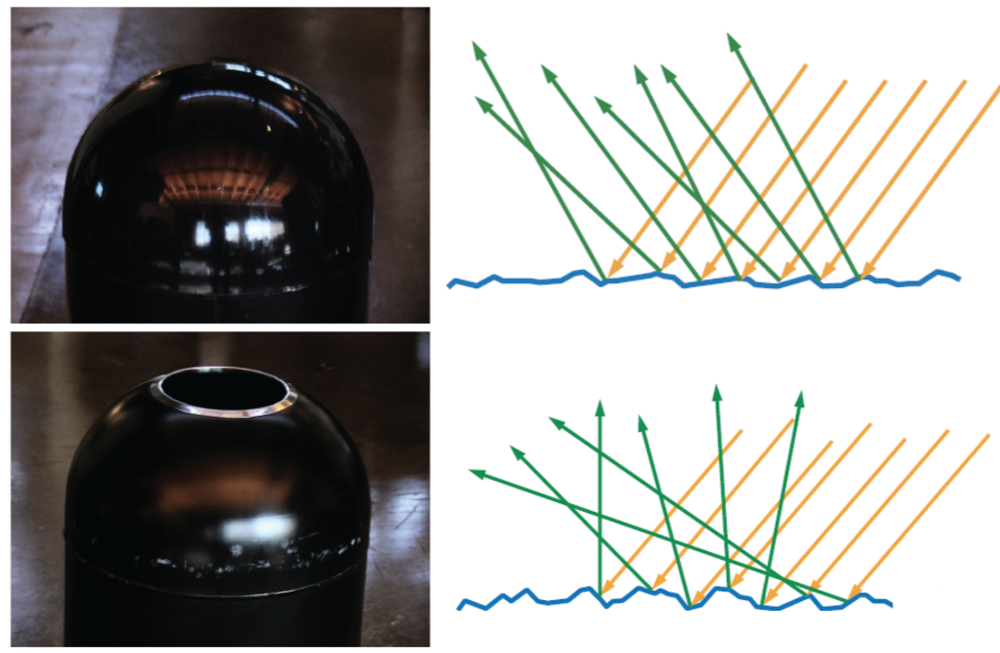</a>


---

## Types of Material

- Metals (Conductors) 
    - Metals immediately absorb all refracted light.
- Dielectrics (Insulators) 
    - have internal refraction so needs more processing
- Semiconductors (can be ignored!)

--

## Non-Metals


<a href="https://blog.selfshadow.com/publications/s2015-shading-course/hoffman/s2015_pbs_physics_math_slides.pdf#page=39">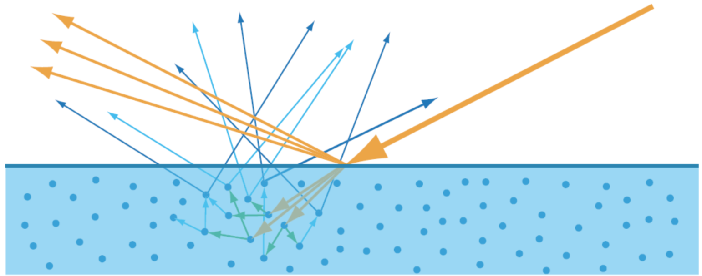</a>

--

## A simpler Model

-  The distribution of distances depends on the density and properties of the scattering particles.
- The shaded color is only affected by light hitting that surface point.

<a href="https://blog.selfshadow.com/publications/s2015-shading-course/hoffman/s2015_pbs_physics_math_slides.pdf#page=39">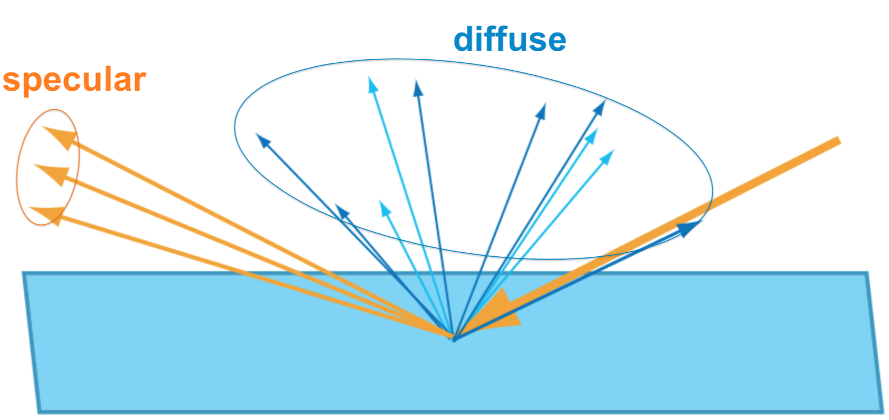</a>

--

## [Subsurface scattering](https://en.wikipedia.org/wiki/Subsurface_scattering)

- If the pixel is small compared to the entry-exit distances we need a special technique to render the effects of the sub-surface scattering 

<a href="https://blog.selfshadow.com/publications/s2015-shading-course/hoffman/s2015_pbs_physics_math_slides.pdf#page=44">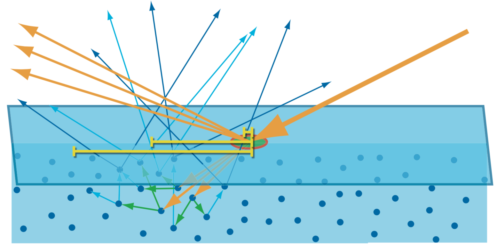</a>


---


## [BRDF](https://en.wikipedia.org/wiki/Bidirectional_reflectance_distribution_function)

- __B__idirectional
- __R__eflectance
- __D__istribution
- __F__unction

- Some renderers have more generic BxDF functions 
- a black box with the inputs being any two angles, one for incoming (incident) ray and the second one for the outgoing (reflected or transmitted) ray at a given point of the surface.

--

## BRDF

<a href="http://www.realtimerendering.com/book.html">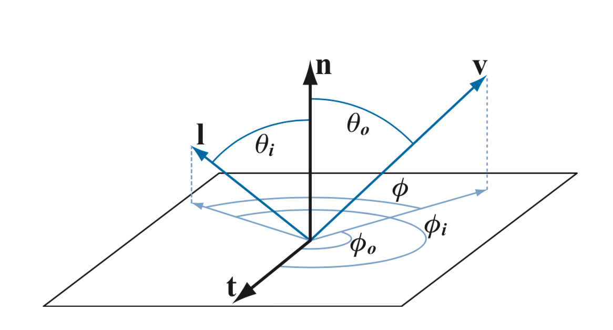</a>

- BRDF is only defined for light and view vectors above the macroscopic surface.

--

## The Reflectance Equation

`$$ L_{o}(\mathbf{v})=\int_{\Omega} f(\mathbf{l}, \mathbf{v}) \otimes L_{i}(\mathbf{l})(\mathbf{n} \cdot \mathbf{l}) d \omega_{i} $$`

- the outgoing radiance from a point equals the integral of incoming radiance times BRDF times a cosine factor, over the hemisphere of incoming directions. 
- The [integral](https://en.wikipedia.org/wiki/Integral) $\int_{\Omega}$ is effectively a weighted average over all incoming directions
- $\otimes$ represents a component wise addition of the RGB values.


--

## Microfacet Theory

<a href="https://blog.selfshadow.com/publications/s2015-shading-course/hoffman/s2015_pbs_physics_math_slides.pdf#page=53">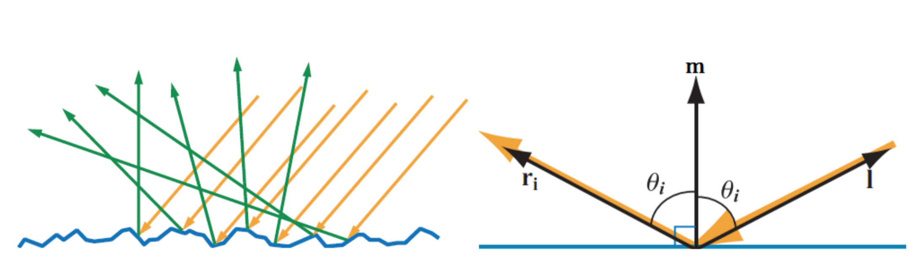</a>

- Each point is locally a perfect mirror reflecting each incoming ray of light into one outgoing direction, which depends on the light direction $\mathbf{l}$ and the microfacet normal $\mathbf{m}$.


--

## [The half vector](https://en.wikipedia.org/wiki/Blinn%E2%80%93Phong_reflection_model)

<a href="http://www.realtimerendering.com/book.html">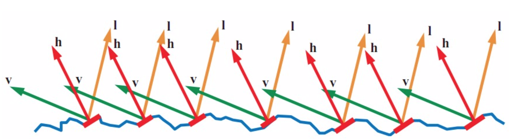</a>

- Only  microfacets with a surface normal $\mathbf{m}$ oriented exactly halfway between $\mathbf{l}$ and $\mathbf{v}$ will reflect any visible light 
- this direction is the half-vector $\mathbf{h}$

--

## [Shadowing and Masking](http://jcgt.org/published/0003/02/03/paper.pdf)

<a href="http://www.realtimerendering.com/book.html">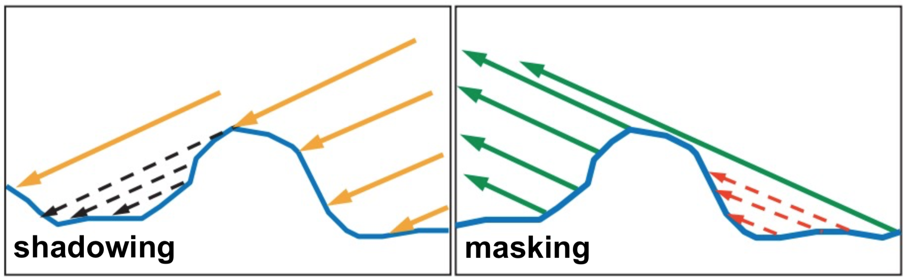</a>

- even if the facet normal is equal to the half vector it may not contribute
- in reality light will bounce but we usually ignore this

--

## Fresnel Reflectance

`$$f(\mathbf{l}, \mathbf{v})=\frac{\color{red}{F(\mathbf{l}, \mathbf{h})} G(\mathbf{l}, \mathbf{v}, \mathbf{h}) D(\mathbf{h})}{4(\mathbf{n} \cdot \mathbf{l})(\mathbf{n} \cdot \mathbf{v})}$$`

- the above equation is the Microfacet BRDF (Specular) the red section is for the [Fresnel Reflectance](https://en.wikipedia.org/wiki/Fresnel_equations)
- The Fresnel reflectance is the fraction of incoming light that is reflected

```
vec3 fresnelSchlick(float cosTheta, vec3 F0)
{
    return F0 + (1.0 - F0) * pow(1.0 - cosTheta, 5.0);
}
```


--

## Fresnel Reflectance

<a href="http://www.realtimerendering.com/book.html">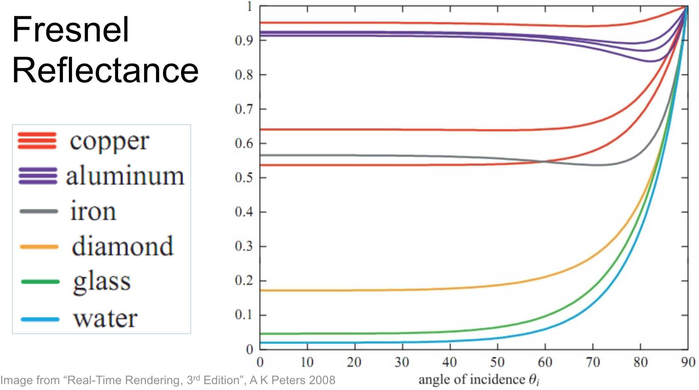</a>

- Note some materials have 1 line other 3 depends upon the wavelength of light what colour is reflected.


--

## Fresnel for Metals


<a href="http://www.realtimerendering.com/book.html">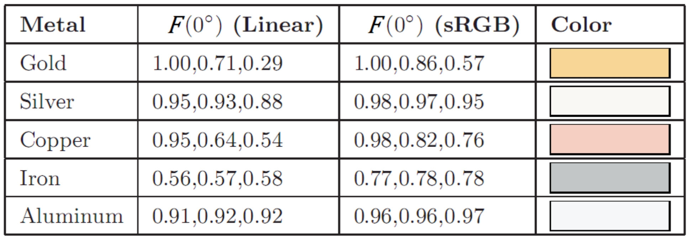</a>

- Metals have bright specular colors. 
- metals have no subsurface term, so the surface Fresnel reflectance is the material color.

--

## Fresnel for Non-Metals


<a href="http://www.realtimerendering.com/book.html">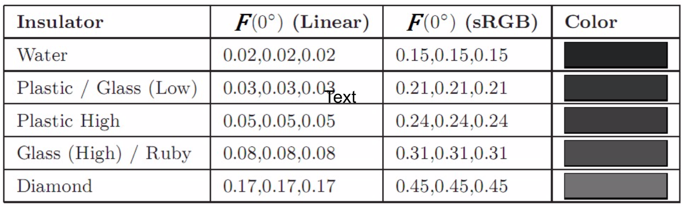</a>

- non metals also have sub surface colour (the diffuse term) so we add this (usually called the albedo) to the specular highlight.

--

## Example 

<a href="../ADA/examples/water/index.html" target="popup" onclick="popupWindow('../ADA/examples/water/index.html','selection',640,320);"></a>

[based on this shader toy demo](https://www.shadertoy.com/view/Ms2SD1)


--

## Normal Distribution Function

`$$f(\mathbf{l}, \mathbf{v})=\frac{F(\mathbf{l}, \mathbf{h}) G(\mathbf{l}, \mathbf{v}, \mathbf{h}) \color{red}{D(\mathbf{h})}}{4(\mathbf{n} \cdot \mathbf{l})(\mathbf{n} \cdot \mathbf{v})}$$`

- The NDF determines the size and shape of the highlight.
- Most are [isotropic](https://en.wikipedia.org/wiki/Isotropy) :- rotationally symmetrical around the normal. 
- Most common functions use cosines calculated as the dot product of $(\mathbf{n}\cdot\mathbf{m})$
- common methods use [Gaussian functions](https://en.wikipedia.org/wiki/Gaussian_function) 

--

## Normal Distribution Function

```
float DistributionGGX(vec3 N, vec3 H, float roughness)
{
    float a = roughness*roughness;
    float a2 = a*a;
    float NdotH = max(dot(N, H), 0.0);
    float NdotH2 = NdotH*NdotH;
    float nom   = a2;
    float denom = (NdotH2 * (a2 - 1.0) + 1.0);
    denom = PI * denom * denom;
    return nom / denom;
}
```

--

## Geometry Factor

`$$f(\mathbf{l}, \mathbf{v})=\frac{F(\mathbf{l}, \mathbf{h}) \color{red}{G(\mathbf{l}, \mathbf{v}, \mathbf{h})} D(\mathbf{h})}{4(\color{green}{\mathbf{n} \cdot \mathbf{l})(\mathbf{n} \cdot \mathbf{v}})}$$`

- The Geometry Factor (red) gives the chance that a microfacet with a given orientation is lit.
- It is sometimes combined with the (green) factor to give what is know as the "visibility term" 
- In some cases this can be set to 1 to give us a fast render but it darkens too fast compared to real surfaces 

--

## Geometry Factor

```
float GeometrySchlickGGX(float NdotV, float roughness)
{
    float r = (roughness + 1.0);
    float k = (r*r) / 8.0;
    float nom   = NdotV;
    float denom = NdotV * (1.0 - k) + k;
    return nom / denom;
}

float GeometrySmith(vec3 N, vec3 V, vec3 L, float roughness)
{
    float NdotV = max(dot(N, V), 0.0);
    float NdotL = max(dot(N, L), 0.0);
    float ggx2 = GeometrySchlickGGX(NdotV, roughness);
    float ggx1 = GeometrySchlickGGX(NdotL, roughness);
    return ggx1 * ggx2;
}

```

--

## Subsurface Reflection (Diffuse Term)

- most common model is the [Lambert reflection model](https://en.wikipedia.org/wiki/Lambertian_reflectance) 

`$(\mathbf{n}\cdot\mathbf{l})$`

- This is added to the Specular BRDF 
- Simplest BRDF model and works well for most cases, however there are cases where this doesn't work.
    - Clay type materials [Oren Nayar](https://en.wikipedia.org/wiki/Oren%E2%80%93Nayar_reflectance_model)
- other models are around (mainly in academic literature and not production)

--

## Assumptions

- in most of these models we have assumed parameters such as ```metalic, IOR, roughness, albedo, normal``` are constant
- in most cases we will use image based textures to change these
- more of this later


---


## PBR in Practice

- Most modern renderers have a PBR or ["principled"](https://disney-animation.s3.amazonaws.com/library/s2012_pbs_disney_brdf_notes_v2.pdf) shader.
- most use the techniques we have just discussed
- Most have the same parameter names (IOR, roughness, metalness etc)
- However there are still some differences, usually in how the Specular,Diffuse, transmission and Sub surface scattering are mixed.
- Another major factor (not in the scope of this lecture) is the camera / lens model used by the renderers.

--

## Mantra

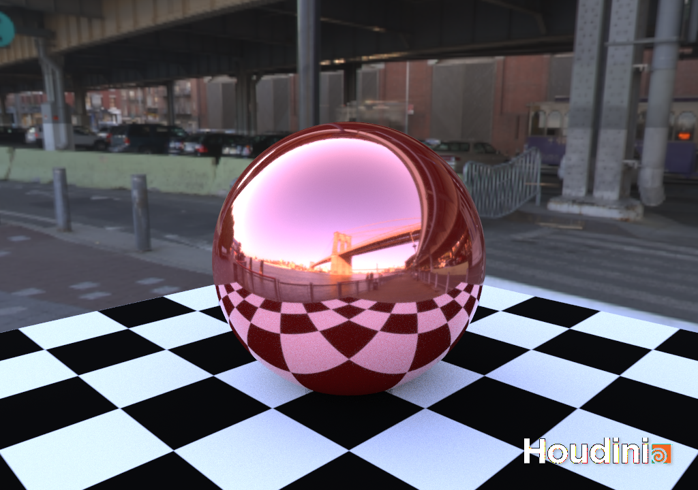

--

## Arnold

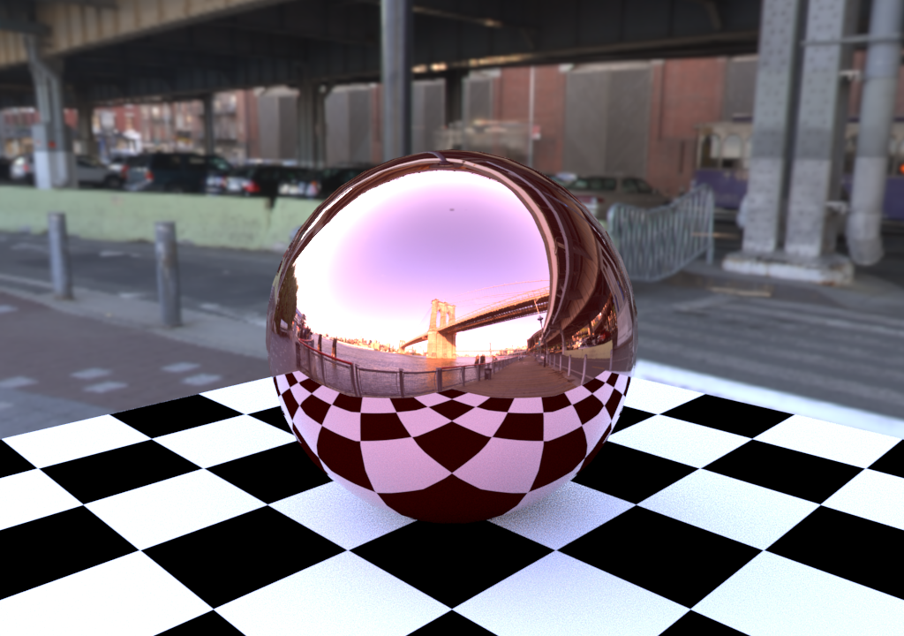

--

## Vray

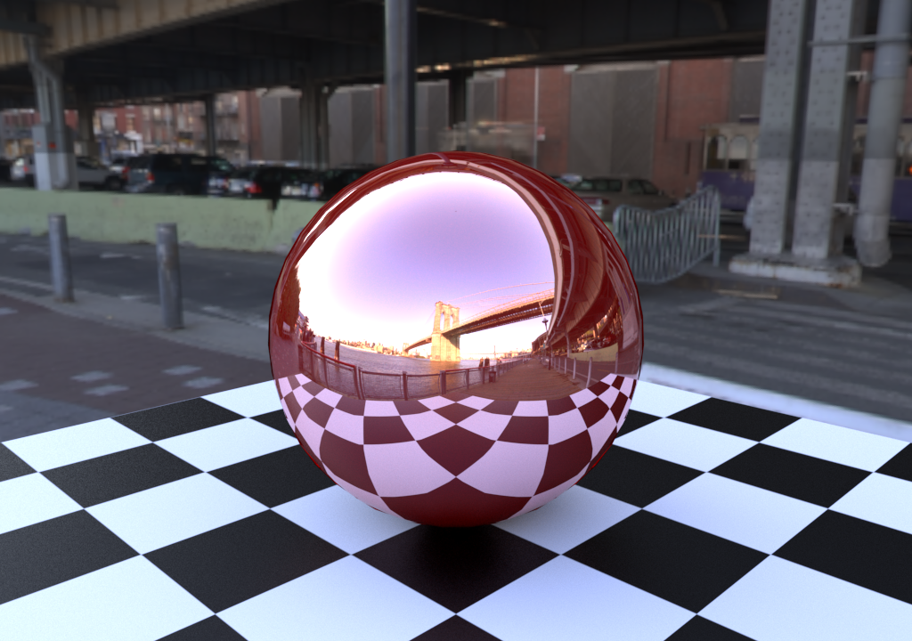


--

## Vray

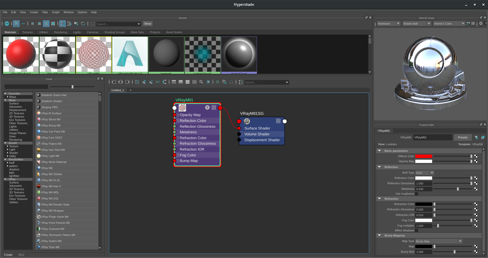

--

## Unreal

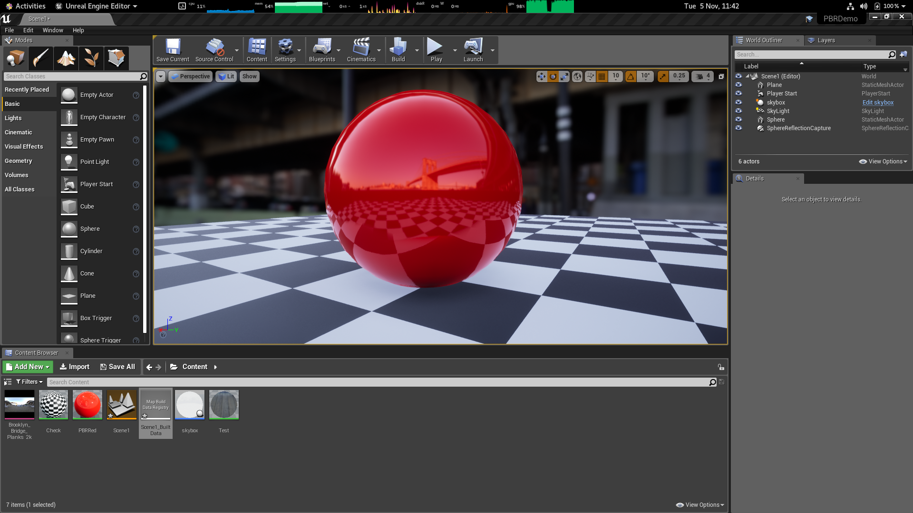


---

## Adding Textures

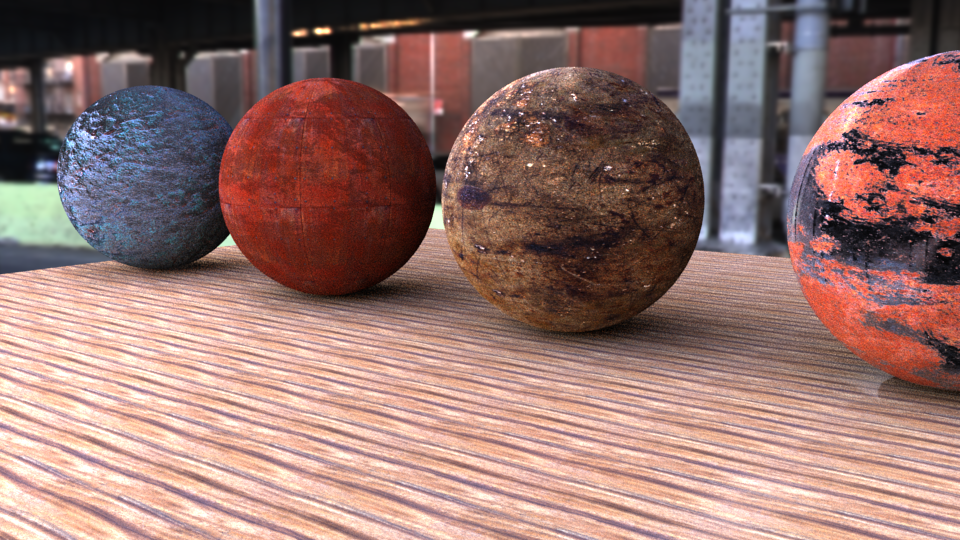


--

## Adding Textures

- Most of the parameters we have been discussing can be better controlled via textures
- Textures can either be image based as in the previous example or via procedural shaders (OSL)
- The Substance suite of tools allows for these to be developed.

--

## Adding Textures

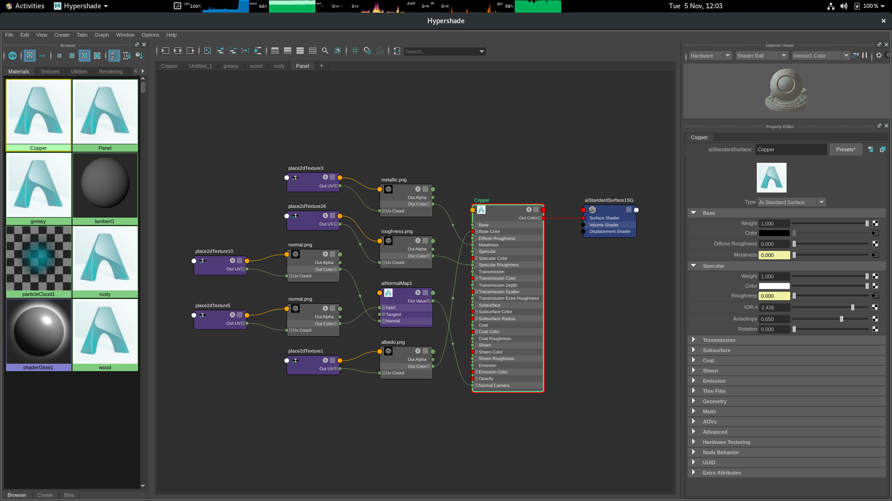


---


## References
- http://www.pbr-book.org/3ed-2018/contents.html
- https://www.chaosgroup.com/blog/understanding-metalness
- https://blog.selfshadow.com/publications/s2015-shading-course/hoffman/s2015_pbs_physics_math_slides.pdf
- https://www.gdcvault.com/play/1024478/PBR-Diffuse-Lighting-for-GGX
