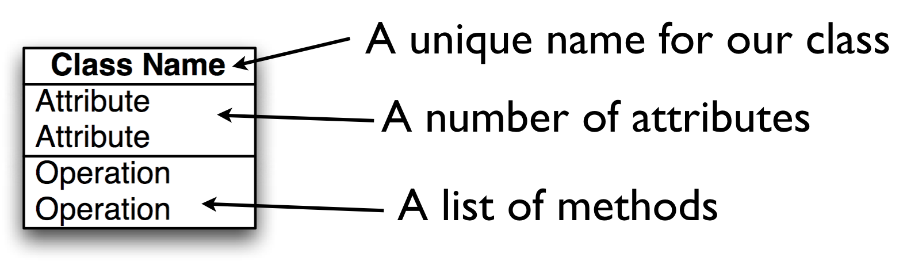

# Lecture 4 Object Oriented Programming
Jon Macey

jmacey@bournemouth.ac.uk

---

## Procedural Programming 
- In procedural programming we use
    - data structures to store information
    - function (passing in the structures) to process the information
- This can lead to complex / large function prototypes passing in and out large amounts of data.

--

## Object Oriented Programming
- In OO Programming we tend to combine both the data and the functions that act on them into a single unit.
- We then place an “interface” to this data know as methods which are allowed to act upon the data in a prescribed way.
- The traditional model of OO is to model “real world” objects, however as we shall discuss this is not really the case.

--


### [Object Oriented Programming is Inherently Harmful](http://harmful.cat-v.org/software/OO_programming/)

- “Object-oriented programming is an exceptionally bad idea which could only have originated in California.” – Edsger Dijkstra
- “object-oriented design is the roman numerals of computing.” – Rob Pike
- “The phrase "object-oriented” means a lot of things. Half are obvious, and the other half are mistakes.“ – Paul Graham

--

### [Object Oriented Programming is Inherently Harmful](http://harmful.cat-v.org/software/OO_programming/)

- “Implementation inheritance causes the same intertwining and brittleness that have been observed when goto statements are overused. As a result, OO systems often suffer from complexity and lack of reuse.” – John Ousterhout Scripting, IEEE Computer, March 1998
- “Sometimes, the elegant implementation is just a function. Not a method. Not a class. Not a framework. Just a function.” – [John Carmack](http://www.gamasutra.com/view/news/169296/Indepth_Functional_programming_in_C.php)

--

### [Object Oriented Programming is Inherently Harmful](http://harmful.cat-v.org/software/OO_programming/)


- “The problem with object-oriented languages is they’ve got all this implicit environment that they carry around with them. You wanted a banana but what you got was a gorilla holding the banana and the entire jungle.” – Joe Armstrong
- “I used to be enamored of object-oriented programming. I’m now finding myself leaning toward believing that it is a plot designed to destroy joy.” – Eric Allman

--

### [Object Oriented Programming is Inherently Harmful](http://harmful.cat-v.org/software/OO_programming/)


- OO is the “structured programming” snake oil of the 90' Useful at times, but hardly the “end all” programing paradigm some like to make out of it.
- And, at least in it’s most popular forms, it’s can be extremely harmful and dramatically increase complexity.
- Inheritance is more trouble than it’s worth. Under the doubtful disguise of the holy “code reuse” an insane amount of gratuitous complexity is added to our environment, which makes necessary industrial quantities of syntactical sugar to make the ensuing mess minimally manageable.


---

## Agents and Communities
- The common "model" of teaching OO is :-
    - An Object Oriented program is structured as a community of interacting agents called objects.
    - Each object has a role to play.
    - Each object provides a service or performs an action that is used by other members of the community

--

## Patterns
- As we will see when building and designing these communities patterns will appear.
- These “design patterns” can be seen as “a general reusable solution to a commonly occurring problem”
- In OO design patterns typically show relationships and interactions between classes or objects, without specifying the final application classes or objects that are involved.


--

# [Gang of Four](https://en.wikipedia.org/wiki/Design_Patterns)

- GOF: "Gang of Four", ie Gamma, Helm, Johnson, Vlissides, authors of "Design Patterns: Elements of Reusable Object-Oriented Software”
- Classic text on OO Design
- Two main considerations 
  - Program to an 'interface', not an 'implementation'.
  - Favour  ‘object composition’ over ‘class inheritance’


--

#[S.O.L.I.D. ](https://en.wikipedia.org/wiki/SOLID_(object-oriented_design)
- A mnemonic to remember the first five principles of Object Oriented design
- Single responsibility, Open-closed, Liskov substitution, Interface segregation and Dependency inversion
- The principles when applied together intend to make it more likely that a programmer will create a system that is easy to maintain and extend over time

--

# [Single Responsibility](http://www.oodesign.com/single-responsibility-principle.html) 
- A class should do only one thing
- This should be entirely encapsulated in the class
- All services (methods) should be narrowly aligned to this responsibility

--

# [Open / Closed](http://www.oodesign.com/open-close-principle.html)
- “software entities (classes, modules, functions, etc.) should be open for extension, but closed for modification”
- This means we shouldn’t modify the source but extend the code using inheritance
- This is sometimes know as “implementation inheritance” 
- This can be done using Abstract base classes

--

## [Liskov substitution principle](http://www.oodesign.com/liskov-s-substitution-principle.html)
- “objects in a program should be replaceable with instances of their subtypes without altering the correctness of that program”
- For a mutable objects  “if S is a subtype of T, then objects of type T in a program may be replaced with objects of type S without altering any of the desirable properties of that program”

--

## [Interface segregation principle](http://www.oodesign.com/interface-segregation-principle.html)
- no client should be forced to depend on methods it does not use.
- ISP splits interfaces which are very large into smaller and more specific ones so that clients will only have to know about the methods that are of interest to them
- Sometimes called “role interfaces”
- This means we make classes “thin” not fat general purpose ones (which sometimes lead to software bloat)

--

## [Dependency inversion principle](http://www.oodesign.com/dependency-inversion-principle.html)
- “One should Depend upon Abstractions. Do not depend upon concretions”
  - High level modules should not depend on low level modules. Both should depend on abstractions.
  - Abstractions should not depend upon details. Details should depend upon abstractions.


---

## Messages and Methods
- Actions are initiated in OO programming by the transmission of a message to an agent (an object) responsible for the action.
- The message encodes the request for an action and is accompanied by any additional information (arguments) needed to carry out that request.
- The receiver is the object to whom the message is sent
- If the receiver accepts the message, it also accepts the responsibility to carry out the indicated action.
- In response to a message, the receiver will perform some method to satisfy the request

--

## Messages vs Procedure calls

```python
#!/usr/bin/env python


def sqr(v: int) -> int:
    return v * v


value = 10
print(f"{sqr(value)=}")
```

--

## Messages vs Procedure calls

- in an Object oriented system we would instead as a class to square itself
- this is done via a message

```
#!/usr/bin/env python

# Note this is a bad design to illustrate a point!
class IntValue:
    def __init__(self, value: int) -> None:
        self.value = value

    def square(self):
        self.value = self.value * self.value

a = IntValue(10)
b = IntValue(20)

a.square()
b.square()
print(f"{a.value=} {b.value=}")

```


--

## Advantages
- Now we have a class we can have many instances of the same same class (each know as an object)
- Each class has it's own unique data (indicated by the self in python)
- We will delve deeper into this syntax later in the lecture

--

# Responsibilities

- In message passing there is a designated receiver. 
- This may not be known until runtime (know as runtime polymorphism)
- This is a form of late binding, this happens at runtime and not compile time like a procedural program.

> Ask not what you can do to your data structures.
Ask what your data structures can do for you. 

[Budd (2002)](http://web.engr.oregonstate.edu/~budd/Books/oopintro3e/info/ReadMe.html)

---

## Object Oriented Concepts [(Kay 1993)](http://gagne.homedns.org/~tgagne/contrib/EarlyHistoryST.html)

- Everything is an Object.
- Computation is performed by objects communicating with each other (via messaging)
- Each Object has it’s own Memory 
- Every object is an instance of a class.
- The class is a repository for behaviour associated with an object.
- Classes are organised into a singly rooted tree structure called the inheritance hierarchy. 

--

## Classes

- Almost everything in python is an object 
- Try typing ```help(float)``` in the terminal
- Each of these have methods (functions) that can be invoked using the ```.``` operator

```python
#!/usr/bin/env python

a = float(10.3)
print(a.conjugate())
print(a.as_integer_ratio())
print(a.hex())
```


--

## The Anatomy of a class

- in some languages data is hidden away (encapsulation) and only accessible via methods of the class
- Python does not do this directly, however we will see how we can simulate this later


---

# Class Diagrams
<div>
<pre>
<code class="language-plantuml">
  @startuml
  Title A class hierachy using inheritance

  SuperClass <|-- Subclass

  Parent <|-- Child
  Parent <|-- Derived
  Parent <|-- SubClass


  @enduml
</code>
</pre>
</div>

<div>
<pre>
<code class="language-plantuml">
  @startuml
  Title  One to many relationship
  class "Class" as a  
  class "Class" as b
  a "1" -o  "*" b : "                 "
  @enduml
</code>
</pre>
</div>

<div>
<pre>
<code class="language-plantuml">
@startuml

Title Zero or One to many relationship
class "Class" as a  
class "Class" as b
a "0..1" -o "*" b : "               "


@enduml
</code>
</pre>
</div>


--

#Associations
- Represents the relation from one class to another
- Most association will be 
  - Has
  - Owns
  - Uses
- In pythons it often translates to an attribute
- Try to be more explicit
  - Renders to
  - Reflects
  - Supports

--

# Associations
- The numbers
  - How many X can Y have
  - How many Y can X have
- Syntax
  - 0..1 May have ONE, or NONE
  - 0..* May have SEVERAL, including NONE
  - 1 Has ONE and only ONE
  - 1..* Has at least ONE, but can have SEVERAL

--


# Composition

<div>
<pre>
<code class="language-plantuml">
@startuml

Title Car has (a)n Engine
"Car      " "0..1" -* "1..1" Engine : "               "

@enduml
</code>
</pre>
</div>

```python 
class Engine :
    self.m_cc=1200;


class Car :
    self.engine = Engine()
```

- Use a filled diamond it always gives a multiplicity of 1 or 0..1
- This implies ownership and when the car is destroyed so is the Engine

--

# Aggregation

<div>
<pre>
<code class="language-plantuml">
@startuml

"World  " "0..1" -o "1..*" Mesh : "                        "

@enduml
</code>
</pre>
</div>


- Aggregation differs from composition as it doesn’t necessarily imply ownership.
- This is usually implemented by containing a reference to another object where the lifetime is determined elsewhere
- This implies a pointer (or smart pointer) of some kind in some languages (not python)

--

# Generalisation

- This is done via a process called inheritance
- Sometimes we have classes so general they can’t be created (Abstract classes)
- The hierarchy goes from Generalisation to specialisation
- Use a lot in things like GUI toolkits

---

## methods

- Methods are functions which operate upon the data in the class
- python has a number of special methods that start and end with ```__``` 
- these are know as "dunder" or magic methods we will investigate this when we look at writing our own classes

--

## mutable vs immutable
- A mutable object is one where the data may be modified after creation.
- An immutable object once created may not be modified
- We can further add to this distinction by mixing elements of both in a class
- Methods may also be tagged to say if they modify the internal state of the class or not. 

---

## Unified Modelling Language (UML) 

- Unified Modelling Language (UML) is a standardised general-purpose modelling language
- UML has a number of graphical element which allows us to describe various components of a software system in a standardised way
- We shall use the UML notation for class diagram when designing our classes as well as other elements from the UML 2.x standard

--

# UML Classes



--

## Specifying Attributes
- attributes are specified in the following way
- ```[visibility] name : [data type] ```
- data type is any class type or built in data type in python we don't need to worry as much


--

## Specifying Methods
- Methods are defined as follows
- ```[visibility] Name( [param] ) : [return type]```
- ```param := [name] : [data type]```
- can have param,param ... 


--

## Accessors and Mutators
- In the previous example we had the methods below
- These methods are know as 
    - Accessors (or get methods) the one returning the value
    - Mutators (or set methods ) which is used to set the class attribute value
- You will notice the get method has a const at the end of the definition as it doesn’t mutate the class
- This is how a number of traditional OO languages handle this however python is different

--

## Accessors [(Priess 1998)](http://www.brpreiss.com/books/opus5/html/book.html)
- An accessor is a method that accesses (returns) an attribute of an object but doesn’t modify the object
- In the simplest case, an accessor just returns the value of one of the attributes. 
- In general, an accessor performs some computation using the attributes as long as that computation does not modify any of the attributes.

--

## Mutators [(Priess 1998)](http://www.brpreiss.com/books/opus5/html/book.html)
- A mutator is a method that can modify an object. 
- In the simplest case, a mutator just assigns a new value to one of the attributes. 
- In general, a mutator performs some computation and modifies any number of attributes.

---


## Object Orientation

- Python is fully object−oriented and supports class inheritance
- Defining a class in Python is simple  as with functions, there is no separate interface definition (as used in languages like c++)
- A Python class starts with the reserved word class, followed by the class name.
- Technically, that's all that's required, since a class doesn't need to inherit from any other class.

--

## Python Classes

- Typically a Python class is a self contained .py module with all the code for that module contained within it.
- The class may also have special methods to initialise the data and setup any basic functions

```
class ClassName :
  <statement 1>
  .
  .
  .
  <statement N>
```

--

## A simple Colour Class

```
#!/usr/bin/python

class Colour :
    ' a very simple colour container'
    def __init__(self,r=0.0,g=0.0,b=0.0,a=1.0) :
        'constructor to set default values'
        self.r=r
        self.g=g
        self.b=b
        self.a=a

    def __str__(self) :    
        ' method to print out the colour data for debug'
        return '[{},{},{},{}]'.format(self.r,self.g,self.b,self.a)

    def __repr__(self) :    
        ' method to print out the colour data for debug'
        return 'Colour[r={},g={},b={},a={}]'.format(self.r,self.g,self.b,self.a)

    def mix(self,colour,t) :
        '''method to mix current colour with another by t
        will catch the attribute error and pass back black if
        wrong values are passed
        '''
        c=Colour()
        try :
            c.r=self.r+(colour.r-self.r)*t
            c.g=self.g+(colour.g-self.g)*t
            c.b=self.b+(colour.b-self.b)*t
            c.a=self.a+(colour.a-self.a)*t
        except AttributeError :
            pass
        return c
```


--

## Using the class

```python
#!/usr/bin/env python3

from Colour import Colour


red=Colour()
red.r=1.0
print(red)
print(repr(red))
print(type(red))

c1=Colour(0.2,1.0,2.0,1)
print(c1)
newColour=c1.mix(red,0.2)
mixed=c1.mix(red,0.5)
print("mixing {} {} {} {}".format(mixed.r,mixed.g,mixed.b,mixed.a) )
# Problem
c1=Colour("red","green","blue","alpha")
print(c1)
newColour=c1.mix(red,0.2)


```


--

## ```__init__```

- Is the python class initialiser, at it’s simplest level it can be thought of as a constructor but it isn’t!
- The instantiation operation (“calling” a class object) creates an empty object. 
- The ```__init__``` method allows use to set an initial state
- The actual process is the python constructor is ```__new__```
- Python uses automatic two-phase initialisation 
  - ```__new__``` returns a valid but (usually) unpopulated object, 
  - which then has ```__init__``` called on it automatically.

--

  ## methods

- The class methods are defined within the same indentation scope of the rest of the class
- There is no function overloading in Python, meaning that you can't have multiple functions with the same name but different arguments
- The last method defined with a name will be used

--


## self

- There are no shorthands in Python for referencing the object’s members from its methods the method function is declared with an explicit first argument representing the object, which is provided implicitly by the call.
- By convention the first argument of a method is called ```self```. 
- The name ```self``` has absolutely no special meaning to Python. 
- Note, however, that by not following the convention your code may be less readable to other Python programmers, and it is also conceivable that a class browser program might be written that relies upon such a convention.


--

## Problems

- some programming languages allow us to define multiple constructors for different types
    - python does not so I can construct the class with a string as demonstrated
- There are different ways to overcome this
    - using type hints to show what should be used [type hints](https://www.python.org/dev/peps/pep-0484/)
    - check type in constructor and respond
    - use [@classmethod](https://stackabuse.com/pythons-classmethod-and-staticmethod-explained/) 

--


## [@classmethod](https://docs.python.org/3/library/functions.html#classmethod)

- the classmethod returns a new instance of an object

```python
#!/usr/bin/env python3

class Colour :
  ' a very simple colour container'
  def __init__(self) :
    'constructor to set default values'
    self.r=0
    self.g=0
    self.b=0
    self.a=0
    
  def __str__(self) :	
    ' method to print out the colour data for debug'
    return '[{},{},{},{}]'.format(self.r,self.g,self.b,self.a)
  
  def __repr__(self) :	
    ' method to print out the colour data for debug'
    return 'Colour[r={},g={},b={},a={}]'.format(self.r,self.g,self.b,self.a)
  
  @classmethod
  def fromFloat(cls,r , g, b , a=1.0) :
    c=Colour()
    try :
      c.r = float(r)
      c.g = float(g)
      c.b = float(b)
      c.a = float(a)
    except ValueError :
      raise ValueError 
    return c
  
  @classmethod
  def fromInt(cls,r , g, b , a=255) :
    c=Colour()
    try :
      c.r = int(r)
      c.g = int(g)
      c.b = int(b)
      c.a = int(a)
    except ValueError :
      pass
    return c
  

  def mix(self,colour,t) :
    '''method to mix current colour with another by t
    will catch the attribute error and pass back black if
    wrong values are passed
    '''
    c=Colour()
    try :
      c.r=self.r+(colour.r-self.r)*t
      c.g=self.g+(colour.g-self.g)*t
      c.b=self.b+(colour.b-self.b)*t
      c.a=self.a+(colour.a-self.a)*t
    except AttributeError :
      pass
    return c
```

--

## using the class

```python
#!/usr/bin/env python3

from Colour import Colour

c=Colour()
print(c)

f=Colour.fromFloat(0.1,2.0,1.0,2.0)
print(f)

f=Colour.fromInt(255,127,12)
print(f)
try :
  f=Colour.fromFloat("1","hello",2,3)
  print(f)
except :
  print("error")
```

---

## Decorators in python

- the @classmethod is a python decorator
- decorators are a powerful feature that allows you to modify or enhance the behavior of functions or classes without permanently modifying them.
- a decorator is a function that takes another function or method as an argument, adds some functionality to it, and returns a new function or method.
- We will look at these more in the future

---

## encapsulation

- In python there is no private or protected encapsulation
- We can access all class attributes using the . operator
- We can also declare instance variables where ever we like in the methods (for example ```self.foo=10 ``` in a method will be available once that method has been called)
- By convention it would be best to declare all instance variables (attributes) in the  ```__init__``` method

--

## Accessor and Mutators

- Python doesn’t require explicit getter and setter methods like other languages such as Java or C#. 
- Instead, Python has a more flexible mechanism known as properties, 
  - which allows you to define getter, setter, and deleter methods in a clean, Pythonic way.
- We will see this in some of the API's we use


--

## Accessor and Mutators

- There are two common ways to implement accessors and mutators in Python:
	1.	Using standard method functions (manual approach).
	2.	Using properties with the @property decorator (Pythonic approach).


--


## standard approach

```python
#!/usr/bin/env python3

class Person:
    def __init__(self, name):
        self._name = name  # The underscore signifies a "protected" variable

    # Getter method (Accessor)
    def get_name(self):
        return self._name

    # Setter method (Mutator)
    def set_name(self, name):
        if isinstance(name, str) and len(name) > 0:
            self._name = name
        else:
            raise ValueError("Invalid name")

# Usage
person = Person("Jon")
print(person.get_name())  # Accessor: Output "Jon"
person.set_name("Jonathan")   # Mutator
print(person.get_name())  # Output "Jonathan"
person._name = 1235  # No error
print(person.get_name())  # Output 1235
```

--

## standard approach

-	```_name``` is a protected attribute (by convention, using a leading underscore), and access is managed by the ```get_name()``` and ```set_name()``` methods.
  - note you can still access ```_name``` directly but by convention you shouldn't as it has underscore in front of it
-	This approach allows you to include logic in the getter and setter methods, such as validation.

--

### Pythonic Approach with ```@property```

- Python provides the @property decorator to simplify the definition of getters and setters. 
- This allows you to access and modify attributes in a way that feels more natural (like accessing or setting a normal attribute) whilst still having control over the behavior.
- This is show in the following example

--

```python
#!/usr/bin/env python3

class Person:
    def __init__(self, name):
        self._name = name  # The underscore signifies a "protected" variable

    # Define the getter method using @property
    @property
    def name(self):
        return self._name

    # Define the setter method using @property_name.setter
    @name.setter
    def name(self, name):
        if isinstance(name, str) and len(name) > 0:
            self._name = name
        else:
            raise ValueError("Invalid name")

# Usage
person = Person("Jon")
print(person.name)   # Accessor: Output "Jon"
person.name = "Jonathan" # Mutator
print(person.name)   # Output "Jon"

person.name = ""  # Raises ValueError

```

--

## how it works

- ```@property``` turns the method name() into a getter. Now you can access ```person.name``` directly without calling person.get_name().
- ```@name.setter``` defines the setter method, so you can assign person.name = "Jonathan" without needing to call ```set_name()```


--

## Read / Write Only  Properties

- You can also define read-only and write-only properties using the ```@property``` decorator
  - Read-only: Define only the getter method.
  - Write-only: Define only the setter method.
- This is useful when you want to prevent users from modifying an attribute directly.

--

## example read_only

```python
#!/usr/bin/env python3

class Person:
    def __init__(self, name):
        self._name = name

    @property
    def name(self):
        return self._name  # No setter defined

# Usage
person = Person("Jon")
print(person.name)  # Output: Jon

person.name = "Jonathan"  # This would raise an AttributeError since the setter is not defined
```

--

## example write_only

```python
#!/usr/bin/env python3

class Secret:
    def __init__(self):
        self._secret_value = None

    @property
    def secret(self):
        raise AttributeError("This is write-only")

    @secret.setter
    def secret(self, value):
        self._secret_value = value

# Usage
s = Secret()
s.secret = "My secret"  # This works
print(s.secret)  # Raises AttributeError since no getter is defined
```

---


## ```__del__```

- ```__del__``` is analogous to the destructor
- It defines behavior for when an object is garbage collected
- As there is no explicit delete in python it is not always called
- Be careful, however, as there is no guarantee that ```__del__``` will be executed if the object is still alive when the interpreter exits
- ```__del__``` can't serve as a replacement for good coding practice

---


## operator overloading

Operator overloading in Python allows you to define custom behavior for built-in operators (such as +, -, *, etc.) for your  classes. 
- By overriding special methods (also known as magic methods or dunder methods), you can control how operators behave for instances of your class.
- in the following example we will use a Vec3 class to demonstrate this

--


## [vec3 class](https://github.com/NCCA/SEForMedia/blob/main/Lecture4/OperatorOverloading/Vec3.py)
- The following examples are going to use the following Vec3 class definition

```python
#!/usr/bin/env python3


class Vec3:
    def __init__(self, x, y, z):
        self._x = x
        self._y = y
        self._z = z

    @property
    def x(self):
        return self._x

    @x.setter
    def x(self, x):
        if isinstance(x, (int, float)):
            self._x = x
        else:
            raise ValueError("need float or int")

    @property
    def y(self):
        return self._y

    @y.setter
    def y(self, y):
        if isinstance(y, (int, float)):
            self._y = y
        else:
            raise ValueError("need float or int")

    @property
    def z(self):
        return self._z

    @z.setter
    def z(self, z):
        if isinstance(z, (int, float)):
            self._z = z
        else:
            raise ValueError("need float or int")

    def __str__(self):
        return f"Vec3({self._x}, {self._y}, {self._z})"

    def __repr__(self):
        return f"Vec3({self._x}, {self._y}, {self._z})"

    def __add__(self, other):
        if isinstance(other, Vec3):
            return Vec3(self.x + other.x, self.y + other.y, self.z + other.z)
        raise TypeError("Operand must be of type Vec3")

    def __sub__(self, other):
        if isinstance(other, Vec3):
            return Vec3(self.x - other.x, self.y - other.y, self.z - other.z)
        raise TypeError("Operand must be of type Vec3")

    def __mul__(self, scalar):
        if isinstance(scalar, (int, float)):
            return Vec3(self.x * scalar, self.y * scalar, self.z * scalar)
        raise TypeError("Operand must be a number")

    def __rmul__(self, scalar):
        return self.__mul__(scalar)  # Just reuse __mul__

        
    def __eq__(self, other: 'Vec3') -> bool:
      if isinstance(other, Vec3):
        return self.x == other.x and self.y == other.y and self.z == other.z
      return False

    def __ne__(self, other: 'Vec3') -> bool:
      return not self.__eq__(other)


if __name__ == "__main__":
    # lets test the class
    v1 = Vec3(1.0, 2.0, 3.0)
    v2 = Vec3(4.0, 5.0, 6.0)
    print(v1)
    print(v2)
    v3 = v1 + v2
    print(v3)
    v1.x = 10
    print(v1)

    v3 = v1 - v2
    print(v3)
    v3 = v1 * 2
    print(v3)
    v3 = 2 * v1
    print(v3)
    print(v1 == v2)
    print(v1 != v2)
    print(v1 == 2)
    try:
        v1.x = "hello"
    except ValueError as e:
        print(e)

```

--

## Comparison Operators

- ```__cmp__(self,other)``` is the default comparison operator
- It actually implements behavior for all of the comparison operators (<, ==, !=, etc.)
- It is however best to define your own operators using the individual operator overloads as shown in the next code segment

--

## Comparison Operators

```python
# equality operator ==
__eq__(self,rhs) 
# inequality operator !=
__ne__(self,rhs) 
# less than operator <
__lt__(self,rhs) 
# greater than operator >=
__gt__(self,rhs) 
# less or equal than operator <=
__le__(self,rhs) 
# greater than or equal operator >=
__ge__(self,rhs)

```

--

## ```__str__```
- is used with the built in print function, we can just format the string to do what we want.
- There is also a ```__repr__``` method  used to print a human readable presentation of an object.

--

## Numeric Operators

- The numeric operators are fairly easy, python supports the following operators which take a right hand side argument.

```python
__add__(self, other)
__sub__(self, other)
__mul__(self, other) 
__floordiv__(self, other) 
__div__(self, other) 
__truediv__(self, other) # python 3
__mod__(self, other) 
__divmod__(self, other)
__pow__  # the ** operator
__lshift__(self, other) #<< 
__rshift__(self, other) #>> 
__and__(self, other) # bitwise & 
__or__(self, other) # bitwise | 
__xor__(self, other) # ˆ operator
```

--

## Reflected Operators

- In the previous examples the operators would work like this ```Vec3 * 2``` to make operators that work the other way round we use reflected operators
- In most cases, the result of a reflected operation is the same as its normal equivalent, so you may just end up defining ```__radd__``` as calling ```__add__``` and so on. 

--

## Reflected Operators

```python
__radd__(self, other)
__rsub__(self, other)
__rmul__(self, other) 
__rfloordiv__(self, other) 
__rdiv__(self, other) 
__rtruediv__(self, other) # python 3 
__rmod__(self, other) 
__rdivmod__(self, other)
__rpow__ # the ** operator 
__rlshift__(self, other) #<< 
__rrshift__(self, other) #>> 
__rand__(self, other) # bitwise & 
__ror__(self, other) # bitwise | 
__rxor__(self, other) # ˆ operator

```

--

## Augmented Assignment

- These are the += style operators
```python
__iadd__(self, other)
__isub__(self, other)
__imul__(self, other) 
__ifloordiv__(self, other) 
__idiv__(self, other) 
__itruediv__(self, other) # python 3 
__imod__(self, other) 
__idivmod__(self, other)
__ipow__ # the ** operator 
__ilshift__(self, other) #<< 
__irshift__(self, other) #>> 
__iand__(self, other) # bitwise & 
__ior__(self, other) # bitwise | 
__ixor__(self, other) # ˆ operator
```

--

## Class Representation
- There are quite a few other special class methods that can be used if required

```python
__unicode__(self)
__format__(self, formatstr)
__hash__(self)
__nonzero__(self)
__dir__(self)
__sizeof__(self)
```

---

## Composition and Aggregation

- To build more complex classes we can use composition, we just need to import the correct module


--

## [Aggregation](https://github.com/NCCA/SEForMedia/tree/main/Lecture4/Aggregation)

- In this example we have 3 classes Point3, Colour and Sphere
- Sphere is composed of a Point3 and a Colour
- The Sphere class is an example of aggregation


---

## Inheritance

- in python inheritance is generated by passing in the parent class(es) to the child class
- it allows one class (the child or derived class) to inherit attributes and methods from another class (the parent or base class).
- This will allow all the base class functions to be accessed or override them if defined in the child
- It promotes code reuse and establishes relationships between classes.

--

## example

- at it's simplest we can do the following
  
```python
class ParentClass:
  # Parent class implementation
  pass

class ChildClass(ParentClass):
  # Child class inherits from ParentClass
  pass
``` 

- as we will see later this is used a lot in libraries like [PyTorch])(https://pytorch.org/)

--

## Simple Inheritance

```python
#!/usr/bin/env python3
# Parent Class


class Person:
  def __init__(self, name, age):
        self.name = name
        self.age = age

  def introduce(self):
      return f"Hi, my name is {self.name} and I am {self.age} years old."


# Child Class (inherits from Person)
class Employee(Person):
  def __init__(self, name, age, employee_id):
      # Call the parent class constructor
      super().__init__(name, age)
      self.employee_id = employee_id

  def working(self):
      return f"{self.name} is working."


# Using the classes
person = Person("Alice", 30)
employee = Employee("Bob", 25, "E123")

print(person.introduce())
print(employee.introduce())
print(employee.working())

print(person.__dir__())
print(employee.__dir__())
```

--

## override 


```python
#!/usr/bin/env python3
class Person:
    def introduce(self):
        return "I am a person."


class Employee(Person):
    def introduce(self):
        return "I am an employee."


person = Person()
employee = Employee()

print(person.introduce())  
print(employee.introduce())  

```

--

## over ride constructor

```python
#!/usr/bin/env python3


class Person:
    def __init__(self, name):
        self._name = name

    def introduce(self):
        return f"I am {self._name}."


class Employee(Person):
    def __init__(self, name, employee_id):
        super().__init__(name) # Call the parent class constructor
        self.employee_id = employee_id

    def introduce(self):
        return f"I am {self._name} and my employee ID is {self.employee_id}."

person = Person("Jon")
employee = Employee("Jon","E123")

print(person.introduce())
print(employee.introduce())
```

---

## is that it?

- At it's simplest level is is about all you need to know about OO
- However there are a number of other concepts that are useful to know about
- We will look at these when we encounter them
  - for example I have not talked about multiple inheritance
  - or the use of abstract classes

--

## is that it?

- Most of the API's we use have OO concepts in them
- For example we will use PyTorch soon which has extensive use of OO concepts
- As does Numpy and Pandas which we will start to investigate next week. 

---

# References

- [http://www.rafekettler.com/magicmethods.html](http://www.rafekettler.com/magicmethods.html)

- Gamma, Erich; Helm, Richard; Johnson, Ralph; Vlissides, John 1994. Design Patterns: Elements of Reusable Object-Oriented Software. Addison-Wesley.
- Steve McConnell. 2004. Code Complete, Second Edition. Microsoft Press, Redmond, WA, USA.
- Martin Reddy, 2011. API Design for C++ Morgan Kaufmann.
- Andrei Alexandrescu  2001. Modern C++ Design, Addison-Wesley.

--

# References

- https://www.tutorialsteacher.com/python/magic-methods-in-python
- http://en.wikipedia.org/wiki/SOLID
- http://en.wikipedia.org/wiki/Liskov_substitution_principle
- “The Pragmatic Programmer”  Andrew Hunt  , David Thomas
- http://citeseerx.ist.psu.edu/viewdoc/download?doi=10.1.1.50.3681&rep=rep1&type=pdf


