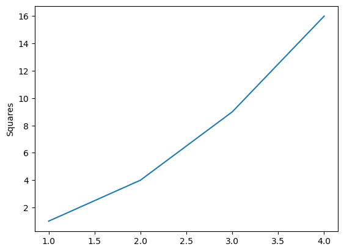

## Lecture 6 Intro to MatplotLib and Pandas 
Jon Macey

jmacey@bournemouth.ac.uk

---

## Matplotlib


- Matplotlib is a plotting library for the Python programming language and its numerical mathematics extension NumPy.
- It provides an object-oriented API for embedding plots into applications using general-purpose GUI toolkits like Tkinter, wxPython, Qt, or GTK.
- It is also used for creating static, animated, and interactive visualizations in Python.

--

## Matplotlib

- Matplotlib’s core is built around two main interfaces:
    - The first is a procedural interface that is designed to closely resemble MATLAB, making it easy to port MATLAB code to Python.
    - The second is an object-oriented interface that is more Pythonic and provides more flexibility.

--

## pyplot

```python
import matplotlib.pyplot as plt

plt.plot([1, 2, 3, 4], [1, 4, 9, 16])
plt.ylabel('Squares')
plt.show()
```




--

## OO Interface

- For more control over your plots, the object-oriented approach gives you direct access to figure, axes, and other elements.
-  This method is more suited to complex multi-plot visualizations.

```
fig, ax = plt.subplots()
ax.plot([1, 2, 3, 4], [1, 4, 9, 16])
ax.set_ylabel('Squares')
plt.show()
```


--

## Examples

- The notebok here contains a number of examples of using Matplotlib
- You can use this as a reference for your own work


---

## What is Pandas

- Pandas is a fast, powerful, flexible and easy to use open source data analysis and data manipulation library built on top of the Python programming language.
- It is a high-level data manipulation tool developed by Wes McKinney in 2008.
- It is built on the Numpy package and its key data structure is called the DataFrame.

--

## Why Pandas

- Pandas is used for data manipulation, data analysis, and data visualization
- It has simple and easy to use syntax to load, process and analyse data
- We can use it to process and clean data from various sources like CSV, Excel, SQL databases, or even web pages
- this can then be fed into machine learning algorithms to train models


---


## Pandas Versions

- Pandas is currently at version stable version of 2.2 however the version we will be using is lower.

```python
import pandas as pd
print(pd.__version__)
2.1.4
```

--

## Installing Pandas

- Pandas is not part of the standard Python library so you will need to install it using pip however it is included in the Anaconda distribution.

```bash
pip install pandas
```

---

## Pandas Data Structures

- Pandas has two main data structures: Series and DataFrames
- A Series is a one-dimensional array with labels
- A DataFrame is a two-dimensional array with labels

--

## DataFrames

- A DataFrame is a two-dimensional data structure with columns that can be of different data types


--

## DataFrames

- data of different types (including characters, integers, floating point values, categorical data and more) are stored in columns. 
- It is similar to a spreadsheet, a SQL table or the data.frame in R.


--

## Series

- A Series is a one-dimensional array with labels
- Each column in a DataFrame is a Series
- We can create our own Series

```python
ages = pd.Series([22, 35, 58], name="Age")

print(ages)
0    22
1    35
2    58
Name: Age, dtype: int64
```


--

## Series

- Typically we will run functions over the data in a Series or DataFrame to process the data

```python
ages = pd.Series([22, 35, 58], name="Age")
print(f"{ages.max()=}")
print(f"{ages.min()=}")
print(f"{ages.mean()=}")
```

```bash
ages.max()=58
ages.min()=22
ages.mean()=38.333333333333336
```

---

## Pandas DataFrames

- We can build a simple data frame using a dictionary (in json format)

```python
df = pd.DataFrame(
    {
        "Name": [
            "Tom",
            "Jon",
            "Jess",
        ],
        "Age": [22, 55, 6],
        "Sex": ["male", "male", "female"],
    }
)
```

--

## Data Access

- We can access the data in a DataFrame using the column name

```python
print(df["Name"])
0     Tom
1     Jon
2    Jess
Name: Name, dtype: object
```

- we can also access the individual elements using the row and column index

```python
print(df["Name"][0])
Tom
```

--

## Data Access

- We can also use the `loc` function to access the data

```python
print(df.loc[0])
Name     Tom
Age       22
Sex     male
Name: 0, dtype: object
```

---

## analysis tools

- we can get pandas to give us some basic statistics on the data

```python
df.describe()
Out[16]: 
             Age
count   3.000000
mean   27.666667
std    24.986663
min     6.000000
25%    14.000000
50%    22.000000
75%    38.500000
max    55.000000
```

--

## describe

- this will give us the count, mean, standard deviation, min, 25%, 50%, 75% and max values for each column
- it will only work on numerical data
- we can also get the mean, sum, median, mode, variance, skew, kurtosis, quantile, and correlation
  - however these are all separate functions and may need extra flags to work such as ```numeric_only=True```

```python
df.sum()
Out[28]: 
Name        TomJonJess
Age                 83
Sex     malemalefemale
dtype: object
```

---

## loading data

- we can load data from a variety of sources
- we can load data from a csv file

```python
df = pd.read_csv("data.csv")
```

- we can also load data from an excel file

```python
df = pd.read_excel("data.xlsx")
```

- we can also load data from a SQL database

```python
df = pd.read_sql("SELECT * FROM data", conn)
```

---

## Examples

- We will continue your exploration of Pandas in the lab using this notebook as a reference
- We will also look at how to use Pandas to load and process data from a CSV file
- We will also look at how to use Matplotlib to visualise the data

---

## Alternatives 

- There are a number of alternatives to Pandas in particular [polars](https://docs.pola.rs/) seems to becoming very popular especially for large datasets
- It has a transition guide [here](https://docs.pola.rs/user-guide/migration/pandas/)
- It can take a more functional approach to data processing which can sometimes be easier to read and understand

