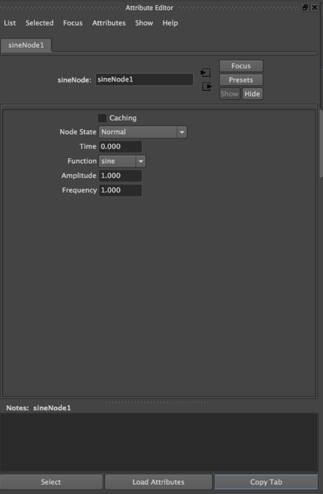
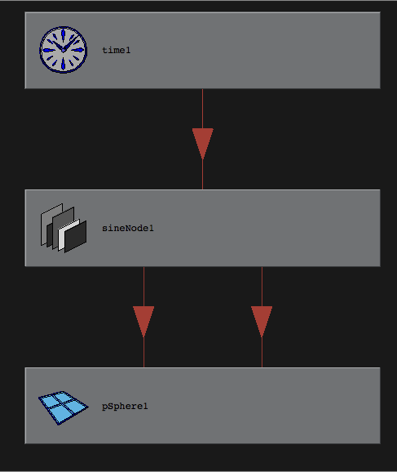
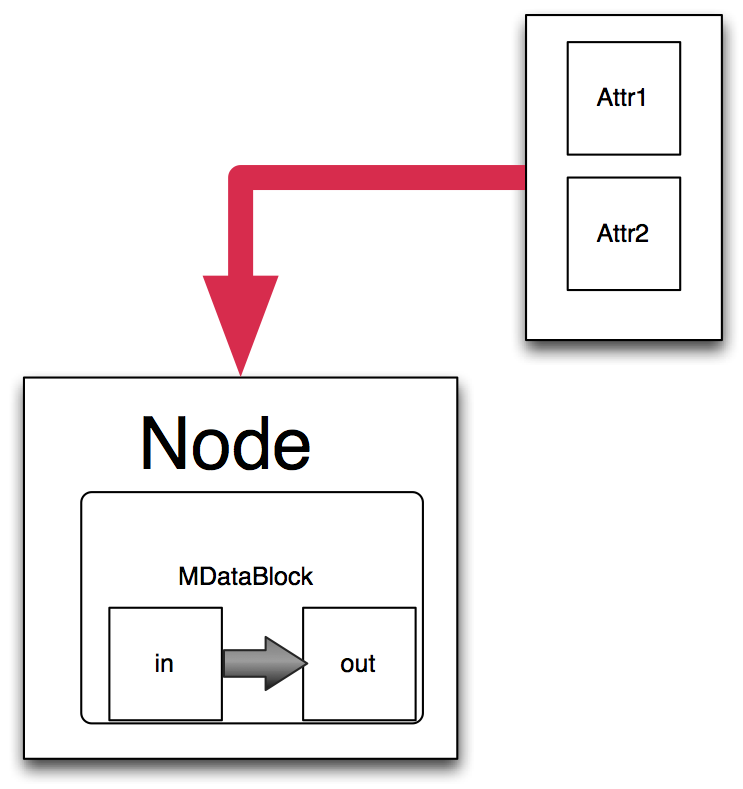
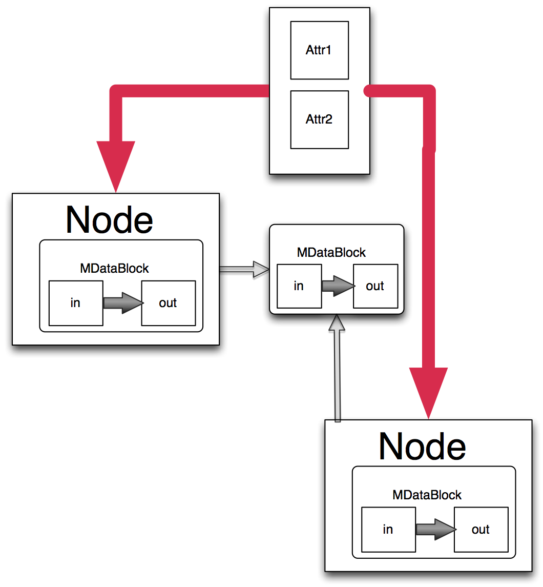
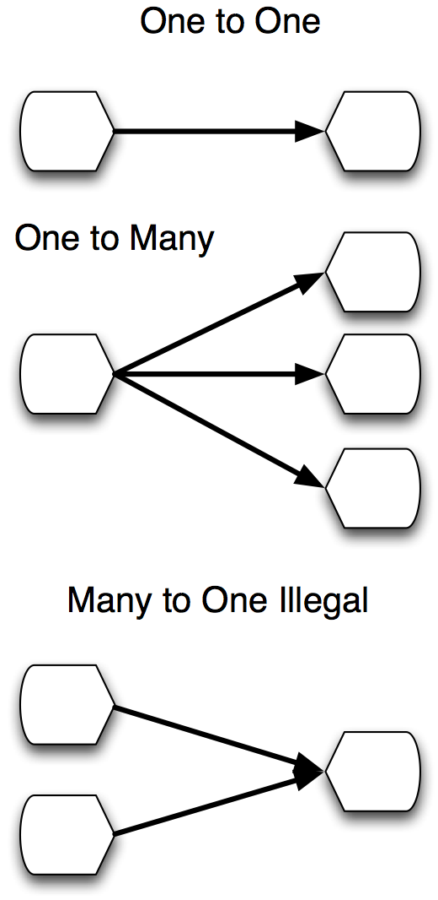
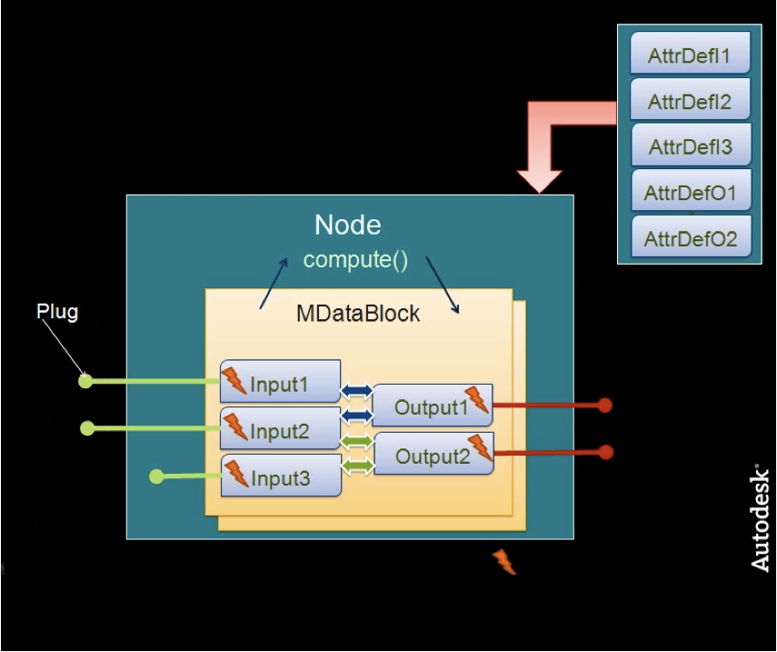
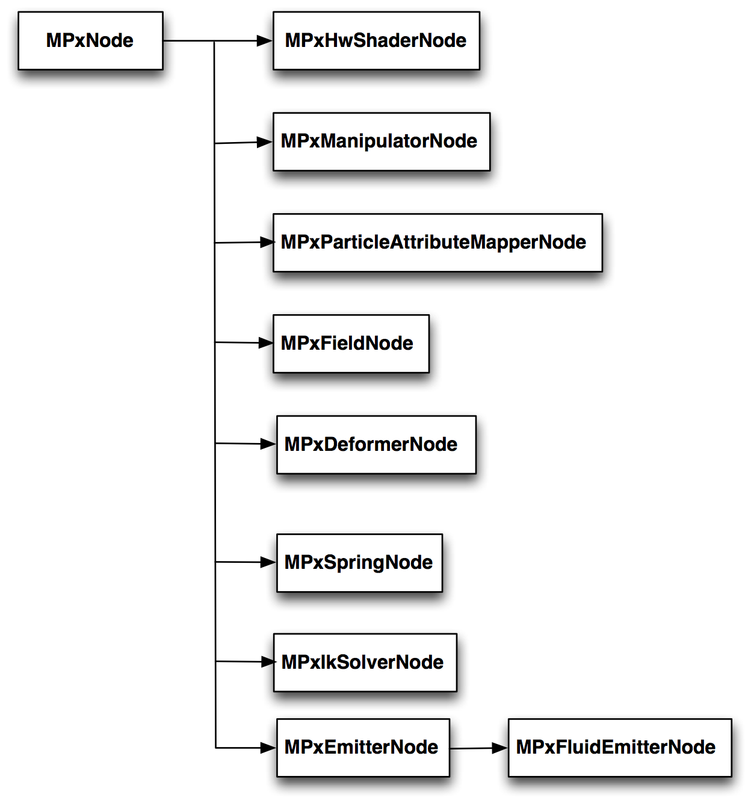
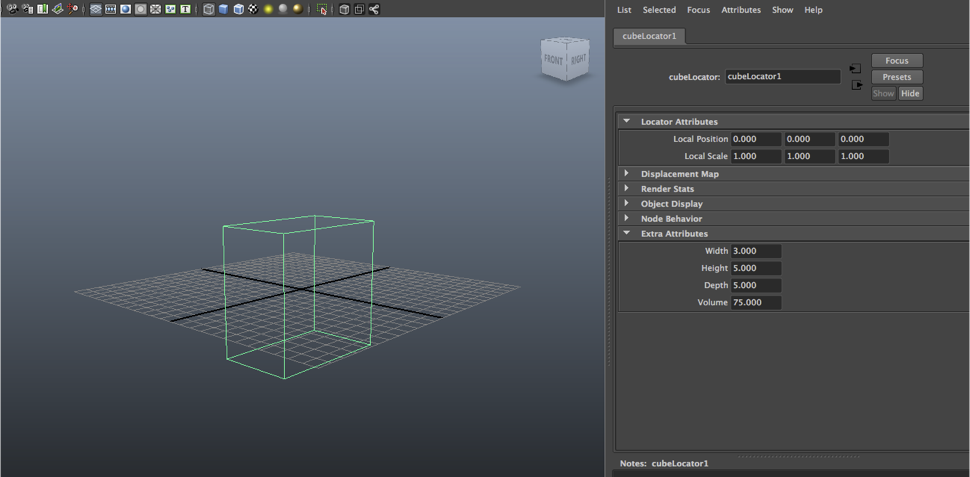
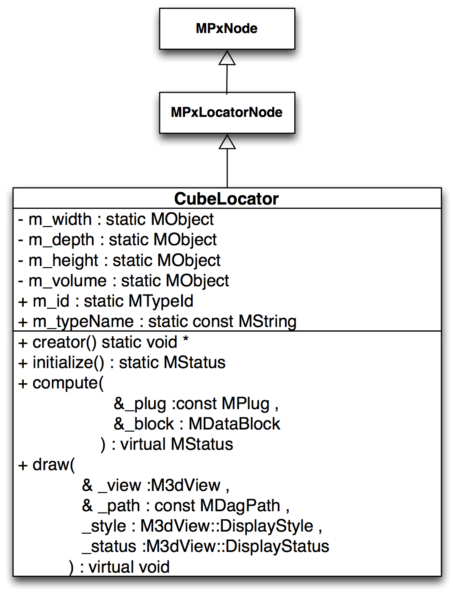

# API's for DCC Tools

Jon Macey

jmacey@bournemouth.ac.uk 

---

## Introduction

- This lecture is intended to introduce some concepts used in DCC tools api's
- It is impossible to cover all the api's in a single lecture so we will focus on a few key concepts and design patterns.
- We will only look at the python API's
- We will mainly focus on the Maya API as it is the most likely to be used 
- However we will touch on a few others 
- This lecture will not look at user interfaces as we will cover this later using PySide / PyQt.

--

## What is an API?

- API stands for Application Programming Interface
- For a DCC tool it is a way of extending and customizing the tool
- It is a way of accessing the underlying data structures and algorithms to process data in our own way
- It is a way of automating repetitive tasks

--

## Plugin vs Scripts

- A plugin is a binary module that is loaded into the DCC tool (however Maya allows python plugins now)
- A script is a text file that is interpreted by the DCC tool
- Typically a plugin will be faster than a script as it is compiled
- However a script can be easier to write and debug, and can be more portable
- A script can be used to prototype a plugin

--

## Python API's

- The python API's are typically wrappers around the C++ API's 
    - in some cases they are not well documented and we have to look at the C++ docs
- We are basically using python to call C++ functions and methods from the API
- This can sometimes lead to so odd python code as we need to compensate for the differences between the languages (more on this later)
- Maya in particular is trying to make the python API more [pythonic](https://docs.python-guide.org/writing/style/)
    - this is seen in the [PyMel](https://help.autodesk.com/cloudhelp/2017/ENU/Maya-Tech-Docs/PyMel/) module as well as [api2](https://help.autodesk.com/view/MAYAUL/2022/ENU/?guid=Maya_SDK_Maya_Python_API_Maya_Python_API_2_0_html)


--

## Python API's

- Another advantage of the python API's is that we can use the python shipped with the DCC to run our scripts
- This allows for offline / non-gui processing of data
- sometimes this can be really useful as a lot of the work doesn't need the gui or interaction from the user.


---

## [The Maya Environment](https://github.com/PaulNendick/maya-configuration)

- When maya starts up it reads a file called Maya.env this contains a number of environment variables for Maya.
- Under Linux ```~/maya/version/```
- Under Windows ```%HOMEDRIVE%\%HOMEPATH%\Documents\maya\[version]```
- On a mac this is located in ```~/Library/Preferences/Autodesk/maya/[Version]```
- We are going to use this to setup some directories to use for the next few weeks Lectures

--

## Basic Setup

```
cd $HOME
mkdir MayaScripts
mkdir MayaPlugs
```

- Add this to the Maya.env (you may need both versions of Maya)

``` 
MAYA_PLUG_IN_PATH=/home/jmacey/MayaPlugs
MAYA_SCRIPT_PATH=/home/jmacey/MayaScripts
MAYA_DISABLE_CLIC_IPM=1
MAYA_DISABLE_CER=1
```
- Note the last too can speed up maya start / restart which you will need __a lot__

--

## A simple Mel Script Test

```
global proc helloMel()
{
  print("hello from Mel\n");
}
```
- Save the file in the scripts directory as hello.mel
- in the Mel window source ```hello.mel```
- then call helloMel()

--


## Python Paths

- maya will use the global python path which you can set as usual
- it is also possible to setup some default python behaviors using a file called ```userSetup.py```
- this lives in the default maya user directory as follows
```
# Windows
%HOMEDRIVE%\%HOMEPATH%\Documents\maya\[version]\scripts
# Linux 
~/maya/[version]/scripts
# Mac OSX
~/Library/Preferences/Autodesk/maya/[version]/scripts
```

--

## userSetup.py

- to add to the path in the userSetup.py file we can do the following

```
import sys
sys.path.append('yourpath')
```

--

## A Simple Python Script

```
def helloPy() :
  print ('hello from python ')
```
- Again save this script as helloPy.py in the Scripts directory
- We need to import the module before we use it so the following is needed

```
from helloPy import helloPy
helloPy()
```

--

## [reload](https://docs.python.org/2/library/functions.html#reload)
- To help the development cycle, we can easily modify the script and call 
```
import helloPy
# make changes to source.
reload (helloPy)
```

- to reload the module from the source file, otherwise this will be the same module for the whole of the session.
- Also note that each tab of the script editor is also a different instance so each module is unique to the tab imported 

---

## The Maya API

- The maya api uses inheritance to extend the basic functionality of maya. 
- There are a number of different class types we can work with and these will change depending upon the context
- Devkit can be found here https://www.autodesk.com/developer-network/platform-technologies/maya

---

## MObject

- Also know as a "Model Object" Generic class for all Maya types. 
- Ownership is maintained by Maya (lifetime) 
- To access anything we need to apply a function set to the ```MObject```.
- Is a handle/reference to a Maya internal object 
    - Valid use: determine object type and compatible function sets 
    - NEVER store an MObject use immediately 

--

## Mfn function sets

- These are used to interact with ```MObjects``` We need to connect the correct function set to the correct object type. 
- As they are Dependency nodes we can also attach as this. 
  - If the ```MObject``` is pointing to a light we apply a ```MFnLight``` function set to access the light params. 
  - However as it is also a DG object we can also apply a ```MFnDependencyNode``` function to it as well. 
- This overlap is very limited but application of it depends upon the context we are working within.

--

## MFn function Sets

  - ```MFnCamera``` 
  - ```MFnLight``` 
  - ```MFnFluid``` 
  - ```MFnPlugin``` 
  - ```MFnNurbsSurface``` 
  - ```MFnDagNode``` (DagNode has visible component in UI) 
  - ```MFnDependencyNode``` (dependency node has no visible component in UI) 

--

## MFn function Sets
- An object can be compatible with more than one type of function set . . . 
- Example: a NURBS object is compatible with/can be operated on by MFnNurbsSurface, MFnDagNode, MFnDependencyNode etc.

--

## Proxy MPx

- Base classes inherited to define new types of Maya objects 
  - Examples:
  - ```MPxCommand``` – define new commands 
  - ```MPxNode``` – define new (generic) nodes 
  - ```MPxDeformerNode``` – define deformer type 
  - ```MPxIkSolver``` – define new IK solver 
  - ```MPxFileTranslator``` – define file exporter 
- Proxies understand Maya’s internals; developer implement the new/unique features.

--

## Iterators MIt
- Used to traverse a category of objects 
- Examples:
  - ```MItKeyframe``` – iterate over keyframes of anim curve 
  - ```MItSurfaceCV``` 
  - ```MItCurveCV``` 
  - ```MItDependencyGraph``` – iterate over all nodes (in)directly connected to a given node 
  - ```MItDependencyNodes``` – traverse all the nodes in Maya’s Dependency Graph 

--

## Utility Classes (Wrappers)
- MGlobal – a static class. Members perform mostly UI-related tasks 
- MStatus – passes return status codes (always check) 
- MString 
- MVector 
- MDagPath 

---

## [Light on a Sphere](https://github.com/NCCA/ScriptingForDCC/blob/master/Lecture5/LightOnSphere/light_on_sphere.py)

- This example will generate a series of lights placed on a sphere or hemisphere based on a given radius.

```python
import math
import random
import maya.cmds as cmds

def random_point_on_sphere(radius : float=1.0 , hemisphere: bool=False):
    xiTheta = random.uniform(0, 1)
    temp = 2.0 * radius * math.sqrt(xiTheta * (1.0 - xiTheta))
    twoPiXiPhi = math.pi * 2 * random.uniform(0, 1)
    x = temp * math.cos(twoPiXiPhi)
    y = temp * math.sin(twoPiXiPhi)
    if hemisphere is True:
        y = abs(y)
    z = radius * (1.0 - 2.0 * xiTheta)
    return x, y, z

def scatter_lights(nlights : int=100, radius : float=10.0, hemisphere : bool=True, base_name : str="light"):
    for i in range(nlights):
        name = cmds.shadingNode("pointLight", asLight=True)
        x, y, z = random_point_on_sphere(radius, hemisphere)
        cmds.move(x, y, z)
        cmds.rename("pointLight1", base_name + "_" + str(i + 1))

scatter_lights()
```

--

## Light on Sphere

- This example is a simple script, the user needs either source it or paste it into the script editor and run it.
- It is possible to make this an importable module but we will look at that in a later lab.
- It would be better if we could convert this into a plugin that can be auto loaded when maya starts.
- The user would then be able to ```scatter_lights()``` from the python and mel editor.

---

# Python Plugins

- Python now supports plugins developed in python
- They are very similar to the C++ plugins but don't need to be compiled
- Performance may vary as the code needs to still be interpreted
- Can be an easier solution for development

--


## [OpenMaya.MPxCommand](https://download.autodesk.com/us/maya/2009help/API/class_m_px_command.html) 

- This is the base class for all commands in Maya
- We need to override the ```doIt()``` method
- We can also override the ```undoIt()``` and ```redoIt()``` methods
- We can also override the ```isUndoable()``` method to determine if the command is undoable
- We can also override the ```hasSyntax()``` method to add command line arguments

--


## [MayaCommandPythonStarter.py](https://github.com/NCCA/ScriptingForDCC/blob/master/Lecture5/MayaCommandPythonStarter/MayaCommandPythonStarter.py)

```
import maya.api.OpenMaya as om
import maya.cmds as cmds


def maya_useNewAPI():
    """
    Can either use this function (which works on earlier versions)
    or we can set maya_useNewAPI = True
    """
    pass


maya_useNewAPI = True


class HelloMaya(om.MPxCommand):

    CMD_NAME = "HelloMayaPy"

    def __init__(self):
        super(HelloMaya, self).__init__()

    def doIt(self, args):
        """
        Called when the command is executed in script
        """
        print("This should come from the python shell")
        om.MGlobal.displayWarning("This should be a warning")
        om.MGlobal.displayError("This should be an error")
        om.MGlobal.displayInfo("This should be an info message")

    @classmethod
    def creator(cls):
        """
        Think of this as a factory
        """
        return HelloMaya()


def initializePlugin(plugin):
    """
    Load our plugin
    """
    vendor = "NCCA"
    version = "1.0.0"

    plugin_fn = om.MFnPlugin(plugin, vendor, version)

    try:
        plugin_fn.registerCommand(HelloMaya.CMD_NAME, HelloMaya.creator)
    except:
        om.MGlobal.displayError(f"Failed to register command: {HelloMaya.CMD_NAME}")


def uninitializePlugin(plugin):
    """
    Exit point for a plugin
    """
    plugin_fn = om.MFnPlugin(plugin)
    try:
        plugin_fn.deregisterCommand(HelloMaya.CMD_NAME)
    except:
        om.MGlobal.displayError(f"Failed to deregister command: {HelloMaya.CMD_NAME}")


if __name__ == "__main__":
    """
    So if we execute this in the script editor it will be a __main__ so we can put testing code etc here
    Loading the plugin will not run this
    As we are loading the plugin it needs to be in the plugin path.
    """

    plugin_name = "HelloMaya.py"

    cmds.evalDeferred(
        'if cmds.pluginInfo("{0}", q=True, loaded=True): cmds.unloadPlugin(f"{plugin_name}")'
    )
    cmds.evalDeferred(
        'if not cmds.pluginInfo("{0}", q=True, loaded=True): cmds.loadPlugin(f"{plugin_name}")'
    )

```

--

## Converting a script to a plugin

- As the plugin is a class we can add methods to it
- adding attributes is a little more complex with a command
- Also to add command line arguments we need to use the [MSyntax](https://download.autodesk.com/us/maya/2010help/API/class_m_syntax.html) class and functions

--

## Development methods

- There are a number of ways to develop a plugin all of which are a pain!
- Maya will crash! (lots!)
- depending upon the type of plugin we are using we can use the maya standalone module to test before deploying to the GUI version
- The following example is using the standalone method

--

## [LightOnSpherePlugin.py](https://github.com/NCCA/ScriptingForDCC/blob/master/Lecture5/LightOnSpherePlugin/LightOnSphere.py)


```python
import maya.api.OpenMaya as om
import maya.cmds as cmds
import math
import random
import os

def maya_useNewAPI():
    """
    Can either use this function (which works on earlier versions)
    or we can set maya_useNewAPI = True
    """
    pass


maya_useNewAPI = True

class LightOnSphere(om.MPxCommand):

    name_flag_short="-n"
    name_flag_long="-name"
    radius_flag_short="-r"
    radius_flag_long="-radius"
    number_lights_flag_short="-nl"
    number_lights_flag_long="-nlights"
    hemisphere_flag_short="-h"
    hemisphere_flag_long="-hemisphere"

    CMD_NAME = "LightOnSphere"

    @classmethod
    def command_syntax(cls):
        """
        This is where we define the arguments for our command
        # types here https://help.autodesk.com/view/MAYAUL/2024/ENU/?guid=MAYA_API_REF_py_ref_class_open_maya_1_1_m_syntax_html
        """
        syntax = om.MSyntax()
        syntax.addFlag(cls.name_flag_short, cls.name_flag_long, om.MSyntax.kString)
        syntax.addFlag(cls.radius_flag_short, cls.radius_flag_long, om.MSyntax.kDouble)
        # Note for int types we have two options, either unsigned or long
        # later we can parse as int
        syntax.addFlag(cls.number_lights_flag_short, cls.number_lights_flag_long, om.MSyntax.kUnsigned)
        syntax.addFlag(cls.hemisphere_flag_short, cls.hemisphere_flag_long, om.MSyntax.kBoolean)
        return syntax

    def _random_point_on_sphere(self,radius : float=1.0 , hemisphere: bool=False):
        """ generate a point on a sphere / hemispehrere
        :param radius: radius of sphere
        :param hemisphere: if true generate a point on the hemisphere
        :return: x, y, z coordinates of point
        """
        xiTheta = random.uniform(0, 1)
        temp = 2.0 * radius * math.sqrt(xiTheta * (1.0 - xiTheta))
        twoPiXiPhi = math.pi * 2 * random.uniform(0, 1)
        x = temp * math.cos(twoPiXiPhi)
        y = temp * math.sin(twoPiXiPhi)
        if hemisphere is True:
            y = abs(y)
        z = radius * (1.0 - 2.0 * xiTheta)
        return x, y, z


    def __init__(self):
        super(LightOnSphere, self).__init__()
        
    def doIt(self, args):
        """
        Called when the command is executed in script
        """
        # set default argument values
        number_of_lights=100
        radius=1.0
        hemisphere=False
        light_name="LightOnSphere"
        # Parse the arguments.
        arg_data = om.MArgParser(self.syntax(), args)
        if arg_data.isFlagSet(self.name_flag_short):
            light_name = arg_data.flagArgumentString(self.name_flag_short, 0)
        if arg_data.isFlagSet(self.radius_flag_short):
            radius = arg_data.flagArgumentDouble(self.radius_flag_short, 0)
        if arg_data.isFlagSet(self.number_lights_flag_short):
            number_of_lights = arg_data.flagArgumentInt(self.number_lights_flag_short, 0)
        if arg_data.isFlagSet(self.hemisphere_flag_short):
            hemisphere = arg_data.flagArgumentBool(self.hemisphere_flag_short, 0)
        # Create the lights
        for i in range(number_of_lights):
            name=cmds.shadingNode("pointLight", asLight=True)
            x, y, z = self._random_point_on_sphere(radius, hemisphere)
            cmds.move(x, y, z)
            cmds.rename("pointLight1", f"{light_name}_{i+1}")

    @classmethod
    def creator(cls):
        """
        Think of this as a factory to crete an instance of our command
        """
        return LightOnSphere()
    


def initializePlugin(plugin):
    """
    Load our plugin
    """
    vendor = "NCCA"
    version = "1.0.0"

    plugin_fn = om.MFnPlugin(plugin, vendor, version)

    try:
        plugin_fn.registerCommand(LightOnSphere.CMD_NAME, LightOnSphere.creator,LightOnSphere.command_syntax)
    except:
        om.MGlobal.displayError(f"Failed to register command: {LightOnSphere.CMD_NAME}")


def uninitializePlugin(plugin):
    """
    Exit point for a plugin
    """
    plugin_fn = om.MFnPlugin(plugin)
    try:
        plugin_fn.deregisterCommand(LightOnSphere.CMD_NAME)
    except:
        om.MGlobal.displayError(f"Failed to deregister command: {LightOnSphere.CMD_NAME}")

"""
The following code makes it easy to develop and test the maya plugin
without using maya. It is not needed for the plugin to work in maya.
"""


if __name__ == "__main__":   
    """ it is not advised to do imports inside the main block usually 
    however there is an overhead to importing maya.standalone so we only
    want to do it if we are running this file directly

    Also the imports for OpenMaya and Maya.cmds need to happen after the 
    standalone has been imported so we need them as well.
    """
    import maya.standalone
    import maya.api.OpenMaya as om
    import maya.cmds as cmds
    import pathlib
    maya.standalone.initialize(name="python")
    # here we use the __file__ dunder method to get the correct plugin file 
    # to load, if we are doing more complex development we may need to use 
    # a mod file instead. 
    cmds.loadPlugin(__file__)
    print(f"Loading plugin: {__file__}")
    # Now create a new scene for testing
    cmds.file(f=True, new=True)
    # will put it in same folder as the plugin
    location = pathlib.Path().absolute()
    cmds.file(rename=f"{location}/LightOnSphere.ma")
    # run our command
    cmds.LightOnSphere(nl=2000, r=10.0, h=True, n="TestLight")
    # now save the light
    cmds.file(save=True, de=False, type="mayaAscii")
    maya.standalone.uninitialize()


```

---

## Nodes
- Unlike command plugins, nodes directly effect the maya Dependency Graph (DG)
- The DG has a data flow structure that supports animation, construction history, and constraints
- The Maya APIs provide the necessary methods to both add new nodes and examine nodes that already exist.


--

## Dependency Graph
- There are two levels of access to the DG
  - The scene graph provides you with a high level view where you need to know little about the DG but can still affect it.
  - A lower level view of Maya is provided by API function sets. Function sets let you view the DG so that you can see a node, the attributes of the node, the node connections, and the data and messages coming in and going out of the node.

--

## Nodes
- Can be thought of as a “black box” derived from MPxNode
- Has Attributes (usually seen on maya panel)
  - input and output
- can be static or dynamic
  - Each node instance has data MDataBlock
  - Has plugs and connections to other nodes

--

## Nodes

<div id="mySlideLeft">

</div>
<div id="mySlideRight">

</div>

---

## Mfn*Attributes
- Used for the Attribute Definition (MObject)
- static members of the Node class
  - declared once for all instances of the node
  - Does not hold the real data just the definition

--

## Mfn*Attributes
- MFnAttribute
  - MFnGenericAttribute
  - MFnEnumAttribute
  - MFnTypedAttribute
  - MFnNumericAttribute
  - MFnUnitAttribute (MAngle, MDistance, MTime)
  - MFnCompoundAttribute
  - MFnMessageAttribute
  - MFnMatrixAttribute
  - MFnLightDataAttribute

--

## Mfn*Attributes
- An attribute of a dependency node describes a piece of data that belongs to nodes of that type.
- A node's attributes describe connections sites on the node that can be used in the dependency graph
- Attributes typically belong to a class of nodes, rather than to an individual node. 
  - For example, all sphere nodes have a radius. 
- Even though a single attribute may be shared by all nodes of a given type, each node will have its own value for the attribute.

---

## MDataBlock / MDataBlockArray

- As nodes don’t contain data, it must be passed to the specific instance of the node
- A node may have more than one DataBlock (one for each context time / MDGContext)

--

## MDataBlock / MDataBlockArray


- Data blocks can be shared or cached
- Maya will decide on best performance / memory for usage

---

## MPlug
- A Plug links the attribute data of a specific node
- Node connections are established from plugs

```
MDGModifier::connect()
```
- Can be found using the ```MFnDependencyNode::findPlug()``` method
- Changing an attribute value via a plug will set the dirty flag
- Querying an attribute value via a plug forces the re-evaluation of the attribute if dirty flag is set.

--

```
MStatus MPxNode*::compute( const MPlug &_plug , MDataBlock &_data );
```
- The nodes compute method is passed both a plug and a data block
- We access the node’s data from this method (call is dependent upon maya and is done in an efficient way when needed)
- We can then access Attributes and modify them / outputs
- Must set flag to indicate change (dirty / clean)

--

## Connections
<div id="mySlideLeft">
<ul>
<li class=”fragment”> Nodes connected by attributes (seen in Hypergraph connections) 
<li class=”fragment”> Data flow always one way </p>
<li class=”fragment”> Only attributes of same type can be connected (some casting can happen) 
</ul>
</div>
<div id="mySlideRight">

</div>

--

## Connections



---

## Creating Nodes

```python
class SimpleNode(om.MPxNode):    
    # unique ID for node see lecture notes
    id = om.MTypeId(0xFF000000)
    def __init__(self):
        om.MPxNode.__init__(self)

    def postConstructor(self):
        pass
    @staticmethod
    def creator():
        return SimpleNode()
 
    @staticmethod
    def initialize():
        pass

    def compute(self, plug, data):
        pass

```
- Node from 0x00000 to 0x0007ffff reserved for testing
- used internally for load / unload
- If production nodes for sharing they can be requested from Autodesk

--

## MPxNode::initialize
- Used to create static attribute definitions
  - create attributes
  - set flags for attributes
  - add attributes to the node
  - define attribute relationships (attribute linking)

--

## MPxNode::compute
- Does actual computation when dirty output is set
- Query and set data and update the dirty flag
- If plug is unknown return ```kUnknownParameter``` so maya can handle
- Don’t look at data outside the node ( will tend to get cyclic errors)
- Don’t send dirty messages

--

## MPxNode::postConstructor

- Called after the constructor has been called
- Internally maya creates two objects when a user defined node is created, the internal MObject and the user derived object. 
- The association between the these two objects is not made until after the MPxNode constructor is called. 
- This implies that no MPxNode member function can be called from the MPxNode constructor. 
- The postConstructor will get called immediately after the constructor when it is safe to call any MPxNode member function.

--

## MPxNode



---

## MPxLocatorNode
- Base class for user defined locators.
- A locator is a DAG shape that is drawn on the screen, but that is not rendered. 
- Locators are full dependency nodes and can have attributes and a compute method.
- The draw method can be overridden to draw custom geometry using standard OpenGL calls.
  - Note Viewport 2 needs different calls to Legacy Viewport 

--

## example [cubeLocator](https://github.com/NCCA/ScriptingForDCC/blob/master/Lecture5/CubeLocator/CubeLocator.py)


--

## example [cubeLocator](https://github.com/NCCA/ScriptingForDCC/blob/master/Lecture5/CubeLocator/CubeLocator.py)

- this node has 4 attributes (width height depth and volume)
- volume is calculated when w/h/d are changed
- It also uses immediate mode OpenGL to draw the locator
- This node is based on the MPxLocator node and inherits from it.
- The basic class diagram is as follows

--

## example [cubeLocator](https://github.com/NCCA/ScriptingForDCC/blob/master/Lecture5/CubeLocator/CubeLocator.py)


--

## [Viewport 2.0](https://help.autodesk.com/view/MAYAUL/2023/ENU/?guid=Maya_SDK_Viewport_2_0_API_Maya_Viewport_2_0_API_Guide_html)

- Viewport 2.0 is a new hardware-accelerated 3D graphics API that provides a high-performance alternative to the legacy OpenGL and DirectX APIs for viewport display.
- it is a very complex API but works in a similar way to Modern OpenGL or DirectX
- It is possible to use the legacy OpenGL calls but this is not recommended as legacy viewport is disabled by default.
- The overall process is as follows

--

## [Viewport 2.0](https://help.autodesk.com/view/MAYAUL/2023/ENU/?guid=Maya_SDK_Viewport_2_0_API_Maya_Viewport_2_0_API_Guide_html)


- We create our Locator Node as per usual but we also register a draw override for it.
- The draw override is a class that inherits from ```MHWRender.MPxDrawOverride```
- and implements code to hook into the viewport 2 pipeline
- We also need to generate data for the drawing system which will be cached and used by the draw override

--

## example [cubeLocator](https://github.com/NCCA/ScriptingForDCC/blob/master/Lecture5/CubeLocator/CubeLocator.py)

```python
import maya.api.OpenMaya as om
import maya.api.OpenMayaUI as omui
import maya.api.OpenMayaRender as omr

import maya.cmds as cmds
import sys


def maya_useNewAPI():
    """
    Can either use this function (which works on earlier versions)
    or we can set maya_useNewAPI = True
    """
    pass


maya_useNewAPI = True


class CubeLocator(omui.MPxLocatorNode):
    # unique ID for node see lecture notes
    id = om.MTypeId(0xFF0000F2)
    width = None
    height = None
    depth = None
    volume = None
    drawDbClassification = "drawdb/geometry/CubeLocator"
    drawRegistrantId = "CubeLocator"

    def __init__(self):
        omui.MPxLocatorNode.__init__(self)

    @staticmethod
    def creator():
        """
        Think of this as a factory
        """
        return CubeLocator()

    @staticmethod
    def isBounded():
        return True

    def boundingBox(self):
        thisNode = self.thisMObject()
        width = om.MPlug(thisNode, CubeLocator.width)
        height = om.MPlug(thisNode, CubeLocator.height)
        depth = om.MPlug(thisNode, CubeLocator.depth)
        widthVal = width.asFloat()
        heightVal = height.asFloat()
        depthVal = depth.asFloat()

        corner1 = om.MPoint(-widthVal / 2, heightVal / 2, -depthVal / 2)
        corner2 = om.MPoint(widthVal / 2, -heightVal / 2, depthVal / 2)

        return om.MBoundingBox(corner1, corner2)

    @staticmethod
    def _set_attr_default(attr_FN):
        attr_FN.storable = True  # save in file
        attr_FN.keyable = True  # show in channel box
        attr_FN.readable = True  # can be read by user
        attr_FN.writable = True  # can be set by user

    @staticmethod
    def initialize():

        try :
            numeric_fn = om.MFnNumericAttribute()
            CubeLocator.width = numeric_fn.create(
                "width", "w", om.MFnNumericData.kDouble, 1.0
            )
            om.MPxNode.addAttribute(CubeLocator.width)
        except :
            sys.stderr.write("Failed to create width attribute\n")
            raise

        try :
            CubeLocator.height = numeric_fn.create(
                "height", "h", om.MFnNumericData.kDouble, 1.0
            )
            CubeLocator._set_attr_default(numeric_fn)
            om.MPxNode.addAttribute(CubeLocator.height)

        except :
            sys.stderr.write("Failed to create height attribute\n")
            raise

        try :
            CubeLocator.depth = numeric_fn.create(
                "depth", "d", om.MFnNumericData.kDouble, 1.0
            )
            CubeLocator._set_attr_default(numeric_fn)
            om.MPxNode.addAttribute(CubeLocator.depth)
        except :    
            sys.stderr.write("Failed to create depth attribute\n")
            raise

        try :
            # NOTE : v is used already (not sure why) so need vl for short flag
            CubeLocator.volume = numeric_fn.create(
                "volume", "vl", om.MFnNumericData.kDouble, 1.0,
            )
            numeric_fn.readable = True
            numeric_fn.writable = False
            numeric_fn.storable = False
            numeric_fn.keyable = False
            numeric_fn.channelBox = True

            om.MPxNode.addAttribute(CubeLocator.volume)
        except :
            sys.stderr.write("Failed to create volume attribute\n")
            raise
        om.MPxNode.attributeAffects(CubeLocator.width, CubeLocator.volume)
        om.MPxNode.attributeAffects(CubeLocator.height, CubeLocator.volume)
        om.MPxNode.attributeAffects(CubeLocator.depth, CubeLocator.volume)

    def compute(self, plug, data):
        if plug == CubeLocator.volume:
            dependency_fn=om.MFnDependencyNode ( self.thisMObject() )
            width=dependency_fn.findPlug("width", True)
            width=width.asDouble()
            height=dependency_fn.findPlug("height", True)
            height=height.asDouble()
            depth=dependency_fn.findPlug("depth", True)
            depth=depth.asDouble()
            volume=width*height*depth
            volume_plug=om.MPlug(self.thisMObject(), CubeLocator.volume)
            volume_plug.setDouble(volume)
            data.setClean(plug)
            # return self on success (old api used om.kSuccess)
            return self
        else:
            # return None on failure (old api used om.kUnknownParameter)
            return None
        
#############################################################################
##
## Viewport 2.0 override implementation
##
#############################################################################
class CubeLocatorData(om.MUserData):
    def __init__(self):
        om.MUserData.__init__(self, False)  ## don't delete after draw
        self.line_array = om.MPointArray()
        self.index_array = []


class CubeLocatorDrawOverride(omr.MPxDrawOverride):
    @staticmethod
    def creator(obj):
        return CubeLocatorDrawOverride(obj)

    def __init__(self, obj):
        omr.MPxDrawOverride.__init__(self, obj, None, False)

        ## We want to perform custom bounding box drawing
        ## so return True so that the internal rendering code
        ## will not draw it for us.
        self.mCustomBoxDraw = True
        self.mCurrentBoundingBox = om.MBoundingBox()

    def supportedDrawAPIs(self):
        ## this plugin supports both GL and DX
        return (
            omr.MRenderer.kOpenGL
            | omr.MRenderer.kDirectX11
            | omr.MRenderer.kOpenGLCoreProfile
        )

    def isBounded(self, objPath, cameraPath):
        return True

    def _get_w_h_d(self,objPath):
        node = objPath.node()
        width = om.MPlug(node, CubeLocator.width)
        height = om.MPlug(node, CubeLocator.height)
        depth = om.MPlug(node, CubeLocator.depth)
        widthVal = width.asFloat()
        heightVal = height.asFloat()
        depthVal = depth.asFloat()
        return widthVal,heightVal,depthVal


    def boundingBox(self, objPath, cameraPath):
        width,height,depth = self._get_w_h_d(objPath)
        corner1 = om.MPoint(-width / 2, height / 2, -depth / 2)
        corner2 = om.MPoint(width / 2, -height / 2, depth / 2)

        self.mCurrentBoundingBox.clear()
        self.mCurrentBoundingBox.expand(corner1)
        self.mCurrentBoundingBox.expand(corner2)

        return self.mCurrentBoundingBox

    def disableInternalBoundingBoxDraw(self):
        return self.mCustomBoxDraw

    def prepareForDraw(self, objPath, cameraPath, frameContext, oldData):
        ## Retrieve data cache (create if does not exist)
        data = oldData
        if not isinstance(data, CubeLocatorData):
            data = CubeLocatorData()
        data.line_array.clear()
        width,height,depth = self._get_w_h_d(objPath)
        data.line_array.append(om.MPoint(-width/2, height/2, -depth/2))
        data.line_array.append(om.MPoint(width/2, height/2, -depth/2))
        data.line_array.append(om.MPoint(width/2, height/2, depth/2))
        data.line_array.append(om.MPoint(-width/2, height/2, depth/2))
        data.line_array.append(om.MPoint(-width/2, -height/2, -depth/2))
        data.line_array.append(om.MPoint(width/2, -height/2, -depth/2))
        data.line_array.append(om.MPoint(width/2, -height/2, depth/2))
        data.line_array.append(om.MPoint(-width/2, -height/2, depth/2))
        
        top_face = om.MUintArray([0, 1, 2, 3,0])
        bottom_face = om.MUintArray([4, 5, 6, 7,4])
        front_face = om.MUintArray([1, 5, 6, 2,1])
        back_face = om.MUintArray([0, 4, 7, 3,0])
        left_face = om.MUintArray([0, 4, 5, 1,0])
        right_face = om.MUintArray([3, 7, 6, 2,3])     
        data.indices =[top_face, bottom_face, front_face, back_face, left_face, right_face]
        return data

    def hasUIDrawables(self):
        return True

    def addUIDrawables(self, objPath, drawManager, frameContext, data):
        locator_data = data
        if not isinstance(locator_data, CubeLocatorData):
            return

        drawManager.beginDrawable()

        drawManager.setDepthPriority(5)
        # only draw wireframe, see TriangleLocator.py for shaded example
        for index in locator_data.indices:
            drawManager.mesh(
                omr.MUIDrawManager.kClosedLine,
                locator_data.line_array,
                index=index,
            )
        drawManager.endDrawable()


def initializePlugin(obj):
    plugin = om.MFnPlugin(obj)

    try:
        plugin.registerNode(
            "CubeLocator",
            CubeLocator.id,
            CubeLocator.creator,
            CubeLocator.initialize,
            om.MPxNode.kLocatorNode,
            CubeLocator.drawDbClassification,
        )
    except:
        sys.stderr.write("Failed to register node\n")
        raise

    try:
        omr.MDrawRegistry.registerDrawOverrideCreator(
            CubeLocator.drawDbClassification,
            CubeLocator.drawRegistrantId,
            CubeLocatorDrawOverride.creator,
        )
    except:
        sys.stderr.write("Failed to register override\n")
        raise


#
# UNINITIALIZES THE PLUGIN BY DEREGISTERING THE COMMAND AND NODE:
#
def uninitializePlugin(obj):
    plugin = om.MFnPlugin(obj)
    try:
        plugin.deregisterNode(CubeLocator.id)
    except:
        sys.stderr.write("Failed to deregister node\n")
        raise
    try:
        omr.MDrawRegistry.deregisterDrawOverrideCreator(
            CubeLocator.drawDbClassification, CubeLocator.drawRegistrantId
        )
    except:
        sys.stderr.write("Failed to deregister override\n")
        pass


"""
The following code makes it easy to develop and test the maya plugin
without using maya. It is not needed for the plugin to work in maya.
"""


if __name__ == "__main__":
    """it is not advised to do imports inside the main block usually
    however there is an overhead to importing maya.standalone so we only
    want to do it if we are running this file directly

    Also the imports for OpenMaya and Maya.cmds need to happen after the
    standalone has been imported so we need them as well.
    """
    import maya.standalone
    import maya.api.OpenMaya as om
    import maya.cmds as cmds
    import pathlib

    maya.standalone.initialize(name="python")
    # here we use the __file__ dunder method to get the correct plugin file
    # to load, if we are doing more complex development we may need to use
    # a mod file instead.
    cmds.loadPlugin(__file__)
    print(f"Loading plugin: {__file__}")
    # Now create a new scene for testing
    cmds.file(f=True, new=True)
    # will put it in same folder as the plugin
    location = pathlib.Path().absolute()
    cmds.file(rename=f"{location}/NodeTest.ma")
    # now to test the node works by creating it and setting an attributes
    cmds.createNode("CubeLocator", name="CubeLocator")
    assert cmds.objExists("CubeLocator") == True
    cmds.setAttr("CubeLocator.width", 2.0)
    assert cmds.getAttr("CubeLocator.width") == 2.0

    cmds.setAttr("CubeLocator.height", 3.0)
    assert cmds.getAttr("CubeLocator.height") == 3.0

    cmds.setAttr("CubeLocator.depth", 4.0)
    assert cmds.getAttr("CubeLocator.depth") == 4.0

    assert cmds.getAttr("CubeLocator.volume") == (2.0 * 3.0 * 4.0)

    # now save the scene with the node in it
    cmds.file(save=True, de=False, type="mayaAscii")
    maya.standalone.uninitialize()

```

---


--


## References

- https://download.autodesk.com/us/maya/2011help/API/class_m_fn_plugin.html
- https://download.autodesk.com/us/maya/docs/Maya85/wwhelp/wwhimpl/common/html/wwhelp.htm?context=DeveloperResources&file=Using_the_Maya_Python_API.html
- https://www.chadvernon.com/maya-api-programming/
- https://www.xingyulei.com/post/maya-api-command/index.html#step-1-declare-flag-name-outside-the-class
