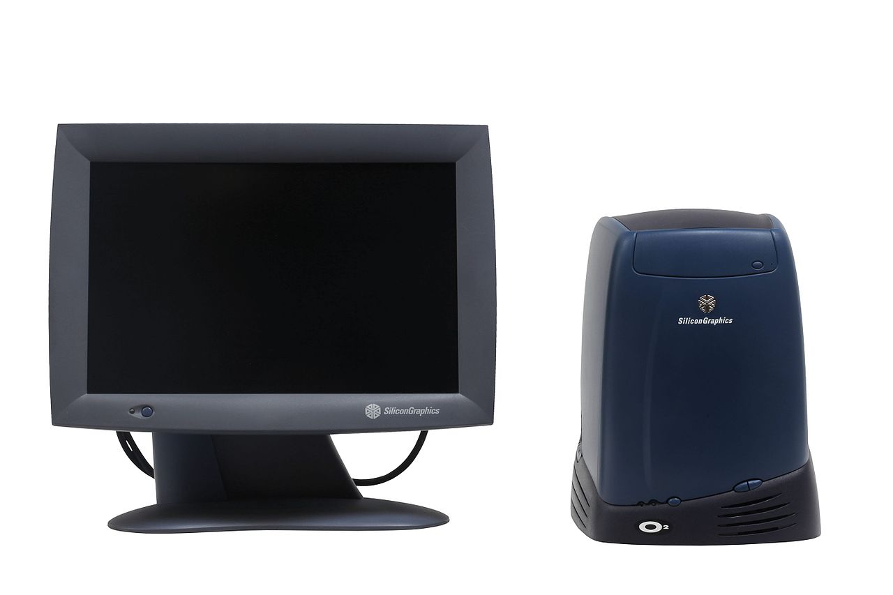
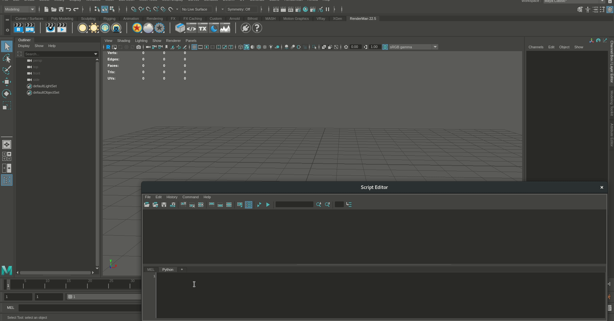

## Teaching Artists to Program
### A reflection of 30 years of programming and the NCCA

### [Jon Macey](https://nccastaff.bournemouth.ac.uk/jmacey/)
### National Center for Computer Animation
### Bournemouth University

---

# Outline

- why teach artists to program?
- A brief history of the NCCA
- How we approach the teaching of programming

--

## What we do

  <video controls>
    <source data-src="videos/showreel2019.mp4" type="video/mp4" />
  </video>
 

--

## About Me

- Currently Senior Lecturer in Computer Animation at Bournemouth University
- Programme Leader for the MSc Computer Animation and Visual Effects
  - Mainly teach Software Engineering and Programming (C++ and Python)
    - Realtime graphics (OpenGL)
    - Production rendering (Renderman)

--

## About the NCCA

- Originally one course BA Computer Animation and Visualisation
- Later a series of Masters Programmes.
- Currently Undergraduate
  -  [BA (Hons) Computer Animation Art and Design](https://www.bournemouth.ac.uk/study/courses/ba-hons-computer-animation-art-design)
  -  [BA (Hons) Computer Animation Technical Arts](https://www.bournemouth.ac.uk/study/courses/ba-hons-computer-animation-technical-arts)
  -  [BA (Hons) Visual Effects](https://www.bournemouth.ac.uk/study/courses/ba-hons-visual-effects)
- Masters
  - [MA 3D Computer Animation](https://www.bournemouth.ac.uk/study/courses/ma-3d-computer-animation)
  - [MSc Computer Animation and Visual Effects](https://www.bournemouth.ac.uk/study/courses/msc-computer-animation-visual-effects)
  - [MA Digital Effects](https://www.bournemouth.ac.uk/study/courses/ma-digital-effects)

---

## Our Philosophy

<myquote>
Since its inception, the philosophy of our centre has been to marry Art and Science in order to facilitate the production of Computer Animation, Digital Effects and Computer Games. <br>Our centre is truly interdisciplinary and is populated by an integrated team of technical and creative people.<br> Our motto is “Science in the service of the Arts” and reflects our attitude towards the mix of the arts and sciences in our teaching and research.
<br>
<span class="author"><i>Prof Peter Comninos</i></span>
 </myquote>


--

## 1990

- here are two of the earliest animations from the NCCA archive

<div id="mySlideLeft">
  <video controls>
    <source data-src="videos/Computer_Animation_Festival_1990_video.mp4" type="video/mp4" />
  </video>
</div>
<div id="mySlideRight">
  <video controls>
    <source data-src="videos/Siamese_Bins_video.mp4" type="video/mp4" />
  </video>
</div>

--

## CGAL

- Computer Graphics Animation Language
  - but so much more
  - In house animation tools (remember it's 1990 not much around)
- Power Animator was the Industry standard but needed IRIX / SGI machines and £7K a seat!

--


## Coding Animation
<div id="mySlideLeftCode">
<iframe src="sphere.html" ></iframe>
</div>
<div id="mySlideRightCode">
```
SCRIPT 1 TO 150 DO
  BEGIN
    FROM 1 TO 100 EVERY 25 LOOP 10 DO
      RZ [ball] 1.5;
      .....
  END;
```
</div>
- This generates 150 frames of animation 
  - makes the object ```[ball]``` rotate around the z axis by 1.5 degrees in loops of 10 frames every 25 
  - i.e. 1-10  26-35 51-60 76-85

--

## Equipment 

- HP (Apollo) computers
  - HP UX 
- Needed to know shell and how to use Unix (csh)
- Also taught some perl (to help automate tasks)
- Late 90's moved to SGI O2 (looked great!)



--

## OpenGL and C

- Once we got the SGI's we had access to the new API OpenGL
  - Version 1.1 on the SGI 
  - Started teaching C and OpenGL
- I still teach OpenGL today (more later)

---

# 2000's

- The move away from CGAL has begun we can now also uses standard workstations and not custom hardware.
- We now have maya (still our core DCC tool)
- Still teach C / OpenGL but we did have a short dalliance with Java!
- Most of our core programming teaching moves to C++ (98)
- At some point we also moved from Linux -> Windows
  -  then back again!

--

# 2003 / 4

- I started to teach at the NCCA 
- This was one of the first Masters Project I supervised

<div >
  <video controls>
    <source data-src="videos/Watercolour.mp4" type="video/mp4" />
  </video>
</div>

--

## Digital Effects

- This is also about the time we started delivering courses with Live Action and CGI integration
- New Software called Houdini used.

<div >
  <video controls>
    <source data-src="videos/Space_Invaders_video.mp4" type="video/mp4" />
  </video>
</div>

--

## Houdini

- Uses a procedural paradigm 
- Several powerful programming langues 
  - VEX (for shaders and Point Operations)
  - Python and H Script

<video controls width=60% >
    <source data-src="videos/wallsmash.mp4" type="video/mp4"  >
</video>

---

## 2010 - 2020

- Mainly use Linux (but dual boot to Windows)
- Most of the DCC tools now have python API's / scripting
  - Still using Python 2.7 but that should change soon.
- We now have programmable GPU's so teaching shading languages
- Game Engines more prevalent and accessible
  - Unreal seems to be standard in VFX industry.

--

## [VFX Reference Platform  (2013)](https://vfxplatform.com/)
<myquote>
 A collection of major library and tool versions that are updated annually with the objective of being a common platform for all VFX and animation studios and software providers to target. Initially this effort has been focused on Linux only and is still being driven by a small number of software vendors. The longer term plan is to include more software providers earlier in the annual review cycle and also to create reference platforms for other operating systems
</myquote>

---

## Teaching Artists to Program

- All students are taught basic python
  - usually within the DCC

<div id="mySlideLeft">
<pre><code>
import maya.cmds as cmds
radius = 0.1
xpos = -5
for i in range(0,10) :
  cmds.polySphere(r=radius)
  cmds.move(xpos+i,0,0)
  radius=radius+0.1
</code></pre>

</div>

<div id="mySlideRight">
  
</div>


--

## The KIVS principle

- Hopefully you are all aware of the KISS principle
- I like to modify that to :-

<myquote>
<font size="24"><B>Keep It Visual Stupid </B> </font>
</myquote>

- As much as possible we want to see pictures!

--

## C and C++

- First year BA CATA students taught C
  - Data structures and Algorithms, some simple (immediate mode) OpenGL
  - Use simple Graphics API's such as SDL2
- Also use Python in the DCC as other courses do
- 2nd year we move to C++

--

## Library Developers vs Library Users

- I've been following the "Stop teaching C" principles proposed by Kate Gregory for a long time
- I really like the concept of splitting library developers and users into different catagories
  - Who needs big O notation anyway ;-) 
    - Ok that is controversial but let me explain!
